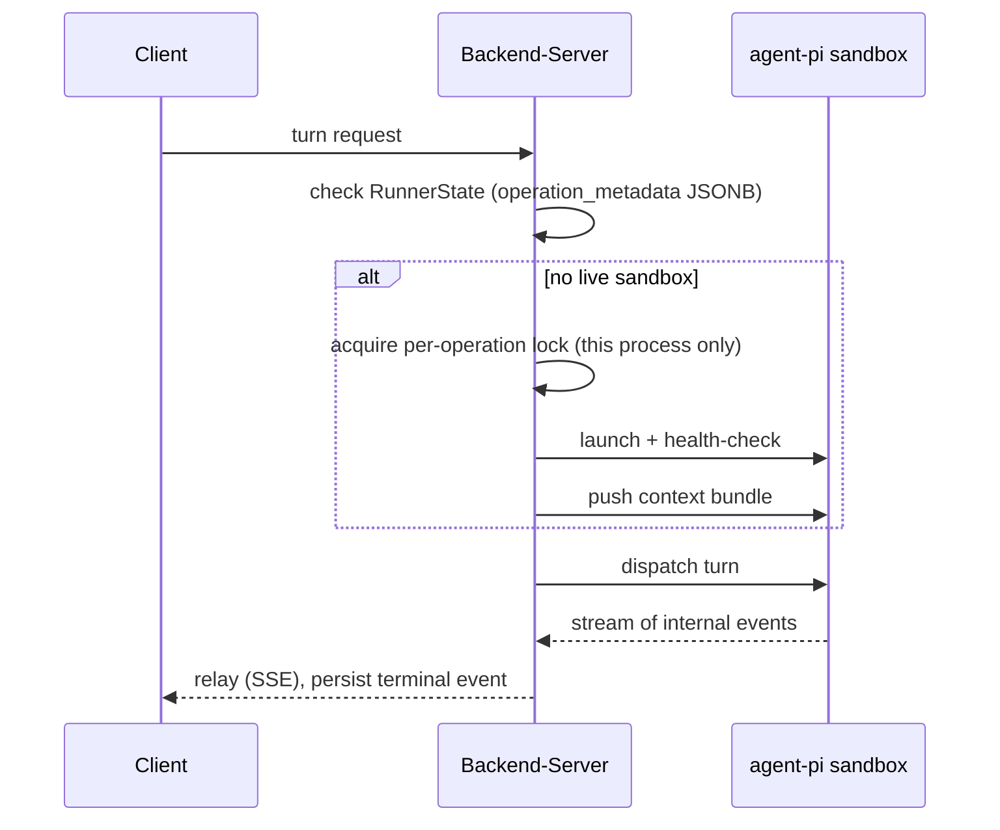
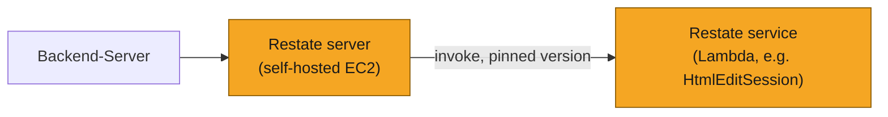
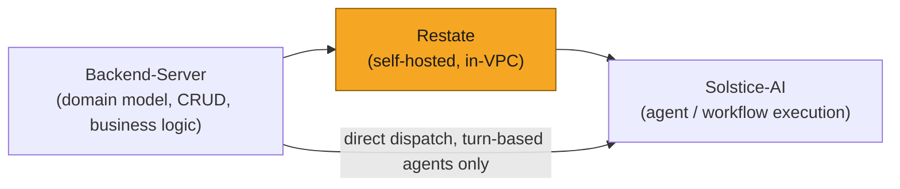
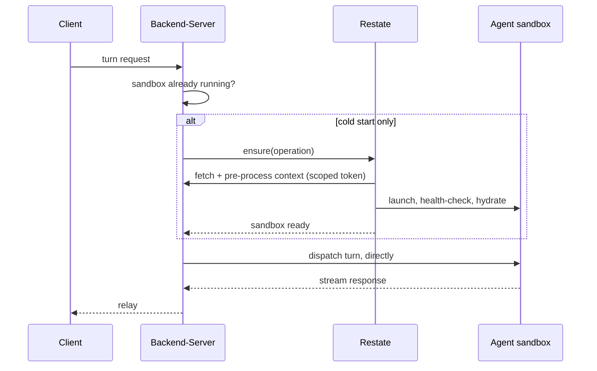
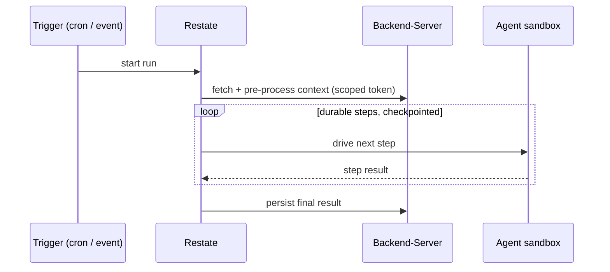
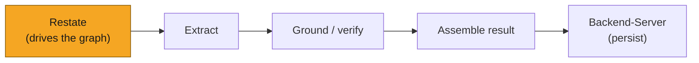
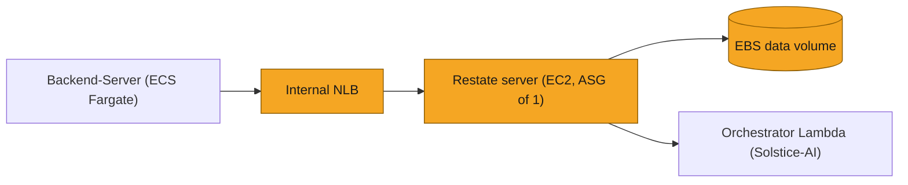

# SOL-2878: Restate as the Solstice-AI agent platform's durable-orchestration layer

| | |
|---|---|
| **Ticket** | [SOL-2878](https://linear.app/solsticehealth/issue/SOL-2878/new-microve-infra-integration) |
| **Author** | @GifanSolstice |
| **Reviewers** | 2, one owning the Solstice-AI / agent-platform domain |
| **Tier** | 2 |
| **Status** | Building |
| **Date** | 2026-08-12 |

> [!IMPORTANT]
> **Tier check.**
> - [ ] Touches auth, tenancy, or permissions
> - [x] Handles PHI or client data in a new way — no tenant data crosses Restate yet; hosting is decided ahead of that changing (see "Security and compliance")
> - [ ] Schema migration on existing tables
> - [x] New external dependency, vendor, or infrastructure — a self-hosted EC2 stack we now operate, replacing the managed Restate Cloud vendor
> - [ ] Changes a cross-service or client-facing API contract
> - [ ] Hard to reverse

## 1. Problem

Backend-Server (BE) and Solstice-AI need a shared substrate connecting BE's domain model and business logic to Solstice-AI's agent execution, as more agents and AI-driven workflows come online. Without one, each new agent reinvents retry, lifecycle, and durability logic in whichever repo happens to own it, and the boundary between "BE logic" and "agent logic" blurs one feature at a time. The architecture already separates BE and Solstice-AI into three planes (below), with a deliberate slot left for a durable orchestration engine; this doc records the decision to fill that slot with Restate, self-hosted, and what that buys us as the platform grows past its first agent.

## 2. What exists today

- **Data plane (BE)** — the only thing with database/S3 credentials. Owns domain model, CRUD, and business logic; emits a raw, agent-agnostic data bundle per operation.
- **Orchestration plane (BE)** — launches, health-checks, and dispatches to the agent's sandbox, and relays its output back to the client.
- **Execution plane (Solstice-AI)** — owns everything about how an agent works: its playbook, tools, and workspace. `agent-pi`, the chat-driven HTML/email editing agent, is the only agent built for the platform so far, running in an isolated MicroVM sandbox per operation.

Concretely, the orchestration plane's control flow today (`src_v2/html_edit/orchestrator.py`):

This works, but it's not where we want to stay: `orchestrator.py` doesn't just call Solstice-AI as a service — it knows how to launch a sandbox on two different runtimes (Docker locally, MicroVM in prod), mint and refresh MicroVM auth tokens, and check the agent's image against a contract version. That's knowledge of how the agent works, sitting in BE — exactly what the split in Section 3 says BE shouldn't need to carry.

Durability is a real problem on top of that, but a secondary one: state lives in a JSONB column with no replay story for a crash mid-launch, and the lock guarding a launch is per-process (`asyncio.Lock`), so two gunicorn workers can each find no live sandbox for the same operation and both launch one — real, just unlikely. And because all of this is written directly in BE for `agent-pi` specifically, a second agent means writing it again, not reusing a shared primitive — exactly the reinvention named in Section 1.

`agent-pi` is also not the only AI-driven code in the company. Several agentic workflows already live directly inside Backend-Server, each calling a model provider directly: `content_generation_new`'s `Agentic_Workflows` (the message- and HTML-generation agents), and the MLR reviewer's regulatory-check rules (`operation_management/domain/services/regulatory_checks/mlr_reviewer`). SOL-2933 already named this same set as expected to migrate onto Solstice-AI's infrastructure over time.

## 3. Approach

**BE owns the domain model, CRUD, and business logic. Solstice-AI owns how agents work. Restate is the durable-orchestration glue between them** — so BE calls Solstice-AI as a service, instead of hand-rolling sandbox lifecycle itself.

Concretely: replace Section 2's flow with a *Virtual Object* (Restate's unit of durable, serialized state — one per operation) called `HtmlEditSession`. It launches the sandbox, health-checks it, remembers it, and tears it down on a timer. Serialization is per key, so the two-workers-both-launch race becomes impossible, not just unlikely. It's implemented and E2E-tested in both repos, but **not deployed anywhere yet**.

Day-one scope is narrow — cold path only, the first turn of a session when no sandbox is running yet; every turn after that goes straight from BE to the sandbox. That's narrow because `agent-pi` is the only agent, not by design. It broadens as each new agent or workflow migrates onto it, one at a time — candidates are in "Migration and rollout" below, out of scope for this doc.

We're also self-hosting Restate instead of using the vendor's Cloud offering. Cloud was only ever the dev/test target — this is a first-deployment decision, not a migration off something live. Short version (trade-off in Section 5): self-hosting keeps orchestration data in our network as scope grows, and keeps on-prem deployment realistic, at the cost of operating the node ourselves. Backend-Server PR [#1144](https://github.com/Solstice-Health/Backend-Server/pull/1144) and Solstice-AI PR [#29](https://github.com/Solstice-Health/Solstice-AI/pull/29), both open.

Restate itself splits into two deployables on two different lifecycles. The **server** — the durable engine holding the journal — is the self-hosted EC2 node above. The **services** — the actual Virtual Object/workflow code, like `HtmlEditSession` — deploy separately, as versioned Lambda functions the server invokes:

Every deploy publishes an immutable Lambda version; CI registers that exact version's ARN with the server. The server pins any in-flight invocation to the version it registered — never a moving target, because replaying a durable execution against different code than what produced the journal is unsafe. It also keeps the two lifecycles apart on purpose, the same separation this doc argues for elsewhere: the engine is stateful, rarely changes, and needs its own operational care (Section 5); service code is stateless per invocation, ships as often as a feature does, and scales on its own via Lambda — nobody provisions a server just to add a new Virtual Object.

## 4. System views

### Context: where it sits

Restate sits between BE and Solstice-AI. The direct BE→AI edge is specific to turn-based agents once a sandbox is running (see below); other shapes of work route differently.

### Flow: who calls whom, in what order

Restate's remit today (`HtmlEditSession`) is one shape of work: a chat-style agent's sandbox lifecycle. The platform needs to fit at least three shapes, and the views below are the target for all three, not what's built — generalized past today's implementation on one point in particular: **Restate fetches and pre-processes context itself**, via BE's existing product APIs with a short-lived token scoped to the operation, rather than BE building a bundle and pushing it.

**1. Turn-based (chat-style) agent** — a human waits on each response.

Turns bypass Restate deliberately, not by omission — two reasons. **Latency**: a durable round-trip adds real time to something that has to feel instant; that cost is worth paying once at session start, not on every message. **Journal content**: a durable-execution engine logs what passes through it, so routing every turn through Restate would put tenant content in the orchestrator's own storage on every message, not just at session start. What Restate needs to durably remember is whether a sandbox exists and is healthy — not the content of each turn, which the sandbox already holds for its own lifetime.

**2. Long-lived / autonomous agent** — sandboxed the same way as the turn-based case, but not chat-driven: nothing waits on a per-turn response, so it runs on its own once triggered, by a schedule or an event. We take no position on what runs inside the sandbox — it doesn't have to be `agent-pi`'s harness, or a coding-agent harness at all. Every step benefits from durability here, since there's no user to just resend a lost message if one drops.

**3. Graph-based workflow** — the "agent" is a DAG of steps, not one loop (e.g. extract → ground → verify → assemble). Restate drives the graph; a failed node retries on its own, not the whole run.

### Data: what changes shape

*N/A for schema — Restate keeps its own durable log, not a Postgres table. Context-fetching goes through BE's existing product APIs on a scoped token; BE keeps its DB/S3 credentials, and no new API surface is introduced.*

## 5. Trade-offs accepted

- We accept operating a single EC2 node — our own patch/upgrade cadence, a single-AZ availability window — to get orchestration data inside our own VPC now, and to keep whole-platform on-premises deployment realistic later. Revisit if we ever run a real Kubernetes footprint for an unrelated reason, which would make a proper multi-node cluster cheap instead of a dedicated build.
- We accept keeping Restate's scope narrow (sandbox lifecycle only) for now, and turns/context-building bypassing it, rather than taking on durable multi-step orchestration before anything besides `agent-pi` needs it. Revisit when a second workload (Section "Migration and rollout" below) actually moves onto this substrate.
- We accept single-node, single-AZ availability risk, scoped to the cold path only — mechanism and blast radius detailed in Section 7 (SPOF note + failure-mode table). Revisit if that blast radius grows (once Restate carries turns or context-building) or if uptime requirements on the cold path tighten before then.

## 6. Alternatives rejected

- Alternative: stay on Restate Cloud, and keep the journal free of tenant content by convention as scope grows. Rejected — that discipline is enforced only by code review; it takes one workflow author routing real content through a durable step, once, for it to silently fail.
- Alternative: Temporal or AWS Step Functions as the durable-execution engine. Not re-evaluated for this decision — Restate was already the adopted engine, chosen during the earlier MicroVM/EditSandbox design work. This doc records the operating model built on that choice, not a re-pick of the engine.
- Alternative: keep building per-agent retry/lifecycle logic directly in Backend-Server as each new agent or workflow needs it. Rejected — this is exactly the coupling the three-plane split above already exists to remove, and it doesn't scale past one agent.

## 7. Risks and rollback

- **Single point of failure on the cold path.** If the self-hosted node is down, no *new* sandbox can launch. Sandboxes already running are unaffected — turns go straight from BE to the sandbox and never touch Restate.
- **Failure modes**, single-node EC2 with the journal on a dedicated EBS volume:

  | Failure | Behavior | Data lost |
  |---|---|---|
  | Process crash | Restarts in seconds | None |
  | Instance failure | Auto-replaced, reattaches the same volume | None |
  | Volume loss | Restore from hourly snapshot | Up to an hour of journal |
  | AZ outage | Down until restored, or restored into another AZ | Up to an hour of journal |

  Losing journal state isn't corruption: Restate forgets a sandbox it doesn't remember, the next dispatch launches a fresh one, and the user loses agent memory for that session — a cold-relaunch behavior Solstice-AI's README already documents and accepts.
- **Rollback**: register the same deployment against Restate Cloud instead of the self-hosted node, provided the journal has stayed tenant-data-free — true at launch. It stops being true once orchestration scope grows to carry real content (Section 3), which is exactly why the hosting decision is made now, before this ever goes live, rather than after.
- **Tenancy/PHI**: no tenant data crosses Restate today — the same fact the Rollback note above depends on (full framing in "Security and compliance").

## 8. Verification

- The self-hosted node has passed the existing E2E test plan (`html-edit-agent/orchestrator/E2E-TEST-PLAN.md`): turn, accept, reject, interrupt, and hard-kill-the-orchestrator all pass, including one exact-once-replay check after a kill mid-turn.
- Before this is treated as done rather than building: one rehearsed snapshot restore, one rehearsed minor-version upgrade, and a few weeks of disk/memory data from the running node to size it properly (see PR #1144's open items).
- Post-ship signal: cold-path latency (`ensure` duration) and node health alarms (disk, memory, process).

## 9. Open questions

- Of the candidates in "Migration and rollout" below, does the file/document-extraction service deserve to go first, ahead of context-refresh or a second agent?
- Is a Celery-on-BE replacement worth its own spike/spec down the line, or should it stay an informal possibility until something forces the question?
- Who owns on-call for the self-hosted node once it's carrying real traffic?

---

## Goals and non-goals

- Goal: make Restate's role legible enough that a new agent or workflow has an obvious place to plug in, instead of reinventing durability per feature.
- Goal: self-hosted and in-VPC going forward, positioning for on-premises deployments of the platform.
- Non-goal: this doc does not move context-building, turn orchestration, or any BE workflow onto Restate. It sets direction; the phasing below is what actually moves them, each its own future change.
- Non-goal: replacing Celery on BE's side. Restate's durability primitives generalize beyond agent orchestration, and this is a real long-term possibility worth naming — but BE's Celery footprint (workers, beat, flower, its own Redis broker) is a separate migration with its own blast radius, and would need its own spec.

## Migration and rollout

- **Phase 0 (this doc, Building)** — self-hosted Restate server in our VPC, sandbox lifecycle only. Backend-Server PR #1144, Solstice-AI PR #29.
- **Phase 1** — extend Restate's remit inside Solstice-AI to jobs that refresh an agent session's context, and to workflows that coordinate more than one sandbox at once. Both are natural extensions of what it already does (one durable unit of work per operation); neither needs a new architectural idea.
- **Phase 2** — a shared file/document-extraction service behind Restate, callable as a tool by any agent or BE workflow. This is the strongest concrete candidate found: PDF/document handling today is scattered across dozens of ad hoc call sites in Backend-Server, and adoption of the one shared safety mechanism that exists for a real concurrency hazard in the PDF library we use is thin — most call sites bypass it. A shared, durable extraction service closes that gap by construction (nobody touches the hazard directly) rather than by convention (everybody remembers to use the wrapper). Whether that gap is currently live in production traffic is unconfirmed; the adoption gap itself is not.
- **Phase 3** — migrate one real BE-resident workflow onto Solstice-AI's execution plane end to end (the `Agentic_Workflows` or MLR regulatory-check rules named in Section 2 are the candidates), to prove the substrate generalizes past `agent-pi`.
- **Explicitly deferred**: a Celery replacement on BE (see Non-goals).

## Security and compliance

- No tenant data crosses Restate in the scope it launches with; the empty-sandbox handoff pattern holds (Restate provisions, BE pushes context directly to the sandbox afterward).
- That changes as scope grows into context-refresh, extraction, and multi-step workflows. Self-hosting is the decision that keeps that data in our own VPC when it does, rather than with a vendor.
- This doc introduces no new external data processor. If anything, going straight to self-hosted means Restate Cloud never becomes one.

## Phasing and estimates

- **Phase 0** is substantially built (open PRs, pending merge/apply and the verification items in Section 8).
- **Phases 1-3** are not sized here — each is its own future change, scoped and estimated when it's actually taken up, per the open question above on ordering.

## Deploy view

## Pre-mortem

It's three months later and this failed. Most likely: Restate's scope never grows past sandbox lifecycle because no second workload gets prioritized to prove the pattern, and the self-hosting investment — a real node someone has to operate — ends up serving exactly what Restate Cloud would have served for free. Quieter failure: the Phase 2 extraction service gets built, but agents and workflows keep calling the PDF library directly out of habit, and the reliability gap it was meant to close persists anyway.

---

## Decision log

| Date | Decision | Options considered | Why | Who | Status |
|---|---|---|---|---|---|
| 2026-08-12 | Self-host Restate rather than stay on Restate Cloud | Stay on Cloud with payload-light-journal discipline vs. self-host | Discipline-by-convention doesn't hold once orchestration carries real content; self-hosting also positions for on-prem deployments | gifan + EM | Decided |
| 2026-08-12 | Single-node EC2, not a cluster | EKS cluster vs. single-node EC2 | No existing Kubernetes footprint; single-node is vendor-sanctioned for workloads tolerating brief downtime; matches current scope (cold path only, not yet load-bearing for turns) | gifan | Decided |
| *pre-existing* | Restate as the durable-execution engine | Restate vs. Temporal vs. AWS Step Functions | Chosen during the earlier MicroVM/EditSandbox design, ahead of this doc | gifan | Decided |

## Sign-off

| Reviewer | Verdict | Date | Note |
|---|---|---|---|
| @ | Approve / Blocked | | |
| @ | Approve / Blocked | | |

> [!TIP]
> **When this ships**
> - [ ] Durable decisions distilled into `CLAUDE.md` / `AGENTS.md`
> - [ ] Living architecture map updated
> - [ ] Status set to Shipped; file frozen as a point-in-time record

## Reviewer guide

1. Start with the four views.
2. Read Trade-offs accepted — is the self-host call right, and is keeping Restate's scope narrow for now the right amount of restraint?
3. Check What exists today against your own knowledge of `agent-pi`, the MicroVM orchestrator, and any BE-resident agentic workflow not named here.
4. Comment within 24 hours.
5. Block only for correctness, security, or cost.
6. Bump the tier if you spot a Tier 2 trigger missed.
