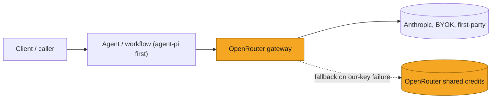
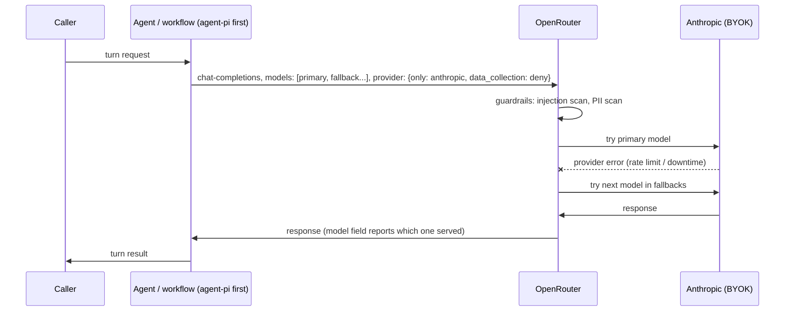
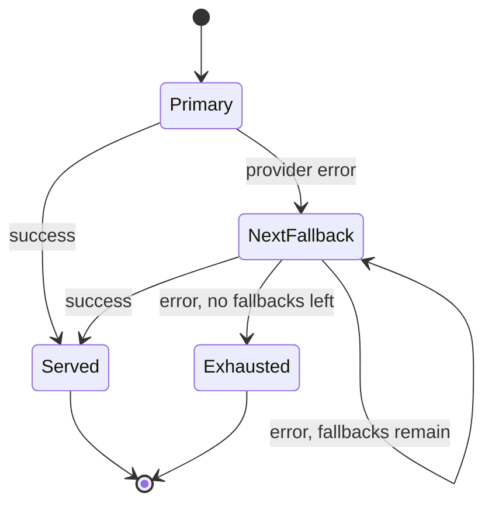
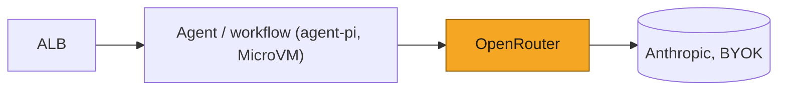

# SOL-2933: Route all model calls through an inference gateway

| | |
|---|---|
| **Ticket** | [SOL-2933](https://linear.app/solsticehealth/issue/SOL-2933/agent-platform-route-all-model-calls-through-an-inference-gateway) |
| **Author** | @GifanSolstice |
| **Reviewers** | 2, one owning the inference/agent-platform domain |
| **Tier** | 2 |
| **Status** | Draft |
| **Date** | 2026-08-11 |

> [!IMPORTANT]
> **Tier check.**
> - [ ] Touches auth, tenancy, or permissions
> - [x] Handles PHI or client data in a new way — pharma marketing content now transits a new third-party processor (OpenRouter), even routed pass-through to Anthropic
> - [ ] Schema migration on existing tables
> - [x] New external dependency, vendor, or infrastructure — OpenRouter becomes the sole inference gateway
> - [ ] Changes a cross-service or client-facing API contract
> - [ ] Hard to reverse

## 1. Problem

Agents call Anthropic directly with no standard way to configure per-step model choice, fallback, or dev/prod key separation. `agent-pi` (the deployed agent) has one model per process, set by the `STUDIO_MODEL` env var, and no fallback if that model errors or rate-limits. Every future agent would otherwise reinvent this.

## 2. What exists today

- `agent-pi`, the deployed agent, calls Anthropic directly through pi-ai: one model per process, set by `STUDIO_MODEL`, no fallback. Its Anthropic key is fetched lazily from a hardcoded SSM path on first connect, to keep the SSM call off the MicroVM run-hook.
- A legacy, undeployed agent also calls Anthropic directly, via the Claude Agent SDK. Not migrated by this plan; left as-is until retired.
- No fallback logic, no per-agent model config, no guardrails on prompt injection or PII in the request path.
- Beyond `agent-pi`: several AI workflows and agents today live in the BE codebase, each with its own direct provider integration. These are expected to migrate onto Solstice-AI's unified infrastructure over the coming months, this gateway included — out of scope for this plan, but a reason to keep the config convention agent-agnostic rather than `agent-pi`-specific.

## 3. Approach

Adopt OpenRouter as the single inference gateway for any agent or AI workflow, with BYOK (our Anthropic key, registered in OpenRouter's account settings, not in code or Terraform) and a thin per-agent model-config convention — not a wrapper SDK. `agent-pi` is the first migration; the same convention applies to every agent/workflow that follows, including the BE ones migrating onto Solstice-AI over the coming months (§ 2).

- `agent-pi`, first: swap pi-ai's provider from `"anthropic"` to `"openrouter"`. Same session/tool-calling code above it; a provider-ID swap plus a `baseUrl` override pointed at OpenRouter — pi-ai already ships a native OpenRouter provider, so no wrapper SDK is needed for this call site.
- Fallback chains are OpenRouter's server-side `models` array — no client-side retry logic, for `agent-pi` or any future caller.
- `resolveModelConfig(agentName)` replaces `STUDIO_MODEL`: model + fallbacks live in a checked-in, reviewable `AgentLLMConfig` per agent, merged with org defaults (provider pinning, data collection).
- New env vars: `OPENROUTER_BASE_URL` (non-secret), `OPENROUTER_API_KEY` (secret, if already in env) falling back to `OPENROUTER_API_KEY_SSM_PATH` (non-secret, points at the secret). No environment name is ever passed to code — each environment's Terraform supplies its own SSM path.
- Guardrails (model/provider allowlist, budget cap, prompt-injection, PII) configured at the OpenRouter account level, dashboard-managed — see § Security and compliance.

## 4. System views

### Context: where it sits

Shape is the same for any agent or AI workflow behind the gateway; `agent-pi` is drawn in because it's the first migration.

### Flow: who calls whom, in what order

### Data: what changes shape

*N/A — request-path/config change only, no new tables or migration.*

### State: lifecycle of the entity

## 5. Trade-offs accepted

- We accept a new single point of failure — an OpenRouter platform outage blocks all inference even with Anthropic up — to get per-request fallback and BYOK without building or operating retry machinery ourselves. Revisit if OpenRouter has a sustained platform-level outage; there's no direct-Anthropic escape hatch today.
- We accept dashboard-managed OpenRouter account config, not Terraform, to avoid depending on the `OpenRouterTeam/openrouter` provider at its current v0.2.x maturity. Revisit when the provider matures or this config starts changing often enough that drift becomes a real problem.
- We accept OpenRouter's default BYOK behavior — our key first, shared-credit fallback on rate limit/failure — to keep the routing simple. Revisit if shared-credit billing becomes a real cost line; until then it just needs a funded credit balance so fallback requests don't fail for an unrelated reason.

## 6. Alternatives rejected

- Alternative: keep calling Anthropic directly and build client-side retry/fallback per agent. Rejected — OpenRouter provides this server-side, per request, for free; building it ourselves is pure duplicated effort.
- Alternative: Terraform-manage OpenRouter account config via `OpenRouterTeam/openrouter`. Rejected for now — v0.2.x maturity, and the config (keys, allowlists, budget caps, guardrails) is low-churn and non-critical.
- Alternative: a full wrapper SDK abstracting model providers. Rejected — pi-ai already speaks OpenRouter natively; a config convention plus one small helper module is enough.

## 7. Risks and rollback

- **New single point of failure** (accepted above): OpenRouter down means all agent inference is down.
- **Prompt caching through the proxy is an acceptance criterion, not a nice-to-have.** Agent loops resend growing context every turn; without cache-read parity, cost and latency regress. Cutover doesn't happen until a representative operation's cache-read rate on OpenRouter matches the direct-Anthropic baseline.
- **Shared-credit fallback billing** (accepted above): needs a funded credit balance, or fallback requests fail for an unrelated reason.
- **Feature translation lag.** New Anthropic features land on OpenRouter's translation layer after they land on the Anthropic SDK. Low risk today (plain tool-calling loop, thinking off); worth checking before adopting anything bleeding-edge.
- **Rollback**: revert pi-ai's provider from `"openrouter"` back to `"anthropic"`, restore `STUDIO_MODEL` and the hardcoded `/solstice/shared/ANTHROPIC_API_KEY` path. Since it's a provider-ID swap plus a config revert, this is fast — no data migration to undo.

## 8. Verification

- **Prompt-cache parity**: cache-read rate on a representative agent-pi operation through OpenRouter must match the direct-Anthropic baseline before cutover.
- **Guardrail flag-mode logs**: run prompt-injection detection in `flag` mode and review logs for false positives (agent loop file-read results are in scope) before escalating to `block`.
- **Fallback firing**: confirm the response's `model` field reports the fallback model when the primary is forced to error, in a manual test.
- **Post-ship signal**: OpenRouter per-key analytics (spend, error rate, which model served) as the ongoing signal to watch.

## 9. Open questions

None.

---

## Goals and non-goals

- Goal: one inference gateway for all agents, replacing direct per-agent Anthropic calls.
- Goal: per-agent (not yet per-step — see non-goal) model + fallback config, reviewable and versioned in the repo.
- Goal: BYOK, so our Anthropic org agreement, spend, and rate limits stay ours.
- Goal: compliance-aligned request routing (`provider.only: [anthropic]`, `data_collection: deny`).
- Non-goal: structured outputs, tracing/observability, or prompt versioning via OpenRouter — solved elsewhere if/when needed.
- Non-goal: per-step model config — no agent has distinct sub-calls today; extend `resolveModelConfig` with a step argument when one appears.
- Non-goal: cost-based routing — we never set `sort: "price"`; nothing here depends on OpenRouter's price optimization.

## Migration and rollout

This plan stands up the gateway, the account config, and the `resolveModelConfig` convention once — `agent-pi` is the first agent cut over. `agent-pi` has no separate dev deployment today, just prod, so its cutover is staged by caution rather than by environment.

1. Register our Anthropic key as BYOK in OpenRouter's account settings (dashboard). Provision the OpenRouter API key.
2. Configure account-level guardrails on that key: model/provider allowlist (`anthropic/*`, Anthropic provider only), a generous budget cap, prompt-injection detection in `flag` mode, PII guardrail per the category table below.
3. Land the `resolveModelConfig` helper and its config convention.
4. Land `agent-pi`'s `AgentLLMConfig` and verify prompt-cache parity on a representative operation against OpenRouter before flipping traffic.
5. Cut `agent-pi` over: swap provider, retire `STUDIO_MODEL`.
6. Watch prompt-injection logs in `flag` mode; escalate to `block` once clean.
7. Retire the hardcoded `/solstice/shared/ANTHROPIC_API_KEY` constant.
8. Backout at any stage: revert the provider swap (see § Risks and rollback) — no data to unwind.

Later agents and BE workflows migrating onto Solstice-AI (§ 2) reuse steps 1-2 as-is and only need their own `AgentLLMConfig` (step 3-4) — no new gateway setup.

## Security and compliance

- BYOK keeps the Anthropic key out of the request path — no Solstice process holds it; it lives only in OpenRouter's account settings.
- Per-request `provider: {only: ["anthropic"], allow_fallbacks: false, data_collection: "deny"}` pins to Anthropic first-party and excludes providers that log or train on prompts. Enforced again at the account level via the model/provider allowlist, so a misconfigured request can't bypass it.
- Prompt-injection guardrail: start `flag`, escalate to `block` once logs are clean. Never `redact` — silently mutating a message mid-edit-loop is a content-corruption failure mode.
- PII guardrail, per category:

  | Category | Setting | Why |
  |---|---|---|
  | SSN | Block | Never legitimately appears in a marketing asset |
  | Credit card | Block | Same |
  | Email addresses | off | Legitimate content — contact/unsubscribe addresses are part of the asset |
  | Phone numbers | off | Often mandated content — ISI sections carry adverse-event-reporting numbers |
  | Person names (beta) | off | HCP names are the content |
  | Addresses/locations (beta) | off | Company/office addresses appear in footers |
  | IP addresses | off | No harm case for our content |

  Prefer Block over Redact wherever enabled — a 403 is visible and debuggable; redaction fails silently.
- Compliance signed off on this routing posture.

## Phasing and estimates

- **Phase 1** (demoable): `resolveModelConfig` convention + `agent-pi`'s `AgentLLMConfig`, cache-parity check, cutover for one operation.
- **Phase 2**: guardrail rollout (flag → block), retire `STUDIO_MODEL` and the hardcoded key constant, account config finalized.
- **Later, out of scope for this plan**: each additional agent/workflow migrating onto Solstice-AI (§ 2) adds its own `AgentLLMConfig` against the gateway this plan builds.

## Deploy view

## Pre-mortem

It is three months later and this failed. Most likely: OpenRouter had a platform outage, and with no direct-Anthropic escape hatch, every agent went down even though Anthropic itself was fine. Quieter failure mode: prompt-cache pass-through never matched the direct-Anthropic baseline and nobody caught it before cutover, so agent cost and latency regressed silently.

---

## Decision log

| Date | Decision | Options considered | Why | Who | Status |
|---|---|---|---|---|---|
| 2026-08-11 | Scope stays model selection + fallback only | Also cover structured outputs, tracing, prompt versioning via OpenRouter | Those are solved elsewhere if/when needed | gifan | Decided |
| 2026-08-11 | No per-step model config | Per-step vs. per-agent config | No multi-step use case exists today | gifan | Decided |
| 2026-08-11 | Prompt-caching parity is a cutover acceptance criterion | Ship without verifying vs. gate on parity | Agent loops resend growing context; caching is cost/latency-critical | gifan | Decided |
| 2026-08-11 | Compliance signed off on OpenRouter routing posture | — | `data_collection: deny`, `provider.only: [anthropic]`, BYOK | gifan | Decided |
| 2026-08-11 | Keep OpenRouter's default BYOK fallback (shared credits) | Our key only, no fallback vs. shared-credit fallback | Simpler; needs a funded credit balance | gifan | Decided |
| 2026-08-11 | No direct-Anthropic escape hatch | Keep a bypass flag vs. OpenRouter-only | OpenRouter is meant to absorb provider-level failures; its own uptime is the residual risk we carry | gifan | Decided |
| 2026-08-11 | Account config stays dashboard-managed, not Terraform | `OpenRouterTeam/openrouter` provider vs. manual | v0.2.x maturity; config is low-churn and non-critical | gifan | Decided |

## Sign-off

| Reviewer | Verdict | Date | Note |
|---|---|---|---|
| @ | Approve / Blocked | | |
| @ | Approve / Blocked | | |

> [!TIP]
> **When this ships**
> - [ ] Durable decisions distilled into `CLAUDE.md` / `AGENTS.md`
> - [ ] Living architecture map updated
> - [ ] Status set to Shipped; file frozen as a point-in-time record

## Reviewer guide

1. Start with the four views.
2. Read Trade-offs accepted — is the no-escape-hatch call right for this horizon?
3. Check What exists today against your own knowledge of `agent-pi` and any other agent/workflow calling Anthropic directly today.
4. Comment within 24 hours.
5. Block only for correctness, security, or cost.
6. Bump the tier if you spot a Tier 2 trigger missed.
