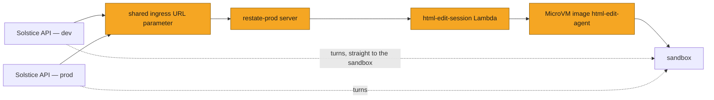
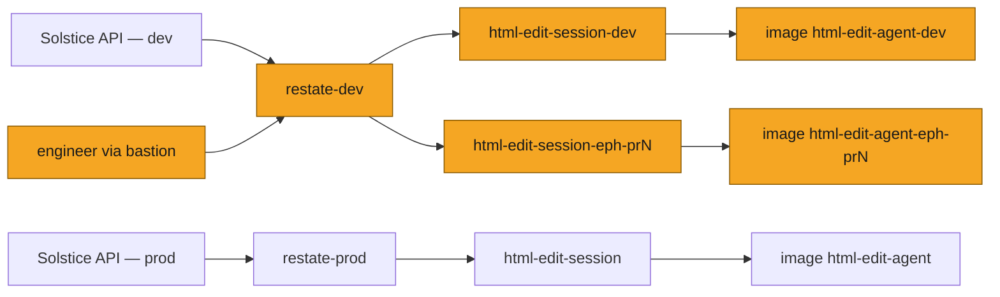
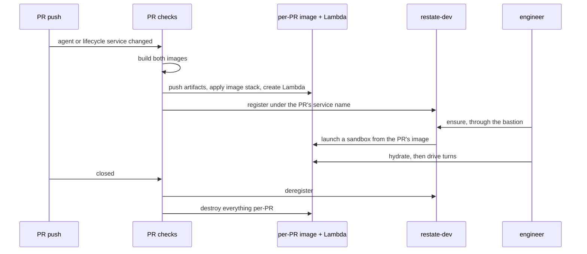
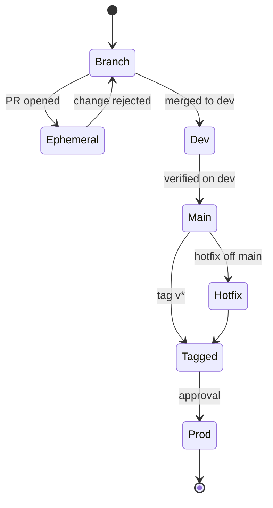
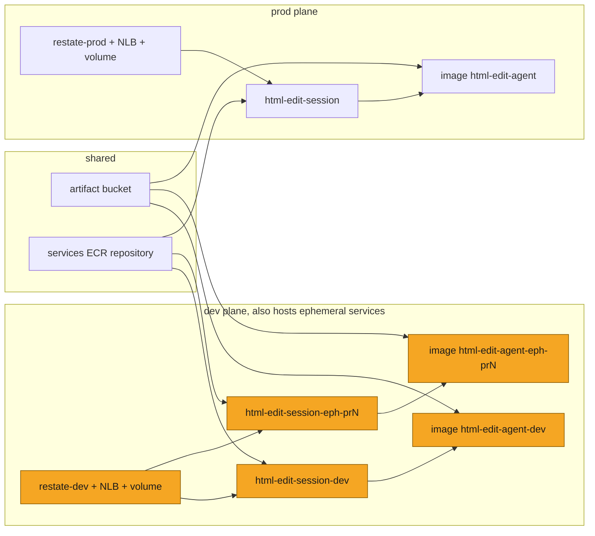

# SOL-2934: Agent platform — dev, prod and ephemeral deployment environments

| | |
|---|---|
| **Ticket** | [SOL-2934](https://linear.app/solsticehealth/issue/SOL-2934/agent-platform-dev-prod-and-ephemeral-deployment-environments) |
| **Author** | @gifan |
| **Reviewers** | 2, one owning the AI plane / infra |
| **Tier** | 2 |
| **Status** | Draft |
| **Date** | 2026-08-17 |

> [!IMPORTANT]
> **Tier check.** Tier 2.
> - [x] New infrastructure — a second Restate server, per-PR images, new IAM and OIDC roles
> - [x] Hard to reverse — splitting the shared Restate ingress parameter touches every backend environment's task definitions at once

## 1. Problem

The AI plane has one deployment and it is production. We need a dev environment,
and an ephemeral environment per PR, so agent and lifecycle changes can be
deployed and exercised before they reach users.

## 2. What exists today

Amber marks what needs a dev version.

| Component | Today | Split? |
|---|---|---|
| Restate server | one, `restate-prod`, cluster `solstice-prod` | **yes** |
| Restate ingress URL | one shared SSM parameter, enumerated into every environment's task secrets | **yes** |
| Lifecycle service Lambda | `html-edit-session` | **yes** |
| MicroVM agent image | `html-edit-agent` | **yes** |
| MicroVM build + execution roles | one pair, POC-named | **yes** |
| Restate service execution role | one | **yes** |
| GitHub OIDC deploy role | one, trusted on the `main` branch | **yes** |
| OpenRouter API key | one prod-named SSM parameter | **yes** |
| Terraform state keys | two, no environment in the path | **yes** |
| Artifact bucket, ECR repository, managed network connectors | shared, no environment-specific grants | no |

Deploys today: a push to `main` rebuilds the agent image and registers the
lifecycle service against `restate-prod`. `dev` is the default branch but unused —
work lands on `main`.

Two mechanics constrain every option below:

- Restate keys a deployment by the **service name** it exposes. That name is a
  constant in the service and in the API's client, and a second deployment of the
  same name on one server takes over routing for new invocations.
- A sandbox launch resolves the **latest active version** of a fixed image name, so
  a new version of a shared image name is live immediately.

## 3. What changes

### 3.1 Names, per environment

| Component | prod | dev | ephemeral, PR N |
|---|---|---|---|
| Restate server | `restate-prod` | `restate-dev` | dev's |
| Restate cluster + snapshot prefix | `solstice-prod` | `solstice-dev` | dev's |
| Ingress URL parameter | `/solstice/prod/RESTATE_INGRESS_URL` | `/solstice/dev/...` | dev's |
| Service Lambda | `html-edit-session` | `html-edit-session-dev` | `html-edit-session-eph-prN` |
| Restate service name | `HtmlEditSession` | `HtmlEditSession` | `HtmlEditSessionEphPrN` |
| MicroVM image | `html-edit-agent` | `html-edit-agent-dev` | `html-edit-agent-eph-prN` |
| MicroVM build role | `solstice-ai-microvm-build-prod` | `-dev` | dev's |
| MicroVM execution role | `solstice-ai-microvm-exec-prod` | `-dev` | dev's |
| Service execution role | `solstice-ai-restate-service-prod` | `-dev` | dev's |
| OIDC deploy role | `solstice-ai-gha-deploy-prod` | `-dev` | `-eph` |
| GitHub Environment | `prod` | `dev` | `ephemeral` |
| OpenRouter key | `/solstice/solstice-ai-prod/OPENROUTER_API_KEY` | `/solstice/solstice-ai-dev/...` | dev's |
| Terraform state prefix | unchanged | `solstice-ai/dev/` | `solstice-ai/dev/eph/prN/` |

The two POC-named roles are renamed in the same change. Both repos already read
role names from variables, so per-environment variable files carry it; two
hardcoded role ARNs in Backend-Server need hand-editing, and one of those is a
vestigial grant on the prod API's task role that gets deleted instead. Two grants
for an Anthropic key nothing reads any more are deleted rather than duplicated.

### 3.2 Ephemeral environments

An ephemeral environment is a satellite of dev. Anything not per-PR it borrows:
dev's Restate server, dev's roles, dev's OpenRouter key, dev's agent image when the
PR does not touch the agent, and a state prefix under dev's.

Per PR it gets an agent image, a service Lambda, and its own Restate service name.
Both container artifacts come from the PR checks that already built them, so the
ephemeral flow rebuilds nothing.

It does not borrow two things: its own OIDC deploy role, because a PR's workflow
must not hold dev's deploy identity; and shared short-retention log groups, so PR
output stays out of dev's.

Five of dev's grants widen from fixed values to `*-eph-*` patterns. None matches a
fixed dev or prod name.

| Grant | Widens to |
|---|---|
| dev build role, artifact read | ephemeral image artifact prefixes |
| dev build + execution roles, trust condition | `microvm-image:html-edit-agent-eph-*` |
| dev service execution role, log writes | `/aws/lambda/html-edit-session-eph-*` |
| `restate-dev` instance profile, `lambda:InvokeFunction` | `html-edit-session-eph-*` |
| shared ECR repository policy, `sourceArn` | `html-edit-session-eph-*` |

Teardown deregisters from Restate **before** deleting the Lambda. A nightly
sweeper reconciles both AWS and the Restate registry against open PRs.

Access is a bastion tunnel. Both servers keep their admin API bound to localhost
and reachable only through the bastion — that is how the UI and the deployment
registry are read on either plane, and prod already works this way. Dev
additionally admits the bastion on its **ingress** listener, so handlers can be
called by hand; prod's ingress stays backend-tasks-only.

| Listener | prod | dev |
|---|---|---|
| ingress — call handlers | backend tasks | backend tasks + bastion |
| admin — UI, deployment registry | bastion | bastion |

The loop from there: call `ensure` on the PR's service, then hydrate and drive
turns against the sandbox's own HTTPS endpoint, which is reachable directly.

### 3.3 Code changes

One: the Restate service name becomes configuration. Default unchanged, and a
validation rejects any override outside the ephemeral shape. Nothing else in either
repo changes — the API keeps naming `HtmlEditSession` and keeps resolving to dev's
or prod's deployment.

### 3.4 Terraform

Both AI stacks — the image stack and the services stack — become
environment-agnostic: environment-shaped defaults deleted, one variable file and one
backend config per environment, passed at init and apply. Ephemeral generates both
per PR. Prod's state keys stay byte-identical, so the refactor plans clean.

In Backend-Server the AI-plane resources become a module instantiated for dev and
prod, with existing prod resources relocated by `moved` blocks. The Restate server
module already takes a name, cluster and subnet, so dev is a second instantiation
plus its own snapshot bucket.

### 3.5 CI

- Three GitHub Environments. OIDC trust moves from branch refs to `environment:`
  subjects; each environment holds its own role ARN; prod gains required reviewers.
- Both container builds become PR checks, hung off the existing changed-paths
  filters and rolled into the aggregator check. From Phase 2 they also push, and the
  ephemeral environment consumes those artifacts.
- The image deploy workflow becomes reusable, called once per environment. The
  service deploy workflow takes environment, function name, Restate node tag and
  registration document as inputs.
- Cancel-in-progress `true` on the plain builds, `false` on any image-stack apply. A
  burst of pushes leaves the in-flight apply plus the newest push, since pending
  runs in a group are cancelled.
- Lifecycle rules expire ephemeral artifacts at 14 days, in S3 and ECR. The artifact
  bucket has no lifecycle policy today.

## 4. System views

### Workflows: trigger → action

| Trigger | Action |
|---|---|
| PR pushed | Build both images. Phase 2: push them, apply the per-PR image stack, create the per-PR Lambda, register it on `restate-dev` under the PR's service name |
| PR closed | Deregister from `restate-dev`, then delete Lambda, log group, image, artifact and state |
| Nightly | Sweep AWS and the Restate registry for ephemeral resources with no open PR |
| Merge to `dev` | Build and apply the dev agent image; deploy and register the dev service |
| Merge to `main` | Nothing — `main` is the release-cut branch |
| Tag `v*` | As dev, against prod names, behind reviewer approval |

### Context: three planes

### Flow: the ephemeral loop

### Data: what changes shape

*N/A:* no schema change. New persisted state is a second Restate journal and new
Terraform state objects.

### State: the release train

## 5. Trade-offs accepted

- A second Restate server, ~$35–90/mo plus a second journal to operate, for an
  isolated durable-execution plane. Revisit on Restate namespaces or Restate Cloud.
- Ephemeral services on dev's server, sharing its journal, CPU and registry.
  Revisit if PR load reaches dev's latency.
- Ephemeral borrowing dev's substrate, so a broken dev plane blocks previews and
  dev's grants carry non-prod wildcards. Revisit if a PR's blast radius costs dev
  availability.
- A configurable service name, which is a durable-state key. Mitigated by an
  unchanged default and a validated override shape.
- An image build on every PR push touching the agent — minutes of wall clock and an
  image version per push — for a merge gate and near-free ephemeral environments.
  Revisit if build minutes show up in the bill; fallback is build-without-push on
  drafts.
- Prod on a tag with approval, trading cadence for a release train shared with the
  API. Escape hatch is the hotfix branch.
- Same AWS account, separated by name. Revisit when the plane holds tenant data at
  rest.

## 6. Alternatives rejected

- **Share `restate-prod` for dev, distinguished by service name.** Dev and prod
  would share a journal, a registry and an availability story.
- **A Restate server per PR.** ~$50–90/mo each, minutes to boot, and the journal
  volume resists destruction.
- **Restate and the service inside the CI job.** Nothing to reap, but it tests
  neither the arm64 Lambda, nor registration, nor the server's invoke path.
- **One image name with per-environment version pinning.** Launches resolve the
  latest active version; pinning needs a code change and every ephemeral build would
  still be an active version of prod's image.
- **A third set of roles, keys and log groups for ephemeral.** Copies of dev's,
  validated by nothing else.
- **Duplicated per-environment Terraform roots, or workspaces.** Drift, and implicit
  workspace-keyed lookups.
- **Doing nothing.** Dev turns keep burning prod sandbox capacity and prod inference
  budget, and a bad agent build reaches users.

## 7. Risks and rollback

| Risk | Control |
|---|---|
| The ingress-parameter split breaks task definitions in every environment at once — a same-named parameter in the shared and per-environment prefixes is a duplicate secret | The four-step order below; the first check at each step is a task-definition diff, not a deployment |
| The role rename breaks a live sandbox's key fetch — a rename is a destroy-and-create, and a running sandbox has already assumed the old role | The drain order below; back out by repointing variable files until the last step |
| Mis-shaped `*-eph-*` patterns widen **dev's** grants, not a throwaway role's | Every pattern requires the `-eph-` infix; checked against fixed dev and prod names |
| Ephemeral leakage — a force-closed PR leaves an image, a Lambda, a registry entry or a running sandbox | `ExpiresAt` tags, nightly sweeper over AWS and the registry, low ephemeral sandbox TTL |
| Retired ephemeral service names leave Virtual Object state on dev's server | Purge at teardown; if no clean admin call exists, periodic dev journal reset |
| A PR job now assumes an AWS role | Scoped to `*-eph-*` and the ephemeral state prefix; fork PRs get no token |
| The journal volume resists `terraform destroy` | Deliberate two-step, in the runbook |

Everything except the two ordered migrations is additive: back out by deleting new
resources.

## 8. Verification

1. Both prod stacks and the Backend-Server module extraction plan with **no
   changes**.
2. The dev agent image reports ACTIVE; prod's image version is unchanged across it.
3. `restate-dev` lists exactly one `HtmlEditSession` deployment, pinned to a
   published version.
4. A cold turn on a dev tenant names the dev image in its sandbox descriptor.
5. Dev tasks resolve their own ingress URL; prod's ingress no longer admits dev's
   security group while its admin listener still admits the bastion; dev's ingress
   is reachable through the bastion. Both environments' state locks observed under
   concurrent applies.
6. Prod and dev execution roles cannot read each other's OpenRouter key; prod's
   build-role trust names exactly one image; the ephemeral role cannot write dev
   state outside the ephemeral prefix.
7. A PR that breaks either container build, or drifts either lockfile, fails PR
   checks.
8. The digest the ephemeral Lambda runs equals the digest PR checks pushed.
9. With an ephemeral environment live, `restate-dev` serves both it and an untouched
   `HtmlEditSession`, and a dev API turn still lands on dev's image.
10. Closing the PR leaves no registry entry, Lambda, log group, image, artifact or
    state object, and no running sandbox.
11. Every deploy path traces to a Terraform resource. Known exception: the
    repository-level deploy-role variable is still set by hand.

*Not covered:* the automated smoke gate — the ticket's third criterion — which needs
its own ticket. What this plan gives it is somewhere to run.

Post-ship signal: dev service invocation errors and MicroVM launch failures should
appear in dev first, plus weekly ephemeral spend.

## 9. Open questions

- Prod from a `v*` tag, or keep push-to-`main`? Tags match Backend-Server and add
  the approval gate.
- Shared `v*` series with the platform, or an AI-specific prefix?
- Which admin call purges a retired Virtual Object's state? Needed before Phase 2;
  fallback is a periodic dev journal reset.
- Does Restate allow hyphens in service names? If so, `html-edit-session-eph-prN`
  matches the AWS names better than the camel-case form used here.
- Ephemeral environments are keyed by PR number, so a branch with no PR gets
  nothing. Confirm that matches intent.
- Dev Restate sizing: small instance and daily snapshots, or prod-identical?
  Recommend the former.
- The non-prod state bucket currently holds the AI plane's prod state. Rename,
  split, or document?

---

# Tier 2 sections

## Goals and non-goals

**Goals.** Independent dev and prod planes. A per-PR environment built from
artifacts PR checks already produced, leaking nothing. A deliberate,
approval-gated prod deploy. No deploy path on hand-made resources.

**Non-goals.** Separate AWS accounts. A staging AI plane. Prod-identical dev
capacity. A Restate server per PR. A third set of roles or keys for ephemeral. The
automated smoke gate. Restate Cloud.

## PR sequence

Two phases in order. Phase 1 stands alone. Each row is one child ticket.

### Phase 1 — dev and prod

| # | Repo | What lands | Gate | Needs |
|---|---|---|---|---|
| 1 | Solstice-AI | Both container builds as PR checks, build-only | A broken build fails the PR | — |
| 2 | Solstice-AI | Environment-agnostic stacks: per-environment variable files and backend configs, environment-shaped defaults deleted | Prod plans clean | — |
| 3 | Backend-Server | AI-plane resources extracted into a module with `moved` blocks | Plans clean | — |
| 4 | Backend-Server | Per-environment roles; POC-named roles retired; dead Anthropic grants, the vestigial task-role grant and both hardcoded ARNs deleted | Old roles deleted only after a live turn passes on the new ones | 3 |
| 5 | Backend-Server | Dev substrate: `restate-dev`, own snapshot bucket, dev log groups, dev key parameter, dev deploy role, dev service added to the ECR policy, bastion on dev's ingress **and** admin listeners | `restate-dev` healthy; UI and ingress both reachable through the bastion | 3, 4 |
| 6 | Solstice-AI | Dev and prod CI: GitHub Environments, `environment:` OIDC trust, reusable image deploy, parameterized service deploy, dev bootstrapped by dispatch | A merge to `dev` serves a dev sandbox; prod untouched | 2, 5 |
| 7 | Backend-Server | The ingress-parameter split, four steps | Each environment resolves its own ingress | 5 |
| 8 | both | Prod's ingress stops admitting dev's security group; README, dev runbook, and Backend-Server's stale CI/CD doc corrected | Prod ingress admits prod tasks only, admin still admits the bastion | 6, 7 |

Critical path 3 → 4 → 5 → 6; PRs 1, 2 and 7 sit off it. **PR 6 demos.** ~5–7 days.

### Phase 2 — ephemeral

| # | Repo | What lands | Gate | Needs |
|---|---|---|---|---|
| 9 | both | Enablers: configurable service name with validation; a deregistration document; the five `*-eph-*` widenings; shared ephemeral log groups; the `ephemeral` Environment and role; S3 and ECR lifecycle rules | Wildcards match no fixed name; dev keeps serving | 5 |
| 10 | Solstice-AI | The loop: PR checks gain push; per-PR image, Lambda and registration; teardown on PR close; nightly sweeper | A PR gets an environment; closing it leaves nothing | 1, 6, 9 |
| 11 | Solstice-AI | Ephemeral runbook | — | 10 |

**PR 10 demos.** ~3–4 days.

## Migration and rollout

**PR 4, the role rename.** Create new roles alongside the old → repoint each
environment's variable file → apply the image stack → apply the services stack so
the execution-role ARN moves → redeploy the service so its published version carries
it → let in-flight sandboxes drain, bounded by the sandbox TTL → delete the old
roles. Deleting early is silent until a live sandbox fetches its key.

**PR 7, the ingress-parameter split.**

1. Exclude the ingress URL from the shared-prefix secret enumeration in dev, prod
   and staging; apply each; confirm it leaves the task definitions.
2. Write per-environment ingress parameters from the owning stacks.
3. Delete the shared parameter.
4. Drop the exclusions, apply, force one deployment per environment, confirm each
   resolves its own ingress.

Back out after step 3 by recreating the shared parameter and re-excluding. Retire
the dead shared MicroVM-execution-role parameter in the same PR, the same way.

## Security and compliance

- No new data processor. A second OpenRouter key makes non-prod spend and revocation
  independent of prod; dev and ephemeral share it.
- After PR 4 no role spans dev and prod. Each execution role reads one key, each
  build role's trust names its own images, each service role passes only its own
  environment's execution role.
- The ephemeral wildcards are the review surface, and because ephemeral borrows
  dev's roles they land on dev's grants. All five require the `-eph-` infix.
- Registration and deregistration are fixed SSM documents with one
  regex-constrained input each, so CI can perform those two operations and not run
  commands. Confirm the deregistration document cannot target dev's own deployment.
- Both servers' admin APIs stay localhost-bound, reached only through the bastion — the sole control on who can register deployments or patch invocation state. Dev's ingress is bastion-reachable too; prod's is not.
- Tenant isolation unchanged: Restate never receives a context bundle. Ephemeral
  environments are driven by hand and by no API.

## Phasing and estimates

Phase 1, PRs 1–8, ~5–7 days, ships alone. Phase 2, PRs 9–11, ~3–4 days. Phase 2's
tickets group under their own parent so Phase 1 can close.

## Deploy view

## Pre-mortem

Three months on, the likeliest failure is not technical: the environments exist and
work still lands straight on `main`. Ephemeral is automatic per PR, so the adoption
risk sits on the release train — prod only from a tag, cut from a `main` that went
through dev — and that needs releases actually being cut. Next likeliest: the
ingress split run out of order, taking dev and prod task launches down together.
Third: ephemeral leakage nobody notices until a bill does, or until dev's registry
is thirty dead ephemeral deployments deep, if the sweeper is written but never
alerted on.

## Decision log

| Date | Decision | Options considered | Why | Who | Status |
|---|---|---|---|---|---|
| 2026-08-17 | Dev gets its own Restate server | Share prod's with a renamed service; Restate Cloud | Service name is the routing key; sharing lets dev re-point prod | @gifan | Decided |
| 2026-08-17 | Dev gets its own image name | Shared name, per-environment version pinning | Launches resolve the latest active version | @gifan | Decided |
| 2026-08-17 | Ephemeral = per-PR image and Lambda on dev's server | Restate in the CI job; a server per PR | Exercises the real Lambda, registration and invoke path at no standing cost | @gifan | Decided |
| 2026-08-17 | Ephemeral borrows dev for everything shared, except its deploy role and log groups | A full third set | One non-prod substrate; the deploy role is the boundary against PR-triggered code | @gifan | Decided |
| 2026-08-17 | Service name becomes configuration, ephemeral-only | Keep the constant | Two deployments of one name on a server collide | @gifan | Decided |
| 2026-08-17 | Both images build on every PR and feed ephemeral; no opt-in label | Build-only checks; label-gated builds | Catches build breaks at PR time and makes ephemeral nearly free | @gifan | Decided |
| 2026-08-17 | Two phases: dev and prod, then ephemeral | One programme | Phase 1 alone ends testing in production; the phases carry different risks | @gifan | Decided |
| 2026-08-17 | Every role gets a per-environment version; POC names retired | `-dev` siblings beside unsuffixed prod names | Each has a grant that should differ per environment | @gifan | Decided |
| 2026-08-17 | Same AWS account, separated by name | Separate accounts | Larger programme; revisit when the plane holds tenant data at rest | @gifan | Decided |
| 2026-08-17 | The automated smoke gate moves to its own ticket | Build it here | Its own design questions; an unbuilt gate would block every environment under it | @gifan | Decided |

## Sign-off

| Reviewer | Verdict | Date | Note |
|---|---|---|---|
| @ | Approve / Blocked | | |
| @ | Approve / Blocked | | |
