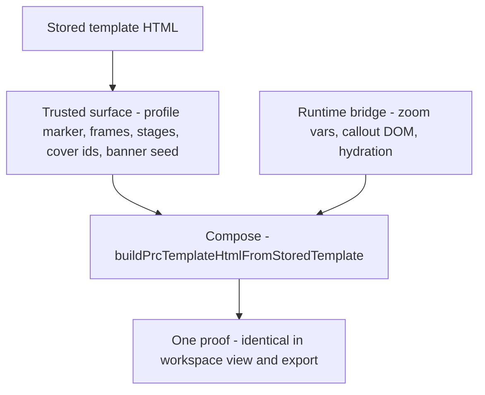
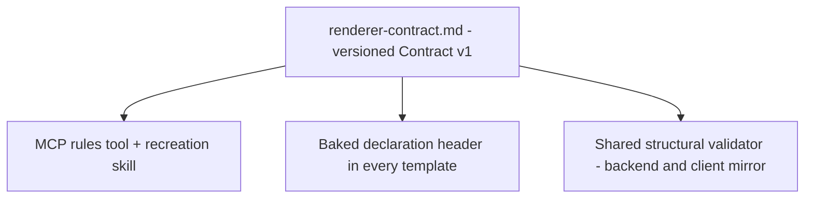
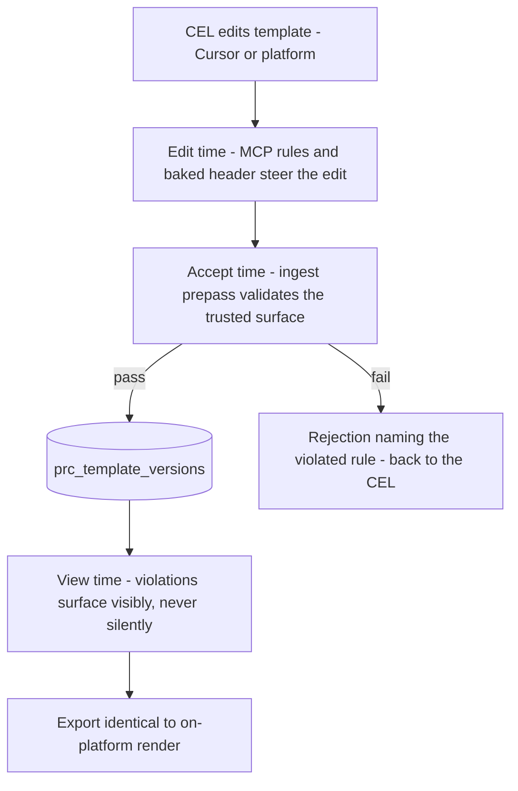
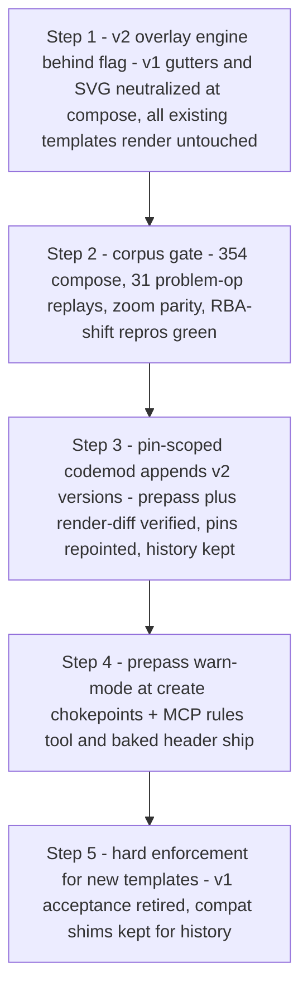

# SOL-3053: The anatomy of a PRC template

| | |
|---|---|
| **Ticket** | [SOL-3053](https://linear.app/solsticehealth/issue/SOL-3053/centralized-prc-template-format-contract-for-out-of-platform-cursor) (parent [SOL-3050](https://linear.app/solsticehealth/issue/SOL-3050)) |
| **Author** | @Alex Li |
| **Status** | Analysis / Contract proposal |
| **Date** | 2026-08-11 |
| **Source** | Corpus analysis of 354 unique production templates across 26 tenants |

What every proof shell in production actually looks like, what the renderer owns versus what it trusts, and the contract that lets `prc-template-view.tsx` render any template — even after it has been taken into Cursor and back.

---

## The problem

The fleet is twelve shapes, not one format.

Across 26 tenants we have 354 unique template shells. They are not variants of a single contract — they partition into twelve exclusive structural buckets (`buckets.json`). Most of the fleet is a hollow banner seed; most emails still ship a legacy callout engine the renderer strips; a thin risk slice already fails fonts, zoom, or category identity. Without a named trusted surface, Cursor edits land on whichever shape they happened to open.

| Metric | Value |
| --- | --- |
| Unique templates · tenants | **354** · 26 |
| Exclusive structural buckets | **12** |
| Declare `--prc-fit-scale` / `--prc-user-zoom` | **0 / 354** |
| Emails carrying a legacy engine | **66 / 87** |
| Hard-reject exhibits in prod | **5** |
| External Google Fonts links | **46** |

### By category (sum of exclusive buckets)

| Category | Count | Buckets | Share of 354 |
| --- | ---: | ---: | --- |
| Banner | 242 | 4 | `████████████████████████████████████████` 68% |
| Email | 87 | 5 | `██████████████` 25% |
| Social | 22 | 2 | `████` 6% |
| Website | 3 | 1 | `█` 1% |

### Twelve exclusive buckets

Bar width relative to the largest bucket (175). Risk / hard-reject classes marked ⚠.

| Bucket | Count | Relative | Notes |
| --- | ---: | --- | --- |
| `banner-standard-srcdoc-shell` | 175 | `████████████████████████████████` | Dominant hollow banner seed |
| `email-generic-legacy-engine` | 53 | `██████████` | `layoutStage` + gutters/svg |
| ⚠ `banner-with-google-fonts` | 44 | `████████` | Font-export risk |
| `social-modern-frame-shell` | 20 | `████` | Frame-only, no stage |
| `email-alexion-legacy-engine` | 13 | `██` | `layoutAlexionStage` |
| ⚠ `banner-missing-total-scale` | 13 | `██` | Zoom contract gap |
| `email-modern-clean` | 11 | `██` | Stage + gutters, no legacy engine |
| `banner-proof-marked` | 10 | `██` | Explicit `proof=banner` |
| `email-modern-no-gutter` | 8 | `█` | Callouts omitted by design |
| `website-email-like-legacy` | 3 | `█` | AZ website shells |
| ⚠ `email-anomalous-shell` | 2 | `█` | Stub / category mismatch |
| ⚠ `social-anomalous` | 2 | `█` | Creative-as-template + fonts |

**354 = Σ counts · exclusive partition.**

---

## Part one — Who owns what

The compose pipeline replaces a large surface at render time. A contract that demands renderer-owned things of stored HTML would falsely fail most of production. The rules below only ever bind the trusted column.

### Renderer-owned — injected or replaced at compose

Templates must never declare, require, or hand-author these.

- `--prc-fit-scale` · `--prc-user-zoom` · `--prc-total-scale` — full zoom contract, always re-injected
- All callout DOM: `.prc-callout`, `.prc-connector-line`, `.callout-dot`, annotation keys
- Legacy engines — `layoutStage` / `layoutAlexionStage` scripts are stripped; one geometry owner
- Creative `srcdoc`, viewport meta, 600 / 375px frame pinning
- Cover values: `filename · to · from · options[]` (overwritten from fields)
- Banner hydration: `__BANNER_TEMPLATE_SRCDOC(S)__`, `dimensions`, `scenes`
- Annotation positions — draft data on the operation, never template markup

### Template-trusted — the actual contract surface

Break these and the proof breaks; keep them and edits survive compose.

- Profile marker: `data-sol-prc-proof` = email · social · website (banner: detection triad)
- Marked creative frames: `iframe.prc-render-frame` / `[data-width]` / `[data-prc-frame]`
- Stage hosts: `.prc-render-stage` + gutters + `.prc-connector-svg` (email/website)
- Cover config: `#prc-cover-data` JSON + stable ids `#prc-filename` · `#prc-to` · `#prc-from` · `#prc-options`
- Field markers: `data-sol-prc-field` / `-mirror` / `-derived`
- Banner seed: `#banner-template-data` + `#banner-scene-adapter` + `main.pages [data-banner-section]` + clone templates
- Social builder: source frame + platform/variant/storyboard `<template>`s

---

## Part two — Four skeletons

**Bold** = trusted contract surface. *Italic / marked renderer-owned* = replaced at compose.

### Email — 87 templates · 5 buckets

`body.prc-doc[data-sol-prc-proof="email"]`

```
html
├─ head · --prc-desktop-width --prc-mobile-width
└─ body[data-sol-prc-proof="email"]
   ├─ script#prc-cover-data (json)
   ├─ section.prc-cover
   │   #prc-filename #prc-to #prc-from #prc-options
   ├─ section[data-viewport=desktop]
   │  └─ .prc-render-stage
   │     ├─ .prc-callout-gutter[left]
   │     ├─ iframe.prc-render-frame   · srcdoc (renderer-owned)
   │     ├─ .prc-callout-gutter[right]
   │     └─ svg.prc-connector-svg
   ├─ section[data-viewport=mobile] (same, 375px)
   └─ legacy layoutStage engine — stripped (renderer-owned)
```

Variants: 13 Alexion shells use `.prc-alexion-*` names (normalized, engine stripped); 8 modern shells intentionally omit gutters — no callouts by design; Dupixent adds `#prc-template-config`.

### Banner — 242 templates · 4 buckets

`body.banner-proof-doc` — detection: data triad, not proof attr (10/242 have it)

```
html
└─ body.banner-proof-doc
   ├─ script#banner-template-data (json seed)
   │   title:"" dimensions: null → filled (renderer-owned)
   │   scenes: [] → hydrated from creative (renderer-owned)
   ├─ script#banner-placeholder-srcdoc
   ├─ script#banner-scene-adapter
   │   reads __BANNER_TEMPLATE_SRCDOC(S)__ (renderer-owned)
   ├─ main.pages
   │  └─ section[data-banner-section]  · cloned per size (renderer-owned)
   │     [data-slot=title|dimensions|frames|isi]
   ├─ template#frame-template
   └─ template#isi-region-template
```

Seeds are intentionally hollow — validity is the adapter + placeholders + section DOM, never populated scene JSON. 44 templates pull Google Fonts: the font-export risk class.

### Social — 22 templates · 2 buckets

`body.prc-doc[data-sol-prc-proof="social"]` — frame-only, never a render stage

```
html
└─ body[data-sol-prc-proof="social"]
   ├─ script#prc-cover-data {filename, sectionTitle}
   ├─ iframe.prc-render-frame.prc-source-frame
   │   [data-prc-frame="social"]  · srcdoc (renderer-owned)
   ├─ main.prc-pages[data-sol-prc-pages]
   ├─ template#prc-platform-page-tpl
   ├─ template#prc-variant-cell-tpl
   ├─ template#prc-storyboard-page-tpl
   └─ page-builder script (groups by data-platform)
```

No `.prc-render-stage`, no gutters — the bridge special-cases social. Validation rules must be per-category.

### Website — 3 templates · 1 bucket

`body[data-sol-prc-proof="website"]` — email-like, URL cover

```
html
└─ body[data-sol-prc-proof="website"]
   ├─ script#prc-cover-data
   │   {filename, url, pageTitle, description}
   ├─ cover fields file_name url page_title meta_description
   ├─ dual [data-viewport] stages + gutters + svg
   └─ legacy layoutStage — stripped (renderer-owned)
```

All three are AstraZeneca `website_prc_template`. Structurally an email with a URL cover schema.

---

## Part three — How violations fail today

Export paths fail closed. The interactive view does not — the worst out-of-contract failures are **silent**, and a CEL believes the template works.

| Violation | Behavior | Where |
| --- | --- | --- |
| Missing stage hosts (frame / svg / gutters) | **silent** | annotations vanish for that stage · `prc-bridge-callouts.ts:1068` |
| Unmarked creative iframes | **silent** | creative injected into *every* iframe · `prc-template-renderer.ts:480` |
| Multi-banner without `main.pages [data-banner-section]` | **silent** | extra dimensions dropped · `prc-template-renderer.ts:2169` |
| Banner markers inside an email template | **silent** | banner branch wins, wrong profile renders · `isBannerTemplate:455` |
| Wrong / renamed `data-sol-prc-field` ids | **silent** | cover edits stop round-tripping · bridge field wiring |
| Empty or missing shell HTML | soft fallback | legacy React view · `interactive-prc-template-view.tsx:233` |
| Resolution content-type mismatch | fail-closed | PRC toggle off · `use-prc-template-resolution.ts:105` |
| Export / projection with bad template | fail-closed | `unavailable` / `render-failed` / throw · `build-prc-template.ts` |

---

## Part four — Contract v1

One source of truth — version and extend the existing `renderer-contract.md` in the MCP plugin. Every template carries a baked declaration; three layers enforce it.

### Baked declaration

```html
<meta name="sol-prc-contract" content="v1" data-profile="email">
<!-- SOLSTICE PRC TEMPLATE — CONTRACT v1 (profile: email)
  If you are an AI or human editing this file outside Solstice:
  1. NEVER remove/rename elements carrying data-sol-prc-*,
     .prc-render-stage, .prc-callout-gutter, .prc-connector-svg,
     iframe.prc-render-frame, #prc-cover-data, #prc-options
  2. NEVER declare --prc-fit-scale / --prc-user-zoom  (runtime-owned)
  3. NEVER add callout/annotation JS — the Solstice bridge owns all
     annotation geometry and strips authored engines
  4. NEVER link external fonts — inline or platform-listed fonts only
  5. Keep template and creative separate — no operation content here
  Full rules: solstice_prc_template_rules via the Solstice MCP -->
```

### Three enforcement layers

| When | Layer | What |
| --- | --- | --- |
| Edit time | MCP-injected rules | Extend `prc-template-recreation` + `renderer-contract.md`; add `solstice_prc_template_rules`. Cite the contract on `solstice_create_prc_template_version`. Baked comment covers editors with no MCP. |
| Accept time | Ingest prepass | Structural validation in `PrcTemplateService.create_template_version` and the MCP create tool — both accept `<html></html>` today. Reject with the violated rule name; mirror client-side in `entities/prc-template`. Gate: all 21 seeds and 349/354 corpus templates pass; the 5 known-bad exhibits fail. |
| View time | Fail visible, not silent | When stage hosts are missing or proof geometry never arrives, the bridge surfaces a diagnostic instead of quietly dropping annotations (`prc-bridge-callouts.ts:1068` bails silently today). Export paths stay fail-closed. |

### Per-profile rules

**Email · Website**

- **Must:** `data-sol-prc-proof` · marked creative frames · viewport labels · `#prc-cover-data` parses · core cover ids intact
- **Should:** stage + gutters when callouts wanted · desktop + mobile width vars
- **Must not:** banner markers · path stubs / non-HTML · authored callout JS

**Banner · Social**

- **Must — banner:** `#banner-template-data` · `#banner-scene-adapter` · `main.pages [data-banner-section]` · clone templates
- **Must — social:** `proof="social"` · source frame · minimal cover
- **Must not:** require non-empty scenes · stage/gutter contract on social · external font links

---

## Part five — Why: the evidence

- **Published stub** — `email/a684f444bb48.html` is 67 bytes: a filesystem path (`@/Users/.../HPP_HCP_Template_Alias_v4.html`) saved as a template.
- **Category mismatch** — `email/817f8955ef2a.html` is a complete UCB banner shell stored under content-type email; the banner branch wins at render.
- **Wrong mental model** — 13 Alexion emails carry comments claiming the legacy callout engine is “preserved, owns all annotations.” It is stripped at compose. Cursor-side edits are being made against documentation that contradicts the renderer.
- **Creative-as-template** — two 2.3MB Lead_Gen social creatives stored as templates: no proof marker, no source frame, Google Fonts.
- 0/354 templates self-host a font; 46 link Google Fonts externally — the font-export failure class is structural, not incidental.
- Extension works when the contract holds: nonstandard field ids like `job_code` flow through the generic `data-sol-prc-field` path untouched.

---

## Part six — The contract, as a mental model

Three ideas carry the whole design. A template only ever promises the trusted surface; every enforcement artifact is generated from one document; and a violation is named at the earliest checkpoint it can be caught — never silently swallowed.

### 1 · Two inputs, one proof

The stored template promises only its trusted surface. Everything else — zoom variables, callout DOM, hydration — arrives from the runtime bridge at compose. The same compose serves the workspace view and the export, so a conforming template cannot render two different truths.



### 2 · One document, three artifacts

The versioned `renderer-contract.md` is the only place rules are written. The MCP rules tool, the baked declaration header, and the shared structural validator are all generated from it — they can drift from each other only if generation breaks, never by hand-editing.



### 3 · Named at the earliest checkpoint

Edit time steers, accept time gates, view time surfaces. A CEL editing in Cursor is guided before the mistake exists, rejected with the violated rule's name if it lands anyway, and shown a visible diagnostic if anything slips through — the silent-failure rows in part three cease to exist.



---

## Part seven — Contract v2 — one model for every template

v1 asked templates to carry annotation chrome: stages, left and right gutter columns, a connector SVG. v2 deletes all of it. A template declares, lays out pages, slots the creative, and marks fields — the platform draws every annotation, bounded within the page. Full text: local `CONTRACT.md` (corpus companion).

### 1 · The annotation model, before and after

**v1 — the template draws the chrome (removed in v2)**

Every template ships opinions about how callouts are drawn: `.prc-render-stage` with left/right `.prc-callout-gutter` columns, `iframe.prc-render-frame`, and `svg.prc-connector-svg`. A missing gutter or SVG kills annotations silently; social needs a different rulebook; gutters reserve layout width whether or not callouts exist.

**v2 — the platform draws within the page**

`[data-sol-prc-page]` is the annotation boundary. Runtime overlay per page: callouts at a **fixed inset** from the page border nearest their anchor, **clamped** inside the page rect, **collision-stacked** in anchor order. Manual drag is the only override — persisted as page-space draft data on the operation, never in the template. Same model for email, banner, social, website. Creative lands only in `iframe[data-sol-prc-creative]`.

### 2 · The whole contract is six layers and a reserved row

Keep layers 0–5 intact, touch nothing reserved, and any edit — Cursor or platform — renders and exports identically. Everything else (comments, styles, brand chrome, extra config keys) is free space.

| Layer | Name | Vocabulary |
| --- | --- | --- |
| L0 | Declaration | `<meta sol-prc-contract="v2" data-profile>` + instruction comment |
| L1 | Profile | `body[data-sol-prc-proof="email\|banner\|social\|website"]` — explicit for all, banner included |
| L2 | Pages | `main[data-sol-prc-pages]` › `[data-sol-prc-page][data-sol-prc-page-type]` — each page is the annotation boundary |
| L3 | Creative slots | `iframe[data-sol-prc-creative="desktop\|mobile\|social\|banner"]` — only marked iframes receive creative |
| L4 | Config seed | `script#sol-prc-config` — presentation keys only; platform-owned values injected, never stored |
| L5 | Fields | `data-sol-prc-field` / `-mirror` / `-derived` + stable cover ids — extend freely, never rename |
| ⛔ Reserved | — | `--prc-*` vars · all annotation DOM/CSS/JS · `__prc_annotation_positions` · `__BANNER_TEMPLATE_*` · external fonts |

### 3 · Migration — runtime first, pins only, machines do the edits

Only pinned versions render anything; rows are append-only history. So the engine migrates before any template does, the corpus is the gate, and backfill is a codemod over pins — not 354 hand-fixes, and not representative-only.



---

## Companions

- Local corpus: `STRUCTURE.md`, `buckets.json`, `paired/fixtures.json`, `CONTRACT.md`
- MCP authoring contract: `solstice-mcp-server/plugins/solstice-platform/skills/prc-template-recreation/references/renderer-contract.md`
- Pressure suite: `tests/unit/components/content-workspace/prc-template/prc-corpus.test.ts`
- Editorial HTML (local, richer viz): `Solstice-Frontend/tests/corpus/prc-templates/structure-explainer.html`
