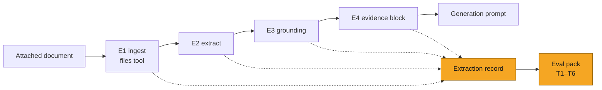

# Claim extraction evals: in-turn extraction on attached documents

| | |
|---|---|
| **Ticket** | [SOL-3155](https://linear.app/solsticehealth/issue/SOL-3155) |
| **Author** | @abhipsha16 |
| **Reviewers** | @arindam-sharma · @eeva-ff · @bensolstice |
| **Tier** | 1 |
| **Status** | Draft |
| **Date** | 2026-08-17 |
| **Companion plan** | [`SOL-3156-content-generation-evals.md`](SOL-3156-content-generation-evals.md) |

> [!IMPORTANT]
> **Tier check.** No triggers apply: observe-only eval pack plus run-record instrumentation; no auth/tenancy, no PHI handled in a new way, no schema migration, no new vendor, no API contract change, reversible in under a day. Tier 1; Tier 2 sections deleted.

## 1. Problem

When a user attaches a document to a generate brief, extraction determines what evidence generation
can use. Today that path returns topic labels instead of claims, reports itself grounded on any
non-empty text, silently caps and truncates the payload, and attaches no source locator. No eval
separates these failures from generation failures: an asset built on lost evidence is
indistinguishable at the output from one where the model chose badly.

**Measured property:** whether a proposition present in the attached document reaches the asset
correctly and citeably, and which stage loses it where it does not.

- A **proposition** is a claim carrying a measured value with its statistical qualifiers and the
  population it applies to.
- A **topic label** is a phrase naming a subject with no value attached.

## 2. What exists today

Paths relative to `Backend-Server/src/content_generation_new/application/Agentic_Workflows/`.
Line-level citations: `notes/pipeline-architecture-map.md` Part 7c in the solstice-dev workspace.

### Stage contracts and current behaviour

| # | Stage | Required output | Current output |
|---|---|---|---|
| E1 | Ingest — `query_agent_v3/tools/files.py` | Complete document text and image set; assigned purpose | As required, subject to per-format extraction limits *(not yet code-verified)* |
| E2 | Claim extraction — `_extract_claims()` | Propositions, each with value, qualifiers, population, source locator | Up to 8 topic labels from a fixed phrase list; on no match, sentences truncated to 160 chars. No locator |
| E3 | Grounding decision — `_documents_only_grounding_status()` | True only when at least one proposition was extracted | True when any extracted item exists **or** any text exists |
| E4 | Payload assembly — blueprint prompt build | Every extracted proposition, verbatim, each with its locator | Items capped at 20; raw text truncated to 3000 chars when extraction is empty; no locators |

```python
# E2 — query_agent_v3/tools/files.py:1255
async def _extract_claims(local_path, file_kind, filename, text) -> list:
    """Extract structured clinical claims using GPT-4o vision on document pages."""
    del local_path, file_kind, filename
    return extract_claim_topics(text)   # fixed 8-phrase list; sentence[:160] fallback

# E3 — query_agent_v3/tools/blueprint.py:203-220
return bool(claim_count or text_chars), text_chars, claim_count   # any text ⇒ grounded

# E4 — query_agent_v3/tools/blueprint.py:3863-3879
doc_claims_parts[:20]                    # cap
str(ext_text)[:3000]                     # raw-text fallback on empty extraction
```

A structured extractor (grouped claims, polygons, render payloads) exists at
`process_claims_extraction_path()`, reachable only from the v2 files path
(`query_agent_v2_files.py:3473-3487`), gated on
`has_structured_claims and file_extension == ".pdf" and design_decision not in {"design_only", "inspiration"}`.

### Worked case

Source passage: *"In previously untreated metastatic nonsquamous NSCLC, median overall survival was
22.0 months versus 10.7 months (HR 0.56; 95% CI, 0.45–0.70; P<0.001)."*

E2 returns `["overall survival"]`. E3 returns `is_grounded=True`. E4 delivers one bullet:
`- overall survival`. Every number, the comparator, the interval, the p-value and the population are
lost, and the run reports itself as grounded.

### Failure modes

| # | Stage | Mechanism | Effect on the asset | Test |
|---|---|---|---|---|
| F1 | E2 | Output items are topic labels, not propositions | Section written from a subject with no values or qualifiers | T1 |
| F2 | E2 | Phrase list is fixed and therapeutically narrow | Documents outside those areas extract nothing; path degrades to raw text | T1 |
| F3 | E2 | Sentence fallback slices at 160 chars, inside values | Statistic delivered without its interval or comparator | T1, T4 |
| F4 | E3 | Text alone sets grounded | Closed-book generation permitted with zero propositions | T2 |
| F5 | E4 | 20-item cap | Document content dropped before generation | T3 |
| F6 | E4 | 3000-char raw-text substitution on empty extraction | Generation reads unstructured prose; long documents truncated | T3 |
| F7 | E2–E4 | No locator attached at any stage | Content cannot be cited; source resolves as unknown | T5 |

The shared evals layer (`src/shared/evals/`, pack registration, Braintrust backend) already exists;
this plan adds a pack to it, not a new harness.

## 3. Approach

One new eval pack plus a per-run, per-attachment **extraction record** emitted by the pipeline.
No production behaviour changes; the record is fail-open and observe-only.

### Tests

| Test | Target | Asserts | Gate | Needs |
|---|---|---|---|---|
| T1 Extraction representativeness | E2 | Every annotated proposition has a matching extracted item; every extracted item carries a value. Reported by therapy area | Deterministic vs annotation | R1 |
| T2 Grounding validity | E3 | `is_grounded == (proposition_count > 0)`; false-grounding rate split by basis (text-only, labels-only) | Deterministic | Instrumentation |
| T3 Payload delivery | E4 | All extracted items delivered; `cap_hit == False`; `fallback_used == False`; share of text omitted when fallback fires | Deterministic | Instrumentation |
| T4 Verbatim integrity | E2–E4 | Every evidence-block string appears in source text; no truncation boundary inside a numeric value, interval, or qualifying clause | Deterministic; truncation inside a value is a hard fail | Instrumentation |
| T5 Attributability | E2–E4 | Every delivered item carries a locator resolving to file, page, span | Deterministic; expected 0 today — establishes the baseline | Instrumentation |
| T6 Pathway conformance | E2 | `pathway_executed == pathway_the_attachment_qualifies_for`; keyword-path rate by channel and attachment type | Deterministic | Instrumentation + open question 1 |

**Rollout order:** instrumentation first. T2–T5 run with zero authored data. T1 waits on R1;
T6 waits on the pathway decision.

### Extraction record (per run, per attachment)

| Field | Used by |
|---|---|
| `attachment_type`, `assigned_purpose`, `pathway_executed` | T6 |
| `extracted_items` | T1, T4 |
| `proposition_count`, `is_grounded`, `text_chars`, `claim_count` | T2 |
| `cap_hit`, `fallback_used` | T3 |
| `evidence_block` | T3, T4 |
| `locator_present` (per item) | T5 |

### Reference data

**R1 — annotated attachments:** documents as users attach them, each proposition annotated with
value, qualifiers, population, and source span; coverage inside and outside the fixed phrase list.
The only authored set; used by T1 and T3.

## 4. System views

### Flow: where the record is emitted and read



*Context: N/A — no new service or caller; the pack reads emitted records.*
*Data: N/A — no schema change; records go to the eval backend, not Postgres.*
*State: N/A — no entity lifecycle.*

## 5. Trade-offs accepted

- We accept measuring the current broken path before fixing it, to get baselines and stage
  attribution for any replacement. Revisit when E2 is replaced with a real extractor.
- We accept deterministic-only gates (no LLM judges in this pack) for auditability. Revisit if
  proposition matching in T1 proves too rigid against the annotation.
- We accept that T5 starts at zero and gates on regression-from-baseline, not an absolute bar.
  Revisit when locators exist on the path.

## 6. Alternatives rejected

- Score only finished assets. Rejected: cannot attribute a failure to a stage; that is the status quo
  this plan exists to fix.
- Author R1 before building anything. Rejected: blocks four runnable tests on annotation lead time.
- Fold brand-corpus ingest evals into this plan. Rejected: different pipeline with its own stores;
  the companion plan treats the corpus as a pinned input, and corpus ingest is deferred pending
  clarification.

## 7. Risks and rollback

Observe-only; no production behaviour change. The record emission sits on the generate path and must
be fail-open — a logging failure never blocks a turn. No tenancy or PHI surface changes: records
reference operation ids and content already processed by the pipeline, stored in the existing eval
backend. Rollback is deleting the pack and the record emission; under a day, no data loss.

## 8. Verification

The pack follows the existing suite conventions: `replay` (scorer contract on stored records, no
model spend) and `perturb` (drop an annotated proposition / inject an unmatched item and require both
detected). The worked case in section 2 is the canonical fixture: the current path must score F1 and
F4 on it, or the scorer is wrong.

## 9. Open questions

1. Per channel, which pathway executes on a real generate turn — `_extract_claims()` or
   `process_claims_extraction_path()`? Sets R1 volume and T6's expected-pathway table.
2. Where should locators come from? Ingest already holds page text and images; is file/page/span
   derivable without a new extractor pass?

---

## Decision log

| Date | Decision | Options considered | Why | Who | Status |
|---|---|---|---|---|---|
| | | | | | |

## Sign-off

| Reviewer | Verdict | Date | Note |
|---|---|---|---|
| @arindam-sharma | | | |
| @eeva-ff | | | |
| @bensolstice | | | |
