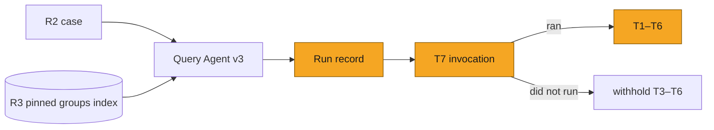
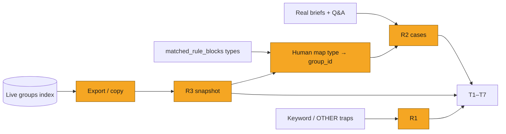
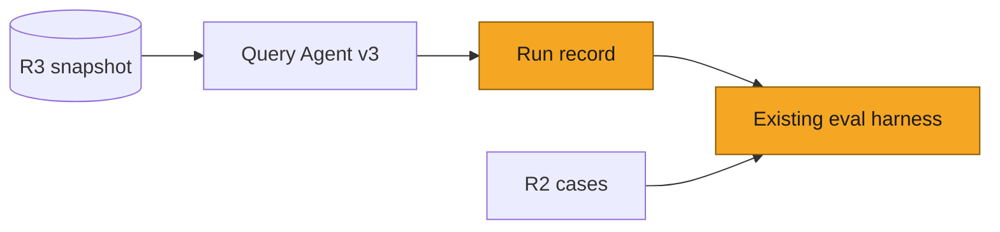
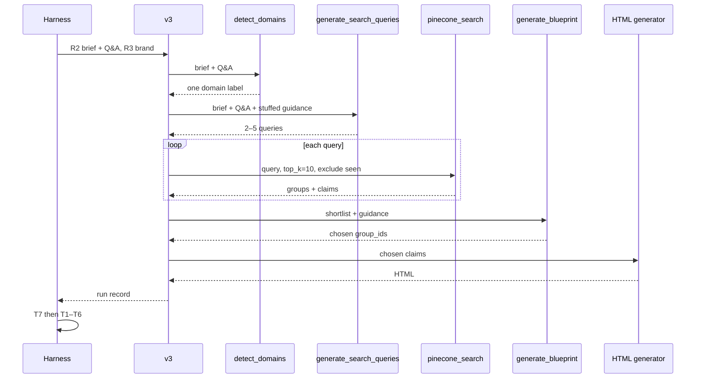
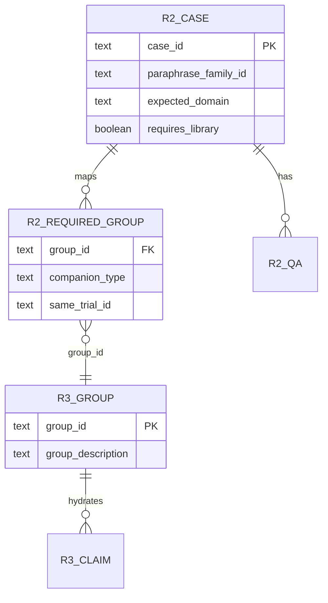
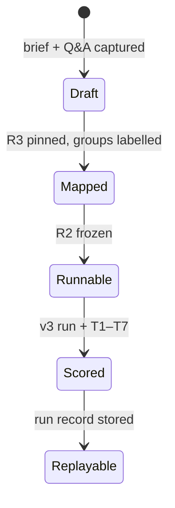

# SOL-3155: Claims retrieval evals

| | |
|---|---|
| **Ticket** | [SOL-3155](https://linear.app/solsticehealth/issue/SOL-3155) |
| **Author** | @abhipsha16 |
| **Reviewers** | @arindam-sharma · @eeva-ff · @bensolstice |
| **Tier** | 1 |
| **Status** | Draft |
| **Date** | 2026-08-18 |
| **Companion** | [`SOL-3156-spike-content-generation-evals.md`](SOL-3156-spike-content-generation-evals.md) (spike: scope the in-cycle generation eval) |

> [!IMPORTANT]
> **Tier check.** Observe-only evals against a pinned index snapshot. No auth/tenancy change, no new PHI store, no schema migration, no new vendor, no API contract change, reversible in under a day. No boxes ticked. Tier 1.

## 1. Problem

Content generation can only use approved claims that retrieval put on the shortlist. Today a weak asset is scored as one blob. We cannot tell whether Pinecone never returned the right group, the blueprint ignored a group that was returned, or the HTML generator dropped a claim that the blueprint had chosen.

This plan measures the **retrieval funnel on Query Agent v3**. It does not measure extraction of attached files (those become markdown in the prompt and never hit Pinecone). It does not measure whether the finished copy is substantiated; that is the SOL-3156 generation pack.

**Measured property:** for a frozen brief and scripted Q&A, against a pinned brand library, how much of the required evidence survives each drop:

```
domain label → search queries → groups on the shortlist → groups chosen in the blueprint → claims stamped in HTML
```

and whether companion groups the domain helper requires (study design, safety, same trial) were present at retrieve **and** at choose.

## 2. What exists today

Live agent is **Query Agent v3** (`POST /content-generation-new/v3/query-agent/stream`). The v2 product graph is deprecated. Two v2 pieces still run inside v3:

- Search: `pinecone_search(hydrate=True)` delegates to v2 `execute_claim_search` (`max_claims_per_group=10`). Import or runtime failure falls through to `_search_groups_basic` and returns `hydrated: false`.
- Domain rules: `domain_rules_helper.build_domain_guidance`. Keyword match on an enhanced string. Not a retriever.

The searchable library is Pinecone index `content-gen-group-index`. Vectors are **group descriptions**, not claim text. After a group hits, claims are fetched by id from `content-gen-claim-index`. A claim whose group description never mentioned the fact cannot be found by search.

### Funnel

| Step | Production function | What it emits | Width |
|---|---|---|---|
| Domain | `detect_domains()` (`gpt-5.4`), primed in `streaming.py:_prime_detected_domains` | One label from the detector option list | 1 |
| Queries | `generate_search_queries()` (`gpt-4.1`) | 2–5 `{query_text, evidence_type, rationale}` | 2–5 strings |
| Retrieve | one `pinecone_search` per query (`top_k` default 10, `$nin` already-seen `group_id`) | Shortlist of groups, each hydrated with ≤10 claims | shortlist |
| Choose | `generate_blueprint` assigns `group_ids` to sections | Chosen set | a handful |
| Use | channel generator stamps `data-claim-id` and `data-source-claim-ids` | Claim ids actually in the HTML | subset of Choose |

Detector option list (the only labels T1 may use): `EFFICACY`, `SAFETY`, `DOSING`, `MOA`, `ACCESS`, `GUIDELINES`, `ORDERING`, `UNMETNEED`, `OTHER`. The keyword map also has `POST_HOC` and `PHARMA`; the detector prompt does not, so those two labels cannot come from Domain. Parse or exception → `OTHER`.

Query generation concatenates the brief, the last five Q&A answers, and a domain-guidance block. The guidance block is skipped when `brand_id` is missing; stuffing exceptions are swallowed. Every query is instructed to include the drug name. If the LLM returns no queries, production still returns `search_ready: true` with fallback `{drug} {brief}`. The query prompt still says “favor figures over tables for emails” for every `content_type`.

Retrieve has no relevance judge. Rank is Pinecone score on the group description.

### Domain helper

`build_domain_guidance` does not query Pinecone. It token-boundary-matches keyword lists against:

1. the brief,
2. Q&A answers,
3. the first four keywords of each detected domain (`blueprint.py` stuffing; same pattern in `generate_search_queries`).

Matched names are logged as `matched_rule_blocks`. Those blocks are the T6 answer key: they name **companion group types**, not copy. A human maps each type onto real `group_id`s on the pinned index (R3).

| Matched block | Companion group types T6 requires |
|---|---|
| efficacy | Study-design group from the same pivotal trial; primary-endpoint group from that trial; safety group from that trial (ARs ≥10%, SAEs ≥2%) |
| post-hoc (keywords in the brief: post hoc, subgroup, RWE, observational, long-term) | The three Phase 3 types above **first**; the supportive-analysis group may not stand alone. T1 still labels this EFFICACY |
| guidelines | Treatment-algorithm group (helper: “when including guidelines, always include the treatment algorithm”) |
| dosing | Dosing group **and** safety group (both present). Reading order on the page is generation, not T6 |
| safety (without efficacy) | Safety group covering ARs ≥10% and SAEs ≥2% |

Copy and layout rules in the same helper file (ARs as a sentence versus a table, one Kaplan–Meier curve, disclaimers, dosing-before-safety as reading order) are not T6. They belong to SOL-3156 if they fail after the right groups were chosen.

Keyword traps for R1: `hr`, `km`, `ae`, `lab`, `sp` match on token boundaries. A reminder brief that contains those tokens will stuff an efficacy or safety block into query generation.

### What is not a dataset yet

- The groups index exists per brand and is live — unpinned, so recall is not reproducible.
- MLR has `mlr-golden-unified` (46). Edit has `edit-golden-candidate-v1` (50). Retrieval has no golden.
- v3 does not persist a structured run record of domain, queries, shortlist, chosen groups, and HTML claim ids. Logs exist; they are not an eval dataset.

## 3. Approach

One pack on the existing eval harness. Production path is v3 only. No second search stack. No Braintrust run until this plan is approved and a run is separately authorized.

A **case** is one frozen brief + scripted Q&A + labels, executed against the pinned index R3.



**Run a case**

1. Load the R2 row (brief, Q&A, expected domain, required facets, required `group_id`s, expected helper blocks).
2. Execute production v3 against R3 (same tools, pinned vectors). Do not substitute a toy retriever.
3. Persist a fail-open **run record**: `detected_domains`, queries, per-query groups (`group_id`, score), `hydrated`, chosen `group_id`s, claim ids in chosen groups, claim ids parsed from HTML, `matched_rule_blocks`.
4. Score T7 first. If search never ran, T3–T6 are withheld (missing shortlist is not a recall fail).
5. Score T1–T6 against the record and R2/R3. T1 and T2 are judged (paired baseline required). T3–T7 are deterministic given the labels.

`replay` later re-scores stored records with no model spend. `perturb` mutates a record (drop a required group; inject a distractor) and asserts the scorer notices.

### Tests

Each test answers one question. A fail at an earlier drop does not imply a fail at a later one; that is the point of the funnel.

#### T1 — Domain (LLM judge)

**Question.** Is the single `detect_domains` label correct for this brief and Q&A?

**Production signal.** `detected_domains[0]` from the run record.

**Gold.** R2 `expected_domain`, restricted to the detector option list above. A post-hoc brief is `EFFICACY`, not `POST_HOC`.

**Scorer.** A **separate** LLM judge. It is not `detect_domains`. Inputs: frozen brief, scripted Q&A, production label. Output: `{expected_domain, agree: bool, rationale}`. The judge’s option list is the detector’s option list.

**Metric.** Agreement rate of production label with the judge. R2 gold string-match is a smoke check on annotation quality, not the reported score.

**Fail.** Production says `OTHER` on an efficacy brief; production says `EFFICACY` on a meeting-reminder brief.

**Does not measure.** Whether companion groups were retrieved (T6). Whether the queries named the trial (T2).

**Gate.** Judged. Merge comparison needs a paired baseline (same judge version, same cases).

#### T2 — Query coverage (deterministic facet check + LLM judge on paraphrases)

**Question.** Do the 2–5 queries, taken as a set, name the required drug, trial, and endpoint? Do three wordings of the same intent still cover those facets?

**Production signal.** `queries[].query_text`.

**Gold.** R2 `required_facets`: `drug_name`, `trial_name` (nullable), `endpoint` (nullable), `domain_term` (nullable).

**Scorer.**
- Deterministic: drug name substring (case-insensitive) must appear in **every** query (production’s own rule). Missing drug name is a hard fail.
- Deterministic: each non-null facet must appear in **at least one** query in the set.
- Judge (finer): on a paraphrase family of three briefs, the union of facets across each run still covers `required_facets`. Queries need not be identical.

**Fail.** Efficacy brief whose queries are only “{drug} overall survival” and never name the trial or a safety/study-design facet the helper stuffed. That is T2, not T3: Pinecone was never asked.

**Does not measure.** Whether Pinecone returned the group for a well-formed query (T3).

**Gate.** Drug-name miss is deterministic. Facet coverage across paraphrases is judged and needs a paired baseline.

#### T3 — Retrieval recall (deterministic)

**Question.** Of the groups this asset must use, how many appear on the shortlist?

**Production signal.** Union of `group_id`s returned by all `pinecone_search` calls in the turn (after `$nin` dedup).

**Gold.** R2 `required_groups[].group_id`.

**Metric.** `|shortlist ∩ required| / |required|`.

**Fail.** Safety companion `g_safety` is required and never appears in any query’s hits.

**Does not measure.** Whether the blueprint picked it (T4). A group can be retrieved and still unused.

**Gate.** Deterministic given R2 + R3. Withheld if T7 fails.

#### T4 — Selection (deterministic)

**Question.** Of the groups the blueprint chose, how many were required? How many required groups were skipped?

**Production signal.** `group_id`s assigned on the blueprint.

**Gold.** Same `required_groups`.

**Metrics.**
- Precision: `|chosen ∩ required| / |chosen|` (chosen empty → undefined, treat as fail if required is non-empty).
- Miss: `required − chosen`.

**Fail.** Shortlist contained `g_design` and `g_safety`; blueprint chose only `g_os`.

**Does not measure.** Whether those claims were stamped in HTML (T5).

**Gate.** Deterministic. Withheld if T7 fails.

#### T5 — Utilization (deterministic)

**Question.** Of the claims belonging to the **chosen** groups, how many appear in the HTML?

**Production signal.** `_extract_claims_from_html`: `data-claim-id="…"` and space-separated `data-source-claim-ids="…"`.

**Gold.** Claim ids attached to chosen groups on R3 (hydration set, capped at 10 per group in production — the denominator is whatever was actually hydrated into the turn, recorded on the run record).

**Metric.** `|html_claim_ids ∩ chosen_group_claim_ids| / |chosen_group_claim_ids|`. Empty HTML markers → 0, never 1.0.

**Forbidden signal.** `_verify_claims_used` unions UUID self-report into `claims_used` and sets `match_rate = 1.0` when HTML has no markers (`content_message_generator_v3_agent_sqlalchemy.py:1519–1529`). T5 must not read it.

**Fail.** Blueprint chose an eight-claim OS group; HTML stamps none of them.

**Does not measure.** Whether unchosen groups’ claims appear (that would be a generation leak, SOL-3156). Whether copy is faithful to the stamped claim (SOL-3156).

**Gate.** Deterministic. Withheld if T7 fails.

#### T6 — Companion completeness (deterministic)

**Question.** If the helper matched a block, are the companion groups of those types on the shortlist **and** in the chosen set?

**Production signal.** `matched_rule_blocks`; shortlist; chosen set.

**Gold.** R2 `required_groups` rows with `companion_type` in `{study_design, primary_endpoint, safety, algorithm, dosing}` and `same_trial_id` where the helper requires same-trial.

**Metric.** Pass/fail per required companion type: a group with that type and matching `same_trial_id` exists in shortlist, and exists in chosen. Both must hold.

**Fail.** Efficacy brief, `matched_rule_blocks` includes `efficacy`, shortlist is four OS groups, no study-design group, no safety group.

**Does not measure.** The domain *label* (T1). A correct EFFICACY label with missing safety is T6 fail, T1 pass.

**Gate.** Deterministic against helper blocks mapped to R3 ids. Withheld if T7 fails.

#### T7 — Invocation (deterministic)

**Question.** Did `pinecone_search` run at least once on a case that required approved claims?

**Production signal.** Count of `pinecone_search` tool calls; `hydrated` flag; empty-error payload.

**Gold.** R2 `requires_library: true` (false only for explicit OTHER / unbranded reminder cases that must not search).

**Metric.** Zero-evidence render rate: `requires_library` and (zero calls or empty results with `error` set). Log `hydrated` so `_search_groups_basic` fallback is visible; fallback still counts as invocation, but T3 is scored against whatever it returned.

**Fail.** Efficacy brief, generator ran, `pinecone_search` never called.

**Does not measure.** Quality of hits. SOL-3156 may borrow T7 only.

**Gate.** Deterministic. T3–T6 withheld on fail.

### Worked case (how the seven tests disagree)

R2 says: HCP email on overall survival for `{drug}` in `{trial}`. `expected_domain = EFFICACY`. Required groups: `g_design`, `g_os`, `g_safety` (same `trial_id`). Required facets: drug, trial name, “overall survival”.

| If production does this | T1 | T2 | T3 | T4 | T5 | T6 | T7 |
|---|---|---|---|---|---|---|---|
| Labels OTHER, never searches | fail | — | withheld | withheld | withheld | withheld | fail |
| Labels EFFICACY; queries are only `{drug} OS`; Pinecone never sees `{trial}` or safety | pass | fail | fail (`g_design`, `g_safety` absent) | miss | — | fail | pass |
| Shortlist has all three; blueprint chooses only `g_os`; HTML stamps 6/8 OS claims | pass | pass | pass | fail (miss design+safety) | pass on chosen | fail | pass |
| Chooses all three; HTML has no `data-claim-id` | pass | pass | pass | pass | fail (0) | pass | pass |
| Reconciler reports UUIDs, HTML has no markers | (unchanged) | | | | fail | | |

### Prompt diversity

Each clinical intent in R2 has a `paraphrase_family_id` and three briefs. Gold (`expected_domain`, `required_facets`, `required_groups`) is shared. T1: judge expected domain is stable across the three; production is scored per wording. T2: queries may differ; the facet union per wording must still cover `required_facets`.

### Run record (per turn)

| Field | Source | Used by |
|---|---|---|
| `detected_domains` | `detect_domains` | T1 |
| `queries[]` | `generate_search_queries` | T2 |
| `hits[]` (`group_id`, `score`, `query_index`) | `pinecone_search` | T3, T6 |
| `hydrated` | search payload | T7 |
| `chosen_group_ids[]` | blueprint | T4, T5, T6 |
| `hydrated_claim_ids_by_group` | search hydrate | T5 denominator |
| `html_claim_ids` | `_extract_claims_from_html` | T5 numerator |
| `matched_rule_blocks` | `build_domain_guidance` | T6 |

Fail-open: a missing field is a scorer skip with an explicit “record incomplete” flag, not a silent pass.

## 3b. Data to create

Three artifacts. Nothing else. No second golden size; first pin is one brand (open question 3).



### R3 — pinned library (machine)

A frozen snapshot of **one** brand’s `content-gen-group-index` plus the claims fetchable from `content-gen-claim-index` for those groups.

Each group row must include: `group_id`, `group_description` (the searchable text), `claim_ids[]`, per-claim `claim_id` and `claim_text` (denominator for T5), and any metadata the hydrate path already stores (evidence type, trial name if present).

Mechanism is open question 1 (dump, namespace copy, or a dedicated eval index). The contract is: the same bytes every run, `brand_id` filter identical to production.

Without R3, T3 and T6 are not reproducible.

### R2 — labelled cases (human + helper)

The pack’s golden. One row per brief wording (three rows share `paraphrase_family_id`).

| Field | Who fills it | Why |
|---|---|---|
| `case_id`, `paraphrase_family_id`, `channel` (`email` / `banner` / `social`) | Author | Identity; channel is recorded because query prompt still special-cases email figures |
| `brief_text` | Author, from a real v3 turn | Frozen input |
| `qa[]` `{question, answer}` | Author, scripted; at most what production reads (last five) | Domain stuffing and query gen both read Q&A |
| `drug_name`, `brand_id` | Author | Query rule; R3 filter |
| `expected_domain` | Author, from detector option list | T1 gold |
| `required_facets` `{drug_name, trial_name?, endpoint?, domain_term?}` | Author | T2 gold |
| `requires_library` | Author (`true` unless unbranded reminder) | T7 |
| `expected_helper_blocks[]` | Derived: run `build_domain_guidance` on brief+Q&A+stuffed keywords, record `matched_rule_blocks` | T6 types |
| `required_groups[]` `{group_id, companion_type, same_trial_id?}` | **Human**, looking at R3, mapping each helper type onto a real group | T3, T4, T6 |

Annotation order: pin R3 first, then map types to ids. Do not invent group ids. If R3 has no study-design group for that trial, the case is either “T6 cannot pass on this library” (record `unmappable: true` and exclude from T6 denominator) or the brand is the wrong first pin.

R2 is the critical-path annotation. Count is not frozen in this plan (MLR’s 46 is a different pack). First slice: enough paraphrase families to cover `EFFICACY` (including one post-hoc wording), `SAFETY`, `DOSING`, `GUIDELINES`, `ACCESS`, `OTHER`, plus one banner or social family so channel leftover is visible. Exact N is open until the brand is chosen.

### R1 — domain traps (human)

Small, not the golden. Used by T1, T2, T6 when the helper or detector should **not** fire, or should fire for a non-obvious reason.

| Trap | Brief shape | Expected |
|---|---|---|
| Short-keyword false fire | Reminder / invite whose text contains `hr`, `km`, `ae`, `lab`, or `sp` as tokens | T1: `OTHER`. T6: no efficacy companions required |
| Post-hoc words present | Efficacy + “subgroup” / “RWE” | T1: `EFFICACY`. T6: Phase 3 foundation groups required |
| Post-hoc words absent | Clean primary-endpoint ask | T1: `EFFICACY`. T6: no post-hoc foundation extra |
| OTHER vs EFFICACY borderline | Unbranded save-the-date versus “email the OS data” | T1 judge disagreement is the signal |

R1 does not need a full required-group map unless T6 is in scope for that row.

### What we do not create

- A judged “is this a good email” label (SOL-3156).
- In-session file-extraction gold (files never hit Pinecone).
- A second brand pin in the first slice.
- A new table in product Postgres; records live in the eval backend.

## 4. System views

### Context: where it sits



No new service. The pack is a new suite on the existing harness. R3 is a snapshot, not a product table.

### Flow: who calls whom, in what order



### Data: what changes shape



R3 is a snapshot file or eval index, not a migration. Run records are eval-backend documents.

### State: lifecycle of a case



## 5. Trade-offs accepted

- We accept pinning one brand’s index (R3) to get reproducible recall, giving up live-library drift until a later window comparison. Revisit when ingest changes are in scope.
- We accept measuring v3 including its v2 search engine, not rewriting search first. Revisit if `execute_claim_search` is replaced.
- We accept T1 as an LLM judge (not string-match against `detect_domains`), because borderline OTHER versus EFFICACY is the failure mode. Revisit if judge and detector agree tautologically (same model, same prompt).
- We accept T2 as judged facet coverage rather than exact query match, because diversity is the point. Revisit if paraphrase agreement is too noisy to gate.
- We accept T6 gold from the helper’s matched blocks mapped to R3 ids, not from `detect_domains`. Detection cannot emit `POST_HOC`.

## 6. Alternatives rejected

- Score only whether search ran. Rejected: that is T7, already insufficient.
- In-turn file extraction as this pack. Rejected: files become markdown in the prompt; they never hit Pinecone.
- Treat `ClaimsRetriever` (annotation finder on `doc-files-…`) as this path. Rejected: generation uses `pinecone_search` on the groups index.
- Full asset-quality judges in this pack. Rejected: generation eval is this cycle; SOL-3156 spikes its scope.
- Score T5 from `_verify_claims_used`. Rejected: it unions LLM self-report and reports 1.0 on empty HTML.
- Use `detect_domains` as the T6 oracle. Rejected: T1 already scores the label; T6 scores companion groups.

## 7. Risks and rollback

Observe-only. Run record is fail-open. R3 snapshot may contain client claim text already in Pinecone; it stays in the existing eval backend. A wrong type→id map on R2 silently fails T3/T6 (false miss) or inflates them (wrong group counted as required) — mitigation is review of `required_groups` against `group_description`. Rollback is delete the pack and the record emission.

## 8. Verification

- `replay` on stored run records (no model spend): T3–T7 bit-identical; T1/T2 identical under a frozen judge.
- `perturb`: drop one required `group_id` from the recorded shortlist → T3 and T6 fail; inject a distractor chosen group → T4 precision drops.
- T1 fixture: efficacy brief, production label `OTHER` → judge disagree.
- T6 fixture: efficacy brief, shortlist is only OS groups → fail.
- T5 fixture: HTML with no `data-claim-id` → 0, even if the reconciler reported UUIDs.

## 9. Open questions

1. R3 mechanism: exported group/claim dump, Pinecone namespace copy, or a dedicated eval index?
2. R2 `required_groups`: annotate `group_id`s directly, or annotate facts and map to groups after pin? (This plan assumes map-after-pin.)
3. Which brand’s library is the first pin?

---

## Decision log

| Date | Decision | Options considered | Why | Who | Status |
|---|---|---|---|---|---|
| 2026-08-18 | This ticket is retrieval, not extraction | Extraction of attached files; corpus ingest | Files are markdown-in-prompt; ingest is deferred | Author | Decided |
| 2026-08-18 | Generation eval is this cycle; this pack does not include it | Fold asset judges here; skip generation | Retrieval and generation fail independently | Author | Decided |
| 2026-08-18 | T6 gold = helper `matched_rule_blocks`, mapped to R3 ids | Use `detect_domains` as the oracle | Detection cannot emit POST_HOC; helper is what stuffing and blueprint actually run | Author | Decided |
| 2026-08-18 | T1 scores Domain with a separate LLM judge | Skip Domain; string-match production label to R2 | Borderline OTHER vs EFFICACY is the failure mode; detector and judge must not be the same call | Author | Decided |

## Sign-off

| Reviewer | Verdict | Date | Note |
|---|---|---|---|
| @arindam-sharma | | | |
| @eeva-ff | | | |
| @bensolstice | | | |
