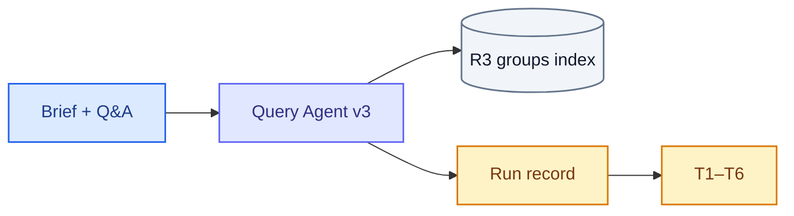

# SOL-3155: Claims retrieval evals

| | |
|---|---|
| **Ticket** | [SOL-3155](https://linear.app/solsticehealth/issue/SOL-3155) |
| **Author** | @abhipsha16 |
| **Reviewers** | @arindam-sharma · @eeva-ff · @bensolstice |
| **Tier** | 1 |
| **Status** | Draft |
| **Date** | 2026-08-18 |
| **Companion** | [`SOL-3156-spike-content-generation-evals.md`](SOL-3156-spike-content-generation-evals.md) (spike: scope the in-cycle generation eval, not a pack) |

> [!IMPORTANT]
> **Tier check.** Observe-only evals against a pinned index snapshot. No auth/tenancy change, no new PHI store, no schema migration, no new vendor, no API contract change, reversible in under a day. No boxes ticked. Tier 1.

## 1. Problem

Content generation can only use approved claims that retrieval put on the shortlist. A weak asset is currently scored as one blob: we cannot tell whether the library never returned the right group, the planner ignored it, or the renderer dropped it.

This plan measures the **retrieval funnel on Query Agent v3**, not extraction and not the finished asset. Attached files are out: they are converted to markdown and placed in the prompt.

**Measured property:** for a frozen brief against a pinned brand library, how much of the required evidence survives

```
queries written → groups retrieved → groups chosen → claims used in HTML
```

and whether domain rules that require companion evidence (study design, safety) were satisfied at retrieve and at choose.

## 2. What exists today

Live agent is **Query Agent v3** (`POST /content-generation-new/v3/query-agent/stream`). v2 as a product graph is deprecated. Two v2 pieces still run inside v3:

- Search engine: `pinecone_search(hydrate=True)` → v2 `execute_claim_search` (`max_claims_per_group=10`). Import/runtime failure falls through to `_search_groups_basic` (`hydrated: false`).
- Domain rules: `domain_rules_helper.build_domain_guidance`, injected into query generation and blueprint. Keyword match, not a retriever.

### Funnel (v3)

The brand library is the groups index (`content-gen-group-index`). Size is whatever that brand holds — “~1000 entries” is the teammate’s picture of it, not a constant. Search never ranks individual claims; it ranks **group descriptions**, then fetches claims by id from `content-gen-claim-index`. A claim whose group description omits the fact is unreachable.

| Step | What v3 does | Code | Typical width |
|---|---|---|---|
| B Domain | LLM `detect_domains()` (`gpt-5.4`) is told to pick **exactly one** domain. Prompt options omit `POST_HOC` and `PHARMA`; those labels exist on the keyword map but cannot come from detection. Parse/error → `OTHER`. | `query_agent_v2_domain.py:138`; primed in `streaming.py:_prime_detected_domains` | 1 domain label |
| C Queries | `generate_search_queries` (`gpt-4.1`) writes 2–5 `{query_text, evidence_type, rationale}` from brief + last 5 Q&A + domain-guidance block. Drug name required in every query. Fallback: `{drug} {brief}` with `search_ready: true`. Guidance is skipped unless `brand_id` is set; stuffing exceptions are swallowed. | `tools/pinecone_search.py:575` | 2–5 strings |
| D Retrieve | Each query is one `pinecone_search` call. Tool default `top_k=10`. `$nin` already-seen groups. Hydrate ≤10 claims/group. No relevance judge. | `pinecone_search.py:246` → `execute_claim_search` | shortlist of groups (“top 20” in the teammate picture) |
| E Choose | `generate_blueprint` assigns `group_ids` to sections. Domain rules fire again via `_build_domain_guidance_for_piece` (detected domain stuffed as first-4 keywords). | `tools/blueprint.py` | a handful of groups (“choose 4”) |
| F Use | Channel generator stamps `data-claim-id` / `data-source-claim-ids`. Utilization = claims **parsed from HTML** ÷ claims in the chosen groups | `_extract_claims_from_html` | subset of E |

v2 leftover that still shapes C: the query prompt says “favor figures over tables for emails” regardless of `content_type`.

### Domain helper — required-set generator, not a search

`build_domain_guidance` does not query Pinecone. It token-boundary-matches keyword lists on an **enhanced string**: brief + Q&A answers + the first four keywords of each detected domain (`blueprint.py:2075`, same stuffing in `generate_search_queries`). Matched rule blocks are logged as `matched_rule_blocks`.

That is how we author R2 and score T5:

| Helper says (include this GROUP) | Retrieval check |
|---|---|
| Efficacy: study-design group + safety group from the **same** pivotal trial, plus primary endpoint | T5 |
| Post-hoc / subgroup / RWE: Phase 3 design + primary + safety **first**; supportive group cannot stand alone | T5. Brief must contain those words — detection cannot emit `POST_HOC` |
| Guidelines: treatment-algorithm group | T5 |
| Dosing: dosing group **and** safety group | T5 (both present). Order in the email is generation |

Copy/layout rules (ARs as a sentence vs a table, one KM curve, disclaimers, “dosing before safety” as reading order) are not T5. They belong to the SOL-3156 pack if they fail after the right groups were chosen.

R1 traps exist because the matcher is token-boundary, not clinical: `hr`, `km`, `ae`, `lab`, `sp` are keywords. A reminder brief that happens to contain them will stuff the efficacy/safety block into query generation.

### What is not a dataset yet

- The library (Pinecone, per brand) exists and is live — unpinned.
- MLR and edit have frozen goldens. Retrieval does not.
- No run log of queries / shortlist / chosen groups / HTML claims.

## 3. Approach

One eval pack on the existing harness. Production path is v3 only. The corpus is a **pinned snapshot** of one brand’s groups index (R3). Briefs carry a marked required-evidence set (R2).

### Deep eval — four funnel scores plus domain rules

Each case is one frozen brief (+ scripted Q&A) against R3.

| Test | Step | Question | Metric | Gate |
|---|---|---|---|---|
| T1 Query coverage | C | Do the 2–5 queries name the required drug / trial / endpoint / domain? Do paraphrases of the same intent still cover them? | Facet hit rate; paraphrase agreement | Missing drug name is deterministic. Judged coverage needs a paired baseline |
| T2 Retrieval recall | D | Of the groups the asset should use, how many are in the shortlist? | Required-group recall @ shortlist | Deterministic given R2 + R3 |
| T3 Selection precision | E | Of the groups the blueprint chose, how many were required? How many required groups were skipped? | Precision / miss of chosen vs required | Deterministic given R2 |
| T4 Utilization | F | Of claims in the chosen groups, how many appear in the HTML? | Claims-in-HTML ÷ claims-in-chosen-groups | Deterministic. Parse HTML only |
| T5 Domain-rule completeness | D+E | If the helper matched a block, does the shortlist **and** the chosen set contain those companion groups? | Pass/fail per required companion | Deterministic against `matched_rule_blocks`, not against `detect_domains` |
| T6 Invocation | D | Did `pinecone_search` run at least once on a brief that required approved claims? | Zero-evidence render rate | Deterministic. Withhold T2–T5 when T6 fails. Log `hydrated` so basic-fallback is visible |

T4 **must not** read `_verify_claims_used`. That reconciler unions UUID self-report into `claims_used` and sets `match_rate = 1.0` when HTML has no markers (`content_message_generator_v3_agent_sqlalchemy.py:1519–1529`). Score `_extract_claims_from_html` only. The lying reconciler is generation leftover B.

T6 is the only check the content-gen spike is allowed to borrow. It is not the retrieval eval.

### Prompt diversity (T1)

Same clinical intent, three wordings of the brief. Queries need not be identical. They fail if a required facet (drug, trial name, primary endpoint) is absent from the whole query set.

Cases where the helper should force extra query facets: an efficacy brief whose queries name only OS and never study design or safety. That is stuffing → `generate_search_queries`, not “is OS in Pinecone.”

### Run record (per turn)

Queries emitted; groups returned per query (id, score); `hydrated` flag; groups chosen in the blueprint; claim ids in chosen groups; claim ids parsed from HTML; `detected_domains`; `matched_rule_blocks`. Fail-open.

### Reference data

| Set | Contents | Used by |
|---|---|---|
| R2 | Real briefs + scripted Q&A, with required groups (or required facts mapped to group ids on R3) marked. Companion **types** come from the helper; humans map types → ids on R3 | T1–T5 |
| R3 | Pinned snapshot of one brand’s groups+claims indexes | T2, T5 |
| R1 | Domain traps: short-keyword false fires; `POST_HOC` words in the brief vs not; detect `OTHER` when it should not | T1 / T5 |

R2 is the critical-path annotation. T6 can ship on instrumentation alone.

## 4. System views

### Context: where it sits



No new service. Records go to the existing eval backend.

### Flow

```mermaid
flowchart LR
    Brief["Brief + Q&A"] --> Domain["B detect_domains"]
    Domain --> Rules["domain_rules_helper"]
    Rules --> Q["C generate_search_queries"]
    Q -->|"2–5 queries"| S["D pinecone_search"]
    Lib[("R3 pinned groups index")] --> S
    S -->|"shortlist"| BP["E generate_blueprint"]
    BP -->|"chosen groups"| HTML["F HTML stamps"]
    Q -.-> Rec["Run record"]
    S -.-> Rec
    BP -.-> Rec
    HTML -.-> Rec
    Rec --> Pack["T1–T6"]
    classDef userNode fill:#dbeafe,stroke:#2563eb,stroke-width:1.5px,color:#1e3a8a
    classDef parseNode fill:#e0e7ff,stroke:#6366f1,stroke-width:1.5px,color:#312e81
    classDef effectNode fill:#fef3c7,stroke:#d97706,stroke-width:1.5px,color:#78350f
    classDef extNode fill:#f1f5f9,stroke:#64748b,stroke-width:1.5px,color:#0f172a
    class Brief userNode
    class Domain parseNode
    class Rules parseNode
    class Q effectNode
    class S effectNode
    class Lib extNode
    class BP parseNode
    class HTML parseNode
    class Rec effectNode
    class Pack effectNode
```



*Data: N/A — R3 is a snapshot, not a new table.*
*State: N/A.*

## 5. Trade-offs accepted

- We accept pinning one brand’s index (R3) to get reproducible recall, giving up live-library drift until a later window comparison. Revisit when ingest changes are in scope.
- We accept measuring v3 including its v2 search engine, not rewriting search first. Revisit if `execute_claim_search` is replaced.
- We accept T1 as judged facet coverage rather than exact query match, because diversity is the point. Revisit if paraphrase agreement is too noisy.
- We accept T5 gold from the helper’s matched blocks, not from `detect_domains`. Detection cannot emit `POST_HOC`.

## 6. Alternatives rejected

- Score only whether search ran. Rejected: that is T6, already insufficient.
- In-turn file extraction as this pack. Rejected: files become markdown in the prompt; they never hit Pinecone.
- Treat `ClaimsRetriever` (annotation finder) as this path. Rejected: generation uses `pinecone_search` on the groups index.
- Full asset-quality judges in this pack. Rejected: generation eval is this cycle; SOL-3156 spikes its scope.
- Score T4 from `_verify_claims_used`. Rejected: it unions LLM self-report and reports 1.0 on empty HTML.

## 7. Risks and rollback

Observe-only. Run record is fail-open. R3 snapshot may contain client claim text already in Pinecone; it stays in the existing eval backend. Rollback is delete the pack and the record emission.

## 8. Verification

Pack `replay` on stored run records (no model spend). `perturb`: drop one required group from the shortlist / inject a distractor group; both must be detected. T5 fixture: an efficacy brief whose shortlist contains only OS groups must fail. T4 fixture: HTML with no `data-claim-id` must score 0, even if the reconciler reported claims.

## 9. Open questions

1. R3 mechanism: exported group/claim dump, Pinecone namespace copy, or a dedicated eval index?
2. R2 labels: group ids, or facts that we map to groups on R3 after pin?
3. Which brand’s library is the first pin?

---

## Decision log

| Date | Decision | Options considered | Why | Who | Status |
|---|---|---|---|---|---|
| 2026-08-18 | This ticket is retrieval, not extraction | Extraction of attached files; corpus ingest | Files are markdown-in-prompt; ingest is deferred | Author | Decided |
| 2026-08-18 | Generation eval is this cycle; this pack does not include it | Fold asset judges here; skip generation | Retrieval and generation fail independently | Author | Decided |
| 2026-08-18 | T5 gold = helper `matched_rule_blocks`, mapped to R3 ids | Use `detect_domains` as the oracle | Detection cannot emit POST_HOC; helper is what stuffing and blueprint actually run | Author | Decided |

## Sign-off

| Reviewer | Verdict | Date | Note |
|---|---|---|---|
| @arindam-sharma | | | |
| @eeva-ff | | | |
| @bensolstice | | | |
