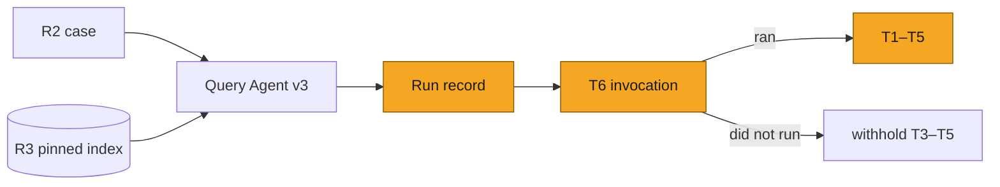
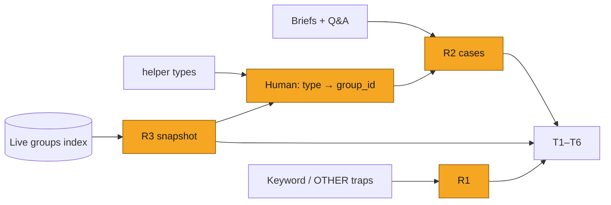
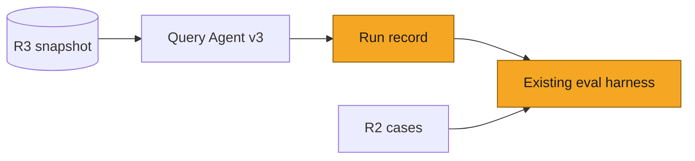
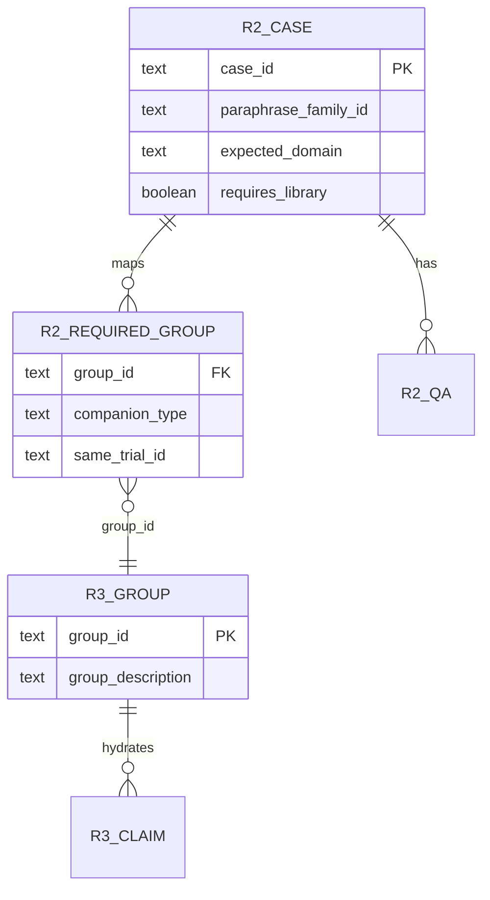
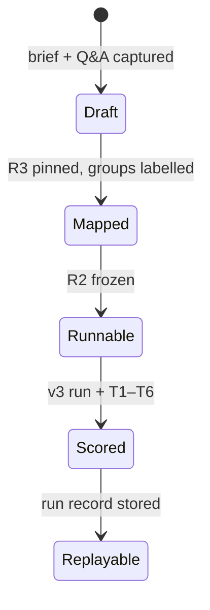

# SOL-3155: Claims retrieval evals

| | |
|---|---|
| **Ticket** | [SOL-3155](https://linear.app/solsticehealth/issue/SOL-3155) |
| **Author** | @abhipsha16 |
| **Reviewers** | @arindam-sharma · @montechand |
| **Tier** | 1 |
| **Status** | Draft |
| **Date** | 2026-08-18 |
| **Companion** | [`SOL-3156-spike-content-generation-evals.md`](SOL-3156-spike-content-generation-evals.md) |

> [!IMPORTANT]
> **Tier check.** Observe-only evals against a pinned index snapshot. No auth/tenancy change, no new PHI store, no schema migration, no new vendor, no API contract change, reversible in under a day. No boxes ticked. Tier 1.

## 1. Problem

Content generation can only use approved claims that retrieval put on the shortlist. Today a weak asset is scored as one blob. We cannot tell whether Pinecone never returned the right group, the blueprint ignored a group that was returned, or the HTML generator dropped a claim the blueprint had chosen.

This plan measures the **retrieval funnel on Query Agent v3**. It does not measure extraction of attached files (those become markdown in the prompt and never hit Pinecone), and it does not measure the finished copy.

**Measured property:** for a frozen brief and scripted Q&A, against a pinned brand library, how much of the required evidence survives each drop:

```
domain label → search queries → groups on the shortlist → groups chosen in the blueprint → claims stamped in HTML
```

Companion groups the domain helper requires (study design, safety, same trial) must be present at retrieve and at choose.

### Vocabulary

Every name used in this plan, defined once:

| Name | Meaning |
|---|---|
| `group_id` | Id of a **claim group** — the searchable unit. Pinecone vectors are group *descriptions*, not claim text |
| `claim_id` | Id of one approved claim inside a group. Search hydrates up to 10 claims per returned group |
| `data-claim-id` | HTML attribute the generator stamps on an element that renders a claim. Its **value is a `claim_id`** |
| `data-source-claim-ids` | Same idea, for an element built from several claims |
| T1–T6 | The six tests, one per funnel drop (§3 Tests) |
| R1 | Domain-trap briefs — a small adversarial set (§3 Data to create) |
| R2 | Labelled cases — brief + scripted Q&A + gold labels (§3 Data to create) |
| R3 | Pinned library — a frozen snapshot of one brand's group + claim indexes (§3 Data to create) |

The ids form one chain, not three systems: retrieval returns `group_id`s → choosing keeps some → hydration turns each kept group into concrete `claim_id`s → the HTML marks each used claim with a `data-claim-id` attribute whose value is that same `claim_id`.

## 2. What exists today

Live agent is **Query Agent v3** (`POST /content-generation-new/v3/query-agent/stream`). The v2 product graph is deprecated. Two v2 pieces still run inside v3:

| Piece | What it is |
|---|---|
| Search | `pinecone_search(hydrate=True)` → v2 `execute_claim_search` (≤10 claims/group). Import or runtime failure → `_search_groups_basic`, `hydrated: false` |
| Domain rules | `build_domain_guidance`. Keyword match on brief + Q&A + stuffed domain keywords. Not a retriever |

The searchable library is `content-gen-group-index`. Vectors are **group descriptions**, not claim text. Hits hydrate claims by id from `content-gen-claim-index`. A claim whose group description never mentioned the fact cannot be found by search.

### Funnel

| Step | Production | Emits | Width |
|---|---|---|---|
| Domain | `detect_domains()` (`gpt-5.4`), primed in `_prime_detected_domains` | One label from the detector option list. Parse or exception → `OTHER` | 1 |
| Queries | `generate_search_queries()` (`gpt-4.1`) | 2–5 `{query_text, evidence_type, rationale}` from brief + last 5 Q&A + stuffed guidance. Drug name required in every query. Empty LLM → fallback `{drug} {brief}` with `search_ready: true`. Guidance skipped if no `brand_id` | 2–5 |
| Retrieve | one `pinecone_search` per query (`top_k` default 10, `$nin` seen `group_id`) | Shortlist of groups, ≤10 claims each. No relevance judge; rank is Pinecone score on the description | shortlist |
| Choose | `generate_blueprint` | `group_ids` on sections. Guidance fires again (detected domain → first 4 keywords) | handful |
| Use | channel generator | `data-claim-id` and `data-source-claim-ids` in HTML | subset of Choose |

Detector option list (the only labels T1 may use): `EFFICACY`, `SAFETY`, `DOSING`, `MOA`, `ACCESS`, `GUIDELINES`, `ORDERING`, `UNMETNEED`, `OTHER`. The keyword map also has `POST_HOC` and `PHARMA`; the detector prompt does not, so those two cannot come from Domain.

Query prompt leftover: “favor figures over tables for emails” for every `content_type`.

### Domain helper

`build_domain_guidance` does not query Pinecone. It token-boundary-matches keyword lists against (1) the brief, (2) Q&A answers, (3) the first four keywords of each detected domain. Matched names are `matched_rule_blocks`. Those blocks name **companion group types**. A human maps each type onto real `group_id`s in R3; the mapped rows become the `companion_type` entries in R2 `required_groups` (§3). The domain label itself is T1.

| Matched block | Companion group types required |
|---|---|
| efficacy | Study-design, primary-endpoint, and safety groups from the same pivotal trial (ARs ≥10%, SAEs ≥2% on safety) |
| post-hoc words in the brief (`post hoc`, `subgroup`, `RWE`, `observational`, `long-term`) | The three Phase 3 types above first; the supportive-analysis group may not stand alone. T1 still labels this `EFFICACY` |
| guidelines | Treatment-algorithm group |
| dosing | Dosing group and safety group (both present). Reading order on the page is generation, not retrieval |
| safety without efficacy | Safety group covering ARs ≥10% and SAEs ≥2% |

Copy and layout rules in the same helper (ARs as a sentence versus a table, one Kaplan–Meier curve, disclaimers, dosing-before-safety as reading order) are not companion gold. They constrain how copy is written from a group that was already chosen, not which groups must be present, so they are out of scope here.

R1 traps: `hr`, `km`, `ae`, `lab`, `sp` match on token boundaries. A reminder brief that contains those tokens will stuff an efficacy or safety block into query generation.

### What is not a dataset yet

| Missing | Why it matters |
|---|---|
| Pinned groups index | Live Pinecone is unpinned; the same brief can retrieve different groups run to run, so recall is not reproducible |
| Labelled cases | No brief carries an expected domain, required facets, or required groups to score against |
| Structured run record | v3 does not persist `{domain, queries, shortlist, chosen groups, HTML claim ids}` as one row; nothing is scoreable per drop |

## 3. Approach

One pack on the existing eval harness. Production path is v3 only. No second search stack. No Braintrust run until this plan is approved and a run is separately authorized.

A **case** is one frozen brief + scripted Q&A + labels, executed against pinned index R3.



| Step | What happens |
|---|---|
| 1 | Load the R2 row (brief, Q&A, expected domain, required facets, required `group_id`s, expected helper blocks) |
| 2 | Execute production v3 against R3. No toy retriever |
| 3 | Persist a fail-open run record (fields in the table below) |
| 4 | Score T6 first (numbered last, scored first — it gates the others). If search never ran, withhold T3–T5: a missing shortlist is not a recall fail |
| 5 | Score T1–T5 against the record and R2/R3 |

`replay` re-scores stored records with no model spend. `perturb` mutates a record (drop a required group; inject a distractor) and asserts the scorer notices.

### Tests

Six tests, one question each. A fail at an earlier drop does not imply a fail at a later one.

| ID | Step | Question | Signal → gold | Score |
|---|---|---|---|---|
| T1 | Domain | Is the single `detect_domains` label correct for this brief + Q&A? | `detected_domains[0]` → R2 `expected_domain` | LLM judge (a separate model from the detector, same option list). Paired baseline required. String match is a smoke check, not the score |
| T2 | Queries | Do the 2–5 queries, as a set, name the required drug / trial / endpoint — under all three wordings of the intent? | `queries[].query_text` → R2 `required_facets` | Drug name in every query, deterministic. Each other facet in ≥ 1 query, judged; paired baseline |
| T3 | Retrieve | Of the required groups, how many made the shortlist? | union of `pinecone_search` hit `group_id`s → R2 `required_groups[].group_id` | recall = (shortlist ∩ required) / required. Deterministic. Reported aggregate **and per companion slice**. Withheld if T6 fails |
| T4 | Choose | Of the chosen groups, how many were required — and which required groups were skipped? | blueprint `group_ids` → same `required_groups` | precision = (chosen ∩ required) / chosen; miss = required − chosen. Sliced like T3. Empty chosen with non-empty required → fail. Withheld if T6 fails |
| T5 | Use | Of the claims hydrated for the **chosen** groups, how many are stamped in the HTML? | claim ids parsed from `data-claim-id` / `data-source-claim-ids` → `hydrated_claim_ids_by_group` for chosen groups | stamped / hydrated. No markers → 0, never 1.0. Withheld if T6 fails |
| T6 | Invocation | Did `pinecone_search` run at least once on a case that requires the library? | count of search calls + `hydrated` flag → R2 `requires_library` | Deterministic. Zero-evidence render rate. On fail, T3–T5 are withheld |

**Companion slice (replaces the old standalone T6).** R2 `required_groups[]` rows carry a `companion_type` (`study_design`, `primary_endpoint`, `safety`, `algorithm`, `dosing`) derived from the helper's matched blocks. T3 and T4 report twice: aggregate over all required groups, and sliced per companion type — so a missing safety companion is a *named* slice fail, not just a lower fraction. Same-trial consistency is enforced when the human authors the map (all companion rows for a family point at one `trial_id`), so no separate runtime check is needed. The standalone test was redundant: its gold set was already a subset of `required_groups`, and the blueprint can only choose from the shortlist, so "present at retrieve AND choose" re-scored exactly what T3 and T4 measure.

Non-overlap: each test scores one drop. T2 scores query *wording*; the companion slice scores *groups*. Both can fail independently — queries that never say "safety" are a T2 fail; perfect queries whose safety group's description simply never matched are a T3 slice fail.

T5 must not read `_verify_claims_used`. That function unions UUID self-report into `claims_used` and sets `match_rate = 1.0` when HTML has no markers (`content_message_generator_v3_agent_sqlalchemy.py:1519–1529`).

### Worked example

A hypothetical R2 case, walked through all six tests to show how they differ. Not a real row; `g_*` are illustrative ids.

**The case.** HCP email on overall survival for `{drug}` in `{trial}`. `expected_domain = EFFICACY`. Required groups: `g_design`, `g_os`, `g_safety` (same `trial_id`). Required facets: drug, trial name, overall survival.

Each row below is a different way production could behave on that one case, and the resulting per-test scores (`—` = not applicable, `withheld` = T6 gated it):

| If production does this | T1 | T2 | T3 | T4 | T5 | T6 |
|---|---|---|---|---|---|---|
| Labels OTHER, never searches | fail | — | withheld | withheld | withheld | fail |
| Labels EFFICACY; queries are only `{drug} OS` | pass | fail | fail (design + safety slices) | miss | — | pass |
| Shortlist has all three; chooses only `g_os`; HTML stamps 6/8 OS claims | pass | pass | pass | fail (design + safety skipped) | pass | pass |
| Chooses all three; HTML has no `data-claim-id` | pass | pass | pass | pass | fail | pass |
| Reconciler reports UUIDs; HTML has no markers | pass | pass | pass | pass | fail | pass |

### Prompt diversity

Each clinical intent has a `paraphrase_family_id` and three briefs. Gold is shared (`expected_domain`, `required_facets`, `required_groups`).

| Test | What must hold across the three wordings |
|---|---|
| T1 | Judge expected domain is stable. Production is scored per wording |
| T2 | Queries may differ. Facet union per wording still covers `required_facets` |

### Run record (per turn)

Fail-open: a missing field is “record incomplete”, not a silent pass.

| Field | Source | Used by |
|---|---|---|
| `detected_domains` | `detect_domains` | T1 |
| `queries[]` | `generate_search_queries` | T2 |
| `hits[]` (`group_id`, `score`, `query_index`) | `pinecone_search` | T3 |
| `hydrated` | search payload | T6 |
| `chosen_group_ids[]` | blueprint | T4, T5 |
| `hydrated_claim_ids_by_group` | search hydrate | T5 denominator |
| `html_claim_ids` | `_extract_claims_from_html` | T5 numerator |
| `matched_rule_blocks` | `build_domain_guidance` | Slice diagnosis: did the helper even fire on this brief |

### Data to create

Three artifacts. Pin R3 first, then map helper types to ids, then freeze R2. First pin is one brand (open question 3).



**R3 — pinned library (machine).** Frozen snapshot of one brand’s `content-gen-group-index` plus claims from `content-gen-claim-index` for those groups. Same bytes every run. `brand_id` filter identical to production. Without R3, T3 and T4 are not reproducible. Mechanism is open question 1.

| R3 field | Why |
|---|---|
| `group_id` | Identity; T3/T4 |
| `group_description` | Searchable text (what Pinecone ranked) |
| `claim_ids[]`, `claim_text` | T5 denominator |
| hydrate metadata already on the group (evidence type, trial name if present) | Mapping `same_trial_id` |

**R2 — labelled cases (human + helper).** One row per brief wording. Three wordings share `paraphrase_family_id`. Annotate after R3 exists. Do not invent `group_id`s. If R3 has no study-design group for that trial: set `unmappable: true` and drop from the slice denominator, or pick another brand.

| Field | Who fills it | Used by |
|---|---|---|
| `case_id`, `paraphrase_family_id`, `channel` (`email` / `banner` / `social`) | Author | Identity. Channel is recorded because the query prompt still special-cases email figures |
| `brief_text` | Author, from a real v3 turn | Input |
| `qa[]` `{question, answer}` | Author, scripted; last five is what production reads | Domain stuffing and query gen |
| `drug_name`, `brand_id` | Author | Query rule; R3 filter |
| `expected_domain` | Author, detector option list | T1 |
| `required_facets` `{drug_name, trial_name?, endpoint?, domain_term?}` | Author | T2 |
| `requires_library` | Author (`true` unless unbranded reminder) | T6 |
| `expected_helper_blocks[]` | Derived: run `build_domain_guidance` on brief+Q&A+stuffed keywords | Which companion types must appear in `required_groups` |
| `required_groups[]` `{group_id, companion_type, same_trial_id?}` | Human, looking at R3, mapping each helper type onto a real group | T3, T4 (aggregate + slice) |

First slice: paraphrase families covering `EFFICACY` (including one post-hoc wording), `SAFETY`, `DOSING`, `GUIDELINES`, `ACCESS`, `OTHER`, plus one banner or social family. Exact N waits on which brand is pinned.

**R1 — domain traps (human).** Small. Not the golden. Full required-group map only if the companion slice is in scope for that row.

| Trap | Brief shape | Expected |
|---|---|---|
| Short-keyword false fire | Reminder / invite containing `hr`, `km`, `ae`, `lab`, or `sp` as tokens | T1: `OTHER`. Slice: no efficacy companions required |
| Post-hoc words present | Efficacy + “subgroup” / “RWE” | T1: `EFFICACY`. Slice: Phase 3 foundation groups required |
| Post-hoc words absent | Clean primary-endpoint ask | T1: `EFFICACY`. Slice: no extra foundation |
| OTHER vs EFFICACY borderline | Unbranded save-the-date versus “email the OS data” | T1 judge disagreement is the signal |

Do not create: asset-quality labels; file-extraction gold; a second brand pin; a product Postgres table.

## 4. System views

### Context: where it sits



No new service. R3 is a snapshot, not a product table.

### Flow: who calls whom, in what order


### Data: what changes shape



R3 is a snapshot file or eval index, not a migration. Run records are eval-backend documents.

### State: lifecycle of a case



## 5. Trade-offs accepted

- We accept pinning one brand’s index (R3) to get reproducible recall, giving up live-library drift until a later window comparison. Revisit when ingest changes are in scope.
- We accept measuring v3 including its v2 search engine, not rewriting search first. Revisit if `execute_claim_search` is replaced.
- We accept T1 as an LLM judge (not string-match against `detect_domains`), because borderline OTHER versus EFFICACY is the failure mode. Revisit if judge and detector agree tautologically (same model, same prompt).
- We accept T2 as judged facet coverage rather than exact query match, because diversity is the point. Revisit if paraphrase agreement is too noisy to gate.
- We accept companion gold from the helper’s matched blocks mapped to R3 ids, not from `detect_domains`. Detection cannot emit `POST_HOC`.

## 6. Alternatives rejected

- Score only whether search ran. Rejected: that is T6, already insufficient alone.
- In-turn file extraction as this pack. Rejected: files become markdown in the prompt; they never hit Pinecone.
- Treat `ClaimsRetriever` (annotation finder on `doc-files-…`) as this path. Rejected: generation uses `pinecone_search` on the groups index.
- Full asset-quality judges in this pack. Rejected: a judged asset score cannot attribute a failure to a drop in the funnel.
- Score T5 from `_verify_claims_used`. Rejected: it unions LLM self-report and reports 1.0 on empty HTML.
- Keep companion completeness as a standalone test. Rejected in review: its gold is a subset of `required_groups` and chosen ⊆ shortlist, so it re-scored T3/T4; it is now a slice of both.
- Merge T2 into the companion slice. Rejected: T2 scores query wording, the slice scores retrieved/chosen groups; merging them loses which drop failed.

## 7. Risks and rollback

Observe-only. Run record is fail-open. R3 snapshot may contain client claim text already in Pinecone; it stays in the existing eval backend. A wrong type→id map on R2 silently fails T3/T4 or inflates them — mitigation is review of `required_groups` against `group_description`. Rollback is delete the pack and the record emission.

## 8. Verification

| Check | Expected |
|---|---|
| `replay` on stored records | T3–T6 bit-identical. T1/T2 identical under a frozen judge |
| `perturb`: drop a required `group_id` from the recorded shortlist | T3 fails, with the slice named |
| `perturb`: inject a distractor chosen group | T4 precision drops |
| T1 fixture: efficacy brief, production label `OTHER` | Judge disagree |
| Slice fixture: efficacy brief, shortlist is only OS groups | T3 design + safety slices fail |
| T5 fixture: HTML with no `data-claim-id` | Score 0, even if the reconciler reported UUIDs |

## 9. Open questions

1. R3 mechanism: exported group/claim dump, Pinecone namespace copy, or a dedicated eval index?
2. R2 `required_groups`: annotate `group_id`s directly, or annotate facts and map to groups after pin? (This plan assumes map-after-pin.)
3. Which brand’s library is the first pin?

---

## Decision log

| Date | Decision | Options considered | Why | Who | Status |
|---|---|---|---|---|---|
| 2026-08-18 | This ticket is claims retrieval, not claims extraction | Extraction of attached files; corpus ingest | Files are markdown-in-prompt; ingest is out of scope | Author | Decided |
| 2026-08-18 | Drop “hard fail” from the T2 drug check; fold companion completeness (old T6) into T3/T4 as a slice; old T7 renumbered T6 | Standalone companion test; merging T2 with it | Companion gold ⊂ `required_groups` and chosen ⊆ shortlist, so the standalone test re-scored T3/T4. T2 stays separate: wording is a different drop from groups | @arindam-sharma (review) + author | Decided |

## Sign-off

| Reviewer | Verdict | Date | Note |
|---|---|---|---|
| @arindam-sharma | Approved | Aug 19 | |
| @montechand | Approved | Aug 19 | |
