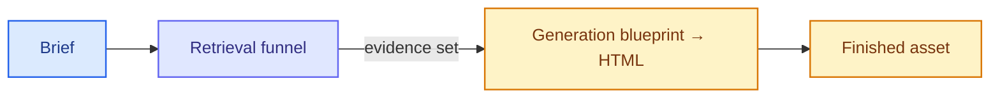

# SOL-3156: Spike — scope the generation eval after retrieval

| | |
|---|---|
| **Ticket** | [SOL-3156](https://linear.app/solsticehealth/issue/SOL-3156) |
| **Author** | @abhipsha16 |
| **Reviewers** | @arindam-sharma · @eeva-ff · @bensolstice |
| **Timebox** | 2 days |
| **Status** | Proposed |
| **Companion plan** | [`SOL-3155-claim-retrieval-evals.md`](SOL-3155-claim-retrieval-evals.md) |

## Question

Once claims retrieval is its own eval (SOL-3155), **what does the generation eval measure?**

Decided already: there is a generation eval this cycle. This spike is not that pack. It scopes the pack so it does not re-score retrieval.

Not: how good is retrieval. That is SOL-3155. Not: in-turn file extraction. Files become markdown in the prompt.

## Why it matters

A finished email can fail because retrieval missed the group, or because generation had the group and still wrote the wrong thing. If the generation pack folds both into one asset score, we will “fix generation” when the library never returned the claim.

This spike exists so the generation pack’s tests are leftover failures only: blueprint → HTML, given an evidence set. Skipping it means either duplicating SOL-3155 inside generation, or shipping a judged-asset blob with no stage.

## Candidates and criteria

**Criteria (fixed before the walk):**

- Attributable to a stage v3 actually has, after retrieval is removed
- Observable without a new golden if possible
- Would change a merge decision, not just decorate a dashboard
- Cheap enough to run beside SOL-3155 (no second full-pipeline live pin this cycle unless the walk demands it)

| Candidate | Why it is in the running |
|---|---|
| B. Deterministic leftovers | Attribution already computed and currently wrong. `_verify_claims_used` unions UUID self-report into `claims_used` and sets `match_rate = 1.0` when HTML has no markers (`content_message_generator_v3_agent_sqlalchemy.py:1519–1529`). Render-success is unused as a gate |
| C. Judged asset support | “Does the HTML state anything the evidence set does not support?” — needs a paired baseline and R2 overlap with retrieval. Includes helper **copy** rules (ARs as sentence vs table, one KM curve, disclaimers, dosing-before-safety as reading order) that T5 does not score |
| D. Interview / intake coverage | Did we ask the question that made the right query possible — may already be absorbed by retrieval T1 if Q&A is scripted |

B is the floor. C and D are in if the walk shows failures that B cannot catch.

Helper split (same file, two packs):

| Helper says | Retrieval (3155 T5) | This pack |
|---|---|---|
| Must include study-design + safety groups from the same trial | yes | — |
| Post-hoc cannot stand without Phase 3 foundation groups | yes | — |
| ARs ≥10% / SAEs ≥2% as copy; one KM; disclaimers | only if those live in a distinct group | C if walk shows they fail after groups were chosen |
| Dosing before safety on the page | T5: both groups present | C: order |

Blueprint stuffing (`_build_domain_guidance_for_piece`) prefers `detected_domains` → first-4 keywords over raw brief text. A generation walk that ignores that will mis-attribute “wrong domain rules in the prompt” as a copy failure.

## Method

1. Take 8–12 real v3 generate turns (email plus at least one banner or social) that already have a brief, a claims shortlist in state, a blueprint, and HTML.
2. For each turn, attribute every visible failure to **one** bucket: retrieval (never on the shortlist), selection (on the shortlist, not chosen), utilization (chosen, not in HTML), generation (in HTML but wrong / unsupported / domain-rule break not explained by retrieval), or other (layout, ISI, template).
3. Count the buckets. B is the floor of the pack. C is in if unsupported statements appear **after** the right groups were chosen. D is in if the miss is “never asked,” not “asked and still retrieved wrong.” Retrieval / selection / utilization counts belong in SOL-3155, not in this pack.
4. Do not run a new Braintrust suite in this spike. Read existing operations and, where needed, the run record SOL-3155 will require.
5. On attribution: compare `_extract_claims_from_html` to `_verify_claims_used` on the same HTML. A mismatch is B, not C.

v3 only.

## Exit criteria

**Done when** the Findings table has a count per bucket and the Recommendation names B, C, D, or a mix, and names the follow-on plan ticket for the generation pack.

**If the timebox expires:** write the counts we have. Default the pack to **B** (deterministic leftovers). Add C or D only for buckets that already have counts.

## Context view

Amber/effect is this spike. Retrieval is SOL-3155.

## Deviations from the brief

- *(empty until the spike runs)*

## Findings

*Filled when the walk ends.*

| Bucket | Count | Notes |
|---|---|---|
| Retrieval miss | | SOL-3155, not this pack |
| Selection miss | | SOL-3155 T3 |
| Utilization miss | | SOL-3155 T4 (HTML parse, not reconciler) |
| Unsupported / altered copy with evidence present | | C |
| Attribution lie (F8/F9) | | B — already confirmed in code; walk counts how often it fires on real HTML |
| Interview miss | | D, unless already T1 |
| Other (layout, ISI, template) | | |

## Recommendation

*Proceed / adjust. Name the Plan this seeds for the generation pack.*

---

Spikes feed Plans: the recommendation spawns a needs-plan ticket. B can land as a Tier 0 on the message-generator reconciler inside that plan; C/D need the judged surface.
