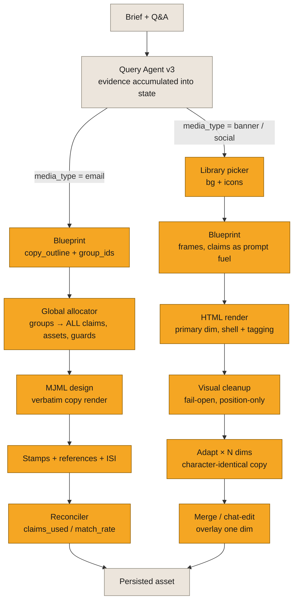

# SOL-3156: Spike — which intermediate generation stages can we evaluate

| | |
|---|---|
| **Ticket** | [SOL-3156](https://linear.app/solsticehealth/issue/SOL-3156) |
| **Author** | @abhipsha16 |
| **Reviewers** | @arindam-sharma / @bensolstice |
| **Timebox** | 2 days |
| **Status** | Proposed |
| **Companion plan** | [`SOL-3155-claim-retrieval-evals.md`](SOL-3155-claim-retrieval-evals.md) |

## Question

Between the evidence being in state and the persisted HTML, a generate turn runs a chain of stages. **Which of those intermediate stages exposes a seam we can freeze and score on its own** — a contract of known input → known output where a failure belongs to that stage and nothing upstream or downstream?

Scope in one line: retrieval (how the evidence got into state) is SOL-3155; finished-asset quality is the existing benchmark doc; everything in between is this spike.

## Why it matters

A weak asset is scored today as one blob. Every distinct way generation can fail — unsupported copy, a short-changed group expansion, wording drift, a paraphrased adapt, a cleanup that kept a broken layout, a merge over the wrong size — looks identical at the output. Without seams at these boundaries we "fix generation" blind. This spike maps the stages, writes their contracts, and returns the subset worth an eval, so a generation regression is attributable to a stage instead of guessed.

## Where the pipelines diverge

Both channels share one trunk: Query Agent v3 accumulates evidence (claims, files, intake decisions) into project state. At `media_type` they split into two lanes with **opposite claim contracts**:

- **Email binds hard.** The blueprint assigns `group_ids` to sections, groups are atomic, the allocator expands each assigned group into **all** of its claims, the designer renders the copy verbatim, and the HTML carries `data-claim-id` stamps back to library claims.
- **Banner / social binds soft.** Claims enter the blueprint prompt as copy **fuel** (≤30 texts, no group expansion), the HTML carries `data-claim-id-lookup="N"` running integers rather than library ids, and the strongest contract is downstream: adapt must hold creative copy **character-identical** across dimensions. Social runs this same spine on `SOCIAL_BASELINE` shells.

Amber is the territory under investigation.

## Candidates and criteria

A stage becomes an eval candidate only if **all** of these hold. Fixed before the walk; changes go under Deviations.

| Criterion | Meaning |
|---|---|
| Freezable | The stage's input artifact can be frozen from a stored real turn (state snapshot, saved blueprint, saved HTML version), so the check scores the stage's own transformation — never a live upstream run. |
| Attributable | With the input frozen, a red result is this stage's fault by construction. |
| Deterministic or cheaply judged | Prefer string/set/structure comparison; an LLM judge only where the contract is semantic (proposition support). |
| Stable enough | The stage exists and runs today. A stage that may be redesigned (the email blueprint is under discussion) still gets mapped and scored — volatility lowers build priority, it does not delete the stage from the map. |
| Decision-changing | A red result would block a merge, not decorate a dashboard. |

### Email lane — group-bound

Chain (module header of the builder, `message_generator_from_scratch_v0_1.py:13-17`): `planner → group_assigner → clinical_copywriter → microcopy → global_allocator → references_prepare → header_designer → designer_mjml → footer_mjml (ISI) → compiler_mjml → mjml_to_html → cohesion → compliance → finalize`.

| Stage | Producer | Input → Output |
|---|---|---|
| Blueprint: copy + group assignment | `generate_blueprint` (`query_agent_v3/tools/blueprint.py`) | group descriptions + ~150-char claim previews → final `copy_outline` + ordinal `group_ids` per section |
| Persist / identity | `foundation_plan` + claims-picker state | ordinal claim ids ↔ `original_claim_id` remap |
| Allocation + expansion | `global_allocator_node` (`message_generator_from_scratch_v0_1.py:7619`) | section→groups → final `section_to_group_ids`, all claims of each group, assets, caps, guards |
| Copy render | `clinical_copywriter` → `designer_mjml` → `mjml_to_html` | `copy_outline` → MJML → HTML, copy held verbatim |
| Citations + stamps | `references_prepare` + design/finalize stamping | expanded claim set → `data-claim-id` spans + reference block |
| Shell | `footer_mjml`, `header_designer` | `Brand.isi` + references → filled shell |
| Attribution reconciler | `_verify_claims_used` (`content_message_generator_v3_agent_sqlalchemy.py:1465`) | LLM self-report + HTML → `claims_used`, `match_rate` |
| Compliance node | `compliance` (chain tail) | no-op today — mapped, not scored |

Candidate checks:

| ID | Stage | Check | Freeze | Score |
|---|---|---|---|---|
| E1 | Blueprint | Every `copy_outline` proposition is supported by the assigned groups' full claim texts | state + blueprint JSON | judged, atomic propositions |
| E2 | Persist | Every ordinal id resolves to exactly one `original_claim_id` | persisted blueprint | deterministic |
| E3 | Allocator | Each section's claim set = union of its groups' claims; each group used once; groups atomic | blueprint + group metadata | deterministic |
| E4 | Allocator | A group that promises N claims delivers N into state | group metadata + state | deterministic |
| E5 | Allocator | Caps (≤5 icons, ≤3 visuals/section) and section-type guards hold | blueprint + state | deterministic |
| E6 | Copy render | Rendered sentences match `copy_outline`; claim-bearing sentences match approved claim text | outline + HTML | string diff; entailment judge for allowed paraphrase |
| E7 | Stamps | Every stamped id ∈ expanded set; clinical sentences stamped; reference block agrees (`_extract_claims_from_html:1428`) | HTML alone | deterministic parse |
| E8 | Shell | ISI present and faithful to `Brand.isi` | brand ISI + HTML | deterministic |
| E9 | Reconciler | Reconciler agrees with the HTML parse — today it reports `match_rate = 1.0` on markerless HTML (`:1519-1529`) | HTML alone | deterministic |

### Banner / social lane — creative-first

Chain per `docs/banner_ad_pipeline.md`. Social runs the same spine on `SOCIAL_BASELINE` shells.

| Stage | Producer | Input → Output |
|---|---|---|
| Library picker | `library_picker.pick_library_assets_for_operation` | brand `BACKGROUND` catalog + intake decisions → `lib_bg_*` / `lib_icon_*` synthetics |
| Blueprint structure | `blueprint_generator.generate_banners_streaming` | brief + ≤30 claim texts + assets → frames JSON |
| HTML render (primary dim) | `html_generator.generate_banners_html` | blueprint + baseline shell → dim HTML |
| Visual cleanup | `visual_validator.cleanup_banner_html` | HTML → repositioned HTML, fail-open |
| Adapt × N dims | `adapt.adapt_banner` | source-dim HTML → target-dim HTML |
| Merge / chat-edit | `multi_dim_merge.merge_incoming_into_existing` (`multi_dim_merge.py:32-59`), `html_chat_edit` SR | stacked HTML + one-dim edit → merged stack |

Candidate checks:

| ID | Stage | Check | Freeze | Score |
|---|---|---|---|---|
| B1 | Picker | Picked ids resolve to real catalog rows; `locked_role` honored; no private-bucket URL leaks | catalog + intake decisions | deterministic |
| B2 | Blueprint | Frame count matches the brief's story beats | brief + blueprint JSON | judged |
| B3 | Blueprint | ≥1 renderable element per frame; final frame CTA non-empty; role enums valid | blueprint JSON | deterministic |
| B4 | HTML render | Persistent shell byte-identical to the baseline; tagging-contract lints pass | baseline + HTML | deterministic |
| B5 | HTML render | Frame copy matches blueprint headline / subheadline strings | blueprint + HTML | string diff |
| B6 | Cleanup | Copy, shell, GSAP labels and timing unchanged; only position / size may differ | pre + post HTML | deterministic |
| B7 | Adapt | Creative copy character-identical across dims; timeline label times equal | source + target HTML | deterministic |
| B8 | Merge / edit | Non-target `<!DOCTYPE>` chunks byte-identical; stack never widens; anchored SR matches exactly once | pre + post stack | deterministic |

## Method

1. Walk each lane on 8–12 stored real turns (email plus at least one banner and one social) that already have state snapshots, saved blueprints, and saved HTML versions — freeze those artifacts; never re-run upstream stages to produce inputs.
2. Score each candidate check as specified above; where a check is judged (E1, E6, B2), record examples rather than building the judge in this spike.
3. Record observed failure modes per stage, then a verdict against the five criteria: build / defer (with the criterion it fails).
4. No Braintrust run, no new golden, no harness code in this spike. Findings feed the plan for the generation pack.

References for the walk: `docs/banner_ad_pipeline.md`, `docs/PHARMA_EMAIL_GENERATION_PIPELINE_AUDIT.md`, `message_generator_from_scratch_v0_1.py`, `content_message_generator_v3_agent_sqlalchemy.py`, `query_agent_v3/tools/blueprint.py`.

## Exit criteria

**Done when** both lane maps are walked on real turns, every stage has a contract row and a verdict, and the Recommendation names the seams the generation pack builds first plus the follow-on plan ticket.

**If the timebox expires:** ship the maps and verdicts we have. Default the pack to the deterministic floors that need no golden — **B7 adapt identity**, **B8 merge preservation**, **E3/E4 allocator fidelity**, **E9 reconciler honesty** — and list the judged checks (E1 proposition support, E6 verbatim integrity, B2 beat count) as mapped-but-unbuilt.

## Deviations from the brief

- *(empty until the spike runs)*

## Findings

*Appended when the walk ends: one row per stage.*

| Check | Observed failures (count on real turns) | Verdict (build / defer + criterion) |
|---|---|---|
| E1–E9 | | |
| B1–B8 | | |

## Recommendation

*Proceed / adjust. Name the plan ticket this seeds for the generation pack, and which seams it carries.*

---

Spikes feed Plans: a proceed recommendation spawns a needs-plan ticket. The deterministic seams can land as Tier 0 checks inside that plan; judged seams need the scored surface.
