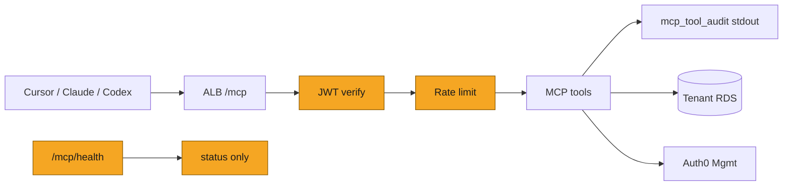
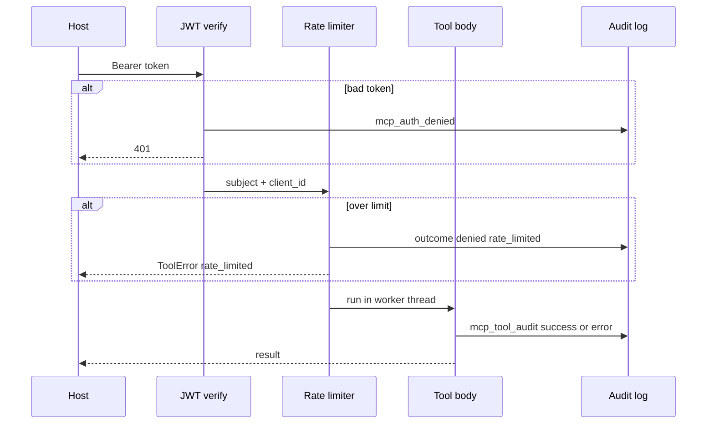
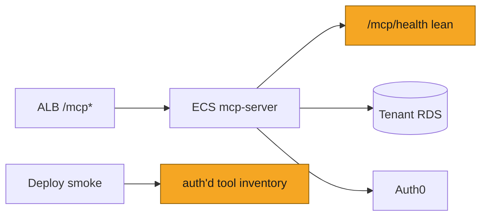

# SOL-3165: MCP hardening — rate limits, list caps, lean health, credential hygiene

| | |
|---|---|
| **Ticket** | [SOL-3165](https://linear.app/solsticehealth/issue/SOL-3165/mcp-hardening-rate-limits-list-caps-lean-health-credential-hygiene) |
| **Author** | @saisolstice |
| **Reviewers** | 2, one owning the MCP / Auth0 domain |
| **Tier** | 2 |
| **Status** | Draft |
| **Date** | 2026-08-18 |
| **Companion plan** | [`SOL-3166-mcp-reliability-scale.md`](SOL-3166-mcp-reliability-scale.md) |

> [!IMPORTANT]
> **Tier check.**
> - [x] Touches auth, tenancy, or permissions — rate limiting keyed on JWT subject/client; auth-deny audit; JWKS refresh behavior; health surface that currently discloses env-gated auth tools
> - [ ] Handles PHI or client data in a new way
> - [ ] Schema migration on existing tables
> - [ ] New external dependency, vendor, or infrastructure
> - [x] Changes a cross-service or client-facing API contract — list tools gain `limit` / pagination; public `/health` drops `tools`
> - [ ] Hard to reverse

## 1. Problem

I'm hardening `solstice-mcp-server` after a deep dive of the tool surface. Core auth and brand RBAC are solid (RS256 JWT with aud/iss/exp/sub, centralized `require_brand_role`, existence-oracle `not_authorized`, payload-free `mcp_tool_audit`, sync work offloaded via `anyio.to_thread`). What remains is defense-in-depth: a compromised agent token can still flood the service, dump unbounded brand lists, learn from unauthenticated health which privileged tools are live, and put a temp password into LLM/chat context. Memory writes also only secret-scan on `observe`, not on explicit `remember` / `replace`.

## 2. What exists today

Paths relative to `solstice-mcp-server/src/solstice_mcp/`.

| Area | Today | Gap |
|---|---|---|
| Auth | `auth.py` `MCPAccessTokenVerifier` — RS256 only, aud/iss required, JWKS cache TTL 300s | Unknown `kid` forces refresh; auth failures are free-form INFO, not structured audit |
| Tool wrapper | `audit.py` `audited_tool` — payload-free audit + `anyio.to_thread` | No rate limit |
| Lists | `operations.py` `list_operations_for_brand` / `list_projects_for_brand` return `.all()` | `requests.py` already has `MAX_LIST_LIMIT = 500`; ops/projects do not |
| Health | `app.py` `/health` + `/mcp/health` return full sorted tool name list | Unauthenticated inventory of env-gated tools (user-admin, memory) |
| User admin | `user_admin.py` `mode=temp_password` returns plaintext once | Lands in agent host context; needed when reset email fails |
| Memory | `tools/memory.py` `_SECRET_PATTERNS` on `observe` only | `remember` / `replace` rely on Backend alone |

Positive controls already in place (do not regress): existence oracle on unknown op/project IDs; draft HTML denied for non-staff including presigned URL; pre-registered Auth0 clients only (no DCR); audit never logs tool inputs/outputs.

## 3. Approach

Seven hardening items (H1–H7), all inside `solstice-mcp-server`. No Backend schema change. No Redis for v1 rate limiting (per-worker in-process bucket; revisit when multi-task shared limit is required).

| ID | Change | Primary files |
|---|---|---|
| H1 | Token bucket / sliding window on `(subject, client_id)`; stricter caps on `solstice_list_tenants` + user-admin; over-limit → `ToolError("rate_limited: …")` + audit `denied` | `audit.py`, `app.py` |
| H2 | `limit` (default 100, max 500) + cursor/`has_more` on list ops and list projects | `operations.py`, `tools/content.py` |
| H3 | Public health returns `{status, service, version}` only; tool inventory via authenticated path (extend `solstice_server_info` or auth'd detail route for CI) | `app.py`, discovery tools, deploy smoke |
| H4 | Keep `temp_password` for email-fail ops; set Auth0 force-change-on-login (or equivalent Management flag); Datadog monitor on `tool:solstice_reset_password` + `mode:temp_password`; skill/instructions warn out-of-band delivery | `user_admin.py`, plugin skill text |
| H5 | Run `_SECRET_PATTERNS` on `remember` / `replace` statements (same deny as `observe`) | `tools/memory.py` |
| H6 | On `verify_token` failure emit structured `mcp_auth_denied` JSON (reason class, no token) | `auth.py` |
| H7 | Unknown `kid` refresh at most once per TTL / cooldown | `auth.py` `JWKSCache` |

## 4. System views

### Context: where it sits

### Flow: who calls whom, in what order

### Data: what changes shape

*N/A — no new tables. List tool response shape gains `limit` / pagination fields; public health JSON drops `tools`.*

### State: lifecycle of the entity

*N/A — request-path controls only.*

## 5. Trade-offs accepted

- We accept **per-worker** rate limits (2 gunicorn workers ≈ 2× effective budget) to avoid a Redis dependency on day one. Revisit when ECS task count or abuse evidence needs a shared limiter.
- We accept keeping **`temp_password` in the tool result** (ops need it when Auth0 email fails) in exchange for force-change-on-login + monitoring rather than a one-time vault/URL redesign. Revisit if transcripts show repeated leakage.
- We accept a **client-visible** list pagination contract change (agents that assumed full dumps must page). Better than OOM / multi-MB responses.

## 6. Alternatives rejected

- Alternative: drop `temp_password` entirely. Rejected because Pfizer-style reset-email quarantine still needs a staff recovery path.
- Alternative: Redis rate limiter now. Rejected as new infra for a first pass; in-process is enough to stop casual flood.
- Alternative: leave tool inventory on `/health` for CI convenience. Rejected — CI can use an auth'd path or `MCP_CI_ACCESS_TOKEN` detail route.
- Alternative: do nothing. Rejected — medium findings are reachable with any valid user token via an agent host.

## 7. Risks and rollback

- **List pagination** may break host prompts that expect a full array. Mitigate with generous default (100) and clear `has_more`; skills updated in the same PR.
- **Lean health** breaks any smoke that asserts `tools` on unauthenticated GET — update deploy workflow in the same change.
- **Rate limits** too tight could block legitimate multi-tool agent turns. Start env-tunable; default ~60/min/subject, stricter on fan-out tools.
- Rollback: env flags to disable limiter / restore health tools list; list `limit` remains optional for callers that ignore new fields. Backout under an hour, no data migration.

## 8. Verification

- Unit tests: limiter, list caps, lean health, secret guard on remember/replace, JWKS refresh throttle, auth-deny audit shape; extend `tests/test_user_admin.py` for force-change flag if wired.
- Manual: call `/mcp/health` unauthenticated → no `tools`; authenticated inventory still visible for CI.
- Datadog: monitor for `temp_password` mode; query `mcp_auth_denied` after a bad-token probe in staging.
- Signal after ship: `service:solstice-mcp` `outcome:denied` with `error_code:rate_limited` under synthetic flood stays bounded; no ALB flap from worker starve.

## 9. Open questions

1. Who owns the MCP / Auth0 domain for Tier 2 review on this PR?
2. Preferred Auth0 Management field for force-change-on-login on our tenant (confirm exact API attribute before coding H4)?

---

# Tier 2 sections

## Goals and non-goals

**Goals**

- Bound abuse from a valid agent token (rate + list size)
- Stop unauthenticated feature inventory via health
- Close MCP-layer secret and auth-observability gaps
- Reduce temp-password exposure window without removing the recovery path

**Non-goals**

- Enabling Auth0 DCR
- Removing ECS vs AgentCore dual path
- Shared Redis rate limiter (v2)
- Backend memory schema changes
- Changing the `not_authorized` existence-oracle contract
- Reliability items R1–R6 (companion SOL-3166)

## Migration and rollout

1. Land plan Approval in this repo.
2. Implement H3 + deploy smoke update first (health contract) so CI does not go red mid-rollout.
3. H2 list pagination with skill/doc updates in the same MCP PR.
4. H1 rate limit behind env defaults (tunable without redeploy if already env-driven).
5. H5, H6, H7 as pure server changes.
6. H4 last (Auth0 Management behavior + monitor + skill warning).
7. Ship on `solstice-mcp-server` `main` (no `dev` branch — push deploys).

Backout: revert MCP image / env toggles; no data backfill.

## Security and compliance

- Tenant isolation unchanged: brand role still derived from JWT subject + `brand_team_members`, never from caller-supplied role.
- Audit remains payload-free; auth-deny events must never include the bearer token.
- Temp password still crosses the agent host once by design; force-change + monitor are the compensating controls.
- No new data processor; Auth0 Management already in use for user-admin tools.

## Phasing and estimates

| Phase | Scope | Size |
|---|---|---|
| 1 | H3 lean health + H2 list caps + tests + skill/CI updates | S–M (demo: health no longer leaks tools; large brand list pages) |
| 2 | H1 rate limit + H5/H6/H7 | S–M |
| 3 | H4 temp-password force-change + Datadog monitor | S |

## Deploy view

## Pre-mortem

*It is three months later and this failed. The most likely reason:* rate limits were set so high they never tripped, list pagination was added but agents still requested `limit=500` in a tight loop, and we treated "no Datadog alarm fired" as success — so a single stolen staff token still saturated the worker thread pool via `list_tenants` fan-out.

## Decision log

| Date | Decision | Options considered | Why | Who | Status |
|---|---|---|---|---|---|
| 2026-08-18 | Per-worker limiter, no Redis in v1 | Redis, API Gateway throttle, none | Enough to stop flood; avoid new infra | Author | Decided |
| 2026-08-18 | Keep `temp_password`, harden around it | Remove mode; one-time retrieval URL | Email-fail recovery still required | Author | Decided |
| 2026-08-18 | Drop `tools` from public health | Keep for CI | Info disclosure outweighs CI convenience; auth'd path exists | Author | Decided |

## Sign-off

| Reviewer | Verdict | Date | Note |
|---|---|---|---|
| @ | Approve / Blocked | | |
| @ | Approve / Blocked | | |

> [!TIP]
> **When this ships**
> - [ ] Durable decisions distilled into MCP `CLAUDE.md` / plugin skill text
> - [ ] Status set to Shipped; file frozen
