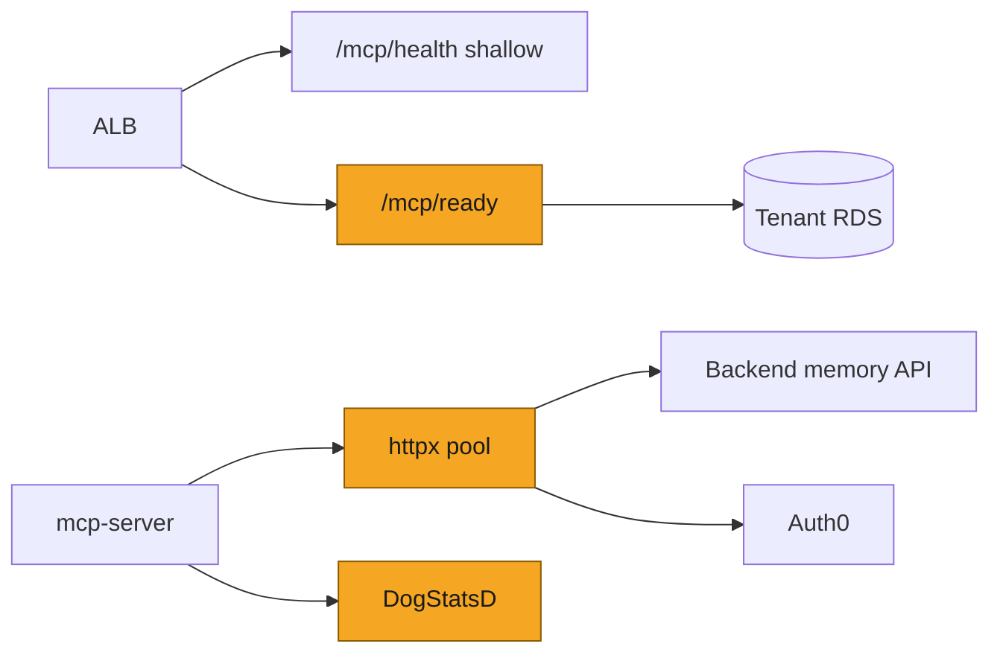
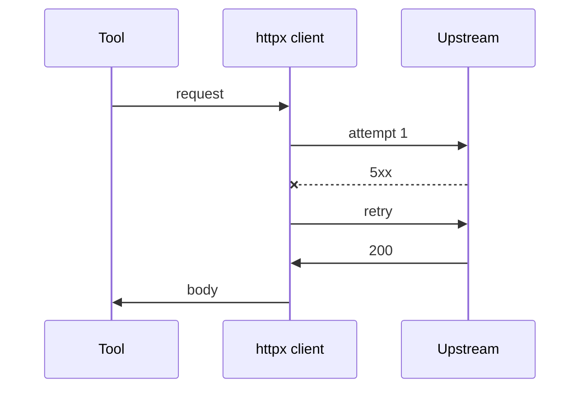

# SOL-3166: MCP reliability & scale — httpx, metrics, readiness, CI

| | |
|---|---|
| **Ticket** | [SOL-3166](https://linear.app/solsticehealth/issue/SOL-3166/mcp-reliability-and-scale-httpx-retry-metrics-readiness-ci) |
| **Author** | @saisolstice |
| **Reviewers** | 2 |
| **Tier** | 1 |
| **Status** | Draft |
| **Date** | 2026-08-18 |
| **Companion plan** | [`SOL-3165-mcp-hardening.md`](SOL-3165-mcp-hardening.md) |

> [!IMPORTANT]
> **Tier check.** No Tier 2 triggers: no auth/tenancy redesign, no new PHI path, no schema migration, no new vendor (DogStatsD already on the task via existing sidecars), no hard-to-reverse client contract beyond additive readiness. Tier 1; Tier 2 sections deleted. Implement after or alongside SOL-3165 once list/health contracts from that plan are clear.

## 1. Problem

I'm following the MCP hardening deep dive with operational reliability work. Auth is not the weak point here — cold starts, sync HTTP without retry, logs-only observability, and a shallow health check are. A healthy ALB target can still be unable to reach tenant RDS; memory/Auth0 calls open fresh TCP and fail open on a single 5xx; deploy can mark AgentCore sync READY while the gateway tool snapshot is stale.

## 2. What exists today

| Area | Today | Gap |
|---|---|---|
| Outbound HTTP | `memory_client.py` and Auth0 paths in `user_admin.py` use `urllib.request` | No pool, no retry, holds a thread-pool slot up to timeout |
| Observability | `audit.py` → stdout → Firelens → Datadog Logs; APM deliberately off | No counters/histograms for tool × outcome / duration |
| Health | `/health` + `/mcp/health` status only (after SOL-3165 lean change) | No readiness probe that touches RDS |
| Tenants | Lazy engine create per tenant per worker | Cold-start spike + pool herd after deploy |
| Deploy | AgentCore `synchronize-gateway-targets`; tools/list assert optional when `MCP_CI_ACCESS_TOKEN` set | Stale tool list can ship |
| CI | ruff + pytest on SQLite in-memory | No mypy; SQLite lies about `FOR UPDATE` / UUID |

## 3. Approach

| ID | Change |
|---|---|
| R1 | Shared `httpx` client + timeouts + 2–3 retries on 5xx for memory and Auth0 Management |
| R2 | Emit DogStatsD counters/histograms from the audit path (`tool`, `outcome`, `duration_ms`); keep APM off |
| R3 | Add `/mcp/ready` that pings a cheap DB/registry check; leave `/health` shallow for ALB |
| R4 | Pre-warm SQLAlchemy engines at boot for configured tenants |
| R5 | Make AgentCore tools/list assertion mandatory when CI token is present |
| R6 | Add mypy to CI; add or explicitly defer a Postgres-backed integration path for gate/RBAC |

## 4. System views

### Context: where it sits

### Flow: who calls whom, in what order

### Data: what changes shape

*N/A — no DB schema changes.*

### State: lifecycle of the entity

*N/A.*

## 5. Trade-offs accepted

- We accept **logs + DogStatsD** without enabling `ddtrace` APM (existing MCP sizing/APM-off decision). Revisit if cross-service traces become required.
- We accept **optional Postgres IT deferred** only if CI cost/time is prohibitive — then the plan PR must say `WIRING DEFERRED` with a follow-up ticket. Prefer landing a minimal Postgres job.

## 6. Alternatives rejected

- Alternative: turn on full APM. Rejected — vault/task sizing assumed APM off; metrics from audit are enough for error-rate alarms.
- Alternative: fold R1–R6 into SOL-3165. Rejected — keeps Tier 2 auth-surface review focused; reliability is Tier 1.

## 7. Risks and rollback

- Ready endpoint flapping ALB if wired as the target-group check by mistake — keep ALB on shallow `/health`; use `/mcp/ready` for deploy smoke / k8s-style readiness only until proven.
- httpx retry amplifying load on a sick Backend — cap retries at 2–3 with backoff.
- Rollback: revert image; metrics emit is fail-open.

## 8. Verification

- Unit/integration: httpx retry behavior with fake transport; ready fails when session factory raises; boot pre-warm does not crash empty registry.
- Deploy: with CI token, stale tools/list fails the job.
- Datadog: `service:solstice-mcp` metrics for tool/outcome appear within one deploy.
- Signal after ship: p95 tool duration and error rate alarmable; no cold-start ALB thrash on deploy.

## 9. Open questions

1. Confirm DogStatsD is already reachable from the mcp-server task (sidecar present) before coding R2.
2. Prefer Postgres IT in this ticket or a follow-up with `WIRING DEFERRED`?

## Decision log

| Date | Decision | Options considered | Why | Who | Status |
|---|---|---|---|---|---|
| 2026-08-18 | Separate Tier 1 plan from hardening | Single combined Tier 2 | Keeps auth review focused | Author | Decided |
| 2026-08-18 | Metrics without APM | Enable ddtrace | Match existing MCP APM-off constraint | Author | Decided |

## Sign-off

| Reviewer | Verdict | Date | Note |
|---|---|---|---|
| @ | Approve / Blocked | | |
| @ | Approve / Blocked | | |

> [!TIP]
> **When this ships**
> - [ ] Durable ops notes distilled into MCP runbooks / vault as needed
> - [ ] Status set to Shipped; file frozen
