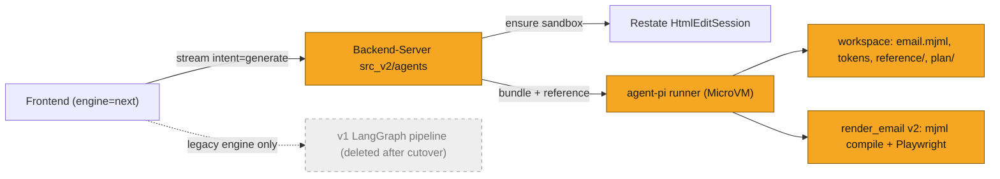
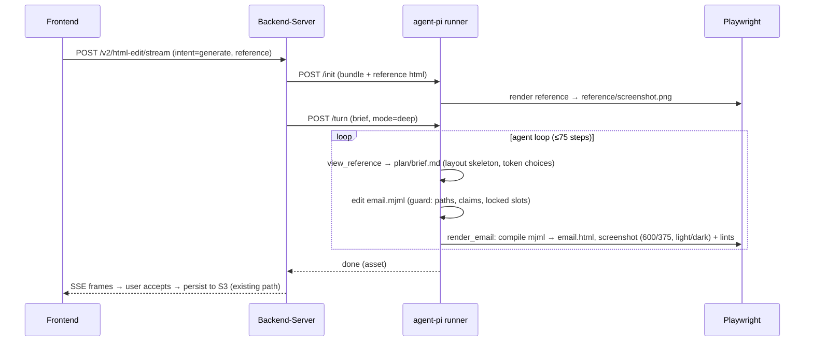
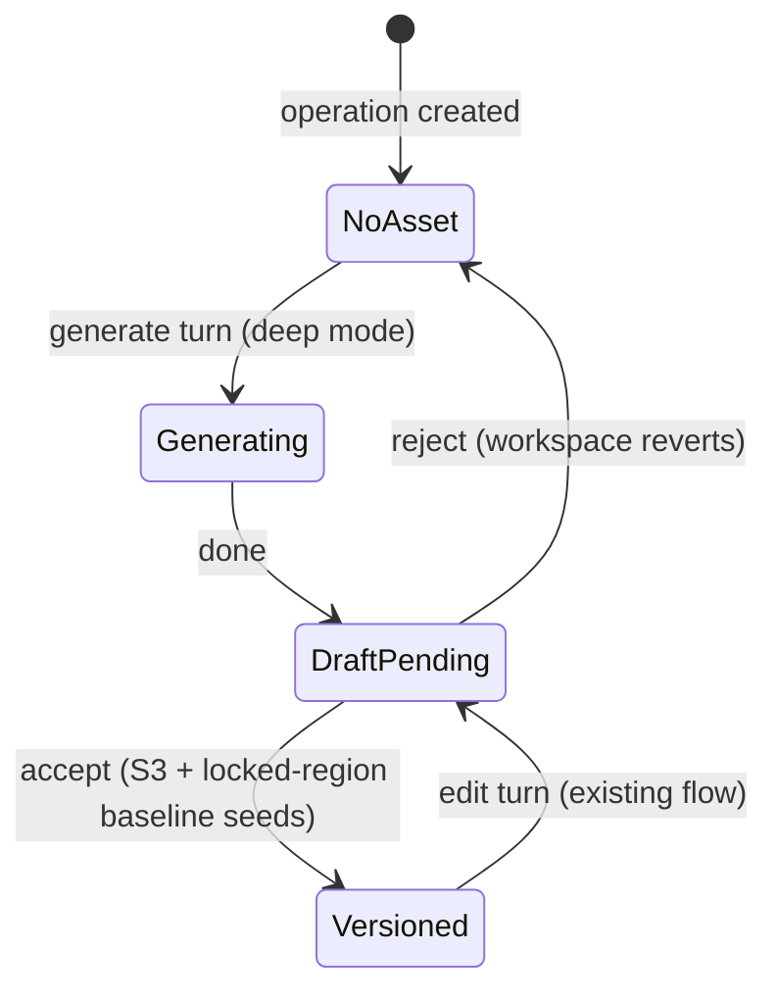
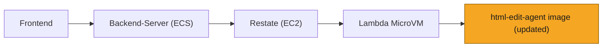

# SOL-3169: Unified email generation in the edit agent

| | |
|---|---|
| **Ticket** | [SOL-3169](https://linear.app/solsticehealth/issue/SOL-3169/unified-email-generation-in-the-edit-agent) |
| **Author** | @gourob |
| **Reviewers** | 2, one owning the Solstice-AI / agent-platform domain |
| **Tier** | 2 |
| **Status** | Draft |
| **Date** | 2026-08-18 |

> [!IMPORTANT]
> **Tier check.**
> - [ ] Touches auth, tenancy, or permissions
> - [ ] Handles PHI or client data in a new way — reference assets are same-tenant files that already flow to the sandbox via the attachments path
> - [ ] Schema migration on existing tables
> - [ ] New external dependency, vendor, or infrastructure
> - [x] Changes a cross-service or client-facing API contract — additive `reference` key in the BE→runner bundle, generation intent on the v2 turn contract, FE generation moves to the v2 endpoint
> - [ ] Hard to reverse — v1 generation stays deployed until cutover completes; rollback is an endpoint switch

## 1. Problem

V1 email generation is a fixed 16-node LangGraph of one-shot LLM calls (~30k LOC across two files) and its output quality is poor — below what Cursor produces given the same brand context, far below Lovable/Figma Make. Meanwhile the edit agent (`agent-pi`) already demonstrates the architecture that frontier design tools use: a persistent tool-using loop with filesystem-as-context, vision feedback, and code-level guardrails. This plan unifies generation into that agent — same runner, same workspace, same guard — so one architecture serves both, and adds the core new use case: **reference-based generation** that transfers a reference email's layout without its language or brand style.

## 2. What exists today

**The edit agent** (`Solstice-AI/html-edit-agent/agent-pi/`, deployed; Python `agent/` is the A/B reference):
- Loop: pi harness over OpenRouter (`src/session.ts`), opus-5 primary, `standard`/`deep`/`blitz` modes (`src/modes.ts`), 50-step budget, guard as a pi extension.
- Workspace: built deterministically from the BE bundle by `agent/context/builder.py` (TS mirror byte-identical) — `CLAUDE.md` playbook, `email.html`, `isi.md`, `brand/{context,brand_guidelines}.md`, `claims/` (greppable groups + `approved.json`), `images/manifest.json`, `attachments/`, `render/`, `.versions/`.
- Tools: file tools (`Read/Edit/Write/Grep/Glob`) + domain tools per kind — email gets `render_email` + `search_claims` (`agent/tools.py:382`).
- Vision loop: `render_email` screenshots `email.html` at 600×800 via a warmed Playwright singleton and returns the JPEG as an image block plus a deterministic issue list (`broken-image`, `horizontal-overflow`, `collapsed-region`) from `_ISSUES_JS` (`agent/render.py`).
- Guard (code, not prompt): path jail, protected paths, locked-region revert, claim-id allowlist revert (`agent/hooks.py`, `agent-pi/src/guard.ts`).
- Platform: `src_v2/agents/` is already generalized for more than one agent (`AgentSpec`, `BUNDLE_PRODUCERS`, `OutputAdapter`); Restate `HtmlEditSession` provisions the sandbox; `src_v2/html_edit/router.py` exposes `/v2/html-edit/{stream,accept,reject,interrupt,warmup}`.

**V1 generation** (`Backend-Server/src/content_generation_new/application/Agentic_Workflows/`): `query_agent_v3` blueprint stage (one giant prompt → JSON blueprint) then `message_generator_from_scratch_v0_1.py` (22.5k lines, one file: planner → copywriters → MJML designer → compiler → a bolted-on 2-round visual-QA find/replace pass). Structurally the opposite of the edit agent — no closed loop, prompts as inline f-strings, compliance node dead. Full internal audit: `Backend-Server/docs/PHARMA_EMAIL_GENERATION_PIPELINE_AUDIT.md`.

**References today**: prior-approved/uploaded files exist (`prior_approved_files`, `n_cg_operations.source_material` JSONB) and `query_agent_v3/native_files.py` classifies "design reference" documents, but nothing puts a reference in front of an agent's eyes; there is no stored screenshot.

**Research grounding** (Lovable/v0/Figma/Cursor/Anthropic frontend-design skill, Design2Code/ReLook/Set-of-Mark): visual quality comes from (1) constraining output to a design-token vocabulary, (2) explicitly banning the model's convergent defaults, (3) brainstorm→critique→build sequencing, (4) a closed screenshot loop **plus** deterministic DOM lints, (5) transferring reference layout as an abstracted region skeleton, never the raw reference.

## 3. Approach

Generation becomes **the first turn of the existing edit agent** — no new agent, image, or Restate object. The architecture stays; what changes is the email source format, workspace content, two tools, and BE wiring.

1. **Generation turn.** `EditStreamRequest` gains `intent: "generate" | "edit"` (default `edit`). For `generate`, the workspace initializes `email.mjml` as a minimal MJML skeleton (the design source, below); the turn runs in `deep` mode (thinking high — Lovable's "first generation is sacred"), and the step budget rises to 75 for that turn. Everything downstream (savepoints, accept/reject, locked-region baseline refresh on accept) already works on "one document string" and needs no change — the platform asset stays `email.html`.

2. **MJML for emails** (email-kind only; banners untouched). Deploy-time client-compatibility rework (Outlook table soup, MSO conditionals) is real recurring cost; MJML makes compatibility by construction the agent's default output.
   - `email.mjml` is the **design source** the agent edits; `email.html` remains the **platform asset** — wire format, accept/reject, savepoints, editor contract, and guard baseline all keep operating on HTML, unchanged.
   - The compile lives inside `render_email`: the tool compiles `email.mjml` → `email.html` (mjml npm lib, in-process in agent-pi) and then screenshots — one call keeps the pair in sync, and compile errors return as the tool result. Guard checks (locked regions, claim ids) run against the compiled HTML and revert the MJML edit on violation.
   - **Staleness rule**: the runner records the hash of the last compiled `email.html`. An external HTML write that breaks it (accept convergence carrying hand edits, version restore) marks `email.mjml` stale; from then on edit turns edit the HTML directly — exactly today's behavior. MJML is authoritative while only the agent touches the email, and degrades gracefully the moment a human does. CLAUDE.md states the rule.
   - Existing `header_footer_library` entries are already MJML and drop in as building blocks.

3. **Workspace additions** (all emitted by the existing deterministic context builder):
   - `brand/tokens.md` — a machine token sheet derived from `brand.design_bible`: semantic HSL colors, font stacks with email-safe fallbacks, spacing scale, radius, logo/ISI rules. CLAUDE.md rule: *tokens only — no literal colors or fonts in markup*. Not new data — the existing `brand/*.md` docs remain the descriptive context (voice, imagery, rationale); tokens are the same `design_bible` projected once, deterministically, into a closed vocabulary a hard rule can point at, so values stop being re-derived per turn. Lives under `brand/` so it is guard-protected for free.
   - `reference/` — `source.html` (or the raw image) plus `screenshot.png`, rendered at `/init` by the runner's already-warm Playwright singleton. Guard-protected (read-only).
   - `plan/` — the agent's own working notes, written and read only by the agent (like `.versions/`, never surfaced to the user and never a human gate). The design brief is required **only in generation turns**, before touching `email.html`: making the brainstorm→critique commitment durable keeps later steps of a long turn anchored to it, and it doubles as an audit trail for evals. Edit turns are unchanged — no planning step; the brief persists in the workspace and the agent may read it (design intent for later structural edits) or update it, both optional.
   - **Generation playbook** section in `CLAUDE.md`: brainstorm (name 4–6 colors from tokens, two type roles, ASCII layout sketch, one signature element) → self-critique ("is each choice specific to this brief or a generic default?") → build; a named list of AI-email clichés to avoid; "spend boldness in one place"; email quality floor (hierarchy at 600px, legible with images off, survives dark-mode inversion, explicit image dimensions + alt).

4. **Tools.**
   - `render_email` v2: compiles `email.mjml` → `email.html` first when the MJML is present and current (§3.2), then screenshots; optional `{viewport?: "desktop"|"mobile"|"both", dark_mode?: boolean}` — 600px and 375px screenshots, dark mode via `prefers-color-scheme` emulation. Extended `_ISSUES_JS` lints (all deterministic, from computed styles/DOM): per-element horizontal overflow, WCAG-AA text contrast, font-size floor, image natural-vs-rendered dimension mismatch, missing `alt`/dimensions, container width ≠ 600 — the checks a screenshot glance misses.
   - `view_reference` (new, no args): returns `reference/screenshot.png` as an image content block — same plumbing `render_email` already uses in both runners. The agent can re-look at any point. Registered only when the workspace contains `reference/` (the existing per-workspace tool-roster mechanism, `agent/tools.py:382`); without a reference the tool doesn't exist and the playbook's reference protocol is omitted from the turn framing. The reference is fixed at `/init` — a mid-conversation attachment is not promoted to a reference in this cut.
   - `search_claims`, guard, everything else: unchanged.

5. **Reference layout transfer** (playbook protocol, enforced by guard where code can enforce):
   - Agent calls `view_reference`, then writes a **typed layout skeleton** into `plan/brief.md`: ordered regions (hero / body block / two-col / CTA / ISI / footer) with proportions and alignment — explicitly *no* colors, fonts, or copy. It then builds from skeleton + `brand/tokens.md` + approved claims, and never opens `reference/source.html` for styling. Abstraction-before-generation is what structurally prevents style/content copying.
   - Language transfer is blocked by the existing claim-id guard (every claim tag must cite `claims/approved.json`; efficacy/safety statements without a corpus are refused) — the reference's claims never enter the approved set.

6. **BE wiring.** Bundle gets an additive optional `reference` key (`{source_kind, file_name, html | image_s3_bytes}`), resolved from `source_material.prior_approved_content`, an uploaded file, or another operation's latest HTML — all fetched by BE with existing authorization; the sandbox still holds no credentials. FE (`useUnifiedGeneration`, engine = `next`) calls `/v2/html-edit/stream` with `intent: "generate"` instead of the v1 unified SSE endpoint; the legacy engine keeps v1 untouched until cutover.

7. **Deleted after bake**: the v1 email path — `query_agent_v3` blueprint tooling and `message_generator_from_scratch_v0_1.py` (~30k LOC). Banner/slide generation paths are out of scope and stay.

Explicitly *not* doing (from the research, deferred deliberately): best-of-N candidates with a pairwise judge, golden samples/rubrics. See §5–6.

## 4. System views

### Context: where it sits

### Flow: a generation turn with a reference

### Data: what changes shape

*N/A because:* no schema change. The reference selection rides in the existing `n_cg_operations.source_material` JSONB; the new shapes are the additive `bundle.reference` key and the workspace files in §3.

### State: lifecycle of the asset

## 5. Trade-offs accepted

- We accept a **dual representation for emails** (`email.mjml` design source, compiled `email.html` platform asset) to get email-client compatibility by construction and eliminate deploy-time compat rework. We give up MJML validity across human hand edits — an external HTML write strands the MJML and later turns fall back to direct HTML editing (today's behavior). Revisit when telemetry shows stale-fallback turns dominating — then invest in HTML→MJML reconciliation or route hand edits through the agent.
- We accept **single-candidate generation** (playbook + closed loop, no best-of-N + judge) to keep latency and the loop simple. Revisit when golden samples/rubrics land or Phase 3 evals put us below the Cursor bar.
- We accept the **agent abstracting the reference itself** (vision → written skeleton) over a deterministic DOM layout extractor, to keep the "good tools + freedom" architecture and zero new machinery. Revisit if layout-fidelity complaints show the skeleton step being skipped or sloppy.
- We accept an **additive bundle key without a contract version bump** to avoid coordinating a breaking deploy. Revisit at the first genuinely breaking bundle change.

## 6. Alternatives rejected

- **Improve v1's prompts in place** — the audit shows the architecture is the problem (one-shot nodes, no closed loop, dead compliance node); prompt work there is sunk cost.
- **A second, generation-only agent** — duplicates workspace, guard, render, and Restate lifecycle for no benefit; generation and editing share every requirement, and unified UX is the goal.
- **Direct HTML generation (no MJML)** — the closed loop verifies design in Chromium but can never verify Outlook/Gmail rendering, and deploy-time compatibility fixes are real recurring work; a playbook-plus-lints floor doesn't guarantee what a compiler guarantees. Rejected in favor of MJML-by-construction (§3.2), accepting the staleness trade-off in §5. (Decision log, 2026-08-18.)
- **MJML as unconditional source of truth** (recompile-only, no fallback) — user hand edits land on HTML and can't be decompiled back to MJML; without the stale-fallback rule the first hand edit either gets wiped or permanently forks the two files.
- **Feed the reference HTML directly into the generation prompt** — invites style and language copying; the skeleton abstraction is the compliance-safe mechanism, and it is what the layout-transfer literature converges on.
- **Doing nothing** — v1 quality is the client-facing problem prompting this plan.

## 7. Risks and rollback

- **Rollback**: FE endpoint switch back to the v1 SSE path (minutes); v1 stays deployed through the bake period; no data migration, no schema change.
- **Tenancy/PHI**: no new data path — the reference is a same-tenant file BE already authorizes (`_authorized_key`-style checks as with attachments) and pushes into a credential-less sandbox, exactly like `current_html` today.
- **Reference copying**: claim-id guard blocks unapproved language mechanically; style copying is playbook-enforced plus human accept-time review. Residual risk acknowledged — flagged for the eventual rubric work.
- **Client-rendering breakage** (Outlook/Gmail): compatibility by construction via MJML for agent-authored output; residual exposure is human hand edits and stale-fallback HTML turns — watch in the same telemetry as the §5 revisit trigger.
- **MJML/HTML divergence**: bounded by the staleness rule (hash check; stale MJML is never recompiled over hand edits), but a bug there could silently overwrite a hand edit — the hash comparison needs its own tests.
- **Latency**: a deep-mode 75-step generation is minutes, vs v1's pipeline which is also minutes — measure in Phase 1; if worse, drop to `standard` mode and re-eval quality.

## 8. Verification

- **Bar check**: N briefs × M brands run through (a) this agent and (b) Cursor given the identical workspace context; blind pairwise ranking by the marketing panel (rank, don't score). Ship gate: ≥ parity with Cursor.
- **Layout transfer**: for reference-based runs, reviewer compares region skeletons of reference vs output (manual until golden samples exist).
- **Post-ship signal**: first-draft accept rate and count of edit turns before first accept, compared against v1's history for the same brands.

---

# Tier 2 sections

## Goals and non-goals

**Goals**: email generation on the edit-agent architecture at ≥ Cursor quality; reference-based layout transfer with stored reference file + screenshot; richer visual feedback (multi-viewport, dark mode, deterministic lints); delete the v1 email pipeline after cutover.

**Non-goals**: banner/slide generation; best-of-N + judge; golden samples/rubrics (coming separately); image generation/editing; MLR/compliance flow changes; HTML→MJML reconciliation for hand edits; the legacy (non-`next`) editor engine.

## Phasing and estimates

- **Phase 1 (Wed demo)**: generation turn end-to-end — `email.mjml` skeleton, compile-in-render with staleness rule, `brand/tokens.md`, generation playbook, `render_email` v2 viewports. Demo: brief → generated email in Studio.
- **Phase 2 (~1 wk)**: reference pipeline — bundle key, `reference/` + init-time screenshot, `view_reference`, skeleton protocol, guard update.

## Deploy view

No new infrastructure — the existing `html-edit-agent` MicroVM image redeploys with the new workspace/tool code; BE and Restate deployments unchanged.

## Additional experiments in flight

Running alongside the plan, not part of it; results land in the decision log.

1. **Raw brand PDFs as context** — skip the derived identity files (`brand/*.md`, `tokens.md`) and give the agent the brand-guide PDF directly (vision), letting it derive its own token sheet per generation. Tests whether the deterministic distillation loses design signal the model could use. Judged against the token-sheet path on the §8 bar check.
2. **Parallel variations + relative ranking** — N agents generate the same brief under different design directions; a multimodal judge picks the final HTML by relative ranking (rank, never absolute score). This is §5's deferred best-of-N — a clear win here fires that revisit trigger early.

---

## Decision log

| Date | Decision | Options considered | Why | Who | Status |
|---|---|---|---|---|---|
| 2026-08-18 | Generation is a turn on the existing edit agent, not a new agent | New agent image; extend v1; unify | Shared workspace/guard/render; unified UX; v1 architecture is the problem | Author | Proposed |
| 2026-08-18 | Generate direct HTML, not MJML/DSL | MJML compile; block schema; HTML | One asset the same agent edits; guard + editor contract are HTML-native | Author | Superseded (below) |
| 2026-08-18 | Emails generate through MJML: `email.mjml` design source, compiled `email.html` platform asset, stale-fallback on hand edits | Direct HTML; MJML unconditional source of truth; MJML + stale-fallback | Deploy-time client-compat rework is the dominant cost; compile-in-render keeps one loop and one platform asset; fallback absorbs hand edits | Author | Decided |
| 2026-08-18 | Reference enters generation only as an agent-written layout skeleton | Raw HTML in prompt; DOM extractor; vision→skeleton | Structurally prevents style/language copying; zero new machinery | Author | Proposed |

## Sign-off

| Reviewer | Verdict | Date | Note |
|---|---|---|---|
| @ | Approve / Blocked | | |
| @ | Approve / Blocked | | |

## Reviewer guide

1. Start with the four views: check boundaries, call direction, and where the new pieces sit, before reading any prose.
2. Read Trade-offs accepted. Are these the right ones to accept, for the horizon stated?
3. Check What exists today against your own knowledge of the codebase. If you know an existing service or util that covers part of this, name it.
4. Comment within 24 hours. One async round; after that the author books 15 minutes and settles it live.
5. Block only for correctness, security, or cost. Everything else is a comment plus a decision log entry, and the author decides.
6. Bump the tier if you spot a Tier 2 trigger the author missed.
