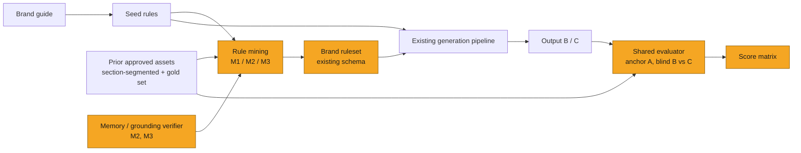

# SOL-3171: Mining brand rules from prior approved assets

| | |
|---|---|
| **Ticket** | [SOL-3171](https://linear.app/solsticehealth/issue/SOL-3171/spike-mine-brand-rules-from-prior-approved-assets-3-methods-vs-seed) |
| **Author** | @chandhru |
| **Reviewers** | @gourob / @ari |
| **Timebox** | 2 days per method, run in parallel (Gourob / Chandhru / Ari) + 0.5 day joint scoring |
| **Status** | Proposed |

## Question

Can we mine a brand ruleset from prior approved assets that produces more brand-faithful generations than our current brand-guide-derived seed rules — and if so, which of three mining strategies does it best per unit of cost?

Scope: email and banner assets, design and identity dimensions only. This spike does not ask whether mined rules can substitute for MLR review. They cannot, and no candidate is evaluated on that.

## Why it matters

Brand rules today are hand-authored. Onboarding a brand is gated on a person reading the brand guide and writing rules by hand, which makes brand onboarding scale linearly with headcount. Worse, coverage stays thin exactly where it matters most for generation — module order, image treatment, CTA density, section rhythm — because brand guides don't discuss those things. Only the approved assets do.

The decision this unblocks: whether automated rule mining goes into brand onboarding at all, and which architecture we invest in. The three methods differ enough in cost profile and failure mode (context ceiling vs. compression loss vs. sampling variance) that picking the wrong one means rebuilding rather than tuning.

If we skip finding out: we keep paying manual authoring per brand, we can't onboard brands with a thin guide or a thin corpus, and — most expensively — we have no evidence about whether the seed-rule baseline is already good enough. Every future generation-quality complaint stays unattributable between "the rules are thin" and "the generator is weak."

## Candidates and criteria

Criteria are fixed as of brief sign-off. Any later change goes under Deviations with a reason.

**Criteria:**

1. **Brand fidelity lift** — paired win rate of the mined ruleset over the current ruleset, judged against a held-out source asset (see Method). Pre-registered bar: **≥60% win rate on ≥3 brands**, measured outside judge noise.
2. **Groundedness** — every rule traceable to a cited approved asset or brand-guide clause. Bar: **100% traceable, zero rules asserting claim, indication, or ISI content.** A ruleset that invents a mandatory element is worse than a ruleset that misses one; in a regulated pipeline this criterion is pass/fail, not scored.
3. **Variation headroom** — the ruleset must not collapse generation onto a single layout. Measured as pairwise diversity across N generations from the same copy, compared against observed diversity in the real approved corpus. A method that wins on fidelity by overfitting one template fails here.
4. **Data efficiency** — fidelity at ≤10 approved assets vs. a few dozen. The shape of the curve matters more than the endpoint, because most brands we onboard next are in the thin tier.
5. **Legibility and stability** — a brand manager can read, diff, and correct the output. Re-running the miner on an unchanged corpus yields a ruleset with high rule-level overlap (drift measure); a miner that returns a different brand every run isn't shippable regardless of score.
6. **Cost per brand** — VLM calls, tokens, wall clock, dollars, and how each scales with corpus size.
7. **Ops fit** — output lands in the existing section-scoped brand-rules schema with no new store; MJML example references resolve to real assets.

| Candidate | Why it is in the running |
|---|---|
| **Method 1 — Full-freedom agentic loop** (@gourob) | Ceiling test. Max context, max autonomy: nested section-segmented approved assets, curated gold-standard folder, brand guide, seed rules; agent chooses its own output format. Tells us what's achievable when we stop constraining, which bounds what the cheaper methods are giving up. |
| **Method 2 — Progressive memory with budgeted rules** (@chandhru) | Forces a compressed brand representation (≤100 tokens/rule, ≤30 rules/section, optional MJML example links) and updates it asset-by-asset until corpus coverage ×k or the memory verifier stabilizes. Bounded output size by construction, and the verifier gives an intrinsic stopping signal independent of the shared evaluator. |
| **Method 3 — Sampling with grounding verifier** (@ari) | Cheapest by an order of magnitude and flat in corpus size: 5 sampled assets to a rule-creator agent, then a rule-verifier agent checks grounding against 5 freshly sampled assets plus the originals. If this ties the others, the others don't ship. |
| **Do nothing — seed rules only** | Baseline: rules mined from the brand guide alone (palette, typography, and the rest). Makes the cost of switching explicit, and is the control every fidelity number is measured against. |

## Method

One shared harness, built first and used identically by all three methods. Owners do not build their own evaluators.

**Harness (day 0.5, shared):**

1. **Fold split.** Per brand, hold out ~20% of approved assets as the eval set. Miners see the train fold only. *This corrects the brief as spiked, which ran the evaluator over all approved assets — including the ones the ruleset was mined from. Without the split we would be measuring memorisation.*
2. **Copy extraction.** Reverse-engineer `copy(A)` from each held-out asset A: text, section order, asset slots, styling stripped. One extractor, all methods.
3. **Generation.** `copy(A)` + mined ruleset → **B**. `copy(A)` + current ruleset → **C**. Same generator, same seed policy, same MJML compile step.
4. **Judging.** VLM sees A as anchor, plus B and C blind and position-randomised, alongside a 5-asset reference strip from the brand's held-out corpus. Forced choice, no ties, 3 votes per triple, majority wins. *Reading the brief's comparison as `sim(A,B) > sim(A,C)`: B vs. C is the contest, A is the anchor.*
5. **Controls, run before any method is scored:**
   - *Noise floor* — B vs. B′ (two generations, same ruleset) should land near 50%. Anything further means the judge is reading position or render artifacts, not brand.
   - *Negative control* — a deliberately corrupted ruleset (wrong palette, wrong type scale) must lose to baseline ≥90% of the time. A harness that can't see a broken ruleset can't see a good one.
   - *Human agreement* — two reviewers score 30 triples against the VLM judge. Below ~70% agreement, all automated scores are reported as directional only.

**Per method:** each owner runs their pipeline against the train fold for every brand in the dataset table, emits a ruleset in the shared schema, and hands it to the harness. Held constant across methods: generator, extractor, judge, folds, and the seed-rule starting point.

**Dataset matrix.** First pass is 5 brands × 3 methods × 1 configuration (full train fold). Ablations run **only for the leading method** after the first pass — the full cross product does not fit the timebox and would buy resolution we can't act on yet.

| Brand | Corpus tier | Assets (confirm at kickoff) | First pass | Ablations (leader only) |
|---|---|---|---|---|
| Lisraya | Thin | | ✓ | count, quality, distribution |
| Optune GIO | Thin | | ✓ | count |
| Ultomiris gMG | Thin / mid | | ✓ | count, distribution |
| Vyndamax | Mid (few dozen) | | ✓ | count, quality |
| Opzelura | Mid (few dozen) | | ✓ | count, quality, distribution |

Ablation axes: **count** (full fold / 50% / 5 assets), **quality** (gold-standard subset only vs. all-approved), **distribution** (email-only vs. email + banner mix).

## Exit criteria

- **Early win.** One method clears ≥60% paired win rate on ≥3 brands with 100% rule traceability and no variation collapse → stop comparing, write the plan.
- **Early kill (harness).** Either control fails on day 1 → stop, and the deliverable is the harness gap written up as its own spike. No method scores get published from a harness that can't detect a corrupted ruleset.
- **Early kill (all-lose).** All three methods land inside judge noise of baseline on both corpus tiers → recommendation is do-nothing, and we record the corpus size at which any signal first appeared.
- **Timebox expiry.** Publish the score matrix with empty cells marked as empty, plus the noise floor, human-agreement number, and cost per brand per method, plus the one blocker that ate the time. No "seemed promising" without a number attached.

## Context view

*The territory the question touches. Amber marks the part under investigation.*

## Deviations from the brief

*Empty — spike not yet started. Append one line each with a why while running.*

## Findings

*Appended when the spike ends. Numbers or short evidence in the cells, no adjectives.*

| Criterion | M1 Agentic loop | M2 Progressive memory | M3 Sampling | Do nothing |
|---|---|---|---|---|
| Brand fidelity lift (paired win rate vs. baseline) | | | | — |
| Groundedness (% traceable / claim violations) | | | | |
| Variation headroom (diversity vs. corpus) | | | | |
| Data efficiency (≤10 assets → few dozen) | | | | |
| Legibility and stability (rule overlap on re-run) | | | | |
| Cost per brand (calls / tokens / wall clock / $) | | | | |
| Ops fit (schema, MJML refs) | | | | |

Harness controls: noise floor ____ · negative control ____ · human agreement ____

## Recommendation

Decision rule pre-registered so the mapping isn't argued after the numbers land:

- **One method clears the bar** → proceed. Seeds the *Brand rule mining in brand onboarding* plan; the losing methods' matrix rows paste into that plan's Alternatives rejected.
- **Two or more clear** → proceed with the cheaper one, record the other as the documented fallback with its cost delta.
- **None clear, but fidelity trends up with corpus size** → adjust. Narrow to the mid tier and re-spike data efficiency; thin-corpus brands stay manual.
- **None clear, no trend** → drop. Record the seed-rule baseline as sufficient for now, keep manual authoring, and state what evidence would reopen the question.

*Actual recommendation to be written at spike end.*

---

Spikes feed Plans: a proceed recommendation spawns a ticket with the needs-plan label, and its evidence pastes into that plan's [Alternatives rejected](plan-template.md#6-alternatives-rejected) section.