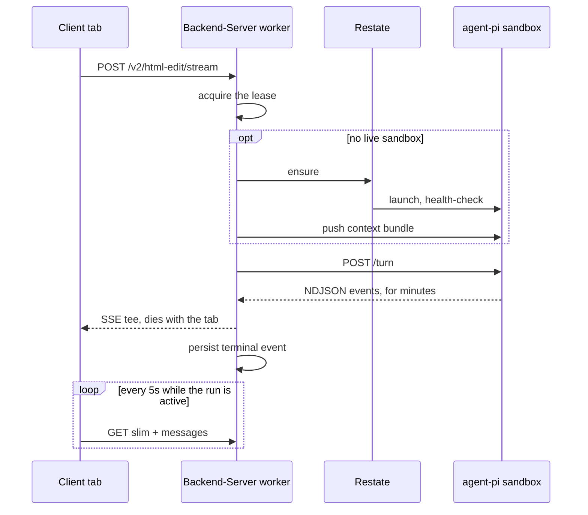
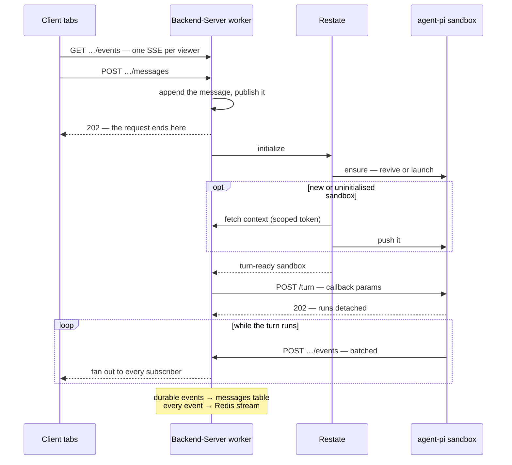

# SOL-3202: Refactor the chat-turn control flow

| | |
|---|---|
| **Ticket** | [SOL-3202](https://linear.app/solsticehealth/issue/SOL-3202) |
| **Author** | @gifan |
| **Reviewers** | TBD — one must own the html-edit surface |
| **Tier** | 2 |
| **Status** | Draft |
| **Date** | 2026-08-19 |

> [!IMPORTANT]
> **Tier check.**
> - [x] Touches auth, tenancy, or permissions — introduces a machine credential for the agent and a publicly reachable callback route
> - [x] Handles PHI or client data in a new way — the agent gains a write path into Backend-Server, and chat content passes through a Redis stream
> - [ ] Schema migration on existing tables — none; the existing message table is reused unchanged
> - [ ] New external dependency, vendor, or infrastructure — none; the existing Redis is reused
> - [x] Changes a cross-service or client-facing API contract
> - [ ] Hard to reverse

## 1. Problem

One HTTP request currently does three unrelated jobs: send a chat message, run the agent turn, and stream the result to a single browser tab. A single turn today:

The backend's own docstring calls itself the runner stream's primary consumer, with the client's response "a tee".

- **A second viewer has to be refused, not subscribed.** The request that owns the turn also feeds the viewer, so there is nowhere to put a second one. Production answers `409`.
- **The lease is not a lock.** It lives in one worker's memory, so every worker holds its own and nothing persists it. A real lease — with an owner and an expiry — exists only in a local test harness.
- **Polling exists because the stream is not trusted.** Two endpoints every five seconds, paused by a latch while a stream is attached — an admission that the stream can silently stop being the truth.
- **The turn dies with the process.** Launch, re-hydrate and retry decisions live in a task cancelled on deploy, so a release mid-turn drops the turn.
- **Reject is best-effort in a request.** It has to reach the live sandbox or the next turn builds on discarded HTML. Today three fallbacks try in sequence, with failure suppressed.
- **Sandbox lifecycle is split across two services.** Restate owns `ensure`, `describe`, `terminate` and the reapers, but Backend-Server decides when to relaunch, re-hydrate or recycle — and holds a live MicroVM token to dispatch with.

These read as seven problems. They are one cause, so fixing them together is cheaper than fixing them in sequence.

## 2. Approach

### Endpoints

Split the one endpoint into three. Scope paths per agent so each keeps its own contract without inventing a shared session model:

| Endpoint | Job |
|---|---|
| `POST /api/v2/agents/html-edit/{operation_id}/messages` | Send a message |
| `GET /api/v2/agents/html-edit/{operation_id}/events` | Subscribe — any number of viewers |
| `POST /api/v2/agent-callback/{operation_id}/events` | The agent's only write path |

`{agent_name}` is a naming convention on the client plane, not a wildcard route: each agent mounts its own router with its own schemas, as every other v2 domain does. The callback plane is the opposite — agent-generic routes, with the token's `agent` claim selecting the implementation, so the runner never encodes the backend's agent layout in a URL.

A **cursor** is an opaque string the client stores and echoes back. It is a Redis stream id today, and clients must not parse it.

**`POST …/{operation_id}/messages`**
- *Auth* — the same bearer token as every other v2 route, with brand access enforced on the path param.
- *Body* — the prompt, a client-generated message id, and today's optional extras: attachments, selection, target banner, intelligence mode.
- *Returns* — `202 {cursor}` once the row is written and published — and, when this call starts a turn, once the turn is dispatched (the runner 202s; the dispatch awaits only Restate `initialize`, seconds). Never a stream.
- *Errors* — idempotent on the client message id, so a double-click writes one message.
- A message arriving while a turn is in flight is written and published, but starts no turn — `202 {turn_id: null}`, never a refusal. The composer is disabled while a turn runs, so this is only the multi-tab race window. There is no queue: a turn starts iff a POST started it.

**`GET …/{operation_id}/events`**
- *Auth* — same bearer token. Read with `fetch` and a streaming response rather than `EventSource`, which cannot set headers; the frontend already does this.
- *Query* — `after=<cursor>`, omitted for a fresh subscription.
- *Returns* — `text/event-stream`: the events after the cursor, then the live tail, held open until either side closes. Periodic comments keep proxies from reaping an idle tail.
- *Errors* — a cursor trimmed out of the stream is reported, not silently skipped, so the client knows to reload history.

**`POST /api/v2/agent-callback/{operation_id}/events`**
- *Auth* — the agent's short-lived token, scoped to one tenant, agent, operation and turn, and write-only. `role` and `author` derive from it; supplying either in the body is an error, never an overwrite.
- *Body* — a batch of events plus a per-turn sequence number. Tenant, agent, operation and turn derive from the token, never the body; the destination URL is the runner's deployment config, never the caller's, so a runner only posts to its own gateway.
- *Returns* — `200` with the cursor of the last event accepted. A batch is accepted whole or rejected whole.
- *Errors* — `409` on a replayed sequence number, so a retry after a timeout is free; `422` on an event kind the agent did not declare.

**`POST …/{operation_id}/warmup`** — not an event route. Fire-and-forget on page load, `202` immediately, so the first message does not pay for a cold launch. Implemented as a one-way Restate `initialize` send: the backend awaits only the ingress enqueue ack; the build itself is Restate's, and survives a backend restart.

### Control flow

What changes:

**The command returns immediately.** Nothing is held open, so "preparing the sandbox" becomes an event rather than a stalled connection. A cold operation feels like a warm one.

**Subscribing is its own call.** A viewer is no longer whoever happened to send the message. Any number can attach, and a reconnect is the same call with a cursor.

**The agent pushes; the backend stops pulling.** The arrows between them reverse, so no worker owns a turn any more and a deploy mid-turn no longer drops it. The loop at the bottom is the agent pushing, where it used to be the client polling. The only backend task left is dispatch itself — wake, then one POST, seconds end to end — and a message whose dispatch died is re-dispatched, not lost.

**Restate hydrates the sandbox, not the backend.** The bundle is still built from the database, but Restate asks for it with a scoped token and pushes it, so hydration failures become a retried, journaled step instead of bespoke backend code. Fetch and push happen in a single journaled step, keeping the bundle out of the journal — as the idle reaper already does with its probe and suspend. The bundle endpoint on the backend is a waypoint: building it can move behind Restate later without changing this flow.

**Context is pushed once, when the sandbox is new.** Today the backend re-pushes the current document on every turn against an existing sandbox, in case it drifted. Nothing makes it drift: the agent is the only writer, accept stores the proposal unchanged, and a reject that cannot be reverted terminates the sandbox — so the next turn is a fresh one and hydrates anyway. The one other case is a runner process restarting inside a live VM, which reports itself uninitialised, so it is detected rather than guessed at.

**Nothing changes shape in the database.** No new table, no new column, no migration: `n_cg_operation_messages` already stores everything worth keeping, so this adds a way to deliver those rows rather than a second copy. Transients stay unpersisted, and `_v2_edit` keeps `status` and `pending_html`. The cursor therefore lives in Redis — inside the retention window a client resumes incrementally, outside it reloads history as page load already does, and a trimmed cursor is detectable so it knows which it needs.

**Restate owns every lifecycle decision, behind one call.** Today it only launches; the backend still decides when to relaunch, re-hydrate or recycle. `initialize` replaces all of that: one request-response handler that returns a turn-ready sandbox — running is a state read, suspended is a revive, absent is a launch, and a new or uninitialised runner is hydrated before it returns. A cold start is a couple of seconds, so the caller just waits. The backend keeps one dumb heal — a sandbox proven dead at dispatch is one more `initialize` with its id — and still dispatches `/turn`, interrupt and the reject ladder itself, so no handler outlives a turn and nothing new lands on the Lambda clock.

**Nothing watches the clock — and nothing adjudicates staleness server-side.** A turn that dies without a terminal event wedges nothing: no gate consults rows for liveness (the runner's own in-flight 409 is the arbiter everywhere — dispatch just claims and tries, reverting on busy), so the orphaned claim is inert. The client declares the silent turn dead: no turn frame for a timeout window settles the open bubble with an error, and the user simply sends again. No timer chain, no watchdog, no janitor.

**The lease goes, with nothing in its place — and so does queueing.** One turn at a time is already enforced by the agent's own in-flight guard, next to the workspace at risk. A second person's message mid-turn is ordinary data, visible to every viewer — recorded and published, but no turn runs for it (matching today's disabled-composer behavior). The design still supports queueing for free (queued = a row without a turn id) if product ever wants it; nothing dispatches such rows today.

**A lot of code goes with it.** `TurnRelay` and its retry ladder, all recovery polling, the frontend's `423` handling that production cannot produce, and the event mapping layer. `runner_client` and `restate_client` shrink to the calls the new path uses — wake, dispatch, interrupt, the reject ladder — instead of owning turn transport. The per-turn document sync goes too.

## 3. Trade-offs accepted

- We accept losing a turn when a sandbox dies mid-flight, including the model spend already incurred, to keep client content out of Restate's journal and handlers off the Lambda clock. Revisit if crash-mid-turn shows up in real traffic; the upgrade path is journaling iteration boundaries and workspace versions, not content.
- We accept that a silent turn is surfaced only client-side (the frontend's inactivity timeout) and that a mid-turn send gets no turn rather than a queued one. Both match today's product behavior; revisit if either surfaces as user confusion.
- We accept a publicly reachable callback route guarded only by a scoped token, because sandbox egress is internet-only. Revisit if a VPC egress connector becomes available, which would put a network boundary back in front of it.
- We accept that a client away longer than the stream's retention window reloads history instead of resuming incrementally, to avoid adding a table or a column. A full reload is what page load already does, and a trimmed cursor is detectable, not silent. Revisit if the reload cost shows up on large operations; then a `seq` column on the existing message table is the smallest next step.
- We accept treating the workspace as intact unless the sandbox is new or reports itself uninitialised, instead of re-pushing state every turn, to keep the common path free of context work. This holds because the agent is the only writer. Revisit before enabling partial accept, which would make the stored document a merge of baseline and proposal and so genuinely diverge the workspace.
- We accept sharing the existing Redis with the Celery broker rather than isolating the workload, keeping our footprint small enough not to move its memory. Revisit if stream volume grows past a few percent of `maxmemory`, or if eviction of broker keys is ever observed.

## 4. Alternatives rejected

- Alternative: do nothing. Rejected because the lease, the polling and the retry ladder each cost real complexity and all trace to the same cause, so they cannot be fixed independently.
- Alternative: keep one request and just add multi-viewer support. Rejected because there is nowhere to put the second viewer — the turn's output only exists on the first viewer's connection.
- Alternative: Restate's own pubsub streaming pattern. Structurally the same design, and it would delete Redis. Rejected because SSE is TypeScript-only while both our services are Python, and because chat history has to live in Postgres anyway, so we would dual-write. It would also likely hold client content in Restate's durable state. Revisit if Python gains SSE.
- Alternative: wrap the agent loop in a Restate handler, journaling every model and tool call. Rejected because the handler would stay alive for the whole turn against a Lambda ceiling, the journal would hold client content, and it would mean rewriting agent-pi's loop against a durable model provider — moving agent internals into the orchestration plane, the coupling SOL-2878's split exists to prevent.
- Alternative: Restate dispatches the turn itself, one-way from the messages route. Rejected because it forces three more contracts — a turn-input fetch so content stays out of the journal, a failure-reporting channel since one-way swallows errors, and a watchdog to close what nothing awaits — while the backend keeps runner access for interrupt and reject anyway. `initialize` keeps the lifecycle ownership and deletes that surface.
- Alternative: keep Backend-Server pushing context to the sandbox. Rejected because hydration failures stay bespoke instead of becoming a retried, journaled step, and lifecycle ownership stays split.
- Alternative: have the agent read its own context each turn, removing the drift window entirely. Deferred rather than rejected — it needs a bigger change to the agent and widens its internet-facing credential from write-only to read-and-write. Revisit if the sync step proves unreliable.

## 5. Risks and rollback

- **The agent cannot reach the callback route.** Confirmed viable: sandboxes launch with an `INTERNET_EGRESS` connector and already call OpenRouter through it. If that regresses, the fallback is a Backend-Server background consumer reading the runner's NDJSON — instance affinity returns for the consumer, but not for the viewer.
- **Workspace drift is assumed away, not checked.** If anything but the agent ever writes the document, the agent edits a stale copy and the user sees a plausible but wrong result. The known trigger is partial accept, which is disabled today (`PARTIAL_ACCEPT_ENABLED = false`) and would store a baseline/proposal merge if enabled. A reviewer who knows another writer should say so — this replaces an unconditionally correct per-turn push.
- **Restate now calls Backend-Server — for one thing.** The context-bundle fetch inside `initialize` is the only call in that direction, and it needs the service's Lambda to reach the API — VPC-attached for an internal call, or via the public ALB otherwise. Confirm which before PR 2's dispatch path is exercised. The bundle must be fetched and pushed inside one journaled step; two steps would record client content in the journal, breaking the property the self-hosting decision rests on.
- **Making `/turn` async changes the agent's contract,** and there is no dev deployment of agent-pi to rehearse on. That is the main delivery risk, and why PR 1 lands additively and early. The likeliest half-failure: everything else ships, the agent push never starts, and the new subscription path runs beside the old relay indefinitely — two code paths instead of one.
- **SSE connection count** rises from one per active turn to one per viewer. Affordable on the current four async workers, but anything blocking an event loop stalls every stream on that worker, so the existing discipline of pushing DB work off the loop becomes load-bearing.
- **Tenancy and PHI.** The one new data path is chat content through Redis — tenant-scoped by logical database, capped, and disposable because Postgres is the record. Credentials and the authorship rule are in Security and compliance below.
- **Redis is the only cursor, and it is shared.** Losing it, or having entries evicted, costs live subscribers a history reload and an in-flight turn its transient frames. Visible for one turn; no durable data at risk. The eviction policy is `allkeys-lru`, so the real risk is the reverse: our writes displacing Celery's tasks. A bounded stream and a TTL keep us at a few percent of the 3 GB cap, which makes the bound a requirement, not a nicety.
- **Rollback.** PR by PR, and cheapest at the moment it matters most. PRs 1 and 2 are additive, so backing them out is a redeploy of code nothing calls. PR 3 is the cutover, and reverting that frontend deploy puts every client back on `/stream` and the relay, both still live until the deletes. No data moves at any point.

## 6. Verification

- Two clients on different frontend deployments both receive every event for one operation.
- A client killed mid-turn and reconnected resumes with no gap and no duplicates — at its cursor inside the retention window, and by reloading history when the cursor has been trimmed out.
- A deploy during an in-flight turn does not lose the turn, and a message whose dispatch task died is picked up rather than lost.
- A turn whose agent is killed without emitting a terminal event neither blocks the next message nor the review actions; the client times the silent bubble out.
- Reject converges against a live sandbox, and is verifiably serialized against a following turn.
- A turn following an accept does no context fetch or push, and starts from the document the previous turn produced.
- A turn against a sandbox whose runner restarted is detected as uninitialised and re-hydrated.
- An inspected journal for a full turn contains no message text and no HTML.
- A duplicated push from the agent is rejected on a `(turn_id, turn_seq)` dedup key rather than double-written.
- Stream memory measured under a realistic concurrent load and shown to be a small fraction of `maxmemory`, with the cap and TTL taking effect.
- Post-ship signals: SSE connections per worker, ingest rejection rate (should be zero), dispatch failures and busy-reverts (should be rare), Redis memory against its cap, and Celery queue depth for any sign of broker keys being evicted.

## 7. Open questions

- Should accept and reject emit events? Probably yes, or a second viewer never learns the proposal was resolved.

---

# Tier 2 sections

## Migration and rollout

Two rules keep every merge safe: **add before switching, switch before deleting**, and remove nothing until route metrics show no callers. There is no schema migration, so the work between merges is deploys and verification rather than data movement.

Three repositories deploy independently, so a PR cannot span them, setting the floor at one substantive PR each, plus a mechanical delete in each once the switch is live.

| PR | Repo | What it does |
|---|---|---|
| 1 | Solstice-AI | `/turn` gains an optional callback — given one it returns `202` and posts batched events, without one it streams NDJSON as today. Restate gains `initialize`: ensure plus hydration, returning a turn-ready sandbox. All of it dormant until Backend-Server calls it. |
| 2 | Backend-Server | The Redis publisher, `GET …/events`, `POST …/messages` with its inline initialize-and-dispatch, the context-bundle route `initialize` hydrates from, scoped paths for `accept`/`reject`/`interrupt`/`warmup` with the old ones kept as aliases, and the agent-callback route with its token minting. `POST …/messages` initializes and dispatches from the start; today's `/stream` keeps using the relay and additionally publishes each frame it relays. |
| 3 | Solstice-Frontend | Subscribe on mount and render from the log, send over `POST …/messages`, and delete the polling, the lease and the `423` handling. |
| 4–6 | One each | Delete `TurnRelay`, `/stream`, the aliases, the event mapping layer, and NDJSON support in `/turn`; `runner_client` and `restate_client` shrink to the calls the new path uses. |

No feature flags: the switch is which endpoint the frontend calls, so old and new coexist as two routes rather than two branches inside one. PR 3 is the cutover, and reverting that frontend deploy puts every client back on `/stream` and the relay, both live until the deletes.

**Between merges**

- *After 2* — confirm the stream's length cap and TTL take effect under a realistic concurrent load, and that the keyspace does not collide with the Celery broker's. The callback route is live at this point but nothing calls it.
- *Between 2 and 3* — this is where the new path gets proven. It is complete and live but uncalled, so drive `POST …/messages` against a test operation and watch a turn run end to end: the backend initializes and dispatches, the agent pushes, subscribers receive. That is the real production path, not a staging one. Confirm here too that the `HtmlEditSession` Lambda can reach Backend-Server's bundle route, VPC-attached or through the public ALB.
- *After 3* — watch dispatch failures, and leave `/stream` and the relay in place until they go quiet.
- *Before 4–6* — route metrics show no callers on `/stream` or the aliases, and the relay path is idle.
- *At the Solstice-AI delete* — `contract_version` bumps, so the agent image and the Lambda deploy together.

> **Why `contract_version` stays put until the end.** `check_identity` compares versions for equality and raises a *terminal* error on mismatch: a new image with an old Lambda fails, and so does the reverse. Any bump therefore forces the two to deploy in lockstep, and a bad pairing breaks every cold launch with no retry. Keeping PR 1's turn field additive avoids that until nothing drives the old mode.

## Security and compliance

- **New credentials, both narrow.** The agent's is short-lived, scoped to `{tenant, agent, operation_id, turn_id}`, and **write-only**. `role` and `author` derive from it and are rejected if supplied in a body — the security-critical rule, since without it anything reaching the route could post as the agent or as another user. Restate's is a read token for one operation, never exposed to the internet.
- **New public surface.** The callback route is reachable from the internet because sandbox egress is internet-only. It is mounted outside the Auth0 dependency with its own token dependency, and should be rate-limited per operation.
- **Redis.** Holds chat content in a capped, expiring stream on the existing in-VPC instance, tenant-separated by the existing per-tenant logical database. Not a new processor, not a new store of record — Postgres remains the only durable copy.
- **Restate.** Journals and stores no tenant data — ids only; the bundle transits a single journaled step without being recorded — so SOL-2878's hosting and rollback position is unchanged.
- Tenant scoping, brand authorization and audit paths are otherwise unchanged. `require_brand_access` already authorizes every source an id appears in, so a mixed body-and-path period is safe.

---

## Decision log

| Date | Decision | Options considered | Why | Who | Status |
|---|---|---|---|---|---|
| 2026-08-19 | Turn dispatch goes through Restate, but no handler awaits the turn | Awakeable + suspended handler vs. short dispatch + delayed watchdog | There is no post-turn work to wake up for; the awakeable existed only to release a lock, and it made a successful turn dependent on a callback into Restate | gifan | Superseded 2026-08-20 |
| 2026-08-20 | The backend dispatches `/turn` itself, after a `initialize` call that returns a turn-ready sandbox | Restate `dispatch_turn` one-way vs. backend dispatch after `initialize` | `dispatch_turn` needed a turn-input fetch, a failure-reporting channel and a watchdog while the backend kept runner access for interrupt and reject anyway; `initialize` keeps lifecycle ownership in Restate and deletes that surface | gifan | Decided |
| 2026-08-20 | No watchdog; hung turns are closed lazily by the backend | Restate delayed-self-send watchdog vs. lazy detection at message send and subscribe | A hung turn's wedge is only observable at an interaction, which is also when detection can run; avoids a close-channel credential and a timer chain | gifan | Superseded 2026-08-24 |
| 2026-08-20 | A second message mid-turn queues; terminal ingest dispatches the earliest unstarted message | Queue, merge into the running turn, refuse | The log gives queueing for free; merging needs the agent to accept mid-turn input | gifan | Superseded 2026-08-24 |
| 2026-08-19 | The lease is deleted with no replacement | Fleet-wide lock, Restate-held key, no lock | agent-pi already refuses concurrent turns next to the workspace at risk; queueing is derivable from the log | gifan | Decided |
| 2026-08-20 | Hydrate only a new sandbox; no per-turn sync and no staleness marker | Re-push every turn, mark-and-check, hydrate on launch only | The agent is the only writer, so nothing diverges the workspace; a failed reject terminates the sandbox and the next turn hydrates anyway | gifan | Decided |
| 2026-08-19 | Restate fetches the context and pushes it; the agent stays unchanged | BE pushes at launch, Restate fetches and pushes, agent pulls per turn | Smallest agent change, keeps the agent's public credential write-only, and matches the direction SOL-2878 recorded; content stays out of the journal by fetching and pushing in one step | gifan | Decided |
| 2026-08-19 | Reuse the existing Redis rather than a dedicated instance | Dedicated instance, shared instance with bounded usage | A capped, expiring stream per operation is a few percent of a 3 GB cap; tenant separation by logical database already exists | gifan | Decided |
| 2026-08-24 | No queue: a mid-turn send is recorded and published but starts no turn (202 with a null turn id, never a refusal); a turn starts iff a POST started it | Server queue vs. FE queue vs. refuse (409) vs. record-without-a-turn | Today's product disables the composer during a turn, so mid-turn sends are only a multi-tab race; recording without a turn needs no 409 handling, no queue drain, and deletes the ingest→dispatch edge. Queueing stays free to add back (queued = row without a turn id) | gifan | Decided |
| 2026-08-24 | No server-side staleness at all: no rows-derived liveness gates, no lazy closure; the runner's 409 is the only arbiter and the client times out a silent turn | Lazy backend closure (grace window + health probe) vs. runner-as-arbiter + client timeout | The closure machinery existed only to unwedge gates that consulted rows for liveness; removing those consultations removes the wedge, and with it the grace window, the probe and the janitor calls. Cost accepted: a dead turn leaves no durable failure record in the log — late joiners see an unanswered message | gifan | Decided |
| 2026-08-24 | No backend background tasks: dispatch is awaited inline by whichever request triggers it; warmup is a one-way Restate send | Detached driver task vs. inline await vs. FastAPI BackgroundTasks | The long-running work already lives in Restate (initialize) and the runner (the turn); the backend's part lasts seconds, and awaiting it keeps one code path with no disposable-driver machinery. Warmup's durability moves to Restate, where a send survives a backend restart | gifan | Decided |
| 2026-08-24 | The callback plane lives in the v2 manifest (`/api/v2/agent-callback`) with agent-generic routes; the token's `agent` claim selects the implementation | Beside `/api/v2` with per-agent routes vs. in the manifest with generic routes | The manifest states every v2 surface's auth at inclusion (health already shows non-Auth0 is fine there), and the URL was doing implementation dispatch a claim does better — the runner needs only its base URL and operation | gifan | Decided |
| 2026-08-19 | No new table and no new column; the cursor lives in Redis | New event table, a `seq` column on `n_cg_operation_messages`, or a Redis-only cursor | The message table is already the durable log; a second copy buys only exact resume after a long absence, which a history reload covers | gifan | Decided |

## Sign-off

| Reviewer | Verdict | Date | Note |
|---|---|---|---|
| @ | Approve / Blocked | | |
| @ | Approve / Blocked | | |

> [!TIP]
> **When this ships**
> - [ ] Durable decisions distilled into `CLAUDE.md` / `AGENTS.md`
> - [ ] Living architecture map updated
> - [ ] Status set to Shipped; file frozen as a point-in-time record

## Reviewer guide

1. Start with the two turn diagrams in sections 1 and 2 — the change is the difference between them.
2. Read Trade-offs accepted — particularly losing a turn on a mid-flight crash, and a public callback route guarded only by a token.
3. Check the problem list in section 1 against your own knowledge of the code.
4. Comment within 24 hours.
5. Block only for correctness, security, or cost.
6. The mid-turn-message question is resolved in the decision log; the remaining open questions are contract details that do not change the design.
