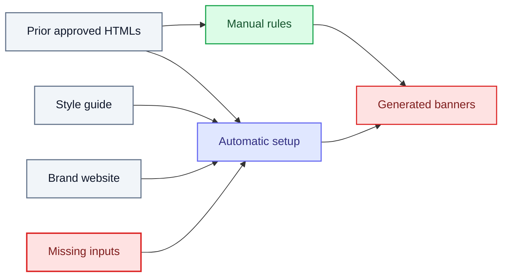

# SOL-3219: Cycle 30 banner experiment — what automatic brand setup still misses

| | |
|---|---|
| **Ticket** | [SOL-3219](https://linear.app/solsticehealth/issue/SOL-3219) |
| **Author** | @bensolstice |
| **Reviewers** | @ari / @chandhru |
| **Timebox** | Cycle 30 (already run) |
| **Status** | Done |
| **Related** | [SOL-3171](SOL-3171-mining-brand-rules-from-approved-assets.md) — different question (which mining method wins). This write-up is what current auto setup still misses vs hand-authored banner rules. |

## Question

What does automatic banner brand-rule ingestion still need to include to match the optimal manual Lisraya and Ibsrela rules?

## Why it matters

Manual banner rules produce better units. Auto setup (Ari and Chandhru's clustering pipeline) does not yet capture the same inputs. Until that gap list is written down, every brand onboarding either stays hand-authored or ships the same thin auto pattern.

## Candidates and criteria

Two arms, same generator, Lisraya and Ibsrela on [sanofi-sandbox](https://www.sanofi-sandbox.solsticehealth.co).

Success metric: a list of what automatic brand-rule ingestion still needs to include to reach the optimal manually created rules.

| Candidate | Why it is in the running |
|---|---|
| Manual brand rules | Ceiling: Lisraya and Ibsrela rules written by hand from shells, approved units, and a generate-then-select animation kit |
| Automatic brand setup (clustering) | Current production-shaped onboarding |

## Method

Generate three banners per brand per arm. Compare. Write down what the auto arm is missing and how the manual arm got those rules.

## Exit criteria

Done when the gap list and how-to-achieve notes are in this file and reviewed.

## Context view

## Deviations from the brief

None. This file is the write-up after the experiment, not a brief written before it.

## Findings

### Assets

#### Lisraya

| Arm | Assets |
|---|---|
| Manual | [1](https://www.sanofi-sandbox.solsticehealth.co/home/assets/85caaee1-0a9c-477f-b8e6-51ea675cf3c4?view=content) · [2](https://www.sanofi-sandbox.solsticehealth.co/home/assets/42b85fbc-8e82-43c0-9882-175952457e88?view=content) · [3](https://www.sanofi-sandbox.solsticehealth.co/home/assets/e401db26-d833-4b0c-94a0-b2b27c74c5d2?view=content) |
| Automatic | [1](https://www.sanofi-sandbox.solsticehealth.co/home/assets/4245c17f-f848-47d8-8af9-1dcb07f30765?view=content) · [2](https://www.sanofi-sandbox.solsticehealth.co/home/assets/38cff9be-b5f2-4765-bf9d-e6c42a4f6880?view=content) · [3](https://www.sanofi-sandbox.solsticehealth.co/home/assets/e3a19fa0-9d28-43bc-ac49-d99ea7cc0087?view=content) |

#### Ibsrela

| Arm | Assets |
|---|---|
| Manual | [1](https://www.sanofi-sandbox.solsticehealth.co/home/assets/d1dacb98-d0ff-4503-bd79-c63facf642aa?view=content) · [2](https://www.sanofi-sandbox.solsticehealth.co/home/assets/663d0e17-7e58-457f-9e02-6eb94ce91069?view=content) · [3](https://www.sanofi-sandbox.solsticehealth.co/home/assets/3717e3fa-adec-472f-9c21-e93c0a60d0f6?view=content) |
| Automatic | [1](https://www.sanofi-sandbox.solsticehealth.co/home/assets/52fd56dc-066f-4d81-ba90-58624891e6ce?view=content) · [2](https://www.sanofi-sandbox.solsticehealth.co/home/assets/97fe61e9-7191-4c87-b588-907c825d415d?view=content) · [3](https://www.sanofi-sandbox.solsticehealth.co/home/assets/299efefe-e37f-4b57-aff4-e36b47ca2602?view=content) |

### What automatic setup is missing

What current automatic brand-rule ingestion still needs to include to match the optimal manual rules.

#### ISI

- ISI **content**
- ISI **container HTML snippet per dimension**, including footer contents (logos) and links
- ISI **scroll speed**

#### Logo

- Placement and usage requirements: how big, which color to use when

#### Backgrounds

- Backgrounds, ideally including placement on a **dim-by-dim** basis

#### Animation examples

- Text entrances
- Number / statistic visualizations
- Text emphasis
- CTA behavior
- Scene transitions
- Misc. brand rules (e.g. restrictions on all text being visible at the same time)

#### Type and chrome

- Custom font / hosted placement
- Scrim (gradient overlay for text visibility) design
- Text drop-shadow design

#### Variety

The current optimal manual setup describes **when** to use things. Automatic rules end up following the same pattern over and over. Need variety explanation / encouragement so ingestion does not collapse to one formula.

### How to achieve the above

- Need prior approved HTMLs. That is where the real ISI chrome, logo placement, backgrounds, and animation live — a style guide will not have this.
- Mining the website for visualization code / animation snippets is valuable. Approved units often miss treatments the live site already has.
- Documentation on ISI container size / scroll speed is good to have and should be ingested if available. Without it the tray/rail and auto-scroll get guessed / are based on prior approved.
- We had an LLM generate a bunch of animation options (some from prior approved units, some from online research). A human then picked the best ones. That improved quality — dumping every option into the rules has limitations.

## Recommendation

Proceed. Auto brand-setup should ingest the gap list above. The how-to-achieve notes are how the manual arm got there.

A follow-up needs-plan ticket should close those gaps in the clustering pipeline. That is not this ticket. Evidence here should also feed [SOL-3171](SOL-3171-mining-brand-rules-from-approved-assets.md) (what is worth mining).

---

Spikes feed Plans: a proceed recommendation spawns a ticket with the needs-plan label, and its evidence pastes into that plan's Alternatives rejected section.
