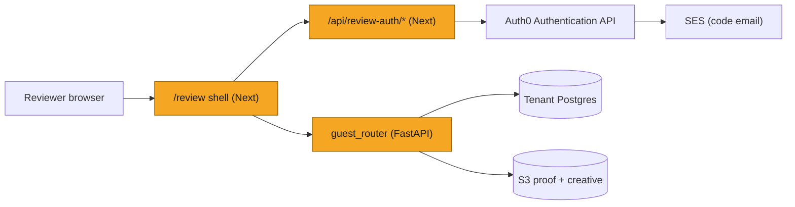
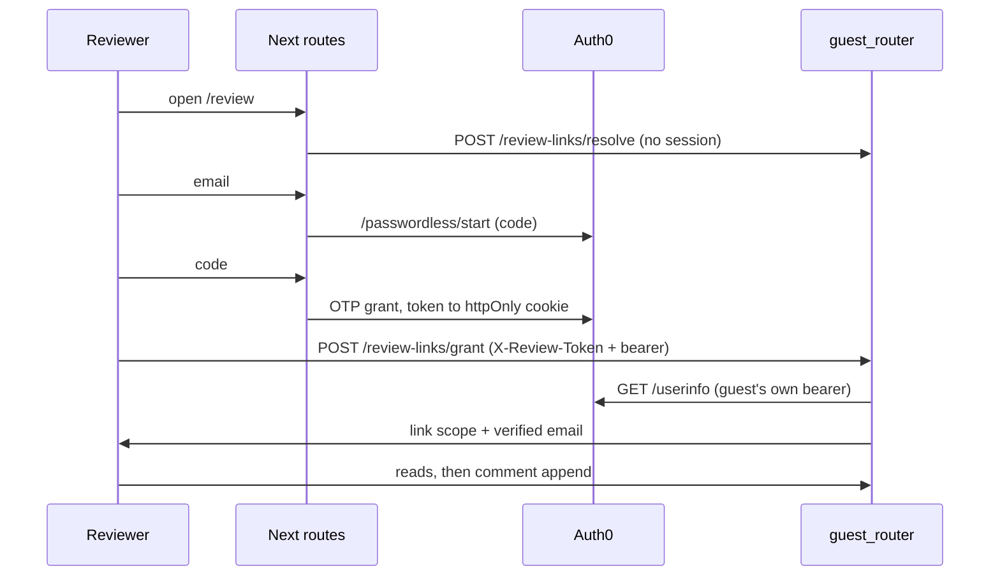
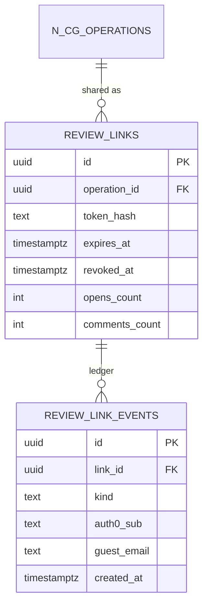
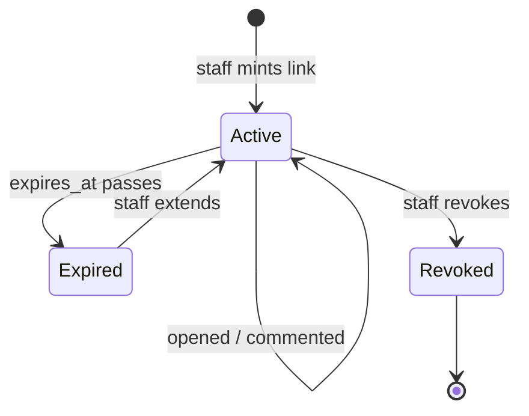
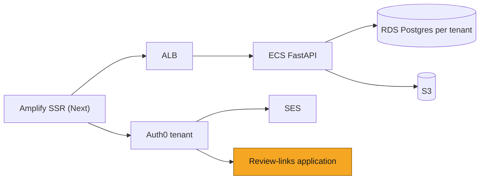

# SOL-3388: Guest review links

| | |
|---|---|
| **Ticket** | SOL-3388 (backend), SOL-3389 (frontend), both under Q3 Goal 2 |
| **Author** | @ercan |
| **Reviewers** | 2, one owning auth/tenancy |
| **Tier** | 2 |
| **Status** | Building |
| **Date** | 2026-09-08 |

> [!IMPORTANT]
> **Tier check.**
> - [x] Touches auth, tenancy, or permissions
> - [ ] Handles PHI or client data in a new way
> - [x] Schema migration on existing tables
> - [x] New external dependency, vendor, or infrastructure
> - [x] Changes a cross-service or client-facing API contract
> - [x] Hard to reverse: undoing it after ship would take more than a day, lose data, or be visible to clients

## 1. Problem

Q3 Goal 2 asks for Adobe-style commenting including a shareable link so people outside the platform can comment on a proof. Today the only way to show an asset to an outsider is the static share link, which publishes a copy of the artifact to a permanent public bucket and accepts no feedback at all. Regulatory review needs the opposite: every comment attributable to a verified person, and the sender able to withdraw access.

## 2. What exists today

- **Static publishing, not review.** `src/content_generation_new/application/share_link/share_link_service.py` copies the selected row's HTML pages or approved PDF into `solstice-public-forever` and returns a `share.solsticehealth.co` URL. Anonymous, no expiry, no revoke, read-only. Wrong foundation for commenting, kept as a secondary path.
- **Comment threads already live on the document row.** `n_cg_operation_messages.metadata->'markupAnnotations'` holds threads with `comments[]`; the PRC surface reads them through `MarkupOverlay` and `MarkupCommentsView`. There is no separate comments table to extend.
- **Customer visibility is already a solved rule.** `resolve_message_read_visibility` (`routes/api/operations_routes.py:69`) gives any non-staff reader document rows filtered to `intent = 'final'`. A guest inherits this rule rather than inventing one.
- **Auth0 v4 SDK is already the platform's identity.** One tenant (`login-solstice`), one shared application used by every tenant frontend (`/solstice/frontend/shared/AUTH0_CLIENT_ID`).
- **No role claim is available.** `Auth0JWTBearer` verifies against the Management API audience and reads `sub`; admin is a DB fact (`brand_team_members`). Nothing claim-based can be minted or trusted, so authorization cannot ride on the token.
- **The customer proof surface is prop-pure at the leaves.** `PrcTemplateView`, `MarkupOverlay`, `BriefSidebar` take plain props; the 4.2k-line view model and store provider sit above them. Reused directly; `EditorialCanvas` and `ContentEditorShell` are not.

## 3. Approach

Split who from what. **Who** is Auth0 Passwordless Email: the reviewer proves an address and gets a normal Auth0 access token. **What** is a `review_links` row: token hash, asset, expiry, revocation. Neither alone grants anything, which is what stops a forwarded link from becoming anonymous write access.

Added:

- Tables `review_links` and `review_link_events` (append-only ledger), per-tenant migration Phase 26.
- `src/content_generation_new/application/review_links/`: `tokens.py` (128-bit hex, sha256 at rest), `guest_identity.py` (reads the verified email from `/userinfo` with the guest's own bearer), `comments.py` (pure thread rules, list in, list out).
- `routes/api/review_link_routes.py`: `staff_router` (brand-gated, mounted with `router_dependencies`) and `guest_router` (mounted without them so `/resolve` answers before sign-in), authorized by the `require_review_link` dependency: `X-Review-Token` plus an Auth0 session, and the path's `link_id` must match the token's link.
- Two narrow helpers on `message_table_repository` that read and write **only** `metadata->'markupAnnotations'` under a row lock, via `jsonb_set`.
- Frontend `features/guest-review/*` plus `app/review/page.tsx`, and three Next route handlers under `app/api/review-auth/*` that drive Auth0's Authentication API directly (`/passwordless/start`, then the passwordless OTP grant) and keep the reviewer's token in an httpOnly cookie.

Deleted: nothing. The static share link stays, as its own "Create Public Link" action beside "Create Review Link".

**Changes to shared components**, which is where the blast radius sits. Each is additive and defaults to today's behavior, so the staff and customer surfaces are unchanged unless noted:

| File | Change | Affects accounts? |
|---|---|---|
| `features/content-editor/views/markup-overlay.tsx` | `drawingDisabled` prop (pins render and open, no new drag); re-post markup state when the bridge publishes `sol-prc-proof-geometry`; `focus:outline-none` on the canvas | Yes, twice, both fixes: pins now paint on first load instead of waiting for a payload change, and the stray blue focus ring is gone |
| `components/content-workspace/components/ChatPanel/markup-comments-view.tsx` | `canMutateThread` / `canReplyToThread` per-thread gates | No, permissive default |
| `components/content-workspace/components/ChatPanel/build-timeline-items.ts` | a thread from a review link reads Submitted, not Draft | Yes, and intended: staff saw reviewer comments labelled Draft |
| `features/content-editor/markup-annotations.ts` | `origin: 'review_link'` and guest-authored threads bypass the own-drafts filter | Yes, and required: without it staff never see a reviewer's comment |
| `components/intake-workflow/assets/brief-sidebar.tsx` | passes the two gates through | No |
| `components/content-workspace/markup/comment-attachments.tsx` | `MarkupAttachmentOpening` context, default enabled | No |
| `entities/operation/model/messages.ts` | `origin` union gains `'review_link'` | No |

## 4. System views

### Context: where it sits

### Flow: who calls whom, in what order

### Data: what changes shape

Comment threads keep living in `n_cg_operation_messages.metadata->'markupAnnotations'`; guest threads are stamped `origin: 'review_link'` and each comment carries `authorKind: 'guest'` plus the verified `authorEmail`.

### State: lifecycle of the entity

## 5. Trade-offs accepted

- We accept **the link being a bearer credential in the URL fragment** to get one keepable, distinguishable URL per asset for a reviewer holding several. The fragment never reaches a server, so it stays out of access logs and `Referer`. Revisit when a reviewer forwards a link to someone who should not have seen the asset, which the ledger will show.
- We accept **our own two-screen code UI instead of Auth0 Universal Login** to get zero change to how staff and customers sign in. Universal Login renders a passwordless code screen only under the tenant-wide Identifier First profile, and the tenant is shared with production. Revisit if Auth0 makes the profile per-application.
- We accept **guest reviewers becoming Auth0 users in the shared tenant**, counting toward MAU, to get a verified email with no bespoke identity store. Revisit if MAU cost outgrows the seats it replaces.
- We accept **comments live on write, with no draft-then-submit batch**, to keep the reviewer's surface to one action. Divergence from the customer rail, which drafts privately and submits a change request. Revisit if reviewers ask to stage feedback.
- We accept **published-version-only visibility** so a guest sees exactly what a customer account sees, at the cost of a reviewer never seeing work in progress they may have been told about.

## 6. Alternatives rejected

- **Tenant-wide Identifier First plus Universal Login.** Rejected: one Authentication Profile serves the whole tenant, production included, so every staff and customer login would change to satisfy a guest surface.
- **Magic link instead of a code.** Rejected: the link completes in whichever browser opens it, and hands sign-in back to the hosted page we are avoiding.
- **A `guest` role claim from an Auth0 Action.** Rejected: tokens are verified against the Management API audience and only `sub` is read, so a claim would be neither mintable nor trusted. Authorization stays a row in our database.
- **Extending the static share link.** Rejected: a public-bucket copy has no identity, no expiry and no write path.
- **Per-recipient invites, domain allowlists, view-only links.** Rejected for v1 as scope: one open comment link per asset, anyone who passes the email code can comment.
- **Doing nothing.** Rejected: the goal names the capability, and the current answer to "let my client comment" is a screenshot in an email.

## 7. Risks and rollback

- **A forwarded link.** Anyone who receives it and can pass an email code can comment. Mitigated by expiry (14 days default), revoke, and an append-only ledger recording every open, grant, denial and comment with `auth0_sub`, email, IP and user agent. Not mitigated by the token alone.
- **Tenancy.** The guest router takes `X-Tenant-Slug` like everything else and is deliberately not tenant-exempt; exempt prefixes fall back to the first warmed engine, which would be a cross-tenant read.
- **Metadata clobber.** Guests never touch `PATCH /operations/{id}/messages`, which replaces the whole metadata dict with no version check. The narrow helper writes one jsonb key under `FOR UPDATE`. Proved on a real row: proof key, intent, content and all 19 metadata keys unchanged.
- **Email delivery.** The tenant sends through SES, so the connection's From must be an SES-verified identity. The Auth0 default (`root@auth0.com`) fails every send, silently from our side.
- **Rollback** is minutes: revoke outstanding links (one UPDATE), unmount `guest_router`, hide the menu item. The tables and the ledger can stay; nothing else reads them.

## 8. Verification

- 60 backend tests across `test_review_link_routes.py` and `test_review_link_comments.py`: token shape and hashing, expiry and revocation on grant, link/token mismatch, missing header, append leaving non-comment metadata untouched, own-comment edit and delete author checks, forged identity and status fields stripped, 401 rather than 403 when there is no session, a comment aimed at a superseded version refused before `jsonb_set`, and minting refused for a PDF asset or one with nothing published.
- Live smoke against the dev tenant (`sanofi_sandbox`): mint, list, resolve without auth, grant, asset reads, thread create, reply, edit, delete, and the negative cases.
- Browser: real passwordless sign-in with an outside address, proof rendered from the bake, pin drawn in-proof, comment created and visible to staff on the same row.
- After ship, watch `review_link_events` (grants against denials), Auth0 tenant logs for send failures, and the guest routes' error rate in Datadog.

## 9. Open questions

None.

---

# Tier 2 sections

## Goals and non-goals

**Goals.** One shareable link per asset. Verified email on every comment. Staff can expire, extend and revoke. A reviewer sees exactly the proof a customer account sees.

**Non-goals.** Invite emails and named recipients. Domain allowlists. View-only links. Guest attachments in either direction, opening or uploading (follow-up). Mobile layout. Guest notifications. Review sets across assets.

**PDF assets are out of this phase and will be revisited later.** Minting refuses them rather than issuing a link that opens nothing: the guest shell renders the PRC proof, while PDF review runs on Apryse and draws exclusively from `pdfAnnotationsXfdf` (`render-approved-pdf.tsx:293` returns early without it), so a guest thread written only into `markupAnnotations` would list in the rail with no mark on the page.

Scale: PDFs are the newest published version on roughly 4 to 5% of published assets across the reachable dev tenants (8.9% raw, but one synthetic database contributes half the PDFs and one slug appears to duplicate another). Prod was not measured.

The work is small, and smaller than first estimated: mount the Apryse viewer in the guest shell and reuse the existing restore and persist effects, plus one narrow writer for `pdfAnnotationsXfdf`, needed only because guests are kept off the whole-metadata PATCH. Two concerns raised earlier did not survive checking: the Apryse licence is a public env var (`NEXT_PUBLIC_APRYSE_KEY`) already shipped to every browser, and the whole-layer XFDF overwrite is a risk client accounts already carry today through the same un-gated `savePdfMarkupState` path.

## Migration and rollout

1. Apply migration Phase 26 (`migrations/add_review_links_tables.py`), idempotent, one transaction per tenant DB.
2. Auth0: a dedicated application for review links with only the passwordless `email` connection enabled and the Passwordless OTP grant on; the connection's From set to an SES-verified address; the connection removed from the shared production application.
3. `AUTH0_REVIEW_CLIENT_ID` and `AUTH0_REVIEW_CLIENT_SECRET` into SSM alongside the existing Auth0 parameters.
4. Add `X-Review-Token` to `CORS_ALLOW_HEADERS`; the list is explicit even where origins are `*`, and without it every guest read fails preflight as `TypeError: Failed to fetch`.
5. Backend first, then the frontend ticket. Behind `guest_review_links` per brand.
6. Backout: revoke links, unmount the router, hide the menu item. No data moves.

## Security and compliance

- **Tenant isolation.** `X-Tenant-Slug` mandatory, route not tenant-exempt, every query scoped by `operation_id` within the tenant DB.
- **Token at rest.** 128-bit hex, sha256 stored, plaintext returned exactly once at creation; a partial unique index keeps live hashes unique; shape is checked before any query so a malformed token never reaches the table.
- **Identity.** The verified address comes from `/userinfo` called with the guest's own bearer, and `email_verified` is required. No machine-to-machine client, no Management API lookup by subject.
- **Least privilege.** Guests reach one router; every existing operation route already 403s a guest JWT because `resolve_actor` finds no `users` row. No `users` row is ever auto-provisioned.
- **Audit.** `review_link_events` is append-only by construction (no soft-delete mixin) and kept indefinitely.
- **New processor surface.** Auth0 sends the code email through the tenant's SES configuration; no new vendor.

## Phasing and estimates

- **Phase 1, done:** tables, guest router, comment rules, the `/review` shell with proof, comments, version dropdown, and email-code sign-in. Demoable.
- **Phase 2, ~1 day:** staff Share dialog with copy, expiry, extend and revoke, replacing the hand-driven endpoints.
- **Phase 3, ~1 day:** guest attachments. Presign first, scoped to keys this asset's comments reference, so a reviewer can open what staff attached; then uploads, reusing the staff storage helper.
- **Phase 4, ~0.5 day:** staff notification polish and the affordance gating in question 2.

## Deploy view

## Pre-mortem

Three months later this failed because a link was forwarded past the intended reviewer and nobody noticed: the ledger recorded every grant, and no one ever read it. The second most likely reason is delivery, silently: the code emails stop arriving after an Auth0 or SES change, reviewers report "the link is broken", and because our side returns 200 on send, we look at the wrong half of the system.

## Decision log

| Date | Decision | Options considered | Why | Who | Status |
|---|---|---|---|---|---|
| 2026-09-08 | Identity is Auth0 Passwordless Email; authorization is a `review_links` row | Role claim via Action, signed link only, per-recipient invites | Claims are neither mintable nor trusted here; a token alone must never grant write access | Ercan | Decided |
| 2026-09-08 | Token stays in the URL fragment, not stripped into session storage | Fragment, sessionStorage, query param | A reviewer with several assets needs one keepable URL each; the fragment never reaches a server | Ercan | Decided |
| 2026-09-08 | Our own email-code screens instead of Universal Login | Identifier First tenant-wide, second Auth0 app plus Identifier First, custom UI | The profile is tenant-wide on a tenant shared with production | Ercan | Decided |
| 2026-09-08 | No draft-then-submit batch for guests | Match the customer batch flow, live on write | Reviewer feedback should not wait behind a second action | Ercan | Decided |
| 2026-09-08 | Guests see published versions only, matching a customer account | Latest published, latest of any intent | Same rule `resolve_message_read_visibility` already applies to non-staff readers | Ercan | Decided |
| 2026-09-08 | Version badges stay relative to what a guest can see | Relative, absolute like staff | The customer surface already numbers relative; matching staff would diverge from customers | Ercan | Decided |
| 2026-09-08 | Earlier published versions are read-only for guests | Read-only, comment on any version | A comment should reference what the reviewer saw; a V1 pin over V2 copy misstates the record | Ercan | Decided |
| 2026-09-08 | Guests do not resolve or reopen threads | Match the account surface, staff-only | Closing a thread is a review decision, not a reviewer's | Ercan | Decided |
| 2026-09-08 | The public link stays, as a separate action | Replace it with the review link, keep both | Different promise to the recipient: a copy anyone can open versus an attributed commenting surface | Ercan | Decided |
| 2026-09-08 | Guest edit and delete act on the caller's own comment, and the rail only offers controls the API accepts | Thread-level controls with server-side refusal, per-comment gating | `comments[0]` is the reviewer's comment only when they opened the thread, so the control both errored and hid their own reply | Claude, confirmed by Ercan | Decided |
| 2026-09-08 | PDF assets refused at mint, support implemented later | Refuse, ship rail-only comments, merge XFDF server-side | Apryse draws only from the XFDF blob, so a rail-only thread leaves no mark; refusing keeps staff from sharing a link that opens nothing | Ercan | Decided, follow-up ticket |
| 2026-09-08 | Guest attachments are a follow-up, and opening is disabled meanwhile | Build the presign now, disable opening, leave the broken click | The click resolved through a staff-only endpoint on an axios instance that navigates to login on 401, so it ejected the reviewer mid-review | Ercan | Decided, follow-up ticket |
| 2026-09-08 | Staff and customer rails keep load-time comment reads | Focus refetch like the guest shell, no change | The messages query also feeds the editor, so a focus refetch would remount the proof mid-edit; the guest-comment notification already tells staff | Claude, confirmed by Ercan | Decided |

## Sign-off

| Reviewer | Verdict | Date | Note |
|---|---|---|---|
| @ | Approve / Blocked | | |
| @ | Approve / Blocked | | |

> [!TIP]
> **When this ships**
> - [ ] Durable decisions distilled into `CLAUDE.md` / `AGENTS.md`
> - [ ] Living architecture map updated
> - [ ] Status set to Shipped; file frozen as a point-in-time record
