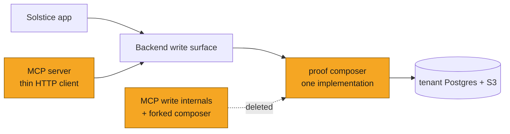
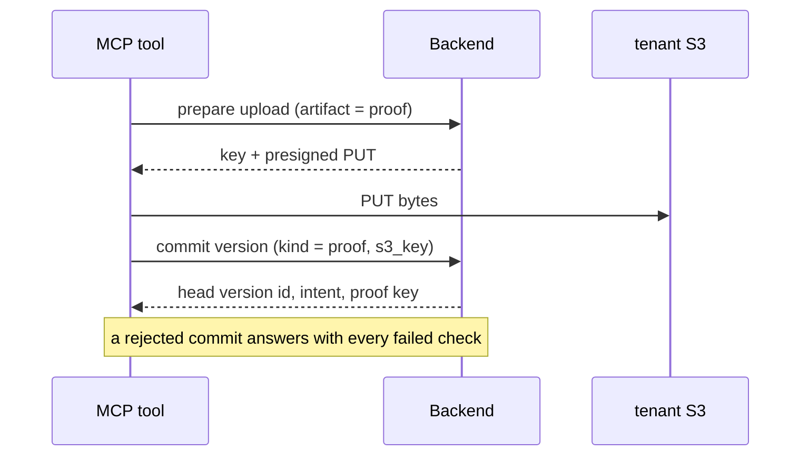
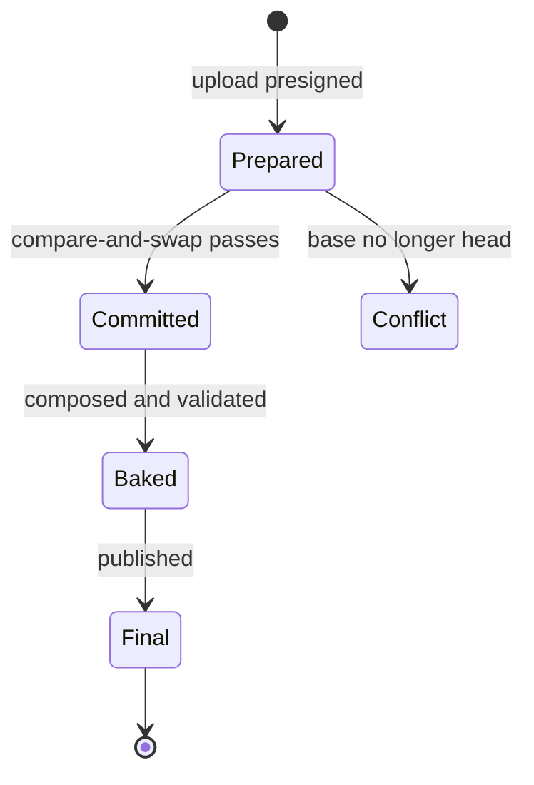
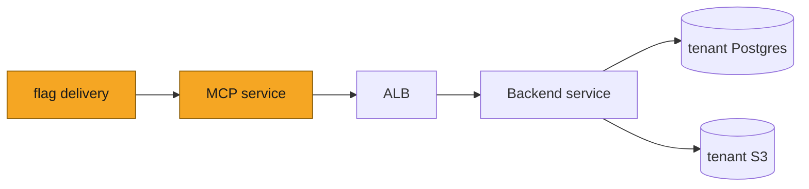

# SOL-3438: Unify PRC write flows in backend

| | |
|---|---|
| **Ticket** | SOL-3438 |
| **Author** | @gifan |
| **Reviewers** | @alex (domain owner), TBD |
| **Tier** | 2 |
| **Status** | Draft |
| **Date** | 2026-09-16 |

> [!IMPORTANT]
> **Tier check.**
> - [x] Touches auth, tenancy, or permissions — machine callers gain a delegated-identity path
> - [ ] Handles PHI or client data in a new way
> - [ ] Schema migration on existing tables
> - [x] New external dependency — feature-flag client in the MCP server
> - [x] Changes a cross-service or client-facing API contract
> - [x] Hard to reverse: agent writes move onto a different validator, and documents committed under the looser one persist

## 1. Problem

Building a PRC proof — binding a creative to its template and checking the result against the Contract v2 rules — is implemented twice. The backend does it for the Solstice app; the MCP server does it again for agents, writing tenant Postgres and S3 directly without ever calling the backend.

Every change therefore has to be made in both places, and when one is missed the copies disagree silently. That is the root cause of the incidents patched last cycle: the fix closed the behavioral gap by copying the flow into the MCP rather than removing the duplication.

Two related problems surfaced while planning the work, and are in scope here:

- **Agents cannot check their work.** There is no way to validate a proof or a template before committing it, and a rejection names no specific failure. Templates published to the library are not validated at all, at any point.
- **The contract itself is not single-source.** It is enforced in four places and described by two documents that contradict each other.

## 2. What exists today

**The backend already owns a clean v2 write path.** [PR #1305](https://github.com/Solstice-Health/Backend-Server/pull/1305) (SOL-3356) merges before this work begins and lands a layered, single write route for operation versions: a transport-only router, an `OperationVersionService` holding intent derivation, the operation lock, compare-and-swap and metadata carry-forward, and an `OperationMessageRepository` holding row and operation-scoped S3 primitives. Commits are discriminated — a *content* commit supplies the creative and the server composes the proof; a *proof* commit supplies the proof and it is stored as authored. Either artifact may be sent inline or as an S3 key. Errors are typed with stable codes.

That PR also moves the proof composer into `src_v2` as a dependency-free module shared by the operations and agents domains, and adds a validation gate on agent terminal ingest.

**The Solstice app is already migrated.** Its paired frontend PR folds five save layers into one commit hook and posts content and proof commits to the same v2 route, with accept sending no body. The app is therefore already a well-behaved client of the shared write path.

**The MCP server is not.** Its write tools still presign, compose and insert on their own, through a forked copy of the composer. That fork is the one remaining duplicate write path.

**But the app still validates the contract in the browser**, with its own implementation, so it can show a live proof-contract badge. That is the remaining divergence between the two clients: they write the same way and judge validity differently.

**The two composers have diverged materially** — roughly twenty behavioral differences. The fork is the stricter of the two, so deleting it loosens what agent writes are held to. The shape of that, for the record:

| | Count | Character |
|---|---|---|
| Checks only the MCP has | ~10 | Annotation normalization, stylesheet integrity, cover-page structure, email cover fields, banner payload, font resolution. The MCP is the stricter implementation. |
| Checks only the backend has | ~4 | A distinct stale-proof error class, a reserved key prefix, an idempotence guard, a typed resolution error. |
| Same check, different strictness | ~5 | Chiefly page-structure nesting, where each implementation is strict in one validator and loose in the other. |

The audit is not a migration spec any more — nothing is being ported. It is here to say what is given up: the checks in the first row stop being applied to agent writes. Worth regenerating once before the cutover to see whether anything in that row has become load-bearing.

**The contract is enforced four times and documented twice.** The backend, the MCP, the browser app and the AI harness each decide independently whether a document is valid. Two rules documents describe the contract, and they contradict each other on at least two points — one names a profile the software rejects outright, and the two disagree on whether a bake marker is required or legacy. An agent can follow its own instructions and be refused by definition. The harness's checker is advisory by policy; the other three are authoritative. All four are independent code.

**Where validation happens today.** On a content or proof commit, and on agent ingest. Nowhere else: a library template publish checks only that the HTML is non-empty, so a shell that can never bake enters the catalog and fails later on somebody else's asset.

## 3. Approach

The MCP stops writing and becomes an HTTP client. Everything it does today is expressed through backend endpoints, most of which already exist.

Four pieces of work, none of which changes what the backend considers valid:

1. **Take the backend's validator as the definition** and delete the MCP fork. The backend's behavior is not changed to match the MCP's; where the fork was stricter, that strictness is dropped.
2. **Add the two endpoints the MCP needs that do not yet exist** — a presigned upload, and the authoring rules its own image ships today — and make the writes that already validate say what was wrong.
3. **Let machine callers act on behalf of a user**, so the MCP can call routes that derive authority from identity.
4. **Cut the MCP over behind a flag**, then delete its write internals.

### Endpoints

| Endpoint | Status | Purpose |
|---|---|---|
| `POST /operations/{id}/versions` | **Extended** | The one version write. Already validates before storing; now reports every failed condition instead of the first, so a rejected commit is how a caller learns what to fix. |
| `POST /operations/{id}/versions/prepare` | **New** | Returns a presigned upload and the operation-scoped key it will occupy, for either artifact — `creative` or `proof`. Mirrors the commit discriminator, so whatever you prepare you reference in the matching commit field. Exists because a supplied key becomes the row's permanent key, so callers must not invent them. |
| `POST /prc-template-versions` | **Extended** | Gains enforcement — a template that cannot bake is rejected rather than published — and reports every failed condition. Request shape unchanged. |
| `GET /prc-template-rules` | **New** | Serves the Contract v2 authoring rules for one profile, parsed per call from the contract document that moves into the backend with this work. Replaces the copy the MCP ships in its own image. Read-only. |
| `POST /messages/{id}/publish` | **Extended** | Gains two options, both defaulting to today's behavior: suppress reviewer notifications, and resolve the operation's pending change requests. Agent approvals set both; the app sets neither. |

The MCP's template publish becomes two calls it already assembles into one response: a library publish, and a proof commit for the operation bake.

**There are no standalone validation endpoints.** An earlier draft added two, and they turned out to answer a question the writes already answer. Both writes validate before storing anything and then discarded the detail, raising on the first failed condition. Reporting all of them makes a rejected write the pre-flight, and attempting one is cheap: a rejected template publish writes nothing and needs no upload, and a rejected commit writes nothing either — its only cost is an S3 object the caller already uploaded.

The one caller a write cannot serve is the AI harness, which asks mid-turn while the agent is still editing and whose own save is terminal. That is deferred with the rest of the harness work; see below.

### Services

One addition to `src_v2/operations/services`, following the layering #1305 established — routers carry no logic, services hold it, repositories move rows and bytes.

**`OperationVersionService`** — extended, not replaced:

- `prepare_upload(operation_id, artifact, actor)` → the presigned upload and its key. Prepare belongs to the version-write lifecycle, so it lives with the commit rather than in a service of its own.
- Its commit path keeps the failures the validator reports rather than the first one, so a rejected commit tells a caller what to fix.
- Open: whether this service also learns to commit PDF versions and design source files. It writes HTML versions only today, and the MCP writes all three.

No validation service. An earlier draft had one, reached by two transports; folding the report into the writes removed every caller it had.

### Repository

**`OperationMessageRepository`** — extended with the upload primitives that belong beside its existing key-scoping and read/store methods:

- `presign_upload(operation_id, artifact, row_id)` → the key and a presigned PUT, minted with the same prefix vocabulary the store methods already use.
- `scoped_proof_key(operation_id, key)` — the proof-side counterpart to the creative key scoping that already exists, so both artifacts validate the same way.

Nothing about key construction is restated here — a second place that knows how keys are built is a second place to get them wrong.

No new repository class. No schema change.

### The validator

The backend's validator is the definition. Nothing is ported into it and nothing is taken out — the fork is simply deleted, and every client asks the backend instead.

One addition, which adds no check and removes none: a **reporting entry point** over the conditions already there. Several independent conditions currently collapse into a single message, which a caller trying to repair a document cannot act on. The reporting form returns each failed condition with a stable identifier and a repair hint; the raising form is implemented over it and keeps its existing messages, so no current caller sees a change.

This is what the two writes report on rejection, and with no standalone validation endpoint it is the only way a caller learns what is wrong. A failure that does not reach the error body is the feature silently missing, so it is asserted at the route rather than at the service.

Identifiers reuse the Solstice app's existing contract-layer vocabulary, extended for the bake stage, so an agent repairing a proof, a user reading the proof badge and the rejection metric all name a defect the same way. Each also names the authoring rule it enforces — see below.

### The rules document

The contract is *described* to agents by a document the MCP ships in its own image, and *enforced* by code in the backend. They change together and deploy separately — the same class of problem as the forked composer, with no mechanism that notices when the two disagree. An agent can follow the document it was handed and be refused by the code.

Two moves, both in the backend PR:

- **The document moves next to the validator** and is served by a read-only endpoint, parsed per call exactly as the MCP parses it today. The MCP's tool becomes an HTTP call and its copy is deleted, so a contract change is one PR in one repo rather than two deploys that cannot be made atomic.
- **Every check names the rule it enforces.** The rejection report already carries a layer identifier; it gains the rule identifier alongside it, so a caller repairing a document can fetch the rule text it violated instead of reading ninety-odd bullets to guess which one applies.

Neither artifact is generated from the other. They answer different questions — one is written for an author, the other decides — and the document is an order of magnitude larger than the enforceable subset: 92 rules across five profile scopes against nine check identifiers. What binds them is a pair of assertions: every check the validator emits names a rule that exists, and every rule marked machine-enforced has a check that emits it. Drift becomes a test failure rather than a contradiction an agent discovers at commit time.

The document gains one field per rule for that marking — enforced by the backend, enforced in the app's engine, or advisory — which the endpoint returns. An agent currently cannot tell which of the rules it is taught will actually refuse its document.

The third description, the engineering-spec covering the same contract, is demoted to a pointer in the same change. Consolidating from three places into two is not consolidating.

The implementation brief is [SOL-3438-followup-rules-consolidation.md](SOL-3438-followup-rules-consolidation.md).

### Solstice app

Unchanged. It already commits through the shared route, and its in-browser contract checker stays: a check that runs continuously against in-editor state cannot move to an endpoint when a proof is tens of megabytes. Two designs would resolve it — stripping creative bodies before sending, or binding the badge to the last committed version — and both are follow-up work, not this ticket.

### AI harness

**Deferred.** The harness keeps its own regex judgement for now.

It is the one caller a write cannot serve: it asks mid-turn while the agent is still editing, and its own save parks a proposal at turn end, which is terminal rather than retryable. Learning at save time means the turn fails in front of a user. So it genuinely needs to ask without writing, through the callback plane it already posts events to.

Out of scope here because this ticket is about the MCP/backend duplication, and because the backend already validates harness output authoritatively at ingest — deferring costs the agent earlier feedback, not correctness.

### MCP server

- A feature-flag client mirroring the backend's, with an environment override as a kill switch.
- A thin HTTP client for the write endpoints, reusing the machine-token cache the memory client already has.
- The rules tool keeps its name, arguments and payload and reads from the backend instead of a file in the image.
- No validation tool. The writes report their own failures, and for a large proof the agent must upload before it can validate anyway, so checking first saves nothing over committing and reading the report.
- All existing tool names, arguments and response shapes unchanged.
- HTML commits route through the backend. PDF versions and source-file pointers keep their current direct-write path — the tools are unchanged either way, so the split is invisible to callers.

## 4. System views

### Context: where it sits

### Flow: an agent saves an edited proof

### Data: what changes shape

*N/A — no schema migration and no new storage layout. Existing tables and key prefixes are unchanged, so rows written by either path stay valid throughout the cutover.*

### State: lifecycle of a version

## 5. Trade-offs accepted

- We accept **losing the checks the MCP fork has and the backend does not** — among them annotation normalization, stylesheet integrity, cover-page structure, email cover fields, and font resolution. Documents the MCP rejects today will be accepted after cutover. The exchange is a far smaller, far safer change: no behavior moves for any existing caller, and the riskiest work in the original plan disappears. Revisit per check if a regression actually surfaces in practice.
- We accept **a single global flag** for the cutover rather than one per flow, for a simpler rollout surface. Canary granularity becomes per tenant rather than per tool. Revisit if a canary shows one flow failing in isolation.
- We accept **a machine credential that can act as any user in a tenant**, to avoid gating this work on an identity-platform change. It is a strict reduction from today, where the MCP holds direct database and storage credentials with no backend mediation. It holds while four conditions do: the actor is derived only from a verified end-user token and never from tool input or model output; the credential is narrowly scoped and reused for nothing else; resolution stays credential-first and rejects a stray actor header; and every write audits both actor and machine client. Revisit when the MCP serves agent clients we do not operate.
- We accept **suppressing reviewer notifications on agent-driven approvals**, preserving today's behavior, rather than coupling this work to a product decision. Revisit once the notification semantics are settled.
- We accept **the Solstice app and the AI harness keeping their own contract checkers**, so the contract is still judged in three places when this ships. Revisit each on its own terms — the app needs a different shape of check, the harness needs an endpoint this ticket defers.
- We accept **a network dependency on a tool that has none today**. The rules tool currently reads a file in the MCP's own image and cannot fail; served from the backend it can, and a backend outage blocks authoring rather than degrading it. Bounded by the same flag, and by caching the last good payload if the canary shows it mattering.
- We accept **that a rejected write is the only way a caller learns what is wrong**, having removed the standalone validation endpoints. That makes the report load-bearing: a failure that does not reach the error body is the feature silently missing, and nothing fails loudly. Covered by asserting it at the route rather than at the service.

## 6. Alternatives rejected

- **Keep both implementations and add a test that diffs them.** Detects drift without removing its cause; every contract change still costs two implementations.
- **Reduce the MCP to the existing inline write route.** Its presigned two-step shape is the right one for agent-authored documents; the fix is to promote it, not discard it.
- **Delegated identity tokens.** The principled answer — identity in the token, nothing forgeable, per-user and expiring. Deferred because it gates the work on identity-platform support we have not confirmed, and the accepted trade-off is already an improvement on today. This is the documented upgrade path.
- **A separate internal router for machine callers.** Duplicates route definitions to buy a guarantee that a router-level dependency and a route-walk test already provide.
- **A signed actor assertion instead of a header.** Stronger — forgery becomes impossible rather than rejected — at the cost of a shared key to distribute and rotate. Deferred as the hardening step if an audit asks for it.
- **Doing nothing.** This was the real alternative, and it is what produced the incidents. The cost recurs on every contract change.

## 7. Risks and rollback

**The cutover is now where the risk sits, not the validator.** Nothing changes for the Solstice app or for existing backend callers: the validator is untouched, so app saves, banner ingest and duplication behave exactly as they do today. What changes is the verdict agent writes receive.

**Agent documents will be judged more loosely than they are now.** The MCP fork rejects things the backend accepts, so a proof that fails today may commit after cutover. That is the accepted trade-off above, and the flag is what bounds it — a tenant at a time, reversible without a deploy.

**Losing annotation normalization is the least visible of these.** The fork rewrites recognized legacy annotation chrome during composition; the backend does not. After cutover an agent-supplied proof carrying such chrome is stored as authored rather than cleaned. Nothing raises, so this is the one to watch in the rejection and rendering metrics rather than in tests.

**Porting nothing means one class of bug disappears entirely.** The original plan's largest risk — reproducing structural checks against a different HTML parser, where a subtle miss passes documents that should fail — does not exist in this shape.

**We build on #1305 without owning it.** It merges before we start, so there is no schedule risk, but our commit path, our validator and our identity work all extend its code. Nothing here forks it, so a reshape is a merge conflict rather than a rewrite.

**A direct-write path survives for PDF and source.** It composes nothing, so it cannot drift on proof logic, but it keeps its own metadata shaping, compare-and-swap and intent derivation. A smaller version of the same class of problem, deliberately left in place.

**Tenancy.** Unchanged. Tenant resolution, actor revalidation against the tenant database, and server-derived intent all follow the pattern already in production for agent memory. No new PHI path; no new data processor.

**Rollback.** Turning the flag off returns the MCP to its local path within a propagation window, with no deploy. Rows written through the backend stay valid because the stored shapes are already mirrored. The reporting entry point adds no behavior to roll back.

## 8. Verification

- **A cutover diagnostic**, not a gate: run a corpus of real templates through both validators once, to list which documents change verdict when agents move onto the backend's. It informs the canary order; it does not block the merge, because no backend behavior is changing.
- **A catalog sweep** before enforcing template validation, since nothing validates library templates today and there is no production baseline. Without it the first enforcement rejects shells that have been in the library for months. This one is a gate — it is the only place this plan adds a rejection to an existing path.
- **Rejection reports, asserted at the route.** A commit and a template publish that reject must answer with every failed check, each carrying its identifier and hint — through the HTTP layer, not the service. This is the load-bearing test: with no standalone validation endpoint, a report that does not reach the error body is the feature silently missing. It is also the exact class of bug that shipped once here, where the service returned dataclasses and the envelope declared models, so every call that *found* something returned a 500 while the clean path passed.
- **Rule join, asserted both ways.** Every check the validator emits names a rule that exists in the document, and every rule marked machine-enforced has a check that emits it. This is the whole mechanism by which the two stop drifting; without it the move is a relocation, not a consolidation.
- **Rules parity across the move**: the endpoint's payload for each of the four profiles must be byte-identical to what the MCP's local parse returns today.
- **Report parity**: the raising and reporting forms must agree on pass and fail for every fixture, and the raising form's messages must be byte-identical to today's. This is what makes the reporting entry point a refactor rather than a change.
- **Identity truth table**, one case per branch, including the case that must be refused rather than silently ignored — plus a route-walk test.
- **Error mapping**, one case per row, asserting the exact strings the tool descriptions name.
- **Metrics**: per-flow counters tagged by path and outcome, and a rejection counter tagged by check identifier so a newly firing check is attributable.

## 9. Open questions

*All four are settled. Recorded here with their consequences; the decision log carries the one-line versions.*

**PDF versions and design source files stay on the existing path.** The shared write handles HTML only, and extending it is out of scope. The consequence is worth stating plainly: the MCP becomes a thin HTTP client *for HTML*, and remains a direct writer for PDF versions and source-file pointers. Those paths keep their own metadata shaping, compare-and-swap and intent derivation, so drift remains possible there — just not in the proof-building logic this ticket is about. The forked composer is still fully deletable, since neither path composes a proof.

**The question of flagging the validator consolidation is moot** — there is no consolidation. The backend's validator is unchanged, so nothing needs gating there. The cutover flag still gates the only behavior change, which is which validator agent writes meet.

**Publish does not resolve pending change requests — confirmed.** The backend's publish route sets the version final and runs its QC gate; request resolution lives on a separate admin notification path. The MCP's approve does both today, so routing it straight at publish would silently stop closing requests and leave assets locked for non-admin viewers.

The fix mirrors the notification decision exactly: an explicit option on publish, defaulting to today's behavior so the app is unaffected, which the MCP sets. One route, two callers, no hidden difference.

**A library publish inherits its current shape.** It enforces structure — a shell that cannot satisfy the contract is rejected rather than published — but it does not dry-compose at publish time. Its refusal reports every structural condition the shell failed, with the bake-stage checks dropped: a shell's slots are empty and it carries no baked payload until something bakes it, so reporting those would send the author chasing what a template cannot satisfy.

---

# Tier 2 sections

## Goals and non-goals

**Goals.** One implementation of the judgement the MCP trusts — the backend's, as it stands. One source for the rules that judgement is described by, owned in the same repo and joined to the checks by test. The MCP as a thin client for HTML writes, with its tool surface unchanged, and its forked composer deleted. A write that rejects a document says what is wrong with it, so an agent can repair without a separate pre-flight.

**Non-goals.** Changing what the backend considers valid. Checks the MCP fork has and the backend does not are dropped at cutover rather than ported, and fixing any regression that surfaces is separate work. PDF versions and design source files keep their existing write path, so the MCP remains a direct writer for those two kinds. The Solstice app keeps its client-side bake — it composes locally for preview and sends the result. No schema migration. No change to notification semantics beyond preserving today's silence on agent approvals. Rewriting any rule's text, or changing what the rules say — the document moves and is marked up, not authored.

**This takes the contract from four judging implementations to three.** Only the MCP's fork is deleted.

The Solstice app keeps its checker: it runs continuously against in-editor state, and a proof is tens of megabytes, so routing it through an endpoint is not a latency trade-off — it is not viable. Two designs would resolve it, stripping creative bodies before sending or binding the badge to the last committed version, and both are follow-up work.

The AI harness keeps its regex judgement until its own change lands. It is the one caller a write cannot serve — it asks mid-turn and its own save is terminal — so its need is real, and deferred rather than dismissed.

## Migration and rollout

A single flag gates the MCP cutover, read through the MCP's flag client, targeted by tenant and brand, with an environment override as a kill switch and a code default of off.

No data moves, no backfill, no schema change. Existing stored objects stay valid because key shapes do not change.

Ordering is strict: every backend endpoint lands dark, then every MCP path lands dark, then the flag opens per tenant, then the fork is deleted, then the flag branches are removed.

The validation tool ships unflagged and ahead of the cutover — it is new surface with no legacy behavior, so agents are already self-correcting when the flag opens.

One accepted corner case: a prepare and its commit can straddle a flag flip. Not mitigated.

## Security and compliance

A narrowly scoped machine credential with a dedicated audience, pinned in code the way the existing agent-memory credential is.

Identity resolution is one dependency applied at router inclusion, so a new route cannot forget it. It reads the actor header only on the machine branch; a user bearer carrying that header is refused outright rather than having it ignored. Handlers receive a resolved actor and never branch on credential type.

The actor is derived MCP-side from the verified end-user token, never from a tool argument and never from model output. That is what prevents prompt injection from choosing an actor, and it needs to be a tested invariant rather than a convention. The backend revalidates it against the tenant database on every call; it is a selector, not a credential.

Accepted exposure and its four conditions are in Trade-offs. Every write audits actor and machine client, so impersonation is detectable even though the pattern cannot prevent it.

Tenant isolation is unchanged and is not duplicated into request bodies.

## Phasing and estimates

Four reviewable PRs. Nothing changes behavior for an existing caller until the cutover flag opens.

**PR 1 — Upload endpoint, self-reporting writes, the rules document, machine-caller identity (Backend, ~1.5 weeks).**
`versions/prepare`, publish-time template enforcement, the two publish options, and the identity extension with its truth-table and route-walk tests.

Also brings the contract document into the repo and serves it from `prc-template-rules`, stamps every validator check with the authoring rule it enforces, marks each rule as backend-enforced, engine-enforced or advisory, and adds the two join assertions. This rides here rather than in a later PR because the checks and the rules they name have to land together — stamping a check with a rule ID is meaningless until the document is in the same repo to be asserted against.

Includes the one piece of validator work this plan retains: a **reporting entry point over the existing checks**. The backend's validator collapses several independent conditions into one message, which a caller trying to repair a document cannot act on. The reporting form returns each failed condition with a stable identifier; the raising form is implemented over it and keeps its current messages, so no existing caller sees a change. This is a refactor, not a consolidation — it adds no check and removes none.

The version commit and the template publish then **carry that report on rejection** instead of the first failed condition. Those two writes already validate; reporting properly is what removes the need for a separate validation endpoint.

Otherwise additive. Nothing calls the new endpoint yet, so it merges with no blast radius, and it unblocks PR 2.

**PR 2 — MCP client and cutover (MCP, ~1 week).**
Flag client, HTTP client, every write tool routed through the backend behind the flag. The rules tool points at the new endpoint and its bundled copy of the contract document is deleted, which is what makes PR 1's move a consolidation rather than a second copy. The flag defaults off, so the merge is inert. No validation tool: the writes report their own failures, and for a large proof the agent must upload before it could validate anyway, so checking first saves nothing over committing and reading the report.

The cutover itself is a flag change per tenant, not a deploy.

**PR 3 — Verdict from the server (AI harness) — deferred.**
The proof-inspection tool would return the backend's report instead of its own regex judgement, over a validation route on the agent callback plane. The harness is the one caller a write cannot serve: it asks mid-turn, and its own save parks a proposal at turn end, which is terminal rather than retryable.

Out of this ticket's scope — the subject is MCP/backend duplication, and the backend already validates harness output authoritatively at ingest, so deferring costs the agent earlier feedback rather than correctness. The work exists on `gifan/SOL-3438-harness-proof-verdict` if it is picked up.

The Solstice app was also in this phase and is out for a different reason: its check is continuous and in-editor, which no endpoint suits at this document size. See Goals.

**PR 4 — delete the fork (MCP, ~1 week).**
Blocked until the flag has been fully open through a soak: everything it removes is still the off-branch until then, which is why it is not bundled into PR 2.

Verified reachable scope, as of PR 2: the forked composer has exactly two remaining callers — the operation bake and the version commit — and the tools route around both when the flag is on. So the deletion is mechanically possible, not merely assumed.

Not a pure deletion, though, which the earlier estimate had wrong in two ways. The local write path also serves PDF versions and design source files, which stay, so the HTML branches come out from around them rather than the file going whole. And roughly 70 test call sites exercise the local HTML path; most are deleted with the code they cover, since the behaviour moved to the backend and is covered there, but each needs checking against the PDF and source cases that remain. The flag module, its settings and its dependency come out at the same time.

Sequencing constraints, in full: PR 1 before PRs 2 and 3; PR 2 fully rolled out before PR 4. PRs 2 and 3 are independent of each other.

## Deploy view

The MCP already runs the agent sidecar its flag client needs; the client library is the new dependency.

## Pre-mortem

*It is three months later and this failed.* The most likely reason: one of the checks the MCP fork had and the backend does not turned out to be load-bearing. Agent-authored proofs that used to be rejected now commit, nothing raises, and the defect surfaces as a rendering complaint or a PRC review finding weeks later — with nothing linking it back to the cutover.

Second most likely: the validation tool's verdict drifts from what a commit actually enforces, so agents self-correct against the wrong rules and grow confident in documents the write path will refuse. The predictiveness tests exist for exactly this and are the ones to keep honest.

## Decision log

| Date | Decision | Options considered | Why | Status |
|---|---|---|---|---|
| 09-14 | Backend owns all PRC writes; MCP becomes a thin client | Keep both plus a diff test; reduce MCP to the inline route | Removes the cause of drift rather than detecting it | Decided |
| 09-14 | Machine callers authenticate as a service and name the user in a revalidated envelope | Forward the user's bearer; delegated tokens | Established in-repo pattern; keeps role out of caller control | Decided |
| 09-14 | New endpoints live in `src_v2` | Extend legacy routes | Matches the existing strangler pattern | Decided |
| 09-14 | One global cutover flag | Per-flow flags | Simpler rollout; canary per tenant instead | Decided |
| 09-14 | MCP takes a flag-client dependency | Backend-served flag endpoint; environment variable only | Same interface as the backend; sidecar already present | Decided |
| 09-14 | Agent approvals suppress reviewer notifications | Fire them; decide now | Preserves today's behavior; product decision deferred | Decided |
| 09-14 | ~~Business logic is the union, stricter implementation winning~~ | | | **Superseded** 09-16 — the backend's validator is the definition |
| 09-14 | ~~Keep the backend's HTML parser~~ | | | **Superseded** 09-16 — moot once nothing is ported |
| 09-15 | Actor travels as a header, resolved by one dependency | A body field; a separate internal router | Absent from request models and handler signatures; one place to validate | Decided |
| 09-15 | The impersonation exposure is accepted, bounded by four conditions | Delegated tokens now; signed assertions now | Strict reduction from today's direct credentials | Decided |
| 09-16 | ~~Add validation endpoints and one new tool~~ | | | **Superseded** 09-17 — the rejected write carries the report instead |
| 09-16 | The validator gains report mode with stable check identifiers | Keep the single collapsed message | Eight conditions in one message cannot drive repair | Decided |
| 09-16 | Template publishes are validated and enforced | Leave them unchecked | Nothing checked templates today; a broken shell fails later on someone else's asset | Decided |
| 09-16 | Consume #1305's version write; add no commit route | Build our own | It already carries CAS, intent and carry-forward | Decided |
| 09-16 | One artifact-parameterised prepare route | One route per artifact | Same mechanism, differing only by prefix; mirrors the commit discriminator | Decided |
| 09-16 | The backend's validator is taken as the definition; nothing is ported from the fork | Union of both implementations; port the stricter checks | Removes the only PR that changed behavior for existing callers, and with it the parser-port risk. Checks the fork has are dropped; fixing any regression is separate work | Decided |
| 09-16 | The validator gains a reporting entry point but no new checks | Leave the collapsed message; consolidate while in there | Callers repairing a document need per-condition failures; keeping it a pure refactor keeps the change safe | Decided |
| 09-16 | ~~Every client takes its verdict from the backend~~ | | | **Superseded** 09-17 — the app cannot at this document size, and the harness is deferred |
| 09-16 | ~~The harness is served by the agent callback plane~~ | | | **Superseded** 09-17 — deferred with the rest of the harness work |
| 09-16 | Repository additions delegate to existing code | Write fresh key construction | A second place that knows how keys are built is a second place to get them wrong | Decided |
| 09-16 | HTML only; PDF versions and source files stay on the existing path | Extend the shared write with those kinds | Keeps scope on the proof-building duplication. The MCP stays a direct writer for those two, and the fork is still deletable since neither composes | Decided |
| 09-16 | ~~The validator consolidation ships without a flag~~ | | | **Superseded** 09-16 — there is no consolidation to flag |
| 09-16 | Publish gains an explicit option to resolve pending change requests | Add it unconditionally; have the MCP call the admin path | Confirmed publish does not do it today — resolution lives on a separate admin route. An option defaulting to today's behavior keeps one route and no hidden difference | Decided |
| 09-16 | A library publish enforces structure but does not dry-compose | Compose on publish; enforce nothing | Keeps the cost of a publish flat. Note the reporting form for the input-side checks has to come from somewhere — the retired validation service did it by stamping and running the report over the result | Decided |
| 09-17 | No standalone validation endpoints; the two writes report their own failures | Keep proof and template validate endpoints | Both writes already validate and discarded the detail. Attempting one is cheap — a rejected publish writes nothing, a rejected commit writes nothing — so the rejected write *is* the pre-flight | Decided |
| 09-17 | The version commit and the template publish return every failed check, not the first | Leave the collapsed message | With no validation endpoint this is the only way a caller learns what to fix | Decided |
| 09-17 | `solstice_validate_prc` is dropped | Keep it as a pre-flight | Redundant once the writes report; for a large proof the agent must upload before it could validate anyway | Decided |
| 09-17 | The contract document moves into the backend and is served from a read-only endpoint | Leave it in the MCP image; serve it from neither and keep both copies | Description and enforcement change together and deploy separately today, which is the forked-composer problem in a second shape. One repo makes a contract change one PR | Decided |
| 09-17 | Every validator check names the authoring rule it enforces, asserted both ways | Keep the two vocabularies separate; generate one artifact from the other | A rejection says `L3` while the rules speak `common.creative_slots`, so repair guidance and refusal do not join. Generation is wrong in both directions — 92 rules against 9 checks, written for different readers. The join is what turns drift into a test failure | Decided |
| 09-17 | Rules are marked backend-enforced, engine-enforced or advisory | Leave them undifferentiated | An agent cannot currently tell which rules will actually refuse its document | Decided |
| 09-17 | The AI harness change is deferred out of this ticket | Ship it alongside | It is the one caller a write cannot serve, but the subject here is MCP/backend duplication and ingest already validates its output. Leaves the contract judged in three places, stated in Goals | Decided |

## Sign-off

| Reviewer | Verdict | Date | Note |
|---|---|---|---|
| @alex | | | Domain owner |
| @ | | | |

> [!TIP]
> **When this ships**
> - [ ] Durable decisions distilled into `CLAUDE.md` / `AGENTS.md`
> - [ ] Living architecture map updated
> - [ ] Status set to Shipped; file frozen as a point-in-time record

---

## As built: caveats and concessions

*Written after PRs 1-3 shipped ([Backend-Server#1315](https://github.com/Solstice-Health/Backend-Server/pull/1315), [solstice-mcp-server#47](https://github.com/Solstice-Health/solstice-mcp-server/pull/47), [Solstice-AI#130](https://github.com/Solstice-Health/Solstice-AI/pull/130)). Everything the plan above claims that implementation did not deliver, and everything found along the way that was left alone.*

> [!NOTE]
> **This section describes the branches as they stand.** The sections above have since been revised: the standalone validation endpoints and the MCP validation tool are removed in favour of the writes reporting their own failures, and the harness change is deferred. See [SOL-3438-followup-collapse-validation.md](SOL-3438-followup-collapse-validation.md) for what changes and why. The authoring rules have since moved into the backend beside the validator and are served by `GET /api/v2/prc-template-rules`; see [SOL-3438-followup-rules-consolidation.md](SOL-3438-followup-rules-consolidation.md). Entries below that mention a validate route or `solstice_validate_prc` are accurate for the shipped code and superseded by that follow-up.

### What the goal became

The plan's headline moved twice, both times downward, and the final shape is narrower than any version above.

**Agent writes are judged more loosely than before.** Taking the backend's validator as the definition means the fork's extra checks are simply dropped: annotation normalization, stylesheet integrity, cover-page structure, email cover fields, the banner payload check, font resolution. Documents the MCP rejects today will commit after cutover. **How often those checks currently fire is unmeasured** — the pre-mortem's first scenario is one of them turning out to be load-bearing.

**Four judging implementations became two as shipped, and three once the harness change is deferred.** The Solstice app keeps its checker. Its check is continuous and in-editor, against transient editor state; the endpoint answers a pre-commit question. The deciding fact is scale — the runner's own event sink comments on *"five 21 MB frames of a proof edit"*, so routing a continuous check through an endpoint is not a latency trade-off, it is not viable. Unifying the app's verdict needs a different shape: stripping creative bodies before sending, or binding the badge to the last committed version.

**The MCP is a thin client for HTML only.** PDF versions and design source files keep the local direct-write path, with their own metadata shaping, compare-and-swap and intent derivation. A smaller version of the same duplication, deliberately left.

### Concessions in the code

- **The M2M verifier moved into shared middleware**, which meant editing `src/agent_memory/auth.py` and repointing one of its tests. Behaviour-preserving, but it widens PR 1 beyond `src_v2`. The alternative was duplicating ~90 lines of JWKS and RS256 handling — the exact failure mode this ticket exists to remove.
- **`Auth0ClientCredentials` is imported from `memory_client` rather than extracted.** `user_admin` already does this, so it follows precedent instead of adding a refactor to an already-large PR.
- **The template-validate route carries the brand in the path** (`/brands/{brand_id}/prc-templates/validate`), not the body. A FastAPI dependency cannot read the body, and the actor dependency has to authorize against the brand.
- **`validate_template` under-reports.** It enumerates structural failures, but a composition failure that is not structural yields a single issue. Full per-condition reporting at the base stage would mean changing the validator rather than refactoring it.
- **`_LEGACY_RAISE_MESSAGE` is scaffolding.** It keeps the raising surface's wording byte-identical — including the strings the MCP tool descriptions teach agents by name — and is deletable once nothing depends on the collapsed wording.
- **`html_size_bytes` is `0`** on a backend-routed template bake: the backend stores the proof rather than measuring it. The field survives; its value does not.
- **`expires_in` changed owner.** The presign TTL is now backend config, not `S3_PRESIGN_EXPIRY_SECONDS`.
- **`solstice_validate_prc` registers only where the backend is reachable**, following the memory tools. The tool surface therefore varies by deployment.

### Found and left alone

- **A supplied operation bake is recomposed today, and will be stored verbatim after cutover.** The MCP rebinds an uploaded bake to the current creative; the backend's proof commit takes it as authored. A stale bake that is silently corrected today would be stored stale. Deliberately not folded in — it needs handling at rollout, and the cheap mitigation is to send the creative alongside so the cross-check runs.
- **The MCP composer rejects this backend's own `platform_default_social` seed**, today, for an unmarked platform annotation engine. Pre-existing, unrelated to this ticket, and it means agents baking on the platform-default social template already fail. Worth its own ticket.
- **The backend flips `change_request_history` in only two places**, both legacy PDF-only approve paths. Neither the new publish route nor `approve-saved-to-project` touches it, so a change request may stay pending after a new-UI publish. If anyone has reported an asset stuck on "being prepared" after an admin published it, that is where to look.
- **The `prc:write` Auth0 audience does not exist.** The setting is in place and defaults empty, so machine callers are refused until it is provisioned. This blocks the cutover and blocked a true full-stack test.

### What the testing does not cover

The cross-service E2E was worth doing: it found a bug that 1264 unit tests could not see — every validation call that found a problem returned a 500, because the services return dataclasses and the response envelope expects models. The clean path returns an empty list and hid it. **The validation tool would have failed exactly when an agent needed it.**

What it is not:

- **Not full-stack.** The tenant database and S3 were stood in for; they live behind an SSH tunnel into shared dev data that a test run should not write to. Database and storage behaviour is covered only by each side's own tests.
- **No real machine credential was ever exercised**, because the audience does not exist. The credential-first resolution is covered by its truth-table tests, not by a live token.
- **The E2E scripts are not in the repos.** They need a server on a fixed port and would break CI. They live in a scratchpad; the durable artifacts are the route-level regression tests, which are committed. Rebuilding them is maybe an hour.
- **The catalog sweep has not run.** Template enforcement is the one place this adds a rejection to an existing path. All 21 bundled seeds pass; the production catalog is unchecked.

### PR 4 is larger than this plan estimated

Verified, as of PR 2: the forked composer has exactly two remaining callers — the operation bake and the version commit — and the tools route around both when the flag is on. Deletion is mechanically possible.

But it is not a pure deletion. The local write path also serves PDF and source, so the HTML branches come out from around them rather than the file going whole, and roughly 70 test call sites exercise the local HTML path. Most are deleted with the code they cover, but each needs checking against the cases that remain. Revised from ~0.5 to ~1 week.

### Process notes

- **Four MCP commits reached the shared `dev` branch** without review, pushed by an IDE sync rather than deliberately: the branch tracked `dev` rather than a branch of its own. Reverted on `dev`, and the feature branch was rebuilt on top of the revert — its commits were still in `dev`'s history, so a PR from it would have shown an empty diff and merged as a no-op. Every branch now tracks its own remote.
- **#1305 merged mid-implementation.** The backend branch was stacked on it and was rebased onto `dev`, so PR 1 contains only this ticket's work.

### The machine credential is a placeholder

Decided deliberately, and all of it is meant to be replaced.

- **The ideal shape is an RFC 8693 on-behalf-of exchange in the MCP.** Auth0 documents it for exactly this case: the MCP presents the user's access token as `subject_token` and gets one back carrying the user's `sub`, an `act` claim naming the MCP, and the backend's audience. That deletes the actor field, the revalidation, the credential-first branch, and most of `machine_actor.py` — the PRC routes go back under the manifest's ordinary Auth0 gate. It was judged too large for this ticket and gets its own PRs.
- **Until then the credential is a bearer of "may act for any user in any tenant."** Audience and scope bound which *routes* it reaches, never which *people* it may name. What contains it is that it never leaves the MCP process, that the actor it names is revalidated against the tenant's users rather than trusted, and that write intent is derived from that user's brand role.
- **No second audience was introduced.** The PRC plane shares `AUTH0_M2M_MEMORY_AUDIENCE` — one machine plane, one Auth0 resource server — and is separated from memory by the pinned `prc:write` scope alone. The setting's name is now wrong and knowingly left alone: renaming a live variable to serve a mechanism we intend to delete is churn. The scope, not the audience, is the boundary, which makes "every machine route pins a scope" structural rather than incidental.
- **The actor travels in the request body as `actor_sub`**, the property the memory plane already uses, rather than a PRC-specific header. Memory can do that safely because its M2M routes are a separate tree; ours serve the app and the MCP on one route, so the field is optional in the schema and a person's bearer carrying one is refused rather than ignored. Publish gained a request body solely to carry it — it had none, and the app still publishes through the legacy route, so nothing else was affected.

### The rules move, as built

- **The contract and the catalog ended up in one package**, `src_v2/prc_templates`. They were split at first — specification apart from stored data — but nothing imported across the boundary, so the split bought nothing and read as two adjacent directories with overlapping names. The tenancy difference that motivated the split now lives as a note on `routers/rules.py`: that route is exempt from `TenantMiddleware` by URL prefix, and the catalog routes that will join it are tenant- and brand-scoped and must not copy it.

- **The rules endpoint authenticates but authorizes nothing, and is exempt from tenant resolution.** It had to be. The payload is one static document, identical for every tenant and brand, and the MCP asks for rules before it knows which tenant it is authoring for — so requiring `X-Tenant-Slug` would have meant giving `solstice_prc_template_rules` a tenant argument it has no way to fill. Its dependency verifies either credential and stops there.
- **A rule's `backend` marking is derived from a table in the validator**, not repeated at each rejection site, so the document's marking and the checks cannot disagree. The bake-stage checks (`B1`-`B3`) name no rule: they describe what composition produces, and the document has no bake scope. That gap is real and wants the domain owner.
- **`SOL-3053` kept its corpus analysis.** Only its normative sections — the v1 contract and the six-layer restatement — were replaced with a pointer. The 354-template corpus study behind the contract exists nowhere else.
- **The rules tool can now fail from the network.** It read a file in its own image before. A backend outage blocks template authoring outright rather than degrading it, and there is no cached fallback.
