# claude-experiment-spec

**Next round: let the agent see, fix what we grade it on, make it cheaper, and stand up the campaign orchestrator**

| | |
|---|---|
| **Ticket** | SOL-XXXX |
| **Author** | @arindam |
| **Reviewers** |  |
| **Tier** | **2** |
| **Status** | Draft |
| **Date** | 2026-08-31 |

**Tier check** — ticked: new external dependency (an image-measurement library in the agent image; the compatibility agent as a second service), cross-service contract change (a campaign orchestrator calling the current agent as a subagent). Not ticked: auth/tenancy, PHI, schema migration on existing tables.

---

## TL;DR

Last week we ran 57 generation sessions across four brands and landed on a shape that looks right: **turn the planning step on, give the agent the brand rules and the brand-guide PDF, and let it look at prior-approved content before it designs.** That produced the best-looking emails we've made, at about **$0.07 and eight minutes each**. **These were look-and-feel comparisons only — one run per setting, nobody scored anything, so none of it is a result yet. By the end of this week we should be in a position to run a proper A/B on Slack, as discussed.** Getting there means testing four things we've never actually tested. The agent **can't really see** — it picks design-library images from a text description, and it can open prior-approved PDFs only at whole-page zoom, which shows section order and hides the craft. We're **grading it on a footer it isn't allowed to touch** — 187 of the 205 problems flagged last week came from that footer, including *every single* contrast failure, so the agent has never actually produced one. The **planning step has no shape**, so the self-critique that makes the output good happens when the agent feels like it. 
---

## What we have vs. what we want to test

*Please note that these are the things that will be experimented upon and then we will conclude which one to do. maybe the entire first column is correct and we didn't have to update the agent at all. nothing will be vibes, we will test out everything and possibly do A/B tessts 

| **What we have** | **What we want to test** |
|---|---|
| Agent picks design-library images from image description | **Let it look.** A view-image tool that returns the actual picture for the VLM to interpret and see |
| Can open prior-approved PDFs and the brand guide, whole pages only | **Zoom.** A crop-and-magnify tool, same as Claude and GPT have, so it can zoom and crop a section to see it better and understand the design better |
| After every change the agent renders the email and gets a list of problems back | **Score only what the agent wrote.** The injected footer comes out; its defects become a pipeline-health number |
| Deterministic verifier checks for — contrast, minimum font size, alt text, image dimensions | **Let the agent judge the picture,** I want to let the agent render a picture and just judge that and not have this deterministic check. In the previous week, there were ~300 violations just for contrast for which the agent generally goes in a loop to solve but its fine honestly. |
| *(nothing today)* So, removing the determistic contrast tool and stuff as in the previous row, I want to give the agent some OpenCV tools so that it can judge contrast on its own instead of following some formula | **Measurement tools** so the agent can sample contrast where it cares, measure gutters and check alignment — with freedom, instead of one global rule over a document it doesn't own |
| Agent writes its own plan, in whatever shape it likes; some of them are good, some are bad | **Give the plan a shape.** Make the self-critique mandatory rather than lucky; leave the content free |
| *(nothing today)* | **Tool doctrine** — which tool, which file, in what order — so it stops re-deriving its own method every run; takes very very long to read every single tool and file |
| Parallel tool calls are switched on and the agent barely uses them | **Read wide in one batch,** then choose. ~6 round-trips to get grounded today; target 2 |
| Brand-source toggle: rules / PDF / both | **Actually test it.** Last week's comparison was one run per setting with the model changing underneath |
| *(nothing today-SUB AGENT)* | **Campaign orchestrator** — fan out with **the current agent unchanged as the subagent**, plus a consistency pass |
| *FAR FETCHED* We screenshot in a browser; Outlook is a Word engine and a browser won't tell you the truth about it | **(MAYBE AS A SUB AGENT OR AS A TOOL) Wire the compatibility agent back in.** Ambitious — may not get there this round |

---

## 0. Where we got to last week

| | value |
|---|---|
| Sessions / turns | 57 / 57 |
| Emails generated | 43 |
| Total spend · tokens | **$3.49** · 4.5 M |
| Median build (Opus 5, deep) | **8 min · 33 tool calls · 26 steps · $0.073** |
| Worst single build | 15 min · 62 tool calls |
| Tool calls total | 1,495 — read 635, search 235, render 222, edit 156, write 90 |
| Prior-approved / brand-guide / image-describe calls | 20 / 21 / 17 |
| Human ratings recorded | **0** |
| Sessions revisited after turn 1 | **3 of 57** |

| model | n | median build | tool calls | median $ |
|---|---|---|---|---|
| claude-opus-5 | 39 | 7.8 min | 27 | 0.073 |
| glm-5.3 | 10 | 3.9 min | 18 | 0.019 |
| gpt-5.6-sol | 5 | 2.4 min | 44 | 0.059 |
| kimi-k3 | 3 | 6.0 min | 11 | ~0 |

### The shape that looked right

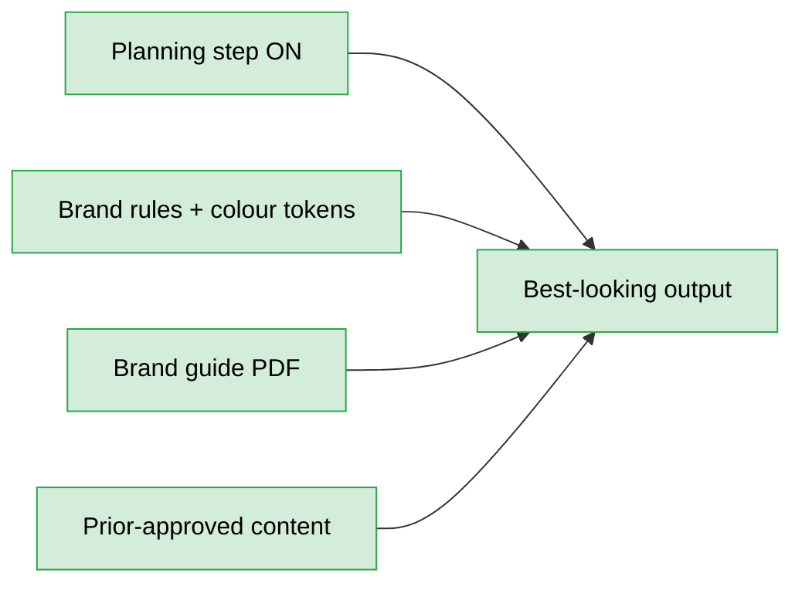

The planning step is doing the work. When the agent writes its brief first *and* critiques it — naming the generic default and rejecting it — the output stops looking generated.

> **These were look-and-feel comparisons only.** One run per setting, four models and three brand-source settings moving at once, and not a single human rating recorded. **By the end of this week we should be able to run a proper A/B on Slack, as discussed** — same brief, two configurations, blind, people vote.

---

## 1. Problem

```
agent can't see           -> picks images from a description; can only open PDFs whole-page
graded on the wrong thing -> 187 of 205 flagged problems are in a footer it cannot edit
plan has no shape         -> the self-critique that makes it good happens by luck
build is expensive        -> 33 tool calls, 26 steps, mostly sequential
```

---

## 2. What we already have that has never been tested

Most of the next round is *measuring things we already built*, not building new ones.

| Exists | Never tested |
|---|---|
| Planning step on/off | Whether the plan is doing the work, or the agent ignores it — nobody's compared the finished email against the plan it wrote |
| Brand source: rules / PDF / both | Confounded last week — the model changed underneath the toggle |
| Deep vs standard vs fast mode | No comparison beyond wall clock |
| Model picker (Opus / GPT / GLM / Kimi) | One run each, one prompt, no scoring |
| Parallel tool calls | On by default, barely used — no measurement of how much it would save |
| Fidelity checker | Only used for replica work; never pointed at generation |
| Prior-approved content in the workspace | The agent opens 1–3 PDFs per build. Nobody's checked whether it takes anything from them |
| Version savepoints + accept/reject | Exists end to end; 3 of 57 sessions ever used it, so we have no "how much did a human have to fix" number |

**Cheap wins hide here.** Half the next round is switching on measurement for things already shipped.

---

## 3. Approach — six tracks

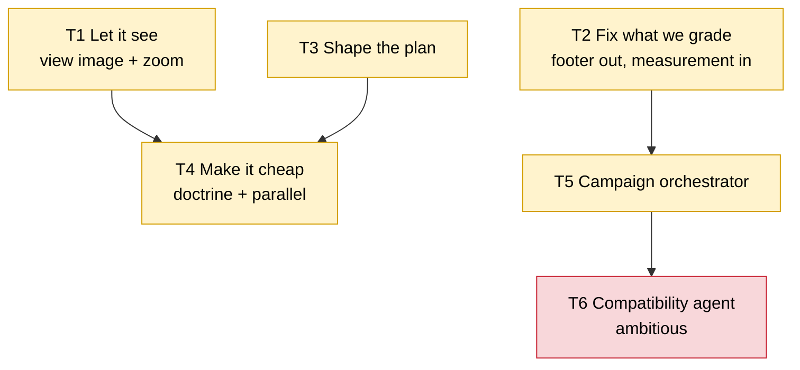

### T1 — Let the agent see

```
today: search index -> read a sentence -> maybe read a SECOND model's sentence -> place it -> hope
next:  search index -> LOOK at top 3 -> choose on the pixels
```

Of 17 image-describe calls across all 57 sessions, **not one returned an actual picture.** Every library asset was chosen and sized from prose. Aspect ratio, baked-in text, legibility at 600 px — all secondhand.

| Add | Why |
|---|---|
| **View an image** | Stop designing around a description |
| **Zoom / crop** any PDF page, render or library image | **This is the one that matters for prior-approved content.** A whole page at 600 px gives you section order; it hides padding rhythm, rule weight and type scale — the actual craft we're trying to learn |

**Reuse, don't rebuild:** the fidelity checker already works out the largest crop the model receives at full resolution. Use that bound.

### T2 — Fix what we're grading

All 205 problems flagged across 43 emails:

| Problem | Total | From the injected footer | **From the agent** |
|---|---|---|---|
| Low contrast | 120 | 120 | **0** |
| Text below 12px | 67 | 67 | **0** |
| Missing alt text | 6 | 0 | 6 |
| Missing image dimensions | 12 | 0 | 12 |
| **Total** | **205** | **187 (91 %)** | **18 (9 %)** |

```
120 contrast "failures" -> zero are the agent's
                        -> the check isn't wrong, WHAT WE POINT IT AT is
```

Order of operations:

```
1. scope   -> grade only what the agent wrote; footer becomes a pipeline-health number
2. measure -> see the agent's real defect rate for the first time
3. loosen  -> only then drop a check, and only one proven to be noise on the agent's own work
```

**One push-back, yours to overrule.** Dropping the contrast check today removes something with a perfect record on agent output, because of a 100 % false-alarm rate from content the agent can't touch. That's fixing the alarm by cutting the wire. Scope it, watch a week, then decide.

**Where the looser direction is right:** the fixed rules can't see centring, rhythm, hierarchy or "this looks generated" — and last week a genuinely good email and a textbook-bad one **scored identically**. So:

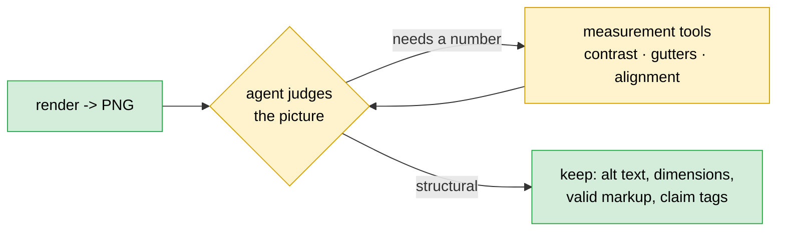

**Exact and cheap → keep it a rule. Everything a rule can't answer → let the agent look.**

**Maybe / maybe not — a separate render-and-check subagent.** Genuinely open:

| For | Against |
|---|---|
| Render screenshots are the biggest thing filling up context — isolate them and the designer's context stays clean | It's a handoff — the designer stops seeing the consequence of its own markup choice |
| Textbook subagent case: narrow tools, lots of context nobody else needs | Start single-agent, prove the need first |

**Decide after T2 scoping, on measured context cost.** Not now.

### T3 — Shape the plan

```
free-form plan -> quality depends on whether the agent felt like self-critiquing
shaped plan    -> the self-critique becomes mandatory, not lucky
```

Require the *shape* — colours with the role each plays, two type roles, a region sketch with proportions, claims allocated per section, and **a self-critique block that must name the generic default it rejected** — leave the *content* free.

Then check it isn't decoration: compare the finished email's structure against the last version of the plan. A beautiful plan the agent ignored means the plan is theatre.

### T4 — Make it cheap

**(a) No tool doctrine.** The agent re-derives its own method every run.

```
add: "for X -> use tool Y -> on file Z -> before step W"
     search the index before reading · look at the image before placing it · zoom before imitating
```

**(b) Parallelism is switched on and unused.** We've measured the harness batching four edits and four renders at once elsewhere. In generation it batches two reads, then drifts sequential.

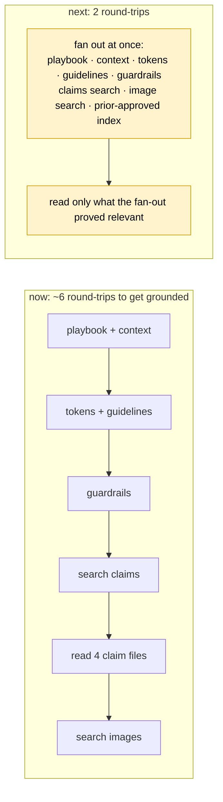

**Read wide, then choose.** Grounding files are small and cached; the expensive thing is the round-trip, not the tokens. Target: grounded in ≤2 round-trips, whole build under 20 tool calls.

### T5 — Campaign orchestrator

Campaigns mean *N emails at once*. That's the one place fanning out is clearly justified.

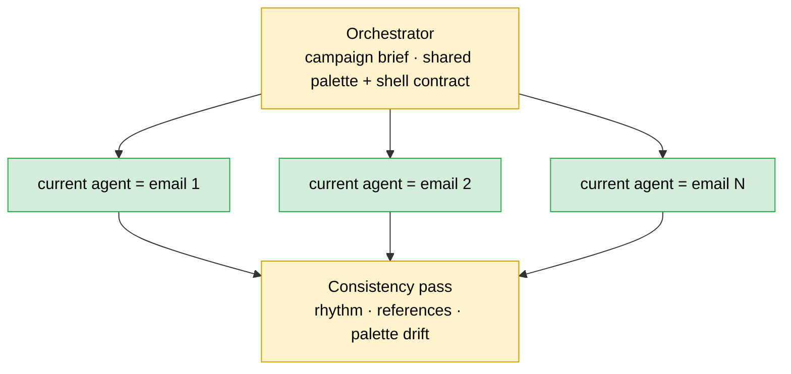

**The current agent becomes the subagent, unchanged.** That's the point — every T1–T4 win multiplies across the campaign, and the orchestrator owns only: campaign brief → per-email briefs → shared palette/shell contract → consistency pass.

Known trap, already written down by us: independently built pieces stack and their spacing adds up — email margins don't collapse. Same applies to palette and component drift across a campaign. **The shared contract lives in the campaign plan, not in email 1's markup.**

### T6 — Bring back the compatibility agent

**Very ambitious. May not reach this.** On the map so it isn't forgotten.

We already own it: it sends an email through real inbox proofs, has a vision model critique each one, and repairs in a sensible order — live HTML first, then Outlook-safe tables, then Outlook-specific fallbacks, flattening to an image only as a last resort. Acceptance comes from the actual proof, not from the model claiming success.

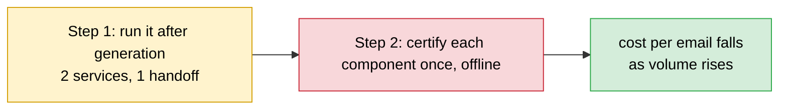

**Post-generation handoff ships first. Per-component certification is the end state** — paid once per component instead of once per email.

**Cheap and worth doing now regardless:** move its hard rules into enforcement code — never flatten a required link, legal link, personalisation token or selectable legal copy into an image; always preserve link targets, tracking parameters, merge tags and preheader markup. If code can enforce it, it shouldn't be a paragraph in a prompt.

**Caveat:** it runs its own models. Inside the loop, results stop being attributable to our generator's model — hold it constant inside any comparison.

---

## 4. System views

### CONTEXT: where the new pieces sit

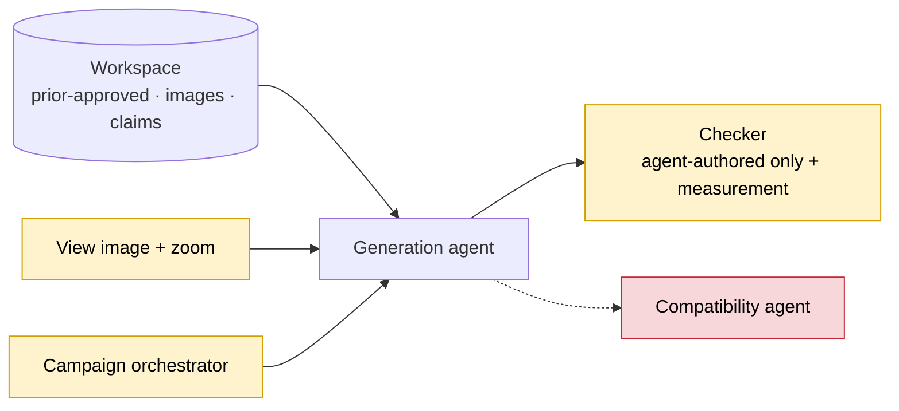

### FLOW: one build, after these changes

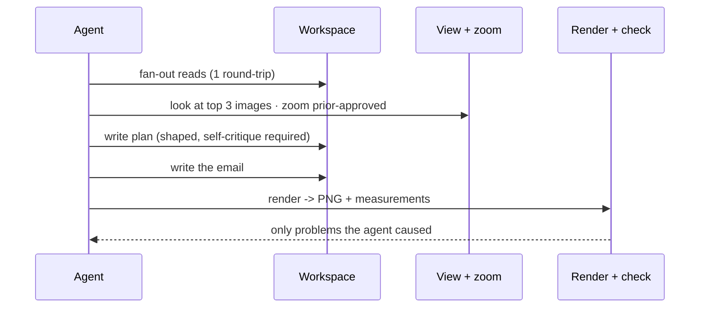

### DATA: what changes shape

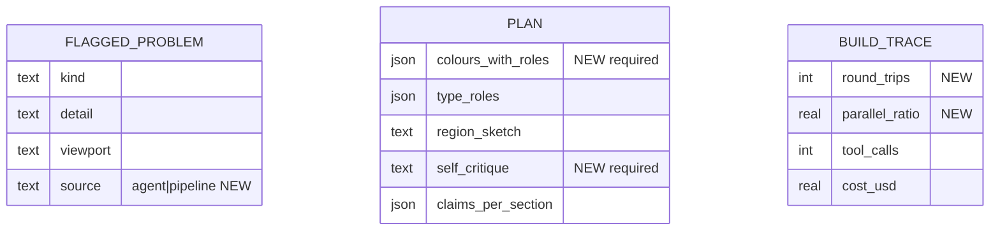

*No migration on existing tables. `source` is the T2 fix in the schema; `parallel_ratio` is the T4 metric.*

### STATE: lifecycle of a track

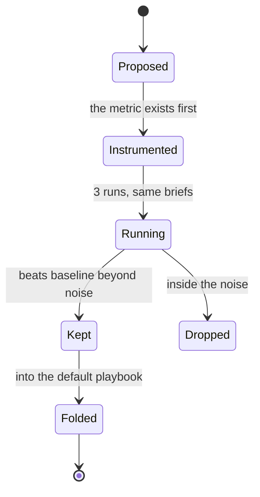

---

## 5. Trade-offs accepted

- Accept **scoping before loosening** the checks → get a real defect rate → **revisit when** a week of clean data shows a check is genuinely noise.
- Accept **a required plan shape**, losing some freedom → get the self-critique every run instead of sometimes → **revisit when** we can see whether the shape raises the floor or flattens the ceiling.
- Accept **more image cost** (view + zoom) for better choices → **revisit when** cost per email passes $0.10.
- Accept **an orchestrator for campaigns only**, single agent everywhere else → **revisit when** a single email starts needing fan-out.
- Accept **per-email compatibility cost** to ship it this quarter → **revisit when** components can be certified once instead.

## 6. Alternatives rejected

- **Drop the contrast check now.** Zero of 120 failures are the agent's — the scope is broken, not the check.
- **Keep grading the injected footer.** It makes "done" unreachable and trains the agent to argue past its own finish line.
- **Go multi-agent for single emails.** Campaigns justify fan-out; one six-section email doesn't, and it costs several times the tokens.
- **Rebuild real-inbox rendering ourselves.** A browser screenshot is a browser. Outlook is a Word engine. We already own the thing that handles it.
- **Keep generating and eyeball it.** It works and $0.073 is good — but the next decision is a quarter of engineering and would be made on vibes.

## 7. Risks and rollback

| Risk | How it shows up | Control |
|---|---|---|
| The agent/pipeline split gets hard-coded to known footer text | Works on today's brands, silently breaks on a new one | Split by **where the content came from**, not by string match; test with a footer we've never seen |
| Loosening checks hides real defects | Quality drops with a clean score | Scope → measure a week → only then loosen |
| Vision tools blow the budget | Cost per email climbs past $0.10 | Cap images per turn; reuse the existing crop-size bound |
| Plan shape over-constrains | Everything comes out the same | Shape only, never content; watch for variance collapse |
| Campaign drift | Emails in one campaign don't look like siblings | Shared contract in the campaign plan; consistency pass owns it |

**Rollback:** every track is a flag, each revertible in minutes. Nothing touches the compliance guard, tenancy, or the deployed image path.

## 8. Verification

- **T1** → how often a shipped image has the wrong aspect ratio or unreadable baked-in text.
- **T2** → agent-caused problems on a build with the footer present. **If that can't reach 0, T2 failed and nothing downstream counts.**
- **T3** → does the finished email match the plan it wrote.
- **T4** → **round-trips to get grounded (target ≤2)**, share of tool calls issued in parallel, total tool calls per build (target <20 from 33).
- **T5** → palette, component and rhythm drift across emails in one campaign.
- **T6** → real-inbox pass rate. A number we don't have at all today.
- **Overall** → **the Slack A/B**: same brief, two configurations, blind, people vote. First real human signal in this programme.

**The one signal I check first:** agent-caused problems = 0 on a build with the footer present.

## 9. Open questions

1. **Separate render-and-check subagent — yes or no?** Deferred to post-T2 measurement.
2. Which measurement primitives are worth exposing — contrast sampler, gutter measure, alignment probe? Keep it to three.
3. Does the plan shape raise the floor or flatten the ceiling? Only repeated runs answer it.
4. Campaign: does the orchestrator own the shell and palette, or does email 1 set it and siblings follow? *(Prefer the contract — siblings-follow is a game of telephone.)*
5. **What exactly goes in the Slack A/B** — which two configurations, how many briefs, who votes?

---

# TIER 2 SECTIONS

## Goals and non-goals

**Goals** — let it see (T1), grade it honestly (T2), shape the plan (T3), make it cheap (T4), stand up the campaign orchestrator (T5), **run the Slack A/B**.

**Non-goals** — no multi-agent for single emails; no vector search (filesystem-first until a corpus outgrows it); no component library build this round; **T6 is a spec, not a commitment.**

## Migration and rollout

| # | Step | Data movement | Backout |
|---|---|---|---|
| 1 | Rename "design exemplars" → **prior-approved content** everywhere | workspace paths only | rename back |
| 2 | Split problems into agent-caused vs pipeline-caused | none | revert |
| 3 | View-image tool | image bytes into context | deregister |
| 4 | Zoom / crop tool | image bytes into context | deregister |
| 5 | Measurement library into the agent image | **new dependency in the deployed image** | drop from the image |
| 6 | Plan shape in the playbook | none | revert playbook |
| 7 | Tool doctrine + fan-out instruction | none | revert playbook |
| 8 | Campaign orchestrator (new, flagged) | per-email briefs fan out | flag off |
| 9 | Compatibility agent handoff | **rendered email leaves to a second service** | flag off |

Order: **1 → 2 before any measurement.** 5 gates the loosening in 2. 8 depends on nothing but benefits from T1–T4. 9 last.

## Security and compliance

- The compliance guard is unchanged and non-negotiable — path restrictions, frozen legal wording, approved-claim-id checking. **No track weakens it.**
- **New in-image dependency** runs locally in the sandbox, no network, no data leaves.
- **View and zoom** put workspace images (already-approved creative) into model context — same posture as today's describe tool, no new boundary.
- **Compatibility agent (T6)** is a genuine new processor: rendered client creative goes to a proofing service plus its own model stack. Record where its servers are; hold it constant inside any comparison.
- **Move into enforcement code now:** never flatten a required link, legal link, personalisation token or selectable legal copy into an image; preserve link targets, tracking parameters, merge tags, preheader.

## Phasing and estimates

| Phase | Ships | Size |
|---|---|---|
| **1** | rename to prior-approved · agent/pipeline problem split · view-image tool | S |
| **2** | zoom/crop on prior-approved + renders · plan shape | M |
| **3** | tool doctrine · fan-out · build-cost metrics | M |
| **4** | measurement tools · loosen checks on evidence | M |
| **5** | **Slack A/B** — same brief, two configs, blind vote | S |
| **6** | campaign orchestrator, current agent as subagent | L |
| **7** | compatibility agent handoff | L — *ambitious* |

**Friday demo:** same brief, before/after — problems attributed to the agent go 9 → 0, and an image chosen after *looking* at three candidates instead of reading three sentences. Then the A/B goes up in Slack.

## Deploy view

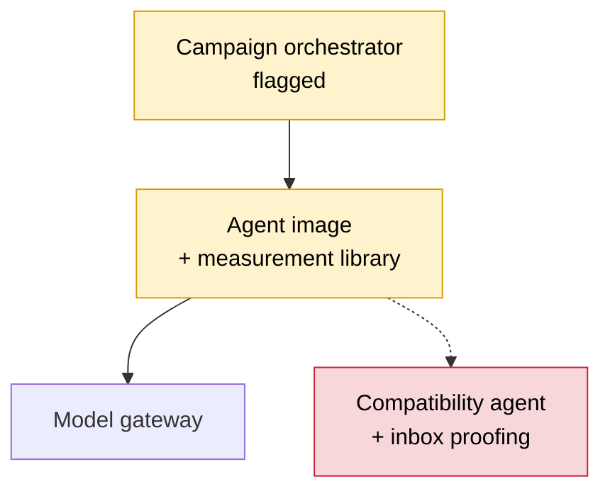

## Pre-mortem

**Three months on, this failed because** the checks were loosened before the scoping data came in, the agent started scoring clean, and nobody noticed quality slipping for six weeks — because there's still no human rating loop. **Control: scope → measure → loosen, in that order, and the Slack A/B goes live this week rather than "soon".**

**Second most likely:** the vision tools landed, the agent started zooming everything, cost per email tripled, and $0.073 — the best number this programme has produced — quietly died. **Control: cost per email is a first-class metric on every run, not a footnote.**

## Decision log

| Date | Decision | Options | Why | Who | Status |
|---|---|---|---|---|---|
| 2026-08-31 | Rename to **prior-approved content** | keep / rename | it's what the client calls it; the compliance story rests on the name | Author | Decided |
| 2026-08-31 | Footer **out** of the scoring loop | keep / exclude / separate counter | 187 of 205 problems are pipeline-injected; "done" is unreachable with it in | Author | Decided |
| 2026-08-31 | **Scope before loosening** the checks | drop contrast now / scope first | 0 of 120 contrast failures are the agent's | Author | **Proposed — contest me here** |
| 2026-08-31 | Render-and-check subagent **deferred** | build now / defer / never | decide on measured context cost after T2 | Author | Open |
| 2026-08-31 | Campaign = orchestrator over the **current agent unchanged** | new pipeline / reuse as subagent | every T1–T4 win multiplies; orchestrator owns only fan-out + consistency | Author | Decided |
| 2026-08-31 | Compatibility agent: **handoff first, certification later** | off / handoff / in-loop / certified | the handoff ships now; only certification changes the economics | Author | Proposed |
| 2026-08-31 | **Slack A/B this week** | wait for a full eval harness / ship the A/B now | 57 sessions, 0 ratings — any human signal beats none | Author | Decided |

## Sign-off

| Reviewer | Verdict | Date | Note |
|---|---|---|---|
| @gourob | Approve / Blocked | | contest "scope before loosening" first |
| @ platform | Approve / Blocked | | new image dependency + compatibility handoff = the Tier-2 surface |

## When this ships

- [ ] Into the playbook: *score only what the agent wrote* · *search the index, then look at the pixels* · *read wide in one batch, then choose*
- [ ] Architecture map updated with the orchestrator and compatibility-agent boundary
- [ ] Status → Shipped, frozen as a point-in-time record

---

## Appendix — what's still worth running from the experiment doc

**Live** = still worth doing, cheap, not already covered above.

| Idea | Status |
|---|---|
| **Brand rules that carry drop-in markup snippets** | **LIVE — the biggest untouched one.** The doc's own "largest single quality jump, twice", never actually controlled. One week. Do it |
| Give it the raw approved corpus with an index and let it pick, no rules at all | **LIVE, cheap** — needs an index over prior-approved content plus a ranker. Pairs directly with T1's zoom |
| Distilled brand rules rather than the raw dump | **BLOCKED** — distillation is switched off in every run so far; flip the flag before this means anything |
| A plan with a required shape | **= T3** — new, not in the doc |
| Build the skeleton first, then fill the sections | **LIVE** — settles the whole-document-vs-section-by-section question by fixing rhythm once up front |
| Generate section by section, each seeing the last | LIVE but lower value — the section markers already exist, so it's cheap to try |
| Parallel section workers for one email | **Skip** — that's T5 at campaign scale instead |
| Survey the header/footer library, then choose | **LIVE, and it gives us a number we lack:** how often the library already has the right shell. If it's 90 %, we stop worrying about this forever |
| Component library **as examples** rather than as parts | **LIVE — the cheap test of the whole component-library thesis.** Run it before building any factory |
| Component library as actual parts | Blocked on building the factory; not this round |
| Orchestrator + workers | **= T5**, campaigns only |
| Separate critic reviewing the maker's work | Partly = the deferred render-and-check subagent question |
| Compatibility agent | **= T6** |
| An independent visual critic on the render | **LIVE** — the compatibility agent's critic already returns structured findings with severity and location, reusable as-is |
| **Render-only checking with the fixed rules relaxed** | **= T2's second half. New, not in the doc** — and it cuts against the doc's own "deterministic first, judgement second" principle, so it needs the scoping data to justify it |

**If only one thing from this list: brand rules carrying drop-in markup snippets.** Strongest claimed win in the whole document, never measured, costs a week.
