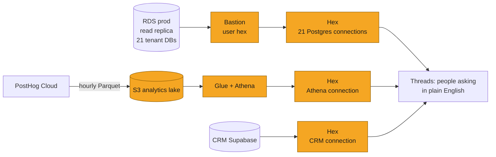
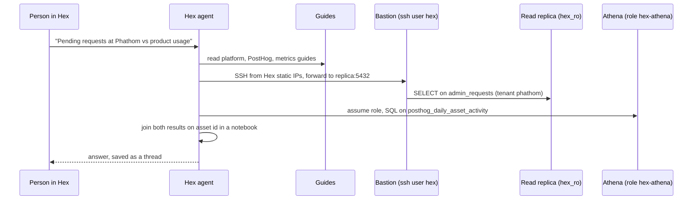
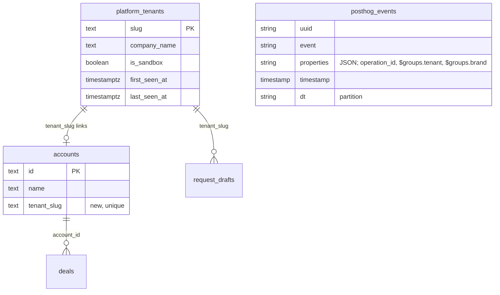
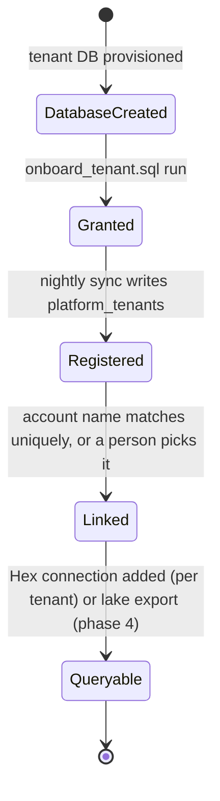
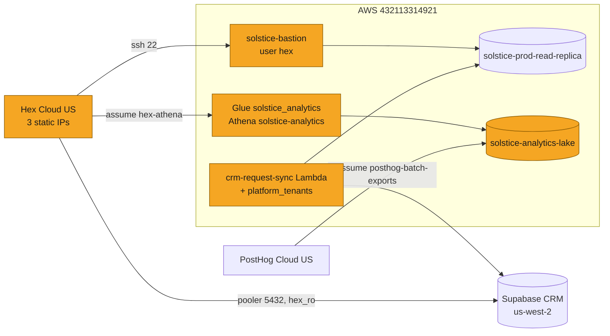

# SOL-XXXX: Analytics lake and Hex for plain-English questions across customer, product, and CRM data

| | |
|---|---|
| **Ticket** | SOL-XXXX (no ticket yet; evaluation started 2026-09-13) |
| **Author** | @jay |
| **Reviewers** | @aris, plus the owner of tenancy and data access |
| **Tier** | 2 |
| **Status** | Building (phases 1 to 3 shipped, phase 4 open) |
| **Date** | 2026-09-13 |

> [!IMPORTANT]
> **Tier check.** Tier 2 because it: handles client data in a new way (customer tenant data and product analytics flow to a new vendor, Hex, and product analytics are copied to S3); adds new external dependencies (Hex, Athena, PostHog batch exports); includes a schema migration on an existing CRM table (`accounts.tenant_slug`). It does not touch auth or the tenancy model of the platform itself; every access path is read-only.

## 1. Problem

Questions about the business need three systems today: the customer tenant databases (what work is happening), PostHog (how people use the product), and the CRM (who the customers are and what they pay). Each answer means an engineer writing SQL by hand, and questions that span two systems, such as "which customers have the biggest review backlog relative to how much they use the product", do not get answered at all. We want anyone on the team to ask these in plain English and get a reliable, shareable answer, without widening write access to anything.

## 2. What exists today

- **Tenant databases.** One Postgres database per customer on `solstice-prod` (RDS), with a read replica `solstice-prod-read-replica`. Engineers reach them through the bastion `solstice-bastion` and an SSH tunnel (Backend-Server `docker-compose.yml`, `documentation/01-ONBOARDING.md`). Schema reference: Backend-Server `documentation/04-DATABASE-MODELS.md`. Key tables: `n_cg_operations` (assets), `admin_requests` (review requests), `n_cg_operation_qc_results` (MLR reports), `brands`, `users`, `projects`.
- **CRM sync.** `solstice-crm/infra/lambda-request-sync` discovers tenant databases nightly from `pg_database`, reads request metadata as the least-privilege role `crm_sync_ro`, and upserts into Supabase `request_drafts`. It is the existing pattern for "a job in the VPC that reads every tenant", and this plan reuses it twice.
- **PostHog.** Project "Solstice - PROD" (id 589053). The frontend (`Solstice-Frontend/lib/analytics/posthog.ts`) identifies persons with email, tenant slug and an `is_internal` flag, and sets group `tenant` (slug) and `brand` (brand id). Events carry `operation_id`, the asset id. About 35,000 events a month.
- **The tenant slug** is already the shared identifier: database name, `X-Tenant-Slug` header, PostHog group, `request_drafts.tenant_slug`. It was not stored on CRM accounts, which is the gap this plan closes.
- Nothing reusable existed for a query layer or a lake. Looked at: Metabase and QuickSight (weaker natural-language layer), Claude with MCP servers (used to build this, not a shared tool).

## 3. Approach

Hex is the question-and-answer layer. Its agent writes SQL against connections we define, reads guides we write for definitions, and saves every answer as a shareable thread. Three kinds of connection, all read-only:

1. **Per-tenant Postgres connections** through the existing bastion, using a new SSH-only OS user and a new database role `hex_ro`. Good for per-customer questions; cannot join across tenants.
2. **An analytics lake** for everything that is not RDS: PostHog exports Parquet to S3 every hour, Glue catalogs it, Athena queries it, Hex connects to Athena by assuming an IAM role. One connection covers all customers.
3. **The CRM** on Supabase, connected directly with a `hex_ro` role and row-level-security policies. The only place all customers already sit in one table.

Two generic pieces make new customers appear without manual work: a nightly-maintained `platform_tenants` registry in the CRM (with `accounts.tenant_slug` as the exact join key), and a single onboarding SQL script in Backend-Server that grants both read-only roles on a new tenant database.

What is deliberately not built yet: copying tenant tables into the lake (phase 4), Datadog and Braintrust sources, a semantic model. Guides carry the definitions instead.

## 4. System views

### Context: where it sits

### Flow: who calls whom, in what order

### Data: what changes shape

The lake adds no new source of truth: `posthog_events` is a copy of PostHog; `platform_tenants` is derived nightly from `pg_database` and each tenant's `companies` table. The one new column of record is `accounts.tenant_slug`.

### State: lifecycle of the entity

## 5. Trade-offs accepted

- We accept **one Hex connection per tenant** (21 today, created by hand because Hex's API cannot create SSH-tunnelled connections) to get per-customer questions with no change to network posture. Revisit when phase 4 lands and the lake covers tenant data, at which point per-tenant connections become optional.
- We accept **an hour of lag on product analytics** to get a pipeline with no servers and no credentials (PostHog assumes an IAM role, Hex assumes an IAM role). Revisit if a question needs freshness under an hour; PostHog supports 5-minute intervals with one field change.
- We accept **cross-source joins happening in Hex notebooks** (the agent pulls two result sets and joins them in Python) for one customer at a time, to ship without an ETL layer. Revisit when the same cross-customer question is asked twice; that is the trigger for phase 4.
- We accept **guides instead of a semantic model** to get shared definitions today at almost no cost. Revisit when five or six metrics are asked repeatedly and the lake holds tenant data; then one semantic model over the lake pays back.
- We accept **a third-party LLM pipeline seeing query results** (Hex uses OpenAI and Anthropic under zero-retention terms and holds a BAA) to get natural-language answers at all. Revisit before any PHI-bearing table is exposed; today the exposed tables hold marketing content metadata, staff names and emails, and commercial terms.

## 6. Alternatives rejected

- **Postgres batch export from PostHog into RDS.** Rejected: PostHog Cloud pushes from the internet, so the destination must be public. Our RDS is private and stays so.
- **Making the read replica publicly addressable, allow-listed to Hex's three IPs.** Rejected for now: defensible, and it would let the API create all connections in one call, but it puts a public DNS name on a replica of customer data to save twenty minutes of form filling.
- **In-database export (`aws_s3` extension plus `pg_cron`) for phase 4.** Rejected in favour of a Lambda mirroring the CRM sync: no scheduled jobs on the primary, one existing pattern for "read every tenant".
- **Claude with MCP servers as the team tool.** Rejected as the shared layer: no saved threads, no curation, credentials are the engineer's own. Kept as the engineer's tool; it built this.
- **QuickSight or Metabase.** Rejected: weaker natural-language layer and no guide or curation model.
- **Doing nothing.** Rejected: the cross-customer questions are already being asked and are unanswerable.

## 7. Risks and rollback

- **Widened read surface.** A single `hex_ro` credential now reads every tenant database. Mitigations: bastion user can only forward to one host and port; role is SELECT-only with a two-minute statement timeout and read-only transactions; Hex's workspace access is one setting (`09_hex_governance.py`) away from group-restricted. Rollback: `alter role hex_ro nologin` on the primary revokes every tenant connection at once; deleting the `hex` bastion user closes the network path. Minutes.
- **Wrong answers from ambiguous columns.** Seen on day one: `marketing_files.is_reviewed` reads like an MLR flag and means "saved in the viewer". Mitigation: guides name these traps and define each metric; endorsed threads pin known-good SQL. Residual risk is a confident wrong number in a leadership conversation; the metrics guide asks the agent to state its definition in every answer.
- **Auto-linking a CRM account to the wrong tenant.** Mitigation: exact name match, one candidate only, slug unused, sync may only fill empty slugs. Rollback: change the dropdown; the link is logged in `sync_runs.summary`.
- **PostHog export schema drift.** Already hit once: persons timestamps are epoch seconds. Mitigation: Glue tables are typed by inspection, not docs; views isolate consumers. Rollback: recreate the Glue table; data in S3 is untouched.
- **Credit exhaustion in Hex.** Each agent question spends credits; the trial allowance was mostly used on day one. Mitigation: auto top-up, saved threads and apps (reruns cost nothing), guides reduce retries.
- **Tenancy.** No change to the platform's tenancy model. Hex connections are per tenant database, so a question cannot leak across tenants through the tenant connections. The lake and the CRM are multi-tenant by design and are the reason for the access group in phase 5.

## 8. Verification

Done, 2026-09-13: all 23 Hex connections pass schema refresh; the agent answered per-tenant, cross-source and CRM questions with correct exclusions after the guides were published; PostHog backfill from 3 September complete with zero failed runs; Athena queries return correct counts and timestamps on events and persons; Lambda unit tests (29) and CRM unit tests pass; lint and typecheck clean.

Signals after ship: `sync_runs.summary.accounts_linked` on the first nightly run after the CRM PR merges; Hex Settings, Credits usage per thread after a week; the list of questions Aris and Jay found wrong or unanswerable, which decides phase 4.

## 9. Open questions

1. Auto-linking on or off? The Lambda links accounts when a name matches uniquely. Reviewers: keep, or make it registry-only and link by hand.
2. Which tables in tenant databases should never be reachable from Hex? Chat message bodies, HTML blobs and prompt libraries are hidden by the governance script; is anything else sensitive.
3. Who owns the Hex workspace after the evaluation, and which seats (Editor, Explorer, viewer).

---

# Tier 2 sections

## Goals and non-goals

Goals: any team member asks questions across customer work, product usage and CRM in plain English; new customers need no per-customer analytics setup; every path is read-only; no long-lived credentials outside the two `hex_ro` passwords.

Non-goals: writing back to any source from Hex; replacing Datadog for operational questions; a semantic layer before repeated questions justify it; exposing `solstice-auth` or the DEV PostHog project.

## Migration and rollout

| Phase | What | State |
|---|---|---|
| 1 | Bastion user `hex`, role `hex_ro`, grants on all tenants, 21 Hex connections | Shipped 2026-09-13 |
| 2 | S3 lake, Glue, Athena, IAM roles, PostHog hourly exports with backfill, Hex Athena connection, flat views | Shipped 2026-09-13 |
| 3 | CRM `hex_ro` and Hex connection; four guides; reference repos | Shipped 2026-09-13 |
| 3b | `platform_tenants` registry and `accounts.tenant_slug` (solstice-crm#64); onboarding grants script (Backend-Server#1285) | PRs open |
| 4 | Nightly Lambda copies four tenant tables per tenant into the lake with a `tenant` column; Glue tables; cross-customer SQL in one connection | Not started; triggered by repeated cross-customer questions |
| 5 | Hex access group and sensitivity labels (`09_hex_governance.py`), seats | Deferred while two evaluators |

Rollout order for 3b: merge the CRM PR (migration applies by GitHub Action); run `onboard_all_tenants.sh` on prod so `crm_sync_ro` can read `companies`; redeploy the Lambda; check `accounts_linked`; link leftovers from the Accounts page. Backout: the migration is additive; disabling the Lambda's registry step is one try block.

## Security and compliance

- New data processors: Hex (SOC 2 Type II, HIPAA, BAA available including multi-tenant; LLM providers OpenAI and Anthropic under zero retention), AWS Athena and Glue in our own account. PostHog already held the product data.
- Data classes reaching Hex today: asset and request metadata, brand and project names, staff names and emails (tenant `users`, CRM `request_drafts`), commercial terms (CRM `deals`). No clinical or patient data; tenant tables that hold generated content bodies are hidden by schema filters when governance is applied.
- Network: Hex reaches RDS only through the bastion, from three static IPs, as an OS user that can forward to one host and port and has no shell. S3 blocks public access and requires TLS. Athena results expire after 30 days. The CRM database accepts connections from any IP by Supabase default; tightening it is a separate task because the web app and the sync Lambda also connect.
- Credentials: two database passwords (`hex_ro` on RDS, `hex_ro` on Supabase) held by Hex. Everything else is role assumption with external ids. The IAM user created for Athena on day one was deleted the same day in favour of the role.
- Audit: `pgaudit` is on for the prod parameter group (`ddl,role,write`; reads are not logged). Hex keeps every thread with its SQL. Bastion auth logs record every Hex session.

## Phasing and estimates

Phases 1 to 3 took one working day with an agent doing the AWS and PostHog work and a person doing the Hex forms and the SQL that needed prod credentials. Phase 3b is two small PRs. Phase 4 is half a day. Phase 5 is minutes.

## Deploy view

## Pre-mortem

It is December and this failed. The most likely reason: the team asked a few questions in week one, got one confidently wrong number (a definition the guides did not cover), stopped trusting it, and went back to asking an engineer. The defence is the metrics guide plus endorsing every verified thread in the first month, and treating each wrong answer as a guide edit rather than a reason to stop.

---

## Decision log

| Date | Decision | Options considered | Why | Who | Status |
|---|---|---|---|---|---|
| 2026-09-13 | Reach tenant DBs through the bastion with a restricted SSH user | Public replica allow-listed to Hex; bastion tunnel | No change to network posture; one host and port forwardable | Jay, agent | Decided |
| 2026-09-13 | PostHog lands in S3 plus Athena, not in RDS | Postgres destination; S3 plus Athena | RDS is private and PostHog pushes from the internet; S3 needs no exposure and absorbs future sources | Jay, agent | Decided |
| 2026-09-13 | Connect the read replica, never the primary | Primary; replica | Analytics load stays off the app's write path | Jay, agent | Decided |
| 2026-09-13 | Exclude `solstice-auth` | Include with a narrow role; exclude | Credentials and Auth0 data; no analytics need | Jay | Decided |
| 2026-09-13 | Hex authenticates to Athena by IAM role, delete the access key | Access key; role with external id | No long-lived secret; the key created earlier was removed the same day | Jay | Decided |
| 2026-09-13 | Guides before a semantic model | Semantic model now; guides | 21 identical connections would mean 21 models; the lake is the right place for one model later | Jay, agent | Decided |
| 2026-09-13 | Phase 4 export via Lambda, not in-database extension | `aws_s3` plus `pg_cron`; Lambda | No scheduled jobs on the primary; reuses the CRM sync pattern | agent, pending review | Proposed |
| 2026-09-13 | Defer access groups while two people evaluate | Lock down now; defer | Evaluation friction; script ready | Jay | Decided |

## Sign-off

| Reviewer | Verdict | Date | Note |
|---|---|---|---|
| @aris | | | |
| @ (tenancy and data access owner) | | | |

> [!TIP]
> **When this ships**
> - [ ] Durable decisions distilled into `CLAUDE.md` / `AGENTS.md` (Backend-Server: tenant onboarding; solstice-crm: registry)
> - [ ] Living architecture map updated
> - [ ] Status set to Shipped; file frozen as a point-in-time record

## Reviewer guide

1. Start with the four views: check that every arrow into a customer data store is read-only and passes through either the bastion, an assumed role, or the CRM's RLS.
2. Read Trade-offs accepted. The two that matter most are the per-tenant connections and joins-in-notebooks; both are explicitly temporary.
3. Check Security and compliance against what you know of the data in the tenant tables. If a table holds something that should not reach an LLM pipeline, name it; the governance script's hide list is where it goes.
4. Comment within 24 hours. Block only for correctness, security, or cost.
