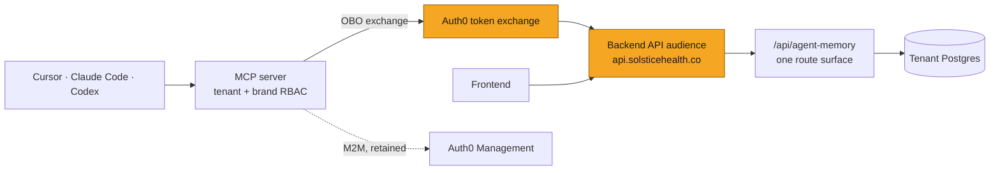
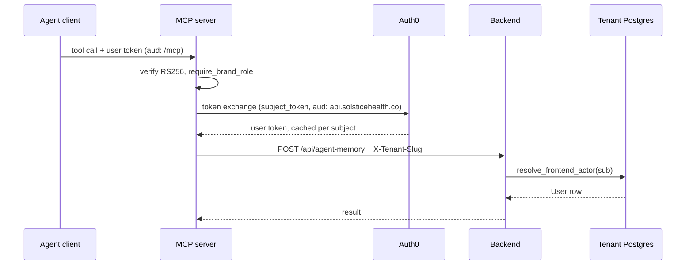
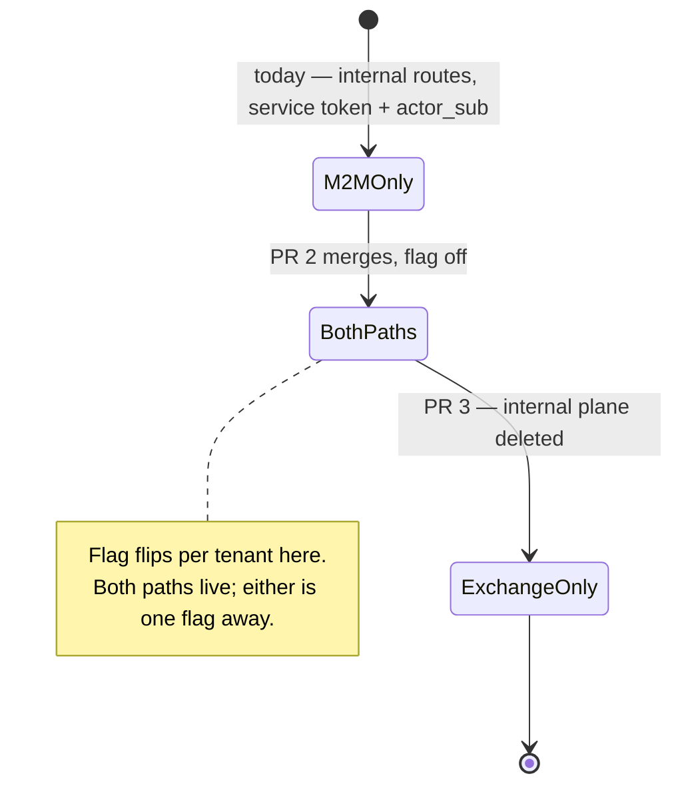
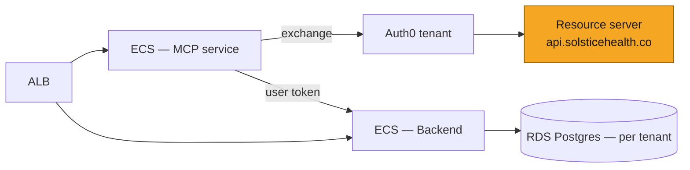

# SOL-XXXX: Delegated identity between MCP and Backend

| | |
|---|---|
| **Ticket** | SOL- |
| **Author** | @gifan |
| **Reviewers** | TBD (one must own auth/platform) |
| **Tier** | 2 |
| **Status** | Draft |
| **Date** | 2026-09-18 |

> [!IMPORTANT]
> **Tier check.**
> - [x] Touches auth, tenancy, or permissions — this is entirely an auth change
> - [ ] Handles PHI or client data in a new way
> - [ ] Schema migration on existing tables
> - [x] New external dependency or infrastructure — a new Auth0 resource server, and a token-exchange grant we do not use today
> - [x] Changes a cross-service or client-facing API contract — the internal memory route surface is deleted and shared DTOs lose fields
> - [ ] Hard to reverse: every step before the deletion is flag-gated or additive; the deletion itself is a code revert

## 1. Problem

Identity changes form three times between an agent client and the tenant database. The hop that matters is MCP → Backend: MCP authenticates as a *service* and names the user in the request body as `actor_sub`, so the Backend needs a second, parallel route surface for every endpoint MCP calls.

That cost is now visible. `agent_memory` carries two routers implementing the same five operations, sharing DTOs with optional `actor_sub`/`tenant_slug` fields the public routes must explicitly reject. A second M2M plane (`AUTH0_M2M_PRC_AUDIENCE`, SOL-3438) has since been added on the same pattern. The stated direction is for MCP to become a thin wrapper over the Backend; on the current pattern every endpoint it wraps costs a second handler and more schema pollution.

Separately, `Auth0JWTBearer` validates every user-facing request against `https://<AUTH0_DOMAIN>/api/v2/` — the Auth0 Management API, a built-in resource server for administering the Auth0 tenant. We do not own it and cannot define scopes on it, so user-facing auth has no scope granularity at all. That is also the reason a delegated token has nowhere sensible to point today.

## 2. What exists today

**Token verification in MCP.** `solstice_mcp/auth.py` — `MCPAccessTokenVerifier` pins RS256 + `kid`, resolves the key through a TTL'd `JWKSCache` whose forced refresh is throttled to once per TTL, and decodes with `require: [exp, iss, aud, sub]`. It hands FastMCP an `AccessToken`; the raw token is never forwarded anywhere.

**Authorization in MCP.** `tenants.discover_tenants_for_sub` probes every configured tenant DB for a live `users` row matching the subject; `brands.require_brand_role` chains that with a `brand_team_members` lookup and raises `ToolError("not_authorized: …")`. No tool signature accepts `user_id` or `role`. This is the invariant the whole design rests on and it is not changing.

**The MCP → Backend hop.** `memory_client.Auth0ClientCredentials` caches one client-credentials token per process, refreshed ahead of expiry, and `BackendMemoryClient` sends it as `Authorization: Bearer` with `X-Tenant-Slug`. The user is named in a server-derived `ActorEnvelope` built only after `require_brand_role` passes.

**The Backend side.** `src/shared/middleware/m2m_auth.py` verifies machine tokens with audience and scope pinned by the calling domain. `src/agent_memory/auth.py` pins `memory:invoke`, fails closed in production when `AUTH0_M2M_MEMORY_AUDIENCE` is unset, and explicitly refuses to fall back to the Management API audience. `revalidate_internal_actor` then checks body `tenant_slug` against the `X-Tenant-Slug`-derived tenant, resolves `actor_sub` to a live user, and hands the route a `User`.

**The public equivalent.** `src/agent_memory/routes.py` does the same job via `Depends(auth0_jwt)` and `resolve_frontend_actor`, which resolves `payload["sub"]` against the same table. The two handlers are otherwise line-for-line the same call into `MemoryService`.

**What is reusable.** Most of it. The Terraform for a resource server already exists (`terraform/environments/mcp/main.tf`, the `auth0_resource_server.mcp` block with its `auth0_resource_server_scopes` and subject-type policies). `auth0_jwt` is a single shared singleton applied once at router inclusion (`main.py`, `router_dependencies`), so the audience is a one-point change. `Auth0ClientCredentials` is the shape a token-exchange client should copy — lock-guarded cache, refresh ahead of expiry, injectable opener for tests.

**What does not exist.** Any token-exchange grant. The only `grant_type` in either repo is `client_credentials`. AgentCore performs an exchange for the Codex path, but that happens in the gateway, not in our code.

## 3. Approach

Move the actor from the request body into the JWT, then delete everything that existed only to carry it.

1. **Register a Backend API resource server** — `https://api.solsticehealth.co` — with real scopes, and have `Auth0JWTBearer` accept it *alongside* the audience it accepts today.
2. **Teach MCP to exchange** the verified end-user token for a Backend-audience user token, cached per subject.
3. **Point the memory client at the public routes**, behind a flag.
4. **Delete the internal plane** — `internal_routes.py`, the optional actor fields, the 400 guard, and the memory M2M audience — once the flag has soaked.

**The frontend does not move in this ticket.** Dual audience acceptance is the resting state, not a migration window: the frontend keeps minting `…/api/v2/` tokens and keeps hitting the same routes, while MCP arrives at those routes with the new audience. Nothing about the frontend's credential changes, so the one genuinely backwards-incompatible step available here simply isn't taken. Retiring the Management API audience is a follow-up ticket with its own risk budget — see Non-goals.

M2M stays exactly where the caller really is a machine: the Auth0 Management calls behind `user_admin`, which have no human actor at all.

**What does not change.** `require_brand_role` stays in MCP. The tenant database stays the authorization trust root — `resolve_frontend_actor` resolves the token's `sub` against the same `users` table `revalidate_internal_actor` does today. This is a change to how an assertion travels, not to what decides. That is what makes it stageable rather than a flag day.

### Scope design

`memory:invoke` and `prc:write` become scopes on the new resource server rather than proxies for an audience. The MCP client requests them on the exchange; the Backend keeps pinning the required scope per domain in code, as `agent_memory/auth.py` does now. Scope checking on user-facing routes is deliberately out of scope here — the audience change makes it possible, and a later ticket can spend it.

### Token exchange in MCP

A new `Auth0TokenExchange` alongside `Auth0ClientCredentials`, same shape with one difference: the cache is keyed by subject, not global. It needs the bounded-with-TTL treatment already used by `TenantMembershipCache` and `SolsticeAccessGate` — an unbounded per-subject token cache in a long-lived worker is the obvious leak. Entries expire on the token's own `exp` minus the existing skew.

The exchange input is the verified token from `require_access_token()`, never a tool argument. That invariant deserves a test, not a comment.

### Audit and rate limiting

`audit.py` reads `token.subject` and `token.client_id` from the MCP-side token, which is unchanged — the exchange happens below it. Backend-side, the M2M token's `sub` (the MCP client id) stops appearing on memory calls; the audit trail moves from "machine client + asserted actor" to "user", which is a reduction in what we can see. Worth confirming Datadog's `user_id`/`user_email` facets still populate from `resolve_frontend_actor` before PR 3 deletes the old path.

`rate_limit.py` is keyed on the MCP-side `(subject, client_id)` and is untouched.

## 4. System views

### Context: where it sits

### Flow: who calls whom, in what order

### Data: what changes shape

*N/A because: no table changes. The shape change is at the API contract — `RememberRequest`, `SupersedeRequest` and `ForgetRequest` lose their optional `actor_sub` and `tenant_slug` fields, and `ObserveRequest` loses its required pair. Covered in Approach and PR 3.*

### State: what the memory plane accepts

*`BothPaths` is the only state with a rollback that isn't a deploy, which is why the deletion waits for a soak rather than riding along with the cutover.*

## 5. Trade-offs accepted

- We accept **a per-subject token cache and one Auth0 round-trip per cache miss** to get the actor into the credential. Revisit when exchange latency shows up in tool p95, which the existing `emit_tool_metrics` duration already reports.
- We accept **a coarser Backend audit trail on memory calls** — the machine client id stops being recorded alongside the actor — to get one route surface. Revisit if an audit asks which machine client acted.
- We accept **that the Backend keeps accepting the Management API audience**, so the frontend never changes credential shape and this ticket contains no backwards-incompatible step. The existing smell persists; it does not get worse. Revisit in the follow-up ticket, where it is the only change and can carry its own rollout.
- We accept **not adding scope enforcement on user-facing routes in this ticket**, to keep the change to identity transport only. Revisit as soon as the audience exists, because that is the first time it is possible.

## 6. Alternatives rejected

- **Do nothing.** Rejected: the pattern is already proliferating — a second M2M plane landed during SOL-3438 — and each new wrapped endpoint costs a duplicate handler.
- **Point the exchange at the Management API audience** and skip the new resource server. Rejected: it inherits the no-scopes ceiling on every endpoint MCP will ever wrap, and `agent_memory/auth.py` already deliberately refuses that audience in production.
- **Forward the user's MCP token verbatim to the Backend.** Rejected: audience validation fails, correctly. Widening Backend's accepted audiences to include `…/mcp` would make a token minted for one service valid at another.
- **A signed actor assertion instead of a body field.** Rejected here, though SOL-3438 named it as its hardening step — it makes forgery impossible but adds a shared key to distribute and rotate, and the exchange gets the same property from Auth0 without the key management.

## 7. Risks and rollback

**There is no backwards-incompatible step before the deletion.** PR 1 is additive to a validator (one more accepted audience) and inert until something mints that audience. PR 2 is inert until a flag opens. PR 3 removes code that the flag has already routed around. No existing caller's credential changes at any point.

**The exchange is the new single point of failure.** Every memory call now depends on an Auth0 round-trip on cache miss. An Auth0 outage previously degraded MCP at process start (one client-credentials fetch, then cached for the process); now it degrades per uncached subject. Mitigated by the cache and by the flag — a cutover that misbehaves reverts per tenant without a deploy.

**Tenancy.** Unchanged. `resolve_frontend_actor` resolves against the same per-tenant `users` table and returns 403 for a subject not provisioned in the routed tenant — the same cross-tenant denial `revalidate_internal_actor` gives today. `X-Tenant-Slug` and `TenantMiddleware` are untouched. No new PHI path, no new data processor.

**Backout.** Before PR 3, backout is the flag — per tenant, no deploy. After PR 3 the internal routes are gone and backout is a revert of that PR: a deploy, with no data implications. This is the reason PR 3 is separate rather than bundled into the cutover.

## 8. Verification

- **Truth-table tests on the exchange client**: cache hit, miss, expiry-with-skew, eviction at the bound, and a concurrent-miss test that asserts one fetch. Mirrors the existing `Auth0ClientCredentials` and `JWKSCache` tests.
- **The injection invariant as a test**: the exchange input comes from `require_access_token()` and a tool argument cannot reach it.
- **Parity tests** asserting the public and internal handlers return identical responses for the same actor, run before PR 3 deletes one of them. This is what makes the deletion a deletion rather than a behavior change.
- **A live full-stack call** with a real exchanged token. Calling this out explicitly because SOL-3438 shipped its machine-caller path with no real credential ever exercised — its audience did not exist — and the gap was only visible in hindsight.
- **After ship**: `mcp_auth_denied` event rate, and the `mcp_tool_audit` `duration_ms` distribution for memory tools before and after the flag opens. A cache that is not working shows up as a latency step change, not an error.

## 9. Open questions

1. **`POST /observations` has no public equivalent.** It either graduates to a public route in PR 3 or becomes the last surviving internal endpoint. Decide before PR 2, because discovering it during the deletion turns a clean removal into a permanent exception.
2. **Does SOL-3438 wait?** Its cutover is blocked on `AUTH0_M2M_PRC_AUDIENCE`, which does not exist. Recommendation: provision it as planned and let SOL-3438 ship on M2M, then migrate the PRC plane onto this mechanism as a follow-up. Blocking a mid-flight cutover on a platform migration is the wrong trade, even though it means briefly provisioning an audience we intend to retire.
3. **Who owns the Auth0 tenant change?** The Terraform in PR 1 provisions a resource server; applying it is not the normal code review path and needs a named owner.

---

# Tier 2 sections

## Goals and non-goals

**Goals.** A Backend API audience with real scopes. The actor in the JWT rather than the request body. One `agent_memory` route surface. M2M retained only where there is no human actor. **Three PRs, none of them backwards-incompatible.**

**Non-goals.**
- **Retiring the Management API audience.** The Backend accepts both; the frontend is untouched. Retiring the old one means changing the credential every authenticated route sees, which is the only backwards-incompatible move in this area — so it gets its own ticket, where it is the only change and can roll out per environment behind its own revert.
- **The PRC plane.** Same mechanism, different ticket — see Open questions.
- **Scope enforcement on user-facing routes.** Made possible here, spent later.
- **Collapsing the two MCP entry paths.** Cursor and Claude Code go direct to ECS because the AgentCore gateway paginates `tools/list` and they do not follow the cursor; that is a client-capability problem, unrelated to token shape, and it does not block any of this.
- **Changing what MCP authorizes.** `require_brand_role` and the tenant scan stay exactly as they are.

## Migration and rollout

One flag gates the MCP cutover, targeted by tenant, code default off, env override as kill switch — the same shape SOL-3438 used.

No data moves, no backfill, no schema change.

Ordering is strict and short: audience exists and is accepted → MCP can exchange → flag opens per tenant → internal plane deleted. Each arrow is a hard dependency, and the Terraform must be *applied*, not merely merged, before the flag opens anywhere.

Nothing here has a deadline. `BothPaths` can hold indefinitely; the deletion is the only step that forfeits the cheap rollback, and it is gated on a soak rather than a date.

## Security and compliance

The exchanged token's audience is a resource server we own, with `subject_type_authorization` set the way the MCP resource servers already set it — `require_client_grant` for users, and for clients only in the environments that need it.

The subject of the exchange is the verified end-user token, derived from `require_access_token()`. It is never a tool argument and never model output; that is what stops prompt injection from choosing an actor, and it is a tested invariant rather than a convention.

The Backend continues to resolve the actor against the tenant database on every call. A token is proof of identity, never of authorization — unchanged from today.

Net posture change: a leaked MCP service credential currently reaches any user in any tenant it can name. After this, there is no service credential on the memory plane at all; an attacker needs a user's own token. That is the security argument for the change, and it is worth stating plainly because SOL-3438 accepted that exposure explicitly and deferred the fix to "an identity-platform change" — this is that change.

## Phasing and estimates

**Three PRs across two repos, plus one flag rollout that is not a PR.** Three is the floor: PR 1 and PR 2 are in different repos, and PR 3 must not merge until the flag has soaked. Nothing changes for an existing caller until the flag opens, and no step alters a credential any existing caller holds.

**PR 1 — Backend API audience and dual acceptance (Backend-Server, ~3 days).**
`auth0_resource_server` for `https://api.solsticehealth.co` with `auth0_resource_server_scopes` (`memory:invoke`, `prc:write`) and client grants, modelled on the `auth0_resource_server.mcp` block; `Auth0JWTBearer.audience` becomes a list, which PyJWT accepts natively. Terraform and the validator ship together because neither does anything without the other: the Backend cannot receive a token for an audience that does not exist, and the audience is unreachable while the validator rejects it. Tests cover a token for each audience and one for neither. Inert until something mints the new audience.

**PR 2 — Token exchange and cutover path (solstice-mcp-server, ~1 week).**
`Auth0TokenExchange` with the bounded per-subject TTL cache, the flag client, and `BackendMemoryClient` pointed at `/api/agent-memory` behind the flag. Flag defaults off, so the merge is inert. Includes the injection-invariant test and the parity tests from Verification.

**Cutover — a flag change per tenant, not a deploy.** Soak before PR 3.

**PR 3 — Delete the internal plane (Backend-Server, ~3 days).**
`internal_routes.py`, the optional `actor_sub`/`tenant_slug` fields on the three request DTOs, the 400 guard in `routes.py`, `revalidate_internal_actor`, `AUTH0_M2M_MEMORY_AUDIENCE` and the memory branch of `verify_m2m_memory_token`. Blocked until the flag has been fully open through a soak — everything it removes is still the off-branch until then. Resolve Open question 1 before PR 2 starts, since it decides whether this PR deletes a router or leaves one endpoint behind.

Sequencing: 1 → 2 → cutover → 3. No branches, no independent tracks.

Phase 1 for a Friday demo is PR 1: a real resource server in Auth0 and a Backend that accepts a token minted against it.

## Deploy view

No new infrastructure beyond the Auth0 resource server. No new vendor, no new data processor.

## Pre-mortem

It is three months later and this failed. The most likely reason:

**The exchanged token's claims are not shaped like the frontend's, and a public route quietly reads one that differs.** `resolve_frontend_actor` only touches `sub`, so the memory routes are safe — but `auth0_middleware.py` carries path exemptions, an internal shared-secret path, and `require_admin` on the same singleton, and the error text in that file suggests the Management audience was chosen to make Auth0 return a JWT rather than an opaque token, not because anything reasoned about it. If MCP later wraps a route that reads more than `sub`, the failure is a claim that silently differs, not a token that 403s. The parity tests cover the memory routes; they do not cover the next route someone wraps.

Second most likely: the per-subject token cache is unbounded in practice because eviction is keyed wrong, and a long-lived worker grows until it is restarted — the leak the `TenantMembershipCache` bound exists to prevent, reintroduced in a new class.

Third: the soak was too short because the flag was opened on low-traffic tenants only, and PR 3 deleted a path that a high-traffic tenant had never actually exercised.

---

## Decision log

| Date | Decision | Options considered | Why | Who | Status |
|---|---|---|---|---|---|
| 2026-09-18 | Register a Backend API audience rather than reuse `…/api/v2/` | Reuse the Management API audience; new resource server | Cannot define scopes on a resource server we do not own; `agent_memory` already refuses that audience in production | Author | Decided |
| 2026-09-18 | Delegated tokens, superseding SOL-3438's 09-14 decision | Keep the revalidated actor envelope; forward the user bearer; exchange | SOL-3438 deferred this explicitly to avoid gating on an identity-platform change; this ticket is that change | Author | Proposed |
| 2026-09-18 | Dual audience acceptance is the resting state; the frontend does not move | Flip the frontend in this ticket; dual acceptance permanently | Leaving the frontend alone removes the only backwards-incompatible step and drops the plan from seven PRs to three | Author | Decided |
| 2026-09-18 | SOL-3438 ships on M2M rather than waiting | Block its cutover on this; provision `prc:write` and migrate later | Blocking a mid-flight cutover on a platform migration is the wrong trade | Author | Proposed — see Open questions |
| | | | | | |

## Sign-off

| Reviewer | Verdict | Date | Note |
|---|---|---|---|
| @ | Approve / Blocked | | |
| @ | Approve / Blocked | | |

> [!TIP]
> **When this ships**
> - [ ] Durable decisions distilled into `CLAUDE.md` / `AGENTS.md`
> - [ ] Living architecture map updated
> - [ ] Status set to Shipped; file frozen as a point-in-time record

## Reviewer guide

1. Start with the four views, then the Phasing section — the ordering constraints are where the risk lives, not in any single PR.
2. Open question 2 is the one that needs an answer before anything starts; it changes SOL-3438's critical path.
3. The pre-mortem's first scenario is the one to argue with. If you know why `…/api/v2/` was chosen, say so — the code does not record it.
4. Block only for correctness, security, or cost.
