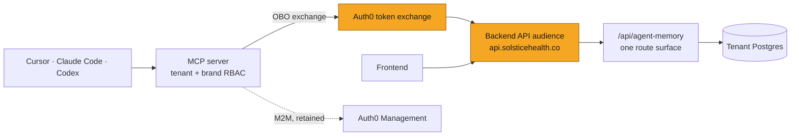
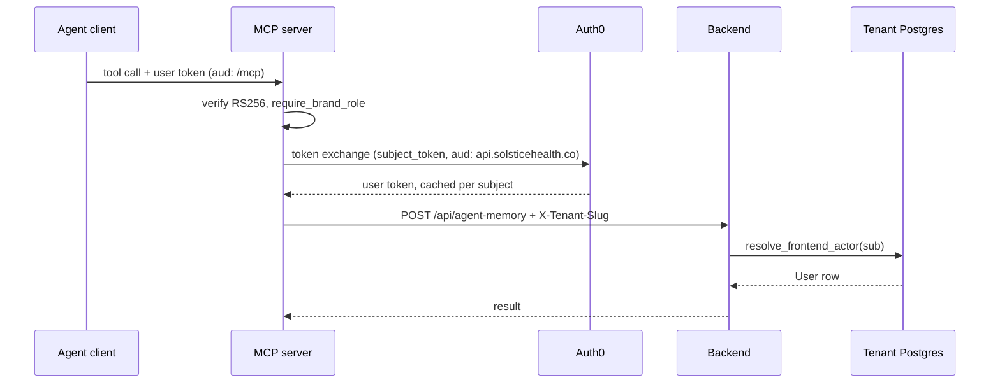
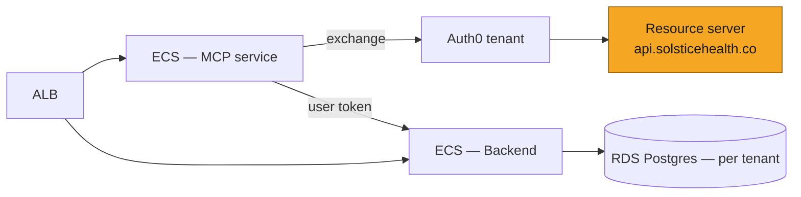

# SOL-XXXX: Delegated identity between MCP and Backend

| | |
|---|---|
| **Ticket** | SOL- |
| **Author** | @gifan |
| **Reviewers** | TBD (one must own auth/platform) |
| **Tier** | 2 |
| **Status** | Draft |
| **Date** | 2026-09-18 |

> [!IMPORTANT]
> **Tier check.**
> - [x] Touches auth, tenancy, or permissions — this is entirely an auth change
> - [ ] Handles PHI or client data in a new way
> - [ ] Schema migration on existing tables
> - [x] New external dependency or infrastructure — a new Auth0 resource server, and a token-exchange grant we do not use today
> - [x] Changes a cross-service or client-facing API contract — the internal memory route surface is deleted and shared DTOs lose fields
> - [ ] Hard to reverse: dual acceptance lands before anything moves, so the frontend flip reverts by environment variable and the cutover reverts by flag; only the final deletions need a deploy to undo

## 1. Problem

Identity changes form three times between an agent client and the tenant database. The hop that matters is MCP → Backend: MCP authenticates as a *service* and names the user in the request body as `actor_sub`, so the Backend needs a second, parallel route surface for every endpoint MCP calls.

That cost is now visible. `agent_memory` carries two routers implementing the same five operations, sharing DTOs with optional `actor_sub`/`tenant_slug` fields the public routes must explicitly reject. A second M2M plane (`AUTH0_M2M_PRC_AUDIENCE`, SOL-3438) has since been added on the same pattern. The stated direction is for MCP to become a thin wrapper over the Backend; on the current pattern every endpoint it wraps costs a second handler and more schema pollution.

Separately, `Auth0JWTBearer` validates every user-facing request against `https://<AUTH0_DOMAIN>/api/v2/` — the Auth0 Management API, a built-in resource server for administering the Auth0 tenant. We do not own it and cannot define scopes on it, so user-facing auth has no scope granularity at all. That is also the reason a delegated token has nowhere sensible to point today.

## 2. What exists today

**Token verification in MCP.** `solstice_mcp/auth.py` — `MCPAccessTokenVerifier` pins RS256 + `kid`, resolves the key through a TTL'd `JWKSCache` whose forced refresh is throttled to once per TTL, and decodes with `require: [exp, iss, aud, sub]`. It hands FastMCP an `AccessToken`; the raw token is never forwarded anywhere.

**Authorization in MCP.** `tenants.discover_tenants_for_sub` probes every configured tenant DB for a live `users` row matching the subject; `brands.require_brand_role` chains that with a `brand_team_members` lookup and raises `ToolError("not_authorized: …")`. No tool signature accepts `user_id` or `role`. This is the invariant the whole design rests on and it is not changing.

**The MCP → Backend hop.** `memory_client.Auth0ClientCredentials` caches one client-credentials token per process, refreshed ahead of expiry, and `BackendMemoryClient` sends it as `Authorization: Bearer` with `X-Tenant-Slug`. The user is named in a server-derived `ActorEnvelope` built only after `require_brand_role` passes.

**The Backend side.** `src/shared/middleware/m2m_auth.py` verifies machine tokens with audience and scope pinned by the calling domain. `src/agent_memory/auth.py` pins `memory:invoke`, fails closed in production when `AUTH0_M2M_MEMORY_AUDIENCE` is unset, and explicitly refuses to fall back to the Management API audience. `revalidate_internal_actor` then checks body `tenant_slug` against the `X-Tenant-Slug`-derived tenant, resolves `actor_sub` to a live user, and hands the route a `User`.

**The public equivalent.** `src/agent_memory/routes.py` does the same job via `Depends(auth0_jwt)` and `resolve_frontend_actor`, which resolves `payload["sub"]` against the same table. The two handlers are otherwise line-for-line the same call into `MemoryService`.

**What is reusable.** Most of it. The Terraform for a resource server already exists (`terraform/environments/mcp/main.tf`, the `auth0_resource_server.mcp` block with its `auth0_resource_server_scopes` and subject-type policies). `auth0_jwt` is a single shared singleton applied once at router inclusion (`main.py`, `router_dependencies`), so the audience is a one-point change. `Auth0ClientCredentials` is the shape a token-exchange client should copy — lock-guarded cache, refresh ahead of expiry, injectable opener for tests.

**What does not exist.** Any token-exchange grant. The only `grant_type` in either repo is `client_credentials`. AgentCore performs an exchange for the Codex path, but that happens in the gateway, not in our code.

## 3. Approach

Move the actor from the request body into the JWT, then delete everything that existed only to carry it.

1. **Register a Backend API resource server** — `https://api.solsticehealth.co` — with real scopes, and have `Auth0JWTBearer` accept it *alongside* the audience it accepts today.
2. **Teach MCP to exchange** the verified end-user token for a Backend-audience user token, cached per subject.
3. **Point the memory client at the public routes**, behind a flag.
4. **Move the frontend onto the new audience**, then delete what is left — `internal_routes.py`, the optional actor fields, the 400 guard, the memory M2M audience, and the Management API audience.

**Dual acceptance is what makes every step revertible.** It lands first and stays live throughout, so the frontend flip is an environment variable rather than a coordinated cutover, and a token minted under either audience keeps working while it does. Nothing is backwards-incompatible at any point; the plan is additive until the final deletions, and those only remove paths that are provably unused by then.

**The frontend flip moves two clients, not one.** `AUTH0_AUDIENCE` is read by both `lib/auth0.ts` (the shared tenant frontend client) and `lib/review-auth.ts` (the guest review-links client, `AUTH0_REVIEW_CLIENT_ID`, deliberately separate so guest sign-in does not ride the production application). They flip together off one variable, so the resource server must grant both or guest review sign-in breaks at the flip.

### What end users see at the flip

Nothing, if the resource server is configured correctly — and in no case is there a repeating prompt. Auth0 consent is recorded per `(user, client, audience, scope)` and remembered, so the worst case is one prompt per user, once, not one per login.

**Copy two settings from `auth0_resource_server.mcp`, not just its shape.** `skip_consent_for_verifiable_first_party_clients = true` suppresses the prompt entirely, but only for a client marked `is_first_party` whose callbacks are *verifiable* — https, not localhost. Every client in that Terraform sets `is_first_party = true`; the frontend clients must too.

**Local development is the exception.** `http://localhost` callbacks cannot be verified, so each developer sees the consent screen once per audience after the flip. Expected, not a defect; worth a note in the rollout announcement so it is not reported as one.

**Guest review sign-in shows no consent at all** — it is a direct grant (`grant_type: http://auth0.com/oauth/grant-type/passwordless/otp`) straight to `/oauth/token`, with no browser in the loop. Its risk is the opposite and sharper: `auth0_resource_server.mcp` sets `subject_type_authorization { user { policy = "require_client_grant" } }`, and under that policy a **user** token for the audience requires an explicit client grant. Copying the block without granting `AUTH0_REVIEW_CLIENT_ID` does not produce a prompt — it produces a rejected token request, on the one path no main-flow smoke test exercises.

**Nobody is logged out.** Refresh tokens are bound to the audience they were issued for, so sessions established before the flip keep minting old-audience access tokens until they end naturally, and dual acceptance keeps those working. Users move to the new audience at their next fresh login. There is no forced re-authentication and no timing to coordinate — which is what makes this an environment variable rather than a cutover.

M2M stays exactly where the caller really is a machine: the Auth0 Management calls behind `user_admin`, which have no human actor at all.

**What does not change.** `require_brand_role` stays in MCP. The tenant database stays the authorization trust root — `resolve_frontend_actor` resolves the token's `sub` against the same `users` table `revalidate_internal_actor` does today. This is a change to how an assertion travels, not to what decides. That is what makes it stageable rather than a flag day.

### Scope design

`memory:invoke` and `prc:write` become scopes on the new resource server rather than proxies for an audience. The MCP client requests them on the exchange; the Backend keeps pinning the required scope per domain in code, as `agent_memory/auth.py` does now. Scope checking on user-facing routes is deliberately out of scope here — the audience change makes it possible, and a later ticket can spend it.

### Token exchange in MCP

A new `Auth0TokenExchange` alongside `Auth0ClientCredentials`, same shape with one difference: the cache is keyed by subject, not global. It needs the bounded-with-TTL treatment already used by `TenantMembershipCache` and `SolsticeAccessGate` — an unbounded per-subject token cache in a long-lived worker is the obvious leak. Entries expire on the token's own `exp` minus the existing skew.

The exchange input is the verified token from `require_access_token()`, never a tool argument. That invariant deserves a test, not a comment.

### Audit and rate limiting

`audit.py` reads `token.subject` and `token.client_id` from the MCP-side token, which is unchanged — the exchange happens below it. Backend-side, the M2M token's `sub` (the MCP client id) stops appearing on memory calls; the audit trail moves from "machine client + asserted actor" to "user", which is a reduction in what we can see. Worth confirming Datadog's `user_id`/`user_email` facets still populate from `resolve_frontend_actor` before PR 4 deletes the old path.

`rate_limit.py` is keyed on the MCP-side `(subject, client_id)` and is untouched.

## 4. System views

### Context: where it sits

### Flow: who calls whom, in what order

### Data: what changes shape

*N/A because: no table changes. The shape change is at the API contract — `RememberRequest`, `SupersedeRequest` and `ForgetRequest` lose their optional `actor_sub` and `tenant_slug` fields, and `ObserveRequest` loses its required pair. Covered in Approach and PR 4.*

### State: what the Backend accepts

```mermaid
stateDiagram-v2
    [*] --> Today: Management audience only; MCP on the internal plane
    Today --> BothLive: PR 1 — dual acceptance, both memory paths available
    BothLive --> BothLive: PR 2 flips the frontend · PR 3 flips the cutover flag
    BothLive --> Converged: PR 4 — internal plane and old audience deleted
    Converged --> [*]
    note right of BothLive
        Everything reverts here.
        Frontend: one env var.
        MCP: one flag, per tenant.
    end note
```

*`BothLive` holds both soaks concurrently and has no deadline. It is the only state whose rollback is not a deploy, which is why all four moving parts flip inside it and the deletions wait outside.*

## 5. Trade-offs accepted

- We accept **a per-subject token cache and one Auth0 round-trip per cache miss** to get the actor into the credential. Revisit when exchange latency shows up in tool p95, which the existing `emit_tool_metrics` duration already reports.
- We accept **a coarser Backend audit trail on memory calls** — the machine client id stops being recorded alongside the actor — to get one route surface. Revisit if an audit asks which machine client acted.
- We accept **a period of dual audience acceptance** rather than a synchronized flip, to keep every step revertible without a deploy. Revisit never; the state is deliberately un-deadlined and closes when PR 4 lands.
- We accept **not adding scope enforcement on user-facing routes in this ticket**, to keep the change to identity transport only. Revisit immediately after: PR 1 is what makes it possible for the first time, and leaving it unspent is how the audience work gets re-litigated later.

## 6. Alternatives rejected

- **Do nothing.** Rejected: the pattern is already proliferating — a second M2M plane landed during SOL-3438 — and each new wrapped endpoint costs a duplicate handler.
- **Point the exchange at the Management API audience** and skip the new resource server. Rejected: it inherits the no-scopes ceiling on every endpoint MCP will ever wrap, and `agent_memory/auth.py` already deliberately refuses that audience in production.
- **Forward the user's MCP token verbatim to the Backend.** Rejected: audience validation fails, correctly. Widening Backend's accepted audiences to include `…/mcp` would make a token minted for one service valid at another.
- **A signed actor assertion instead of a body field.** Rejected here, though SOL-3438 named it as its hardening step — it makes forgery impossible but adds a shared key to distribute and rotate, and the exchange gets the same property from Auth0 without the key management.

## 7. Risks and rollback

**The frontend flip is the sharp edge, and dual acceptance is what blunts it.** It changes the credential every authenticated route sees. Because PR 1 makes the Backend accept both audiences first, the flip is revertible by environment variable with no deploy. Roll per environment, lowest first, and confirm guest review sign-in explicitly — it is the consumer most likely to be missed, since it shares the variable but not the client.

**Tokens in flight.** A token minted under the old audience stays valid for its lifetime. That is why dual acceptance must precede the flip, and must persist past the longest old-audience token lifetime before PR 4 removes it. Confirm the Management API's `token_lifetime` before scheduling PR 4; the MCP resource servers are 3600s.

**The exchange is a new dependency on Auth0 in the request path.** An Auth0 outage previously degraded MCP once per process (one client-credentials fetch, then cached); now it degrades per uncached subject. Mitigated by the cache and by the flag — a cutover that misbehaves reverts per tenant without a deploy.

**Tenancy.** Unchanged. `resolve_frontend_actor` resolves against the same per-tenant `users` table and returns 403 for a subject not provisioned in the routed tenant — the same cross-tenant denial `revalidate_internal_actor` gives today. `X-Tenant-Slug` and `TenantMiddleware` are untouched. No new PHI path, no new data processor.

**Backout.** Inside `BothLive`, everything reverts without a deploy: the frontend by environment variable, the cutover by flag per tenant. Only PR 4 forfeits that, and it is a code revert with no data implications. That asymmetry is the entire reason PR 4 is separate from the flips rather than bundled with them.

## 8. Verification

- **Truth-table tests on the exchange client**: cache hit, miss, expiry-with-skew, eviction at the bound, and a concurrent-miss test that asserts one fetch. Mirrors the existing `Auth0ClientCredentials` and `JWKSCache` tests.
- **The injection invariant as a test**: the exchange input comes from `require_access_token()` and a tool argument cannot reach it.
- **Parity tests** asserting the public and internal handlers return identical responses for the same actor, run before PR 4 deletes one of them. This is what makes the deletion a deletion rather than a behavior change.
- **A live full-stack call** with a real exchanged token. Calling this out explicitly because SOL-3438 shipped its machine-caller path with no real credential ever exercised — its audience did not exist — and the gap was only visible in hindsight.
- **After ship**: `mcp_auth_denied` event rate, and the `mcp_tool_audit` `duration_ms` distribution for memory tools before and after the flag opens. A cache that is not working shows up as a latency step change, not an error.

## 9. Open questions

1. **`POST /observations` has no public equivalent.** It either graduates to a public route in PR 4 or becomes the last surviving internal endpoint. Decide before PR 3, because discovering it during the deletion turns a clean removal into a permanent exception.
2. **Does SOL-3438 wait?** Its cutover is blocked on `AUTH0_M2M_PRC_AUDIENCE`, which does not exist. Recommendation: provision it as planned and let SOL-3438 ship on M2M, then migrate the PRC plane onto this mechanism as a follow-up. Blocking a mid-flight cutover on a platform migration is the wrong trade, even though it means briefly provisioning an audience we intend to retire.
3. **Who owns the Auth0 tenant change?** The Terraform in PR 1 provisions a resource server; applying it is not the normal code review path and needs a named owner.

---

# Tier 2 sections

## Goals and non-goals

**Goals.** A Backend API audience with real scopes, used by every caller including the frontend. The actor in the JWT rather than the request body. One `agent_memory` route surface. The Management API audience no longer accepted anywhere. M2M retained only where there is no human actor. **Four PRs, none of them backwards-incompatible.**

**Non-goals.**
- **The PRC plane.** Same mechanism, different ticket — see Open questions.
- **Scope enforcement on user-facing routes.** Made possible here, spent later.
- **Collapsing the two MCP entry paths.** Cursor and Claude Code go direct to ECS because the AgentCore gateway paginates `tools/list` and they do not follow the cursor; that is a client-capability problem, unrelated to token shape, and it does not block any of this.
- **Changing what MCP authorizes.** `require_brand_role` and the tenant scan stay exactly as they are.

## Migration and rollout

One flag gates the MCP cutover, targeted by tenant, code default off, env override as kill switch — the same shape SOL-3438 used.

No data moves, no backfill, no schema change.

Ordering: audience exists and is accepted → the frontend flip and the MCP cutover proceed **independently and concurrently** → both soak → the deletions land together. The Terraform must be *applied*, not merely merged, before either flip.

Running the two flips concurrently is what keeps this at four PRs. They touch different callers of the same routes and neither depends on the other, so their soaks overlap; by the time the MCP flag is fully open, the frontend has been on the new audience long enough that the old-audience token lifetime has also passed. Both gates on PR 4 clear at roughly the same moment.

Nothing here has a deadline. `BothLive` can hold indefinitely; PR 4 is the only step that forfeits the cheap rollback, and it is gated on soaks rather than dates.

## Security and compliance

The exchanged token's audience is a resource server we own, with `subject_type_authorization` set the way the MCP resource servers already set it — `require_client_grant` for users, and for clients only in the environments that need it.

The subject of the exchange is the verified end-user token, derived from `require_access_token()`. It is never a tool argument and never model output; that is what stops prompt injection from choosing an actor, and it is a tested invariant rather than a convention.

The Backend continues to resolve the actor against the tenant database on every call. A token is proof of identity, never of authorization — unchanged from today.

Net posture change: a leaked MCP service credential currently reaches any user in any tenant it can name. After this, there is no service credential on the memory plane at all; an attacker needs a user's own token. That is the security argument for the change, and it is worth stating plainly because SOL-3438 accepted that exposure explicitly and deferred the fix to "an identity-platform change" — this is that change.

## Phasing and estimates

**Four PRs across three repos, plus one flag rollout that is not a PR.** Four is the floor: the three repos cannot share a PR, and the deletions must not merge until both flips have soaked. No step alters a credential an existing caller holds without the Backend already accepting both.

**PR 1 — Backend API audience and dual acceptance (Backend-Server, ~3 days).**
`auth0_resource_server` for `https://api.solsticehealth.co` with `auth0_resource_server_scopes` (`memory:invoke`, `prc:write`), modelled on the `auth0_resource_server.mcp` block; `Auth0JWTBearer.audience` becomes a list, which PyJWT accepts natively. Terraform and the validator ship together because neither does anything without the other: the Backend cannot receive a token for an audience that does not exist, and the audience is unreachable while the validator rejects it.

Carry over `skip_consent_for_verifiable_first_party_clients = true` and the `subject_type_authorization` block, and note what the latter implies: under `user { policy = "require_client_grant" }`, client grants must cover **every** client that will mint the new audience — the shared tenant frontend client, `AUTH0_REVIEW_CLIENT_ID`, and the MCP clients. A missing grant is not a Terraform error; it surfaces as a rejected token request during PR 2. Confirm each frontend client is `is_first_party = true` in the same pass, since that is what suppresses the consent prompt.

Tests cover a token for each audience and one for neither. Inert until something mints the new audience.

**PR 2 — Frontend mints the new audience (Solstice-Frontend, ~1 day).**
`AUTH0_AUDIENCE` in `.env` and the per-environment Amplify configuration. No application code changes — `lib/auth0.ts` and `lib/review-auth.ts` both read the variable. Revertible by restoring the variable.

Roll lowest environment first, and verify three things before promoting, because they fail independently: a fresh sign-in completes with no consent screen (proves `is_first_party` plus the skip-consent flag); a guest review link completes the passwordless OTP exchange (proves the review client's grant); and a session established *before* the flip still works (proves dual acceptance). Announce the local-dev consent prompt ahead of the flip.

**PR 3 — Token exchange and cutover path (solstice-mcp-server, ~1 week).**
`Auth0TokenExchange` with the bounded per-subject TTL cache, the flag client, and `BackendMemoryClient` pointed at `/api/agent-memory` behind the flag. Flag defaults off, so the merge is inert. Includes the injection-invariant test and the parity tests from Verification. Independent of PR 2 — start both as soon as PR 1 is applied.

**Cutover — a flag change per tenant, not a deploy.** Soak alongside the frontend rollout.

**PR 4 — Delete both legacy paths (Backend-Server, ~3 days).**
`internal_routes.py`, the optional `actor_sub`/`tenant_slug` fields on the three request DTOs, the 400 guard in `routes.py`, `revalidate_internal_actor`, `AUTH0_M2M_MEMORY_AUDIENCE`, the memory branch of `verify_m2m_memory_token`, and the Management API audience from `Auth0JWTBearer`.

Two deletions in one PR because their gates converge: the internal plane needs the MCP flag fully open through a soak, and the old audience needs every environment on the new one plus the longest old-audience token lifetime elapsed. Both are true at the same point, and splitting them would mean two deploys to reach one resting state. Split only if the soaks actually diverge. Resolve Open question 1 before PR 3 starts, since it decides whether this deletes a router or leaves one endpoint behind.

Sequencing: 1 → {2, 3} → cutover → 4. PRs 2 and 3 are independent and should run concurrently.

Phase 1 for a Friday demo is PR 1: a real resource server in Auth0 and a Backend that accepts a token minted against it.

## Deploy view

No new infrastructure beyond the Auth0 resource server. No new vendor, no new data processor.

## Pre-mortem

It is three months later and this failed. The most likely reason:

**The frontend flip broke something we did not know depended on the Management API audience.** `auth0_middleware.py` carries path exemptions, an internal shared-secret path, and `require_admin` all riding the same singleton, and the error text in that file suggests the audience was originally chosen to make Auth0 return a JWT rather than an opaque token — not because anything reasoned about it. Something downstream may read Management-API-shaped claims from the payload. The ordering mitigates it (dual acceptance first, one environment at a time), but the failure mode is a claim that silently differs rather than a token that 403s, so it will not show up as an error rate. Guest review sign-in is the specific path most likely to be missed: it shares `AUTH0_AUDIENCE` but not the client, and nothing in the main login flow exercises it.

Second: the per-subject token cache is unbounded in practice because eviction is keyed wrong, and a long-lived worker grows until it is restarted — the leak the `TenantMembershipCache` bound exists to prevent, reintroduced in a new class.

Third: the soak was too short because the flag was opened on low-traffic tenants only, and PR 4 deleted a path that a high-traffic tenant had never actually exercised.

---

## Decision log

| Date | Decision | Options considered | Why | Who | Status |
|---|---|---|---|---|---|
| 2026-09-18 | Register a Backend API audience rather than reuse `…/api/v2/` | Reuse the Management API audience; new resource server | Cannot define scopes on a resource server we do not own; `agent_memory` already refuses that audience in production | Author | Decided |
| 2026-09-18 | Delegated tokens, superseding SOL-3438's 09-14 decision | Keep the revalidated actor envelope; forward the user bearer; exchange | SOL-3438 deferred this explicitly to avoid gating on an identity-platform change; this ticket is that change | Author | Proposed |
| 2026-09-18 | The frontend moves onto the new audience in this ticket | Defer to a follow-up; move it here behind dual acceptance | The Management API audience is one of the two problems this plan names; leaving it means the audience work is re-litigated later, and scope enforcement stays impossible | Author | Decided |
| 2026-09-18 | Dual acceptance throughout, and the two flips run concurrently | Synchronized flip; sequential flips; concurrent flips under dual acceptance | Concurrency keeps this at four PRs without weakening any gate — the flips are independent and their soaks overlap | Author | Decided |
| 2026-09-18 | SOL-3438 ships on M2M rather than waiting | Block its cutover on this; provision `prc:write` and migrate later | Blocking a mid-flight cutover on a platform migration is the wrong trade | Author | Proposed — see Open questions |
| | | | | | |

## Sign-off

| Reviewer | Verdict | Date | Note |
|---|---|---|---|
| @ | Approve / Blocked | | |
| @ | Approve / Blocked | | |

> [!TIP]
> **When this ships**
> - [ ] Durable decisions distilled into `CLAUDE.md` / `AGENTS.md`
> - [ ] Living architecture map updated
> - [ ] Status set to Shipped; file frozen as a point-in-time record

## Reviewer guide

1. Start with the four views, then the Phasing section — the ordering constraints are where the risk lives, not in any single PR.
2. Open question 2 is the one that needs an answer before anything starts; it changes SOL-3438's critical path.
3. The pre-mortem's first scenario is the one to argue with. If you know why `…/api/v2/` was chosen, say so — the code does not record it.
4. Block only for correctness, security, or cost.
