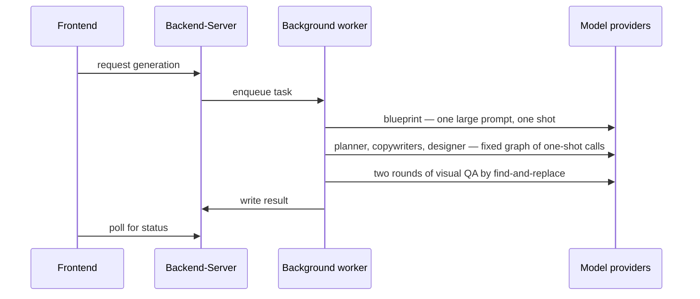
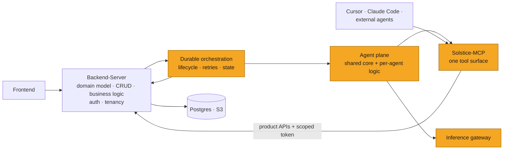
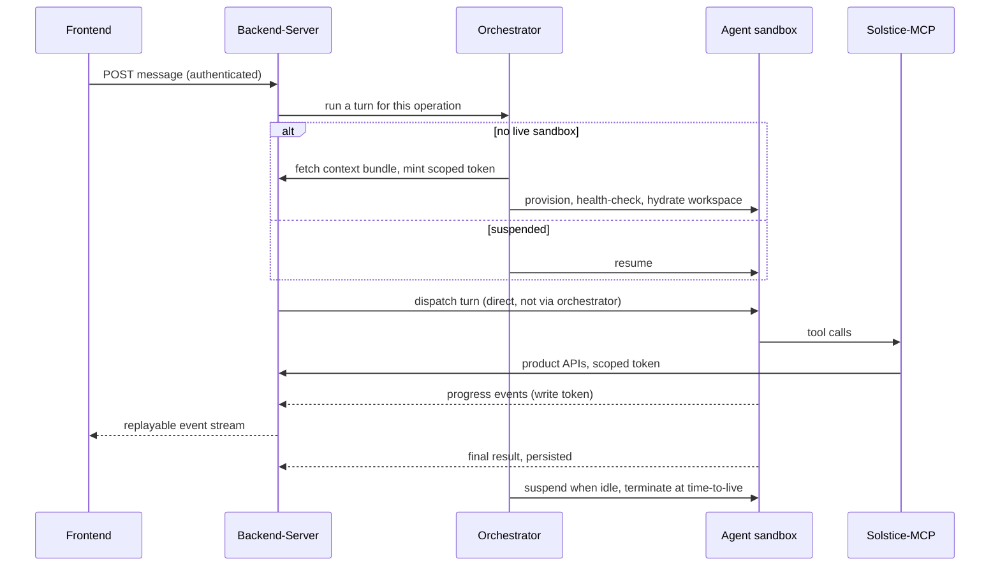
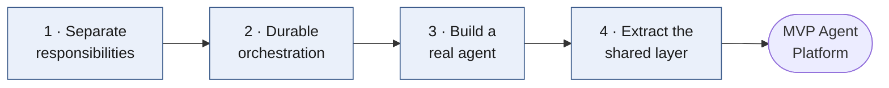
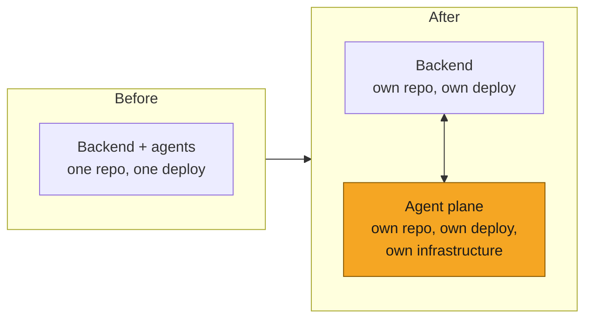
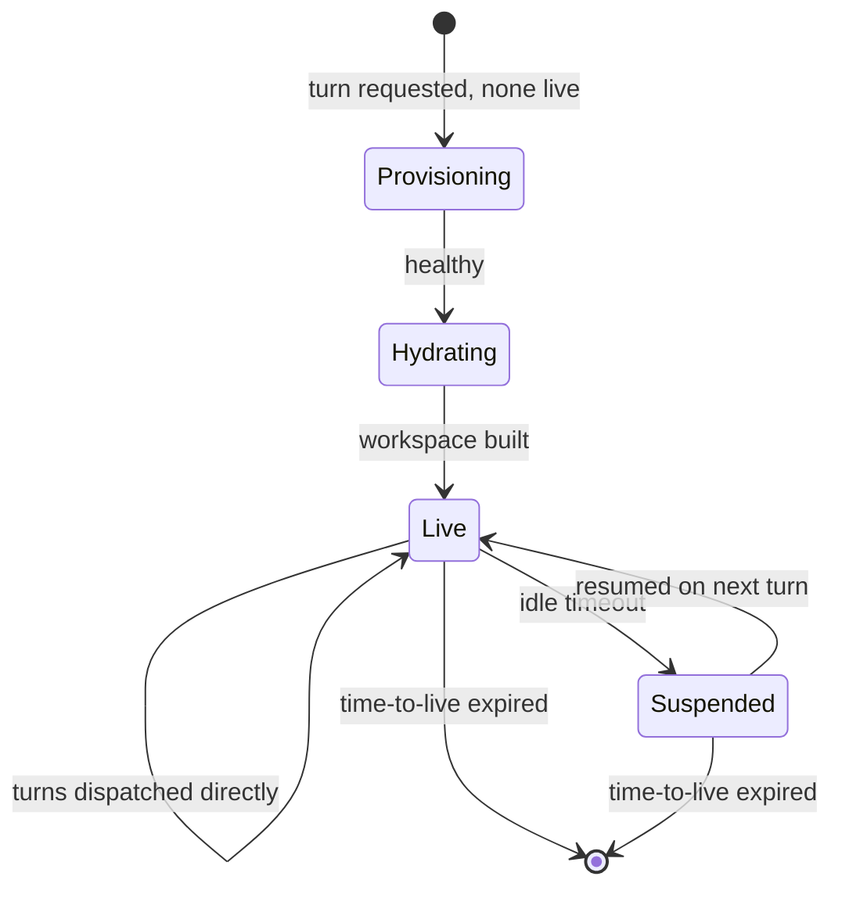
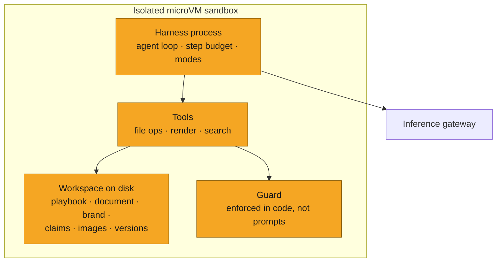
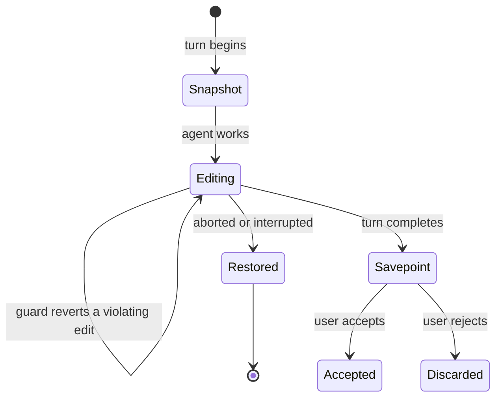
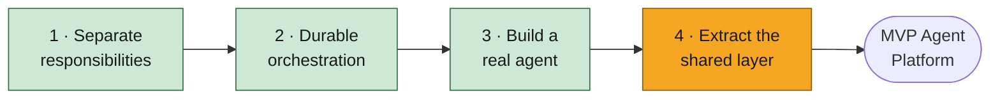

# Agent Platform: from many bespoke pipelines to one substrate

| | |
|---|---|
| **Project** | [Agent Platform](https://linear.app/solsticehealth/project/agent-platform-f5e27bf9821c) |
| **Author** | @GifanSolstice |
| **Reviewers** | 2, one owning the Solstice-AI / agent-platform domain |
| **Tier** | 2 |
| **Status** | Building |
| **Date** | 2026-08-29 |

---

## Summary

**Today** we have on the order of a dozen AI-driven features in the product — the intake query agent, email and message generation, banner generation, slide generation, claim extraction, the claims library picker, MLR review, brand rule extraction, ISI extraction, document-to-HTML conversion, annotation editing, chat editing. Some are tool-using loops, most are fixed pipelines. This document calls all of them *agents*.

Every one was built end to end inside the product backend, sharing almost no code — its own model calls, prompts, retries, orchestration, progress reporting, error handling, deployment path. The result is 1,361 hardcoded model identifiers across 319 files, 759 hand-constructed provider clients, and up to thirteen concurrent versions of a single generator in the tree.

The cost is not the duplicated lines. **It is that our applied AI engineers spend most of their time on the software engineering around an agent rather than on the agent** — work repeated per feature, nobody's specialty, and therefore where the bar drops. That is why features that demo well arrive fragile. **The goal** is to make standing up a new agent cheap, so an applied AI engineer writes agent logic and inherits everything else.

**Four moves, strictly ordered:**

| # | Move | Solves |
|---|---|---|
| 1 | **Separate the responsibilities** — agents leave the backend and become independently deployable services behind a hard boundary | Coupling of code, release cycles, and blast radius |
| 2 | **Introduce a durable orchestration layer** | The incidental complexity and instability of gluing distributed systems together |
| 3 | **Implement a real agent on it** | Proves the substrate, and produces the concrete thing abstractions can be drawn from |
| 4 | **Extract the shared layer** — agent core, capabilities, contracts, frontend components, control flow | Duplication across every layer, for every future agent |

**Where we are.** Moves 1–3 are done and in production. Move 4 is underway: agent lifecycle, runtime definition, and infrastructure registry are extracted; remaining are the shared service surface, the multi-agent build pipeline, standardized contracts and frontend components, the backend-side facade, and per-agent resource tiering. Three platform primitives are landing alongside — deployment environments, durable telemetry, and a single local development stack.

**Reaching the MVP Agent Platform is roughly two weeks of work** ([§6](#6-where-we-are-and-what-the-mvp-agent-platform-means)). The MVP is not the finished platform; it is the point at which the structure is complete and everything after it is incremental rather than further foundation.

---

## 1. The problem

### 1.1 Every agent was built end to end, alone

Each AI feature was built by whoever owned that product surface, when it was needed, with no shared substrate — because none existed. A reasonable trade the first few times; a dozen times over, it produces a codebase where the same problems are solved a dozen ways and no solution improves the others.

| Agent | What it does | Concurrent implementations in the tree | How it executes |
|---|---|---|---|
| Query agent | Turns intake material into a brief / blueprint | 3 | Background task |
| Email & message generation | Generates email and message content | 13 | Background task |
| Banner generation | Generates banner creative | Own stack | Background task |
| Slide generation | Generates presentation assets | 5 | Background task |
| Claim extraction | Mines claims from source documents | 6 | Background task |
| Claim picker | Selects claims for a given asset | 5 | In-process, inside generation |
| MLR review | Runs regulatory checks over an asset | Own stack | Dedicated background task |
| Brand rule extraction | Mines brand rules from approved assets | Own stack | Background task |
| ISI extraction | Extracts and distributes ISI content | Own stack + own diff agent | Background task |
| Document → HTML | Converts PDF, Figma and image sources | 3 separate stacks | Background task |
| Annotation editing | Edits and re-runs document annotations | Own stack | Background task |
| Chat editing | Conversational editing of a live asset | 1 | **Sandboxed service (on the platform)** |

"Concurrent implementations" means versions that all currently exist in the tree — not a history. There are eight separate copies of a diff agent at eight paths; deleting any requires knowing which product surfaces still route through it, and nothing records that.

### 1.2 What gets reinvented, layer by layer

Every horizontal concern below is implemented once per agent, differently, with no shared owner.

| Layer | How it varies today | Evidence |
|---|---|---|
| **Model access** | Provider SDKs constructed inline at each call site; model identifiers written as literals | 759 client constructions across 273 files; 1,361 model-ID occurrences across 319 files; **78 distinct model identifiers**, many long superseded |
| **Prompts** | Inline in the code that uses them, versioned only by commit history | 144 files carrying prompt constants; no inventory, no way to answer "which prompt produced this asset" |
| **Retry & failure handling** | Hand-rolled loops per pipeline | 137 hand-written retry loops against 15 uses of a retry library |
| **Orchestration** | Background tasks, chained by hand | 45+ tasks in a single ~7,200-line module |
| **Progress reporting** | Four unrelated mechanisms across the product | Server-sent streams, WebSockets, a Redis stream, and status polling — all live simultaneously |
| **Frontend** | No shared agent-run surface | 21 streaming consumers and 34 polling sites; chat, review, and query agent surfaces share no abstraction |
| **Tools & context** | Redefined per agent | Retrieval, rendering, and context assembly written fresh each time |
| **Guardrails** | Prompt instructions plus ad hoc checks | A compliance fix lands in one pipeline; the others never learn about it |
| **Deployment** | None are separately deployable | Every agent ships when the backend ships |
| **Quality** | Manual review | No shared eval harness; "is this better than last week" is unanswerable |

> **How these numbers were produced.** Pattern-matched static counts over the two main backend source trees (1,580 files) and the frontend application directories, for provider client construction, model identifiers, prompt constants, retry loops, and streaming primitives. They include tests and some unreachable code — order of magnitude, not an audit. Commands reproducible on request.

### 1.3 What a run looks like today

Generation is the highest-volume of them, and representative:



Roughly 30,000 lines across two files. Every call is one-shot: there is no closed loop, so nothing renders the output and feeds the defects back — quality is whatever the last call happened to produce. Prompts are inline in the code. Retries, model choice, progress reporting and error handling are all implemented inside the pipeline. The frontend learns what happened by polling. One node of the graph — the compliance check — is dead code, and nothing detected that, because there is no eval and no shared telemetry to detect it with.

Hold this next to §2.3.

### 1.4 Why this matters more than the line count

Duplication is the visible symptom. Three consequences are the actual problem.

**A fix is not a fix.** Correcting a behaviour in one pipeline leaves the defect in the others, and nobody knows how many without reading all of them — which is why the same class of bug returns under a different feature name.

**Everything must be understood before anything can be changed.** A new engineer touching generation reads a bespoke stack with no shared vocabulary. Code written once but read for years is where maintenance cost lives, and we wrote this code a dozen times.

**Our applied AI engineers are spending their time on the wrong thing.** This is the one that matters. Standing up an agent means solving deployment, orchestration, retries, streaming, progress reporting, error handling, and frontend wiring before any work on the agent itself — a large fraction of the effort, outside their specialty, repeated per feature. The bar then drops on exactly that work, because attention is going to the AI. **That is the mechanism behind features that demo well and then don't hold up:** every feature builds its own production substrate under deadline.

**The goal: an agent should be its own logic plus a declaration.** Everything shared — agent loop, sandbox, tools, guardrails, context assembly, streaming, telemetry, durability, deployment — is inherited, not copied, so a platform fix reaches every agent at once instead of the one team that wrote it.

---

## 2. Target design



### 2.1 Four responsibilities

**Backend-Server** owns the domain model, CRUD, business logic, authentication, authorization, and tenancy, and is the only thing holding data-layer credentials. It treats agents as it treats any other service it calls.

**The agent plane** owns how an agent works — loop, tools, context, guardrails, prompts, resource footprint. It holds no data-layer credentials, reaching data through product APIs with a scoped, on-behalf-of token. If an API does not serve what an agent needs, we improve the product API rather than open a private back door.

**The durable orchestration layer** owns the glue: provisioning a sandbox, hydrating it, dispatching work, suspending it when idle, expiring it, and surviving crashes and deploys mid-step. It calls Backend-Server too — fetching the context bundle and having tokens minted — so it is a participant, not a one-directional pipe.

**The inference gateway** owns model access: selection, failover, rate limits, and cost attribution per agent and per client — so a model identifier is a configuration value in one place rather than a literal in 319 files.

### 2.2 The tool surface: Solstice-MCP

A standalone service exposing the platform as MCP tools — brand context, content and operations, discovery, requests, user administration, memory. It is stateless and authenticates the caller directly: an identity provider mints a token scoped to the MCP audience; the service validates signature, issuer, audience and subject, requires a connect scope, and re-checks tenant and brand membership on every call. Caller tokens never leave the process.

The intent is that **this is the only way anything reaches the platform to do work**:

- **Our own agents** get platform capabilities as tools rather than bespoke per-agent clients.
- **Cursor, Claude Code, and other development agents** connect to the same endpoint, so internal tooling operates on real platform semantics instead of ad hoc scripts and direct database access. A plugin ships alongside the server carrying the skills for these workflows.
- **External and partner agents** get one authenticated, tenant-scoped, auditable surface rather than API keys and a written contract.

**What the tools should be.** A thin wrapper over a product API call, with the argument shape and description making it usable by a model — a single well-described, permission-checked vocabulary, not a second implementation of the product.

**Where it is today.** The memory tools follow this shape. The content and operations tools reach tenant databases directly and therefore re-implement backend write behaviour to stay consistent with it — the §1 coupling reproduced in a newer service. Same fix: move them onto product APIs and delete the duplicated logic.

### 2.3 What one agent run looks like, end to end



What the diagram does not show:

- **Backend-Server is the last point at which business logic is involved** — it authorizes, resolves tenancy, and persists the user's turn before handing off. The frontend does not know a sandbox exists.
- **Provisioning is journaled and serialized per operation**, so a crash resumes rather than restarts and two concurrent requests cannot produce two sandboxes.
- **Turns bypass the orchestrator** deliberately, and the durability that follows from that is spelled out in move 2.
- **Progress goes through the backend, never to shared infrastructure directly.** The backend validates the sandbox's write token and appends to a per-operation stream the frontend tails and can resume from its last-seen event. That checkpoint is the point of running the sandbox isolated.

The property worth noticing: **at no point does Backend-Server know what model was used, what the prompt said, what tools existed, or how much memory the sandbox has** — those are agent-plane decisions. And at no point does the agent hold a database credential.

### 2.4 Identity, and why it is an enterprise question

Four credentials, each scoped to one hop. The mechanics matter less than what they let us state in a security review:

| Hop | Credential | What it buys |
|---|---|---|
| Person → product | the user's own authenticated session | Every action traces to a person |
| Anything → Solstice-MCP | a token minted for the MCP audience, carrying a connect scope, with tenant and brand membership re-checked on every call | One authenticated, tenant-scoped, auditable door — for our agents, our internal tooling, and partners alike |
| Agent plane → product data | a scoped, on-behalf-of token minted per run | An agent *cannot express* a cross-tenant query, because the scope lives in the token rather than in the query |
| Sandbox → product | a short-lived write token, with the run's identity taken from the token's claims and never from the request body | A sandbox can only write to its own run, and only to its own gateway |

The properties that follow are the ones enterprise review actually asks about: no ambient credentials inside sandboxes, tenant separation enforced by construction rather than by convention, per-agent keys instead of one shared key, and every agent action attributable to a run, a version, and a person.

These are also the two hardest things to retrofit. Building them into the boundary now is far cheaper than adding them to a dozen migrated agents later — which is part of why the platform comes before the migrations.

---

## 3. The four moves

Each move solves a distinct problem, changes a different layer, and cannot start before the one above it.



| Move | Cannot start before | Because |
|---|---|---|
| 1 · Separate responsibilities | — | |
| 2 · Durable orchestration | 1 | There is nothing to orchestrate *between* until the backend and the agents are separate deployable things |
| 3 · Build a real agent | 2 | An agent needs somewhere to run and something to manage its lifecycle |
| 4 · Extract the shared layer | 3 | You cannot know which pieces should be shared, or what their seams look like, until at least one real agent exists to draw them from. Guessing produces the wrong abstraction, which is more expensive than none |

### Move 1 — Separate the responsibilities

**The problem.** Backend and agents are coupled in code, process, and release: an agent change requires a backend deploy, a backend refactor can break an agent, and neither side has a defined surface, so the boundary erodes one feature at a time.

**The change.** Make the boundary *physical* rather than a matter of discipline. Agents move to their own repository, artifacts, and infrastructure. The backend calls them as services; they call the backend as a client, over product APIs with a scoped token — no direct database access.



A separate repository and deployment, rather than internal modules, because a module boundary is a convention and §1 is the record of what happens to conventions under deadline (§4). It yields agents versionable on their own cadence, a backend that need not know how agents work, and a home for shared agent code — which move 4 depends on entirely.

### Move 2 — Introduce a durable orchestration layer

**The problem.** Sandbox management — provisioning an isolated environment, health-checking it, hydrating it with context, dispatching work, suspending it when idle, reclaiming it at its time-to-live — is *incidental* complexity belonging to neither the backend nor the agent. It is also the least reliable part of the system, being entirely calls between distributed components: any step can fail, time out, or be interrupted by a deploy. A crash mid-provision leaves orphaned state; a retry produces a second sandbox and a second bill. Before this layer the only guard was a lock in a single process, so two web workers could each find no live sandbox for the same operation and both launch one.

**The change.** Give that work its own layer on a durable orchestrator — purpose-built to execute multi-step distributed workflows with each step journaled and replayable, and concurrent calls against the same entity serialized rather than racing. We use Restate; full evaluation in the SOL-2878 plan. Each operation gets a durable object owning the sandbox's whole life:



Two details matter more than the diagram:

**Hydration is pulled, not pushed.** The orchestrator requests the operation's context bundle, has a scoped token minted, and builds the workspace from it. The bidirectional dependency is deliberate — it keeps the backend's job "answer questions about the domain" rather than "know what an agent needs."

**Turns deliberately do not go through it.** Provisioning is rare, multi-step, and must not half-fail — exactly what a journaled execution engine is for. A live turn is the opposite: a long stream of thinking deltas and partial edits, none of which ever needs replaying. Routing it through a journaled, per-key-serialized object would bloat the journal with disposable data, add latency to every chunk, and risk blocking the object's own idle and expiry timers. So the backend dispatches turns straight to the sandbox, and the orchestrator owns everything around them.

#### What is guaranteed during a turn

Provisioning and hydration are journaled and serialized. A turn is not — so it is worth being precise about what does hold:

- **Exactly one terminal.** Every turn ends in exactly one of *done*, *error*, or *interrupted*, including when a bug escapes the pipeline: crash containment terminalizes the turn rather than taking the process down.
- **Ordered, replay-safe delivery.** Events carry a per-turn sequence number, strictly increasing, with one writer and one request in flight. The receiver accepts a batch only if it advances the cursor, and answers a replay as *already delivered* rather than as an error — so a retry is always safe.
- **Nothing half-written.** The document is snapshotted before the turn and restored if the turn aborts. Each completed turn writes a savepoint, so the asset always sits on a known version.
- **The client can rejoin.** Events land in a per-operation stream the frontend tails by cursor. A reload resubscribes from its last-seen event, and a cursor that has aged out of the stream is detected rather than silently skipped.
- **The runner can only talk to its own gateway.** The destination is deployment configuration, never something the caller supplies — batches carry tenant content, so this is a containment property, not a convenience.

**What is deliberately not guaranteed:** a turn does not survive its sandbox. If the VM dies mid-turn, the turn terminalizes, the document returns to its pre-turn state, and the user retries. Making a live turn resumable would mean journaling a stream that exists to be watched once — the same trade rejected above, and not worth making.

### Move 3 — Implement a real agent on it

**The problem.** Moves 1 and 2 produce a substrate with nothing on it — unvalidated, and with nothing concrete to generalize from.

**The change.** Build one real production agent: the chat editing agent, which edits a live email or banner conversationally. Deliberately, without trying to make it general.

#### How it actually works



**The sandbox.** An isolated microVM per operation — a workspace, not a service: the harness process inside it *is* the agent. No data-layer credentials; it talks only to the backend and the gateway.

**The workspace is the context.** Instead of a giant prompt, the orchestrator deterministically builds a directory from the backend's context bundle: a playbook the agent reads first, the document being edited, brand guidance, the approved claims as greppable files plus an allowlist, an image manifest, user attachments, a render directory, and a version history. The agent *pulls* what it needs by reading and grepping.

The blocks, illustratively — the bundle differs per agent by design, and this one is shaped around editing an asset:

| Block | Example content |
|---|---|
| Playbook | How this agent should work; the first thing it reads |
| Subject | The document being edited |
| Brand | Guidance and design tokens |
| Claims | Approved claims as greppable files, plus the allowlist |
| Media | Image manifest and user attachments |
| Working area | Render output, savepoints, version history |

**The loop.** A tool-using loop over the inference gateway, with a bounded step budget and selectable intelligence modes trading depth against latency and cost per turn.

**The tools** are file operations — read, edit, write, grep, glob — plus a few domain tools. The important one is rendering: it screenshots the document in a warmed browser and returns both the image and a deterministic list of layout defects computed from the DOM — broken images, horizontal overflow, collapsed regions, contrast failures. That gives the loop a closed feedback signal, part model judgment and part machine check, rather than the model grading its own homework.

**The guardrails are code, not prompt instructions.** A path jail; read-only reference material; regions locked by regulatory review reverted if modified; any claim identifier not in the approved allowlist reverted. These execute at the runtime seam, so they hold regardless of what the model decides — the most important property to preserve when generalizing, because it is what makes a compliance rule enforceable rather than requested.

**Streaming and lifecycle.** The agent posts progress with a minted callback token; the backend appends to a replayable per-operation stream the frontend tails. Sandboxes suspend after inactivity and terminate at a time-to-live, both owned by the orchestrator.

**What happens to the document across a turn.** Reversibility is a mechanism, not a promise:



Note the self-loop: a guardrail violation reverts the offending edit rather than failing the turn, so the agent keeps working against a correct document instead of stopping. An abort restores the whole pre-turn snapshot. A completed turn becomes a savepoint the user accepts or discards — which is why "reversible cutover" and "roll back a bad agent version" are the same mechanism applied at different scales.

#### Why it was deliberately not made general

Abstracting before a second case produces seams in the wrong places (§4), so the first agent was built as one concrete thing with the shared-looking pieces kept identifiable but not lifted out. The accepted cost: every reusable piece lives *inside* this agent, and one fixed sandbox size serves every workload.

**And the old path goes.** An agent is finished when the one it replaced is deleted, not when the new one works. The pattern is a reversible cutover with the legacy path live until production is fully moved, and deletion immediately after.

### Move 4 — Extract the shared layer

**The problem.** With one agent the substrate works but is not a platform: everything reusable lives inside the first agent, so adding a second means hand-copying roughly fifteen files across four toolchains — Python, TypeScript, Terraform, CI — which is §1 reproduced in a new repository.

**The change.** Lift the shared pieces out from under the first agent so a new agent *declares* itself and *implements an interface* rather than forking files.

#### What a new agent should write, and what it should inherit

| Written per agent | Inherited from the platform |
|---|---|
| Its playbook and prompt blocks | The agent loop, step budgeting, and intelligence modes |
| Which tools and skills it composes | The tool protocol, registration, and the shared tool implementations |
| Which guardrails apply to it | Guardrail enforcement at the runtime seam |
| The shape of its context bundle | Workspace construction, hydration, and versioning |
| Its declared resource footprint | Sandbox provisioning, suspend, resume, expiry |
| Its output shape | Streaming, event contract, replay, and the frontend surface that renders it |
| — | Telemetry, cost attribution, environments, build and deploy |

#### What a declaration contains

Schematically — the shape, not the contract:

```
agent
  identity      name, version
  runtime       shape (tool-using loop | deterministic graph), model policy, modes
  resources     sandbox tier
  context       which bundle blocks to build, and from which product APIs
  capabilities  tools, skills, guardrails, lifecycle hooks, prompt blocks
  output        asset kind, event mapping, how a result is handed back
```

**Capabilities are extensions, not copied code.** The harness already accepts capabilities as registered extensions rather than compiled-in behaviour — the chat editing agent's guardrail is one such extension today, attached at the runtime seam. Generalizing means that registry becomes shared: a guardrail, tool, or lifecycle hook is written once as a pi extension and named in any agent's declaration. That is the mechanism behind "guardrails are inherited rather than one team's discipline" — without it, the phrase is an aspiration.

#### The seams being extracted

| Seam | What it is | Concrete example |
|---|---|---|
| **Agent specification** (lifecycle) | A declaration of how an agent's sandbox is provisioned, hydrated and reclaimed. The durable orchestration object is generated from it | A second agent registers a specification with its own settings namespace instead of copying the lifecycle service |
| **Agent definition** (runtime) | Tools, guardrails, system prompt, and mode registry, with the session loop generic over it | A pipeline-shaped agent supplies a different definition and reuses the same loop, streaming and budgeting |
| **Agent manifest** | The agent's own wire contract — turn fields, context bundle, output shape — extended to declare resources | Memory tier becomes a field the agent owns, so an applied AI engineer changes its footprint by editing the agent's own file rather than orchestration code one layer up |
| **Infrastructure registry** | Images and services generated per agent from configuration | Adding an agent is a registry entry, not a new Terraform module and a new deploy job |
| **Agent facade** (backend side) | One object exposing start, stream, suspend and terminate, instead of two separately threaded clients — one for lifecycle, one for turns | The backend stops needing to know that lifecycle and turns are different transports |
| **Event contract** | One vocabulary for what any agent emits — thinking, progress, partial output, terminal states | The frontend renders any agent's run without agent-specific code |
| **Control flow** | One standard path from frontend to backend to orchestrator to agent and back through the callback and stream | Reconnect, replay and interrupt behave identically for every agent, and are implemented once |
| **Frontend components** | A shared surface for running an agent, watching it work, and reviewing what it produced | A new agent gets a usable interface without a new interface being built |
| **Capabilities** | Tools, skills, guardrails, lifecycle hooks and prompt blocks as composable units | The approved-claim allowlist guardrail attaches to any agent that produces regulated copy, instead of being re-implemented per agent |

**Two shapes, one substrate.** Not every agent should be a conversational tool-using loop; several of the §1.1 pipelines are better as deterministic graphs making direct model calls — cheaper, more predictable, easier to evaluate. The platform should run both on the same substrate, so shape is a per-agent choice rather than a fork in the infrastructure. The tool-using loop is the only shape that exists today.

**Not every seam is extracted at once, and that is deliberate.** A generic service surface and a dynamic multi-agent build pipeline are held back until a second agent exists to verify them against — untested control flow in a production deploy path is a worse trade than the copy-paste it would replace. Same judgment as move 3, one level up.

---

## 4. Trade-offs and rejected alternatives

| Decision | Why, and why not the alternative | Revisit when |
|---|---|---|
| **A hard repository and deployment boundary**, and its cross-repository coordination cost | A boundary that cannot erode by accident. A module boundary inside one deployable is a convention, and §1 records what happens to conventions under deadline; refactoring in place also leaves release cycles coupled | Coordination cost on a typical change exceeds the benefit — in practice, if most agent changes start requiring paired backend changes |
| **An external dependency for durable orchestration** (Restate) | Calling systems in order, remembering progress, retrying safely, and serializing per entity is well-understood infrastructure with mature implementations. Building it ourselves would be the largest instance of the reinvention this project exists to eliminate | Operating it costs more than the failure modes it removes |
| **One deliberately non-general first agent**, and the extraction work following it | Abstractions drawn without a concrete case land in the wrong places, and a wrong abstraction costs more to remove than duplication. Hence move 4 after move 3 | N/A — already spent |
| **No direct database access from the agent plane**, and the requirement to improve product APIs when data is missing | Tenancy and audit enforced by construction | Never; this is the load-bearing constraint |
| **An inference gateway in the request path** for every model call, adding a hop | One place where model choice, failover, and cost attribution live | — |
| **Build the platform** rather than keep building agents in the backend | The cost is per-agent and compounds; §1.2 is what a dozen repetitions looks like | — |
| **Build the platform before migrating the existing agents** | Migrating onto an unfinished substrate inherits its defects a dozen times over, and the platform's hardest properties — tenancy, audit, cost attribution — are cheap to build in and expensive to retrofit | — |

## 5. Risks and rollback

**Move 4 produces the wrong seams**, being drawn from one and a half agents rather than three. Mitigated by deferring the pieces that cannot yet be verified — the shared service surface and the multi-agent build pipeline — and by treating the second workload as the forcing function rather than a formality.

**Migrations stall**, leaving two planes running and doubling the maintenance surface. Mitigated by the rule that anything not migrated is deprecated and deleted, and by gating each migration on evals rather than judgment.

**Tenancy and client data.** The agent plane holds no data-layer credentials, so a migrated agent cannot express a cross-tenant query. Traces and eval datasets are derived copies of client content and get a retention path from the start rather than a backfill later.

**Rollback.** Each move is independently reversible at its own layer, and cutovers happen on reversible flags with the old path live until the new one is proven — the pattern used for the chat editing agent.

---

## 6. Where we are, and what the MVP Agent Platform means

### 6.1 Status



Moves 1 through 3 are done and running in production. The chat editing agent serves live traffic and the path it replaced has been deleted — roughly 11,800 lines removed across the backend and the agent repository. Move 4 is underway; the second workload that forces its seams open (SOL-3169, folding generation into the same runtime) is in review. Two move 4 pieces are deliberately not started — a generic service surface and a dynamic multi-agent build pipeline — both waiting on that second agent to be verifiable at all.

| Work | Move | Status |
|---|---|---|
| Agent repository, infrastructure, delivery pipeline | 1 | ✅ Done |
| Blocking PR checks (lint, types, tests, contracts, scanning) | 1 | ✅ Done |
| Inference gateway | 1 | ✅ Done |
| Durable orchestration of sandbox lifecycle | 2 | ✅ Done |
| Chat editing agent in production; legacy path deleted | 3 | ✅ Done |
| Agent lifecycle + runtime extracted behind declarations | 4 | ✅ Done |
| Infrastructure driven from an agent registry | 4 | ✅ Done |
| Deployment environments (dev / prod / ephemeral) | Platform | 🟡 Testing |
| Durable telemetry | Platform | 🟡 In review |
| One local development stack | Platform | 🟡 Pending testing |
| Second workload on the shared runtime | 4 | 🟡 In review |
| Shared service surface + multi-agent build pipeline | 4 | ⬜ Remaining |
| Event contract + standardized control flow | 4 | ⬜ Remaining |
| Shared frontend components for agent runs | 4 | ⬜ Remaining |
| Backend-side agent facade | 4 | ⬜ Remaining |
| Per-agent resource tiering | 4 | ⬜ Remaining |
| MCP content tools moved onto product APIs | 1 | ⬜ Remaining |
| Eval infrastructure on the agent plane (Braintrust) | Platform | ⬜ Remaining |
| Agent version identity + take a version out of service | Platform | ⬜ Remaining |
| Per-run step and token ceilings, per-agent concurrency cap | Platform | ⬜ Remaining |

**Target: approximately two weeks — the week of 8 September 2026.** A forecast, not a commitment; if it slips, the honest report is which item and why, rather than a new date.

### 6.2 What the MVP is not

Everything below follows the MVP. Three items the MVP *starts* rather than finishes: the platform gets the mechanism, the depth comes later. That line is drawn, as a judgment call, where the mechanism stops being foundation and starts being coverage.

- **Eval coverage** — golden datasets and scored eval suites per agent, wired in as a release gate. *In the MVP:* Braintrust integration on the agent plane, run capture, a scored eval runnable from CI. Braintrust is already integrated on the legacy side, with eval CI, online capture and telemetry hooks; none of it reaches the agent plane today. *Not in the MVP:* the datasets and suites themselves, per-agent work that never really ends. Also the precondition for migrating an incumbent pipeline safely — you migrate when the new agent's evals beat the old one.
- **Cost and capacity controls** — *In the MVP:* hard per-run ceilings on steps and tokens, a per-agent concurrency cap, cost attributed per run. *Not in the MVP:* per-client budgets with enforcement, chargeback, and capacity policy that reacts to load. The gateway already makes spend visible; the milestone is making it bounded, not governed.
- **Agent versioning and rollout** — *In the MVP:* an agent version identifiable from the asset it produced, and a way to take a bad version out of service without a code deploy. *Not in the MVP:* canary releases, gradual rollout, and per-client version pinning as a product capability.
- **Migrating the remaining agents** — the dozen pipelines in §1.1, each moved onto the platform, characterized against a golden set, cut over on a reversible flag, then deleted. Anything we choose not to migrate gets deprecated and removed.

Further out, what the platform makes possible rather than what we are committing to: memory and personalization, eval data pipelines fed from real work, composed workflows where agents call agents on one durable orchestration, self-serve agent creation, and driving cost per asset down by routing to cheaper models wherever evals show no loss.

**The distinction that matters:** everything remaining is *additive* — depth on a working platform, scoped and shippable on its own. None of it is further foundation, and none of it blocks the others. That is what changes at the MVP.

---

## Decision log

| Date | Decision | Options considered | Why | Who | Status |
|---|---|---|---|---|---|
| 2026-08-29 | This document supersedes the "MVP to Production Platform" write-up as the project's architecture doc | Keep both; retire the older one | One canonical doc; the older one was organized by workstream rather than by design, which obscured the ordering | Author | Decided |
| | | | | | |

## Sign-off

| Reviewer | Verdict | Date | Note |
|---|---|---|---|
| @ | Approve / Blocked | | |
| @ | Approve / Blocked | | |
