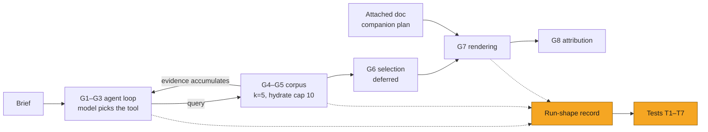

# Content generation evals: intermediate boundaries of the generate turn

| | |
|---|---|
| **Ticket** | *needs-plan ticket to be filed; file renamed to `SOL-XXXX-content-generation-evals.md` when it exists* |
| **Author** | @abhipsha16 |
| **Reviewers** | @arindam-sharma · @eeva-ff |
| **Tier** | 1 |
| **Status** | Draft |
| **Date** | 2026-08-17 |
| **Companion plan** | [`claim-extraction-evals.md`](claim-extraction-evals.md) |

> [!IMPORTANT]
> **Tier check.** No triggers apply: observe-only tests plus a run-shape record; no auth/tenancy,
> no PHI handled in a new way, no schema migration, no new vendor, no API contract change,
> reversible in under a day. Tier 1; Tier 2 sections deleted.

## 1. Problem

Asset-level quality scores cannot attribute a failure to a stage. A weak email may result from a
poor interview, a missed retrieval, an evidence set truncated before use, or a rendering fault —
indistinguishable at the output. This plan defines tests at each intermediate boundary of the
generate turn. The measured question is whether a required fact survives the chain
**retrieved → carried forward → rendered → cited**, with every drop attributed to the stage that
caused it.

### Boundaries with other plans

| Area | Status | Where |
|---|---|---|
| Extraction of attached documents | excluded | [`claim-extraction-evals.md`](claim-extraction-evals.md) — all extraction is specified there |
| Brand corpus ingest | deferred | Excluded pending clarification; this plan treats the corpus as a fixed, pinned input |
| Selection stage and blueprint | deferred | Blueprint generation may be removed; see Trade-offs |

## 2. What exists today

Paths relative to `Backend-Server/src/content_generation_new/application/Agentic_Workflows/`.
Line-level citations: `notes/pipeline-architecture-map.md` in the solstice-dev workspace. All rows
code-verified.

### Stages and observable artifacts

| # | Stage | Operation | Artifact | Deterministic |
|---|---|---|---|---|
| G1 | Domain detection | Keyword match on brief text; selects which domain rules apply | domain tags | yes |
| G2 | Interview | Gap analysis and question generation | question list | no |
| G3 | Query generation | LLM turns each user answer into search queries | query list | no |
| G4 | Search | Vector search over the corpus, top 5, no relevance judge; previously returned groups permanently excluded | ranked groups | yes, given corpus |
| G5 | Hydration | Fetch claims by id, capped at 10 per group | evidence set | yes |
| G6 | Selection | LLM chooses evidence, emits a section plan | blueprint | no · deferred |
| G7 | Rendering | Channel generator produces markup from the evidence set | HTML asset | no |
| G8 | Attribution | Parse markup for claim ids, reconcile against the generator's self-report | claims-used set | yes |

Retrieval is a tool the agent chooses to call, not a guaranteed step: the pipeline carries a guard
for rendering requested with zero claims in state (`query_agent_v3/graph.py:7361-7422`). Whether
retrieval ran is a run outcome, and every metric below is read against it.

Channel facts that shape the tests: G1–G5 are shared across all eight channels; query generation
receives a media type fixed to `email` (non-email channels retrieve under email constraints);
campaign bypasses the agent loop and calls search directly, once, with no exclusion state, domains
fixed to Efficacy and Safety, and the step disabled by default.

### Failure modes

| # | Stage | Mechanism | Symptom in the asset | Test |
|---|---|---|---|---|
| F1 | G1 | Keywords matched as substrings without word boundaries | Wrong domain rules applied to the brief | T1 |
| F2 | G2 | No question asked on a required topic | No query generated; evidence never retrieved | T2 |
| F3 | G3 | Media type fixed to email regardless of channel | Non-email channels retrieve under email constraints | T2 |
| F4 | G4 | Retrieval tool never called | Asset rendered with zero corpus evidence | T3 |
| F5 | G4 | Returned groups permanently excluded from later queries | Retrieved set depends on question order | T4 |
| F6 | G4 | Empty search result not retried | Silent recall loss | T4 |
| F7 | G5→G6 | Ten claims hydrated per group; the selection prompt then shows 3 (5 for high-detail types), each cut to 150 chars | Asset written from fragments of the retrieved evidence | T5 |
| F8 | G8 | Reconciliation returns the union of parsed and self-reported claims | Claims absent from the asset recorded as used | T7 |
| F9 | G8 | Match rate defined as 1.0 when the asset contains no claim markers | Zero attribution scores as perfect | T7 |

## 3. Approach

Tests at each boundary, plus a per-run **run-shape record**. No production behaviour changes;
F8/F9 are two contained fixes in the attribution reconciler, ticketed separately.

### Tests

| Test | Target | Asserts / measures | Gate | Needs |
|---|---|---|---|---|
| T1 Domain detection | G1 | Exact-set match on expected domain tags, including substring traps | Deterministic, no model spend | R1 |
| T2 Interview and query coverage | G2–G3 | Generated queries collectively address every required facet; reported split by channel to expose F3 | Judged; paired baseline | R2 |
| T3 Retrieval invocation | G4 | Search ran at least once on any brief requiring approved clinical evidence; rate of runs rendering with zero corpus evidence | Deterministic | Instrumentation |
| T4 Retrieval yield and stability | G4 | Required-evidence recall against a pinned corpus; spread across question-order permutations | Deterministic given snapshot | R2, R3 |
| T5 Evidence set completeness | G5 | Share of retrieved claim text carried forward; counts withheld by the per-group cap and the character cut | Deterministic | Instrumentation |
| T6 Asset evidence support | G7 | No statement unsupported by the evidence set (altered numbers, dropped qualifiers); attachment turns reported separately | Judged; paired baseline | R2 |
| T7 Attribution accuracy | G8 | Claim ids parsed from markup vs self-report vs persisted record; over/under-report counts; share of retrieved evidence reaching the asset | Deterministic | F8/F9 fixed |

**Rollout order:** instrumentation first — T3, T5, T7 read run state and finished artifacts and can
be built before any reference data is authored. T1 needs a small authored set with no model spend.
T2, T4, T6 need R2/R3 and paired baselines.

### Run-shape record (per run)

Whether search was called and how many times; order of queries issued; groups returned per query;
claims hydrated; claims carried into rendering; whether an attachment was present; claims present in
the finished asset. Without it, intermediate metrics are uninterpretable because control flow varies
between runs on identical inputs.

### Reference data

| # | Set | Contents | Used by |
|---|---|---|---|
| R1 | Domain brief set | Briefs with expected domain tags, including substring traps | T1 |
| R2 | Brief set | Real briefs with required-evidence facets and evidence sets marked; scripted interview answers | T2, T4, T6 |
| R3 | Corpus snapshot | Pinned corpus state so retrieval is reproducible | T4 |

### Reporting rules

- All retrieval results reported against the pinned corpus snapshot; unpinned, regression and
  improvement are indistinguishable.
- Order sensitivity (F5) reported as a spread across permutations, never folded into one recall
  number.
- Runs rendering with zero evidence excluded from quality metrics; reported separately as
  invocation failures.
- Attachment turns reported separately from corpus-only turns, so extraction quality is never
  attributed to generation.

## 4. System views

### Flow: the corpus search loop is conditional on a model decision

*Context: N/A — no new service; tests read emitted records and finished artifacts.*
*Data: N/A — no schema change; records go to the eval backend.*
*State: N/A — no entity lifecycle.*

## 5. Trade-offs accepted

- We accept deferring G6 selection while blueprint generation may be removed, keeping its concerns
  covered from both sides by T5 (evidence set) and T6 (finished asset). Revisit when the blueprint
  decision lands.
- We accept treating the corpus as a fixed, pinned input to get reproducible retrieval numbers,
  giving up sensitivity to ingest quality. Revisit when corpus ingest ownership is clarified.
- We accept measuring the email-tuned retrieval constraint (F3) rather than fixing it first, so the
  fix can be sized by data. Revisit after the first per-channel T2 report.

## 6. Alternatives rejected

- One asset-level quality judge. Rejected: cannot attribute failures to a stage; already the status
  quo.
- Per-channel suites first. Rejected: G1–G5 are shared across all eight channels; testing them once
  is strictly cheaper. G7/G8 get per-channel fixtures where they diverge.
- Fixing F5/F3 before measuring. Rejected: without T4/T2 baselines there is no evidence for sizing
  either fix or detecting the improvement.

## 7. Risks and rollback

Observe-only; no production behaviour change. The run-shape record sits on the generate path and
must be fail-open. No new tenancy or PHI surface: records reference operations already processed,
stored in the existing eval backend. The two G8 fixes (F8/F9) change a logging/reconciliation path,
not generation output. Rollback is deleting the tests and record emission; under a day, no data
loss.

## 8. Verification

Pack self-checks per existing suite conventions: `replay` on stored run records (no model spend) and
`perturb` (drop a required-evidence item / inject an unretrieved claim id and require both
detected). T1 gates in CI immediately once R1 exists — deterministic, no spend.

## 9. Open questions

1. Per channel: do the generators emit claim identifiers into markup today? T7 can only run where
   they do; the per-channel confirmation sets its rollout order.
2. What is the pinning mechanism for R3 — a Pinecone namespace snapshot, an exported group/claim
   dump, or a dedicated eval index?
3. F8/F9 are two contained fixes in the attribution reconciler. Tier 0 ticket, or folded into the
   first pack PR?

---

## Decision log

| Date | Decision | Options considered | Why | Who | Status |
|---|---|---|---|---|---|
| | | | | | |

## Sign-off

| Reviewer | Verdict | Date | Note |
|---|---|---|---|
| @arindam-sharma | | | |
| @eeva-ff | | | |
