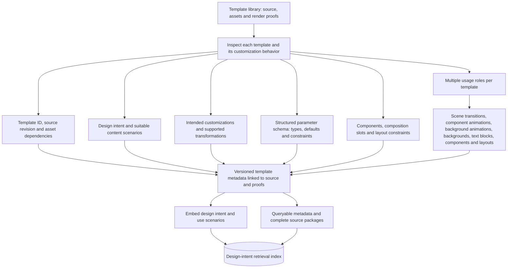
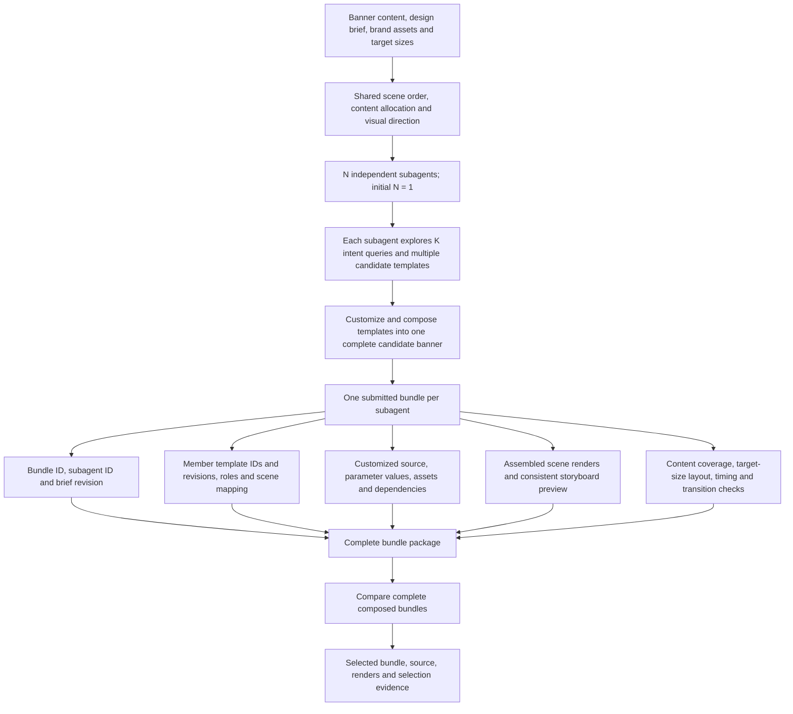
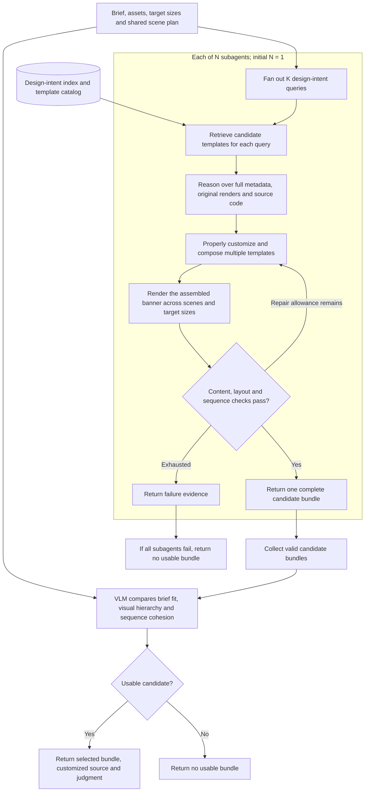
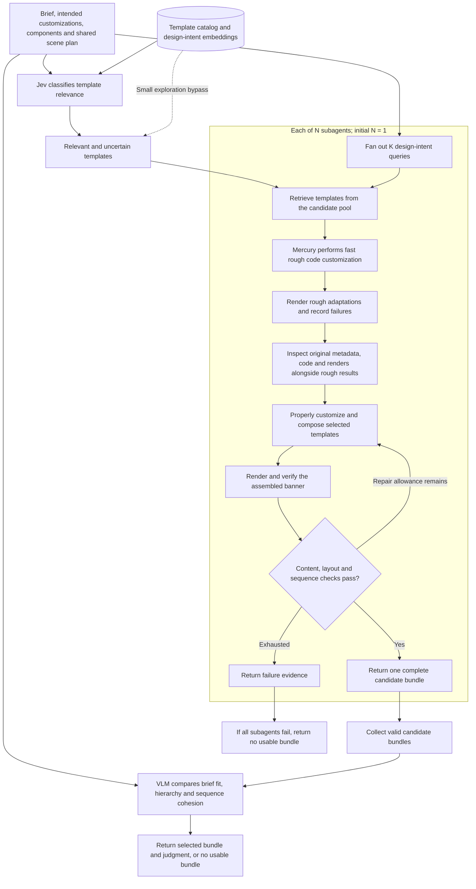
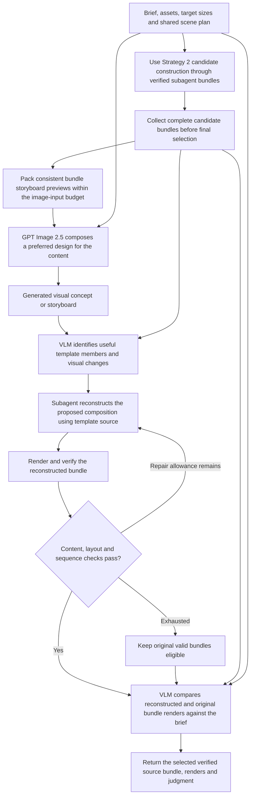
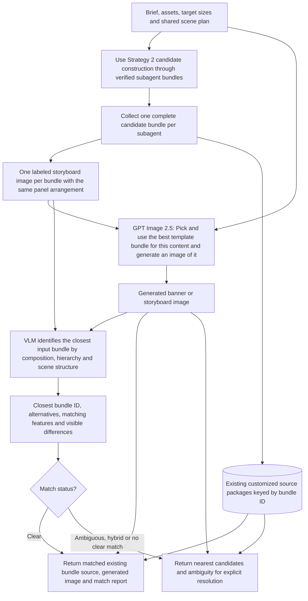
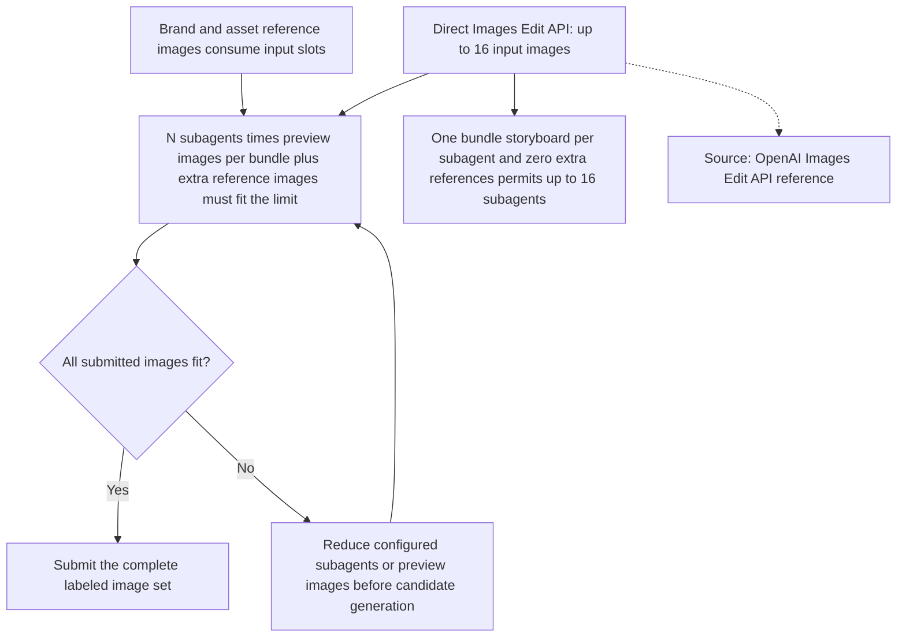
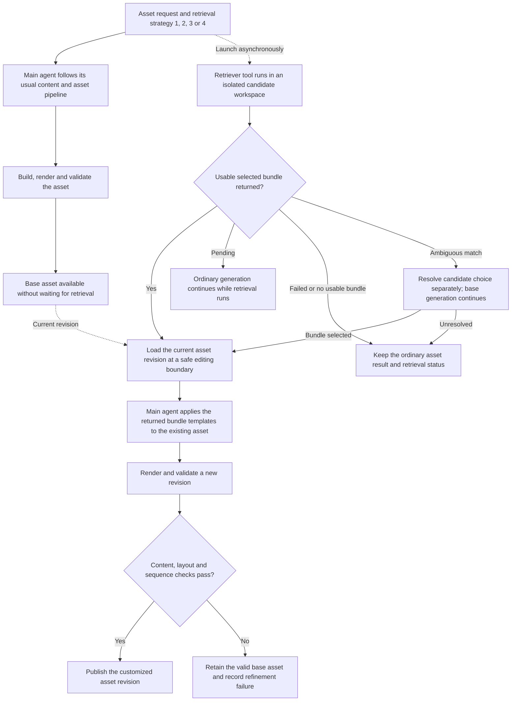
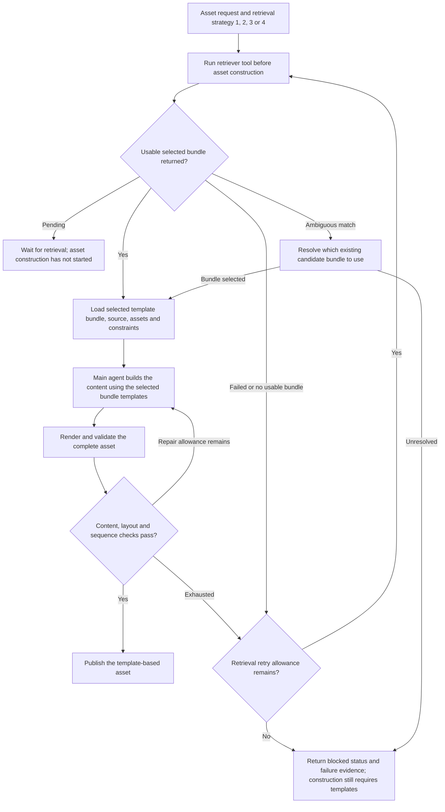

# Retriever tool — proposed banner-first plan

## 1. Shared preprocessing — index design intent, editable parameters, components and usage roles

## 2. Shared bundle contract — each subagent submits one composed candidate containing the templates it used together

## 3. Strategy 1 — intent retrieval, subagent customization and VLM selection

## 4. Strategy 2 — add Jev relevance filtering and Mercury rough code customization

## 5. Strategy 3 — add GPT Image composition, code reconstruction and final visual judging

## 6. Strategy 4 — GPT Image generates its preferred design and the VLM matches it to an existing bundle

## 7. GPT Image input allocation — cap submitted previews and extra references at the configured endpoint limit

## 8. Non-blocking mode — the main agent builds normally and applies retrieved templates when available

## 9. Blocking mode — the main agent waits for a usable bundle and builds content with its templates

