# Template mining: the implemented pipeline

**Implementation snapshot: 21 September 2026.** This describes the current local experiment, including working-tree changes. It is an implementation reference, using the context, flow, data and lifecycle views from this repository's spec format.

## 1. What template mining does

Template mining turns existing brand material into a library of reusable designs. It reads supplied PDFs, identifies distinct design patterns, rebuilds them as editable code, tests them with different content, and brings the results to a human reviewer.

For example, a photograph with an overlaid message panel can become a reusable hero: the photograph stays an asset, the headline and button become editable fields, and the template records how the layout behaves with longer text or a smaller screen. The source page, render proofs and remaining limitations travel with it.

The useful output is **a reusable implementation with evidence**, not just a screenshot:

- Code and assets that reproduce a source-backed pattern.
- Editable fields, constraints and instructions for using it again.
- References to the source pages and regions that explain the design.
- Browser proofs showing the implementation under different conditions.
- Machine findings, human decisions and version history kept separately.

The folder is named `agentic-banner-template-miner`, but the shared engine supports **banner families and non-banner MJML/email templates**. The selected configuration chooses the branch.

## 2. Where it sits

The continuous service runs locally. It serves the review UI, stores campaign state in SQLite, and runs one mining job at a time. Model requests still go to external APIs. Rendering, source extraction, artifacts and campaign storage are local.

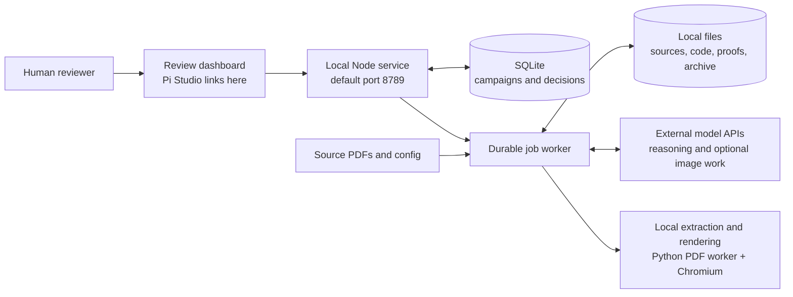

The published standalone miner bundles the dashboard in `frontend/continuous/`; the original workspace serves the same UI from the Studio frontend. The mining server serves it directly. It does not need the Python Studio gateway, a cloud deployment, Redis, Postgres or an object-store account.

**Ownership is deliberate:** agents propose designs and write candidate files; host code validates outputs, controls the queue and commits revisions; the human decides what to accept.

## 3. The two ways to enter the same engine

### 3.1 Full-corpus run versus dashboard iteration

Both routes snapshot sources and build a page inventory. Their discovery steps differ.

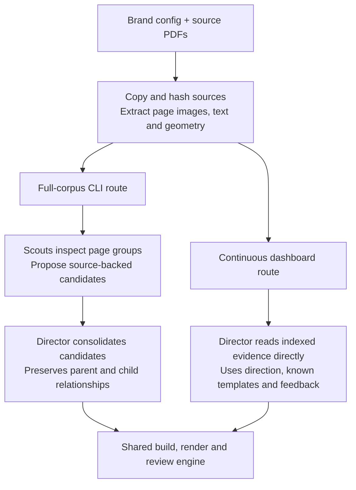

**Full-corpus route:** `init` prepares sources and tasks; `resume` runs the agents. Scouts receive page groups, then the director consolidates their proposals into a complete candidate graph. Discovery has no arbitrary family-count quota in the ordinary prompt. At the end, the engine packages a library for review.

**Continuous route:** creating a campaign snapshots its configuration and PDFs without starting model work. An explicit Mine More request creates jobs. Each discovery job goes directly to the director; the adapter removes the normal initialization's scout tasks. It asks for at most the admitted number of new identities, builds them, and publishes revisions into the campaign. This route skips the ordinary end-of-run library packaging step.

Evidence can be reused when its source and runtime identity match. “Run again” does not necessarily mean re-extract every PDF.

### 3.2 What the source inventory gives agents

The inventory retains source IDs, roles, page numbers and hashes, plus page images and extracted text/geometry. Agents can inspect decisive pages and crops instead of relying only on extracted text. Configuration supplies brand direction, exclusions and source-specific notes.

A candidate carries its source references and any children. A composition can therefore depend on a reusable element instead of silently copying it into an unrelated template. Missing artwork or conflicting sources remain recorded limitations; a useful pattern need not disappear merely because its original asset is incomplete.

## 4. From a candidate to a reviewable template

A **candidate** is a proposed reusable design. The builder turns it into files. Host checks render those files. A separate reviewer compares the result with source evidence.

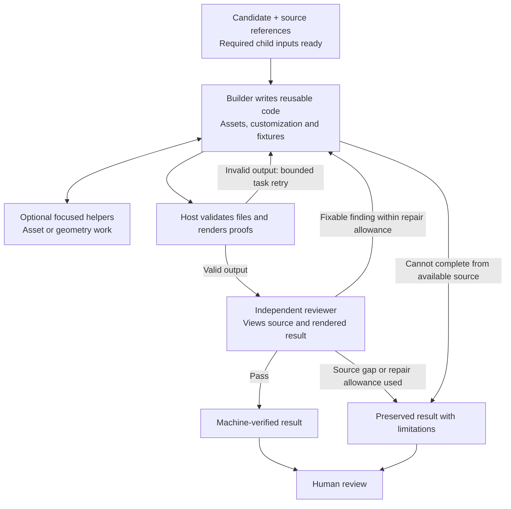

**Two different retry mechanisms:** a task can retry after execution or validation failure; a reviewer can request another builder repair after inspecting valid output. Both have configured bounds. A machine repair within a job is also different from the human-facing revision created when that job publishes its result.

The host fingerprints the artifact under review and checks that it did not change during review. Agents must actually view source and result images before completing the corresponding review checks.

### 4.1 Email and banner checks

| Concern | MJML/email branch | Banner branch |
|---|---|---|
| Reusable implementation | `template.mjml`, assets and customization metadata | Standalone HTML variants, assets and `family.json` |
| Changed content | Default fixture; distinct fixtures when fields are swappable | Source and changed-copy fixtures for swappable variants |
| Visual evidence | Desktop/mobile and images-off proofs | Native-size proofs across variants and sampled animation times |
| Review focus | Layout, live text, assets, source consistency and truthful customization | Size coverage, motion, media roles, assets and customization |
| Additional v2 records | Not the banner v2 contract | Hypothesis coverage, recipe, scoped findings and pinned child inputs |

A **fixture** is simply example content used to test a template. Longer text exposes a fragile layout; images-off rendering exposes what happens when images do not load. These checks provide evidence of behavior, not blanket email-client, accessibility or medical/legal approval.

### 4.2 A banner family owns its sizes and alternatives

A family is one reusable design identity. Size variants do not count as separate mined templates. Each family must account for all four base formats: **728×90, 160×600, 300×600 and 300×250**. A format can be supported, not applicable, or a documented gap.

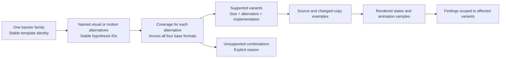

A variant may use static code, JavaScript animation, video or a hybrid. Reference video, proof video and runtime video have distinct roles. A render recording is not automatically a reusable runtime asset.

Banner v2 can retain usable variants while marking others unresolved. Parent compositions consume recorded child versions; later changes to a child do not silently replace those pinned inputs. Documentation-only repairs have a bounded path that preserves rendered bytes and reuses their proofs.

## 5. Continuous mining means repeated, reviewer-triggered iterations

The service stays available between iterations, but it does not keep generating while idle. Reviewing and annotating a batch is separate from starting the next one.

| Reviewer action | Immediate effect | Starts model work? |
|---|---|---|
| Create campaign | Snapshot configuration and PDFs | No |
| Save a draft | Save unsubmitted text and references | No |
| Accept / reject, with optional feedback | Record exact revision decisions and evidence | No |
| Add to refinement queue | Save a durable job targeting the displayed revision | No |
| Save run direction | Update direction for a subsequent iteration | No |
| Request suggested review groups | Analyze pending revisions; cache suggestions | Yes, grouping only |
| Mine More / Run next iteration | Release staged refinements and optionally add discovery | Yes |

### 5.1 What one iteration does, in order

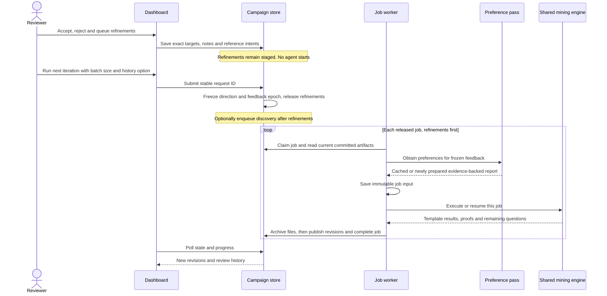

A **feedback epoch** is a numbered cutoff: feedback submitted after the click belongs to a later iteration. Direction and this cutoff are frozen at the click. The complete job input is saved when that job first starts, so discovery can see refinements committed earlier in the same iteration. Retries reuse the saved input.

The preference report is cached by feedback evidence, model and version. Jobs using the same frozen feedback reuse it; a fallback report may be retried by the first job of a new iteration.

### 5.2 Three limits that should not be confused

| Control | Meaning | Current behavior |
|---|---|---|
| Lifetime template limit | Maximum distinct identities accumulated in a campaign | Unlimited by default (`null`); adjustable in the dashboard or startup flags |
| New templates this iteration | Maximum new identities this Mine More request may create | Explicit bounded batch, up to 100; defaults from the campaign review buffer |
| Task and repair allowances | How long the engine keeps trying to complete a candidate | Configured attempts, review rounds, turns and timeouts |

Refinement creates another revision of an existing identity and does not consume new-template capacity. Rejected identities remain known and still count toward the lifetime limit. Children with their own identities count; banner dimensions do not.

Requesting zero new templates is allowed when refinements are staged. Reaching the lifetime limit or source exhaustion can skip discovery while still allowing those refinements. A full batch does not prove the source is exhausted; an empty discovery result does. New direction can reopen discovery.

This lets templates accumulate over repeated requests while the reviewer annotates in batches. Removing the lifetime limit does not turn Mine More into an unbounded background loop.

## 6. Feedback, preferences and conversation history are separate inputs

**Feedback is what the reviewer submitted. Preferences are interpretations of that evidence. Conversation history is the agents' earlier work and reasoning.** Turning history off does not discard saved feedback, known templates or previous artifacts.

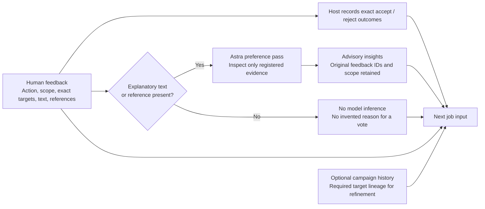

### 6.1 Which history is included?

| Job | History setting | What remains available |
|---|---|---|
| Discover new templates | Off by default: `none` | Current source evidence, known template artifacts, structured results, raw feedback and preference report; prior conversation access is removed |
| Discover new templates | Preserve history: `campaign` | The above plus eligible completed campaign episode sessions |
| Refine an existing template | Always `targets` | The above plus sessions from jobs in the exact target revision's ancestry |

Refinement starts from the requested revision, not an arbitrary newest folder. Target-history selection follows parent revisions back to their producing jobs. It is not an instruction to replay all unrelated campaign conversations.

### 6.2 How preference interpretation stays grounded

The preference pass uses Astra with tools to read submitted feedback, inspect registered revisions/files and view registered images. It does **not** currently have a general shell or arbitrary script-writing tool.

- A bare acceptance means that exact revision was accepted; it does not prove the reviewer likes its colors or typography.
- Explanatory text or attached references can support insights. Each insight must cite the original feedback IDs.
- Template, selection and group evidence retain their exact targets. The host rejects unsupported scope expansion.
- Run feedback provides broad direction. Applicable explicit, specific instructions take precedence over weaker broad inference; recency alone does not erase a stronger instruction.
- Conflicting requests remain visible with their context, rather than being averaged into a fictitious consensus.
- If analysis fails, exact outcomes and raw feedback remain available through a fallback report.

For example, “make this panel narrower” on a photo hero is a revision-specific refinement request. It is not automatically a campaign-wide preference for narrow panels.

### 6.3 Grouping helps navigation; it does not approve work

A separately requested Sol pass suggests review batches. Suggestions are cached; the fallback groups by saved collection, category or family metadata and says that visual similarity has not been checked.

A batch action still names exact template/revision pairs. If a selected revision is stale, the whole submission is rejected instead of partly applying it. Family or composition rows can share a template; the underlying identity and decision remain singular. New group members do not inherit an old group's refinement request.

## 7. What happens when the source cannot support the requested result?

The system preserves the partial work and asks the reviewer how to proceed. It does not treat a gap description as completion of the original request.

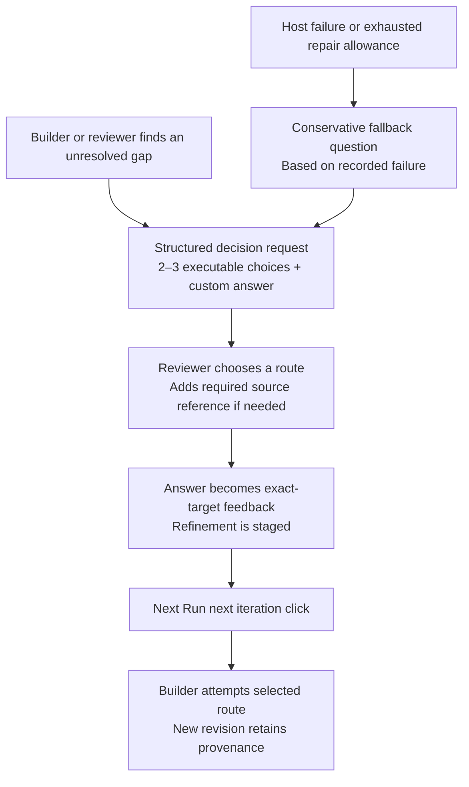

Every published unresolved `gap`, `partial`, `needs_repair` or `blocked` result must carry a decision request. Requests are tied to the campaign, template, revision and producing job. Accepting or rejecting that revision dismisses the question; a newer revision or separate refinement can supersede it. Answering a question stages a refinement; it does not immediately run it.

### Missing photograph example

If the source only contains half a face, shrinking an overlay cannot restore absent pixels. Available routes may include supplying a complete licensed image, reframing existing pixels, or explicitly requesting a synthetic continuation.

The implemented image tool supports generation and editing. References select the edit endpoint; a same-size PNG alpha mask can mark editable regions on the first reference. Fully transparent mask pixels are editable. Preservation is prompt-guided: when source pixels must remain exact, the builder needs to composite the generated region through the mask and verify the protected area.

Generated detail remains synthetic. Image-tool usage is recorded before dispatch, so failed attempts also retain provenance and human-review requirements. A later exact-pixel revision does not erase that history. A mask enables an attempt; it does not guarantee a correct face or successful provider response.

## 8. Identity, revisions and evidence

### 8.1 The records that connect the work

The diagram shows logical relationships. It is not a claim that every box is a separate SQL table; files, variants and some relationships are nested records.

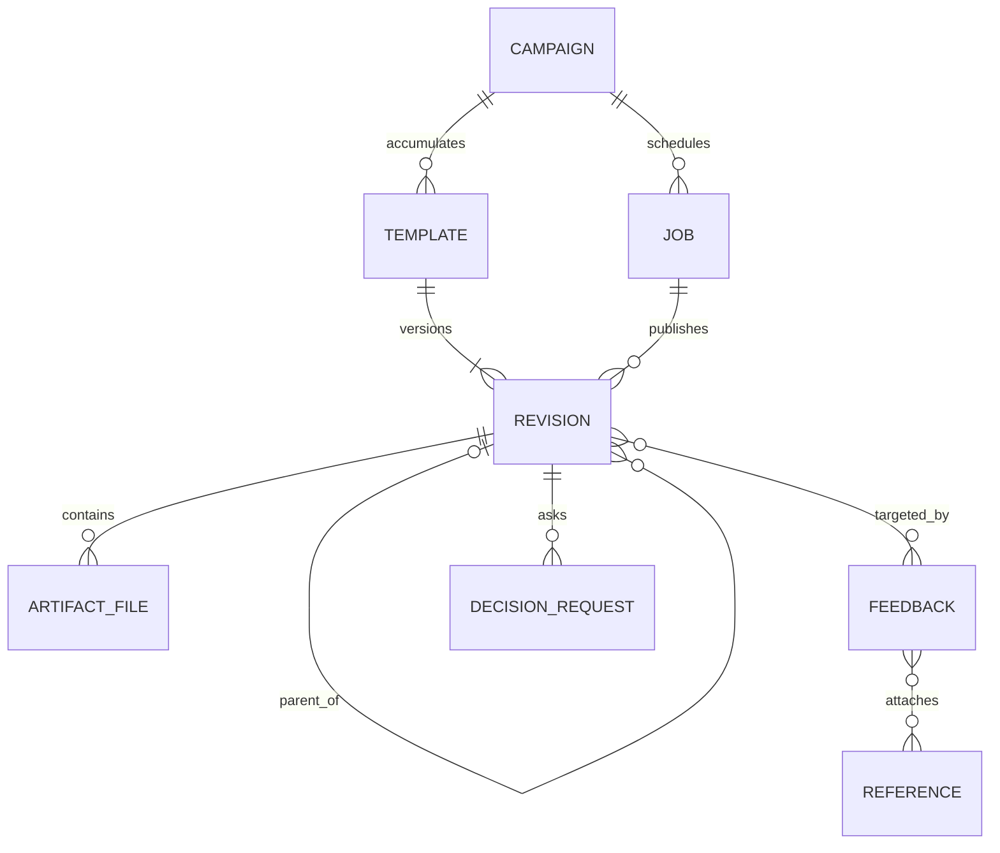

- **Campaign:** a snapshotted source configuration, direction, limits and review history.
- **Iteration:** one explicit Mine More request, its frozen feedback cutoff, and the jobs it releases.
- **Job / episode:** one durable discovery or refinement execution. One job can publish multiple template results.
- **Template:** stable identity across human refinements; records both latest and accepted revision pointers.
- **Revision:** a published result with artifact paths, machine outcome, human disposition and optional exact parent revision.
- **Feedback:** action, scope, frozen targets, text and reference intents. References are copied and hashed.

### 8.2 Accepted and latest can point to different versions

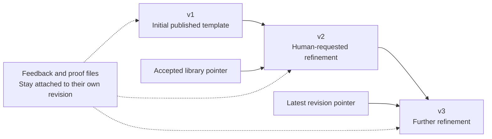

Refining an accepted template does not silently replace the accepted version. Explicitly rejecting that accepted revision clears its accepted-library pointer. The UI keeps the displayed revision fixed while polling; a new revision is offered as an explicit navigation action so it does not replace the preview underneath a feedback draft.

Machine verification and human acceptance are separate. Neither clears image provenance or establishes licensing, production accessibility, Outlook compatibility or MLR approval.

## 9. Scheduling, failure and recovery

### 9.1 Job lifecycle

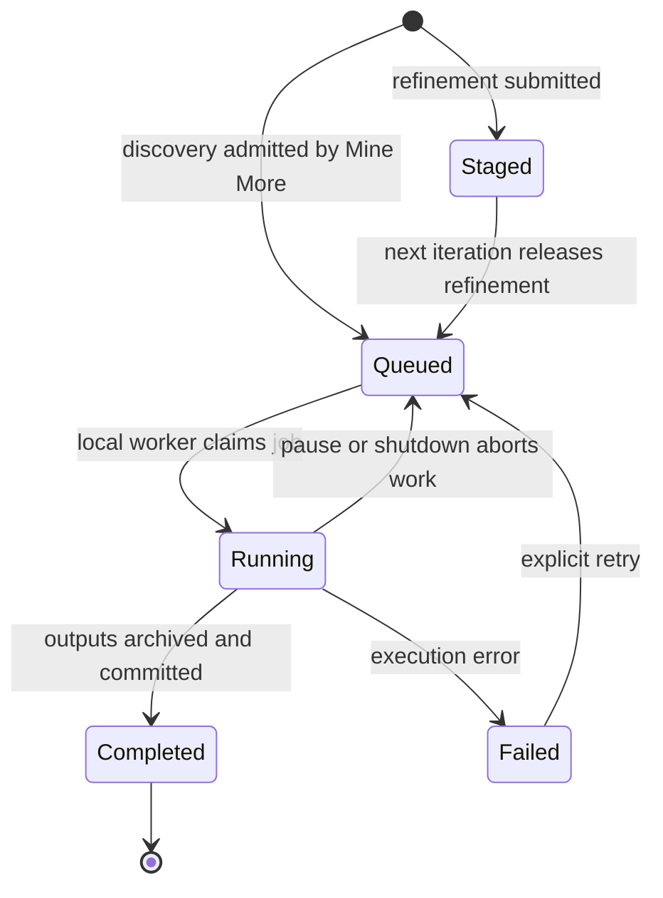

This is the job lifecycle, not the template's review lifecycle. A completed job can publish an unresolved template with a question. A failed job means execution itself needs attention.

The local host runs one job at a time, even across campaigns. Inside that job, the shared engine can run several agent tasks concurrently according to configuration. Required dependencies constrain builder start order; reviewers and focused helpers have scheduling priority. Optional workbench mode adds helper waiting, cancellation and scoped artifact behavior.

Staged refinement jobs are not claimable. A paused campaign cannot start its next iteration. An active iteration prevents a second one from being admitted, and failed work must be retried or resolved before more discovery. Stable request IDs prevent an identical retried click from creating duplicate jobs; reusing an ID with different content is a conflict.

### 9.2 Publish files before acknowledging success

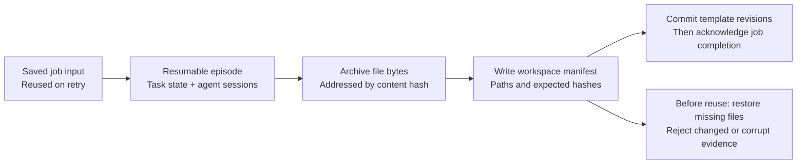

SQLite holds the campaign and review records. Episode folders hold source snapshots, evidence, candidate code, proofs, task results and sessions. A local content-addressed archive stores checkpointed bytes; the manifest describes how to restore them.

The archive and manifest are written before revision/job acknowledgement. Recovery restores missing files but does not overwrite conflicting edits. Run identity also includes inputs and runtime identity, helping prevent a resume against silently changed code or sources.

These are local recovery mechanisms. They do not provide an off-machine backup or distributed worker coordination.

## 10. What the reviewer can inspect

The dashboard connects campaign/job progress with grouped review, revision history, source/proof images, references and banner variants. Its progress describes known job/task work; it cannot predict how many useful patterns remain undiscovered in the PDFs.

Runnable artifact links are scoped to a registered revision. Local asset URLs resolve through the mining service so the reviewer can open the implementation separately from its screenshot. Preview links are signed for the server session; refresh them after a restart. Local serving is implemented here; future S3 hosting is not part of this pipeline.

## 11. Local entry point and code map

From `harness-experiments/agentic-banner-template-miner`:

```sh
npm run continuous -- --env-file /absolute/path/to/.env
# Default: http://127.0.0.1:8789
# Optional: --port 8790 --template-limit 20
# Unlimited lifetime identities: --no-template-limit
```

The runtime needs Node 24+, local dependencies, Playwright Chromium and Python with PyMuPDF. `MINING_PYTHON` selects the prepared interpreter. Opening the dashboard does not need a model call; starting model work needs the configured credentials.

### Source of truth

The [standalone implementation and quick start](https://github.com/Solstice-Health/template-mining) are in a private repository. Source links below require access to that repository. The export bundles the dashboard and original brand inputs; generated runs remain local.

| Area | Implementation to read |
|---|---|
| Initialization, source snapshots, ordinary scout setup | [`src/cli.ts`](https://github.com/Solstice-Health/template-mining/blob/main/src/cli.ts): `initializeRun`, `completeInventory` |
| PDF inventory and evidence cache | [`src/evidence.ts`](https://github.com/Solstice-Health/template-mining/blob/main/src/evidence.ts): `inventorySources`; `workers/pdf_worker.py` |
| Agent execution, builder checks and independent repair loop | [`src/runner.ts`](https://github.com/Solstice-Health/template-mining/blob/main/src/runner.ts): `reconcileTasks`, `verifyBuilder`, `executeTask`, `runWorker` |
| Candidate and task contracts | [`src/types.ts`](https://github.com/Solstice-Health/template-mining/blob/main/src/types.ts); [`src/store.ts`](https://github.com/Solstice-Health/template-mining/blob/main/src/store.ts) |
| Banner dimensions, variants, proof and dependency lifecycle | [`src/banner/contract.ts`](https://github.com/Solstice-Health/template-mining/blob/main/src/banner/contract.ts); `src/banner/render.ts`, `src/banner/lifecycle.ts` |
| Local service, endpoints and startup flags | [`src/continuous/server.ts`](https://github.com/Solstice-Health/template-mining/blob/main/src/continuous/server.ts); [`src/continuous/cli.ts`](https://github.com/Solstice-Health/template-mining/blob/main/src/continuous/cli.ts) |
| Decisions, revision targets, iteration admission and job ordering | [`src/continuous/store.ts`](https://github.com/Solstice-Health/template-mining/blob/main/src/continuous/store.ts): `requestMining`, `claimNextJob`, `recordEpisodeOutputs` |
| Frozen job input, history selection and preference timing | [`src/continuous/worker.ts`](https://github.com/Solstice-Health/template-mining/blob/main/src/continuous/worker.ts): `episodeHistory`, `buildEpisodeInput`, `ContinuousWorker.tick` |
| Continuous discovery versus refinement, source reuse, result publication | [`src/continuous/miner-adapter.ts`](https://github.com/Solstice-Health/template-mining/blob/main/src/continuous/miner-adapter.ts): `executeMiningEpisode` |
| Group suggestions and evidence-backed preferences | [`src/continuous/review-advisor.ts`](https://github.com/Solstice-Health/template-mining/blob/main/src/continuous/review-advisor.ts): `feedbackKey`, `preferences`, `validateFeedbackInsights` |
| Checkpoint ordering and restoration | [`src/continuous/checkpoints.ts`](https://github.com/Solstice-Health/template-mining/blob/main/src/continuous/checkpoints.ts) |
| Image editing, masks and provenance | [`src/tools/image.ts`](https://github.com/Solstice-Health/template-mining/blob/main/src/tools/image.ts) |
| Dashboard implementation | [`frontend/continuous/`](https://github.com/Solstice-Health/template-mining/tree/main/frontend/continuous/) |
| Operational details and API contracts | [`docs/CONTINUOUS-MINING.md`](https://github.com/Solstice-Health/template-mining/blob/main/docs/CONTINUOUS-MINING.md) |

### Reading the behavior correctly

The distinctions to retain are: **identity versus revision; machine verification versus human acceptance; saved feedback versus inferred preferences; conversation history versus retained artifacts; batch size versus lifetime capacity; a completed job versus a fully resolved template.** These explain most apparent surprises in the review loop.
