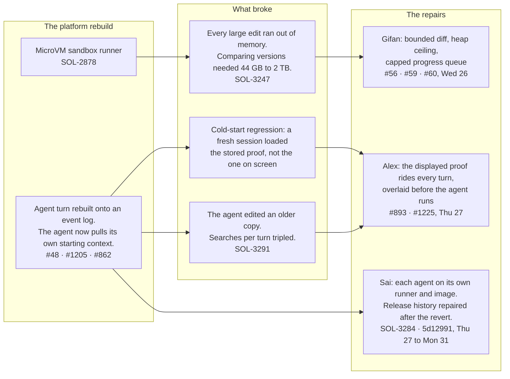

# PRC Template postmortem

| | |
|---|---|
| **Date** | 2026-08-31 |
| **Owner** | @1liale |
| **Participants** | @1liale, @GifanSolstice, @saisolstice |

Covers April through August 2026. Project: PRC Template, proof creation and editing.

## 1. Overview

Five months from the first in-platform proof preview to this write-up. Six times the business requirement widened. The number of systems and rules one proof depends on grew from 2 to 14. The last expansion took editing down for two days.

### What were we trying to accomplish?

Give reviewers a proof they can read, mark up, and correct in Solstice, instead of a PDF built by a script for each brand.

### What happened?

The goal was met. The ask widened six times. Each addition was reasonable alone. Together they made one proof depend on far more moving parts, and the last of those parts was an AI editor that had to hold a frozen copy of the proof.

Nothing here was scope creep in the usual sense. Every change came from a real client or compliance need. The cost was that they stacked onto one feature and we never re-planned.

### What was the impact, and what is the current state?

Shipped and in client use. The August expansion broke proof editing for two days, 25 through 27 August. That outage is fixed and released. Two follow-ups are still open.

A separate release defect in the same months: a feature flag we treated as off shipped default-on with a Pfizer push. Client-facing staff could not save proofs for a week, and they found it before we did.

## 2. Timeline

### Requirement track, April to August

| Month | What the business asked | What that forced | Systems and rules one proof depends on |
|---|---|---|---|
| April | Let reviewers see the proof in the platform. | Proof moves out of a script and into the editor. Cover fields become editable. Markup arrives. | 2 |
| May | Every client needs their own. | Templates become versioned items with an owner, plus a way to turn one back into a PDF. | 4 |
| June | Banners and social too, and reuse it for QC. | Three content types, five layers of which template applies, and other pipelines now depend on the proof. | 7 |
| July | Staff must do this without an engineer. | Self-serve authoring, per-asset choice, and incoming client files now require a template up front. | 10 |
| August | Old versions must reproduce exactly, and chat should edit the proof. | Each version freezes its own copy of the proof, and that copy is handed to the AI editor. | 14 |

### Cycle 25 through the final August push

Cycle 25 set Product KR 4 as keeping CELs in Solstice for key email PRC-template edits that persist across versions. The point was that staff would not leave the product to finish an edit. The font patch and Studio link improved the path. They did not achieve that outcome. Native proof editing followed, and two platform rebuilds landed under its final three weeks.

- **2026-07-13 to 2026-07-20, Cycle 25.** KR 4 is the in-platform CEL goal. The Alexion font patch lands. CEL work still crosses tools. Workflow friction stays high.
- **2026-07-21 to 2026-07-31.** Chat edit links to Solstice Studio. The path is better. Staff still leave Solstice to finish the edit.
- **2026-08-03 to 2026-08-07.** Same gap. Native editing has not started.
- **2026-08-10 to 2026-08-14, week 1.** Native proof editing starts. The AI sandbox is rebuilt underneath it, SOL-2878, MicroVM runner. 13 August: QA failure.
- **2026-08-17 to 2026-08-21, week 2.** Stabilise. 18 August: proof synced. A leak this week creates the all-hands deadline that week 3 then runs under.
- **2026-08-24 to 2026-08-28, week 3.** Polish and test, while chat plumbing is rebuilt onto an event log. PRs #48, #1205, #862. The rebuilt turn path never carries the proof the reviewer is looking at, not in the session's initial payload and not per turn.
  - 25 to 27 August: editing unusable.
  - 26 August: the blocker is named. Gifan ships a bounded diff, a heap ceiling, and a capped progress queue. PRs #56, #59, #60. Large edits had been comparing versions at 44 GB to 2 TB, SOL-3247.
  - 27 August: Alex puts the displayed proof on every turn, overlaid before the agent runs. PRs #893, #1225. The follow-on regression is caught the same evening. The agent had been editing an older copy, and searches per turn tripled, SOL-3291.
- **2026-08-27 to 2026-08-31.** Sai puts each agent on its own runner and image, and repairs release history after a revert. SOL-3284, `5d12991`.

### Week 3 cause and repair

One rebuild, three breakages, three repairs. Both turn regressions share one cause: the rebuilt turn path never carried the on-screen proof.

## 3. Reflection

### What went well

- Every widening of the ask was delivered.
- August was root-caused, not patched over with more hardware.
- The fix was proven on a real customer-sized proof first.
- The follow-on regression was caught the same evening.

### What could have gone better

- Five months, six wider asks, never re-planned once.
- A flag assumed off was default-on in production. Client-facing staff found it first.
- Two platform rebuilds landed on the feature that needed them, in the same three weeks we were trying to sign that feature off.

## 4. Contributing factors and lessons

The failures happened at the seams between changes, not inside any one change.

**We treated each new requirement as a small addition.** Individually that was true. Together they turned one screen into a chain of seven systems, each able to break the others.

**We treated a proof as a small file.** Once every version froze its own copy, real proofs hit 20 to 30 MB, more than the AI editor could hold.

**We treated a plumbing rebuild as invisible.** The rebuild stopped sending the on-screen proof, so the AI edited an older copy of it.

**We treated a feature flag as enough to hide a half-shipped engine.** The flag rode a Pfizer push into production default-on.

The place to have raised this earlier was each time the ask widened, and again when the sandbox and turn rebuilds were scheduled under the native-editing deadline. A new ask should have changed the estimate, dropped another commitment, or moved to the next cycle. The rebuilds needed an explicit risk decision, or they needed to land after sign-off.

Repeat the August response: name the blocker, prove the fix on a customer-sized proof, catch the next break the same night.

Stop absorbing material scope changes without re-planning. Stop shipping platform rewrites during feature sign-off without a named risk decision. Stop assuming a flag is off in production without checking the default.

## 5. Actions and follow-up

Owners below are proposed. Confirm them when this is reviewed. Targets are "before the next CEL launch" rather than a calendar date, because the point is the next time we put a date on this kind of work.

| Action | Owner | Target | Success measure |
|---|---|---|---|
| Complete the product and design cycle first. Map the CEL workflow, edge cases, acceptance criteria, and explicit out-of-scope items before estimating delivery. | @1liale | Before the next CEL launch date is committed | Those artifacts exist, and the estimate is made against them |
| Establish the technical shape early. Review dependencies and stable contracts up front. The agent-turn architecture shared in #engineering is one forward-looking example. | @1liale | Before the next CEL launch date is committed | Dependencies and contracts are written down before build starts |
| Treat every material scope change as re-planning. A new ask changes the estimate, reduces another commitment, or moves to the next cycle. It is not silently absorbed. | @1liale | Ongoing, starting next planning | Scope changes show up as a revised date, a dropped item, or a slipped cycle |
| Push back with concrete options. When the timeline no longer fits, choose among smaller scope, a later date, or additional capacity. | @1liale | Ongoing, starting next planning | The choice is recorded. "We will just absorb it" is not an option |
| Communicate forecast changes at the first broken assumption. Share the impact, revised date, and decision needed before the final week. | @1liale | Next CEL-related delivery | The slip or cut is visible before the last week of the cycle |
| Protect a final stabilisation window. Avoid platform rewrites during feature sign-off. Exceptions require an explicit risk decision. | @GifanSolstice | Next CEL-related delivery | No rewrite lands in the sign-off window unless a named person accepted the risk |
| Test the exact CEL path at client scale. Use 20 to 30 MB proofs, persisted versions, and the real in-platform workflow. Unresolved QA failures block release. | @1liale | Next CEL-related delivery | A client-sized proof is on the path, and an open QA failure stops the release |
| Gate rollout and prove recovery. Test flag defaults, canary risky changes, monitor failures, and verify retry plus independent rollback before broad release. | @saisolstice | Next CEL-related delivery | Flag defaults are checked in prod config. Rollback is proven without depending on the failing path |

**Review date:** 2026-10-06

**What will confirm that the changes worked?**

The next CEL-related launch has a written scope with out-of-scope items, a date that moved or shrank when the ask did, a client-sized proof on the test path, and a flag default we actually checked. If editing breaks again, we already know how we will roll it back.

Sources: commit history across four repositories from March 2026, `git blame` on the agent's search tool (`agent-pi/src/grepTool.ts`), Linear tickets SOL-931, SOL-1197, SOL-1390, SOL-2217, SOL-2675, SOL-2795, SOL-2878, SOL-3083, SOL-3148, SOL-3164, SOL-3167, SOL-3183, SOL-3202, SOL-3247, SOL-3284, SOL-3291, and #engineering / #linear-task-for-engg discussion 18 to 27 August.
