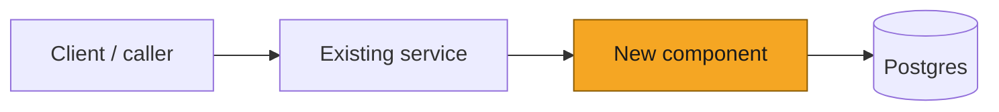
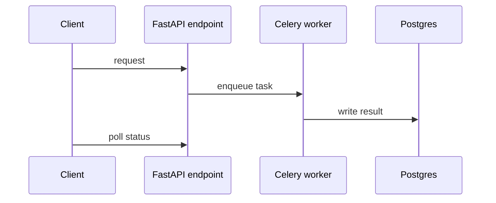
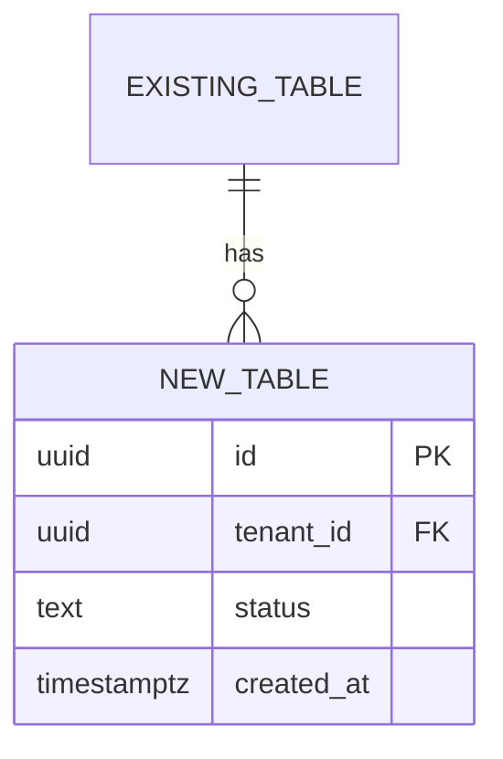
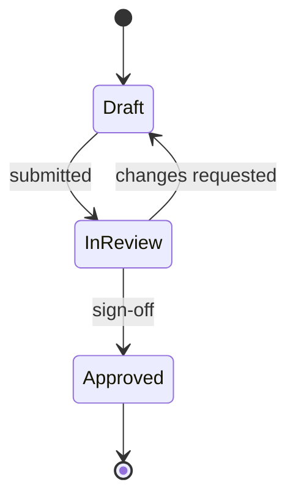
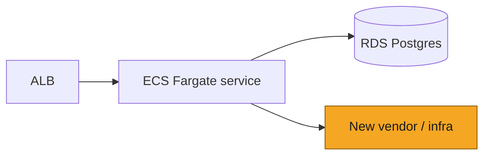

# SOL-XXXX: Title

> [!NOTE]
> **How to use this template**
> 1. Copy this file to `plans/SOL-XXXX-short-slug.md` and open a PR; link the PR from the Linear ticket.
> 2. Have Claude Code or Cursor draft every section from the codebase. Edit before you send it; at review you answer for the content, whichever tool drafted it.
> 3. Fill in or mark N/A each of the four system views. Amber marks what is new or changed.
> 4. Request both reviewers on the PR. Review SLA: 24 hours, every tier. One async round, then a 15 minute call if threads ping-pong.
> 5. An approved plan becomes part of Definition of Ready: the ticket is not committed to a cycle without it. Spike and prototype code can start anytime. Code intended to merge waits for sign-off.
>
> See the [Process Guide](../README.md) for tiers, examples, and what sign-off means. Delete this whole block in your copy.

| | |
|---|---|
| **Ticket** | SOL- |
| **Author** | @ |
| **Reviewers** | 2 for every tier; for Tier 2, one of them owns the touched domain |
| **Tier** | 1 / 2 |
| **Status** | Draft / In review / Approved / Building / Shipped / Abandoned |
| **Date** | YYYY-MM-DD |

> [!IMPORTANT]
> **Tier check.** Tick any box and this is Tier 2: one of your two reviewers must own the touched domain, and the Tier 2 sections stay in.
> - [ ] Touches auth, tenancy, or permissions
> - [ ] Handles PHI or client data in a new way
> - [ ] Schema migration on existing tables
> - [ ] New external dependency, vendor, or infrastructure
> - [ ] Changes a cross-service or client-facing API contract
> - [ ] Hard to reverse: undoing it after ship would take more than a day, lose data, or be visible to clients
>
> No boxes checked and more than a day of work: Tier 1, delete the Tier 2 sections. Contained work under a day: no plan needed, just build. When in doubt, take the higher tier. A reviewer can bump the tier when they spot a missed trigger.

## 1. Problem

*What is broken or missing, and why now. 2 to 3 sentences. Link the epic or client ask if one exists.*

## 2. What exists today

*How the system handles this now, with file and service references. Name what this plan extends. If nothing is reusable, say where you looked. Apply the `CLAUDE.md` decision ladder: reuse before stdlib before framework before new code.*

## 3. Approach

*The shape of the change: key moving parts, what gets added, what gets deleted. Data model and API changes in brief. Keep it at the level of services and modules; detail goes in the views below.*

## 4. System views

*All four views, each filled in or marked N/A with a reason. Keep every view under about 9 nodes; split any diagram that answers two questions. Amber = new or changed.*

### Context: where it sits

*N/A because:*

### Flow: who calls whom, in what order

*N/A because:*

### Data: what changes shape

*N/A because:*

### State: lifecycle of the entity

*N/A because:*

## 5. Trade-offs accepted

*Each entry names the long-term property we optimize, what we give up for it, and the condition that triggers a revisit.*

- We accept … to get … Revisit when …
- We accept … to get … Revisit when …

## 6. Alternatives rejected

*One line each on why. Include doing nothing where that was a real option. If no second approach was ever credible, say that and why.*

- Alternative: … Rejected because …

## 7. Risks and rollback

*What breaks if this is wrong. Tenancy and PHI implications. How we back out, and how long backing out takes.*

## 8. Verification

*How we know it works: tests, evals, metrics, manual checks. Name the signal you will look at after ship.*

## 9. Open questions

*Addressed to your reviewers. If there are none, write none.*

---

# Tier 2 sections

*Tier 1 plans: delete from here down to the Decision log.*

## Goals and non-goals

*Bullets. Name what this plan deliberately leaves out.*

## Migration and rollout

*Flags, backfill, ordering, backout. Any step where data moves gets its own line.*

## Security and compliance

*Tenant isolation, PHI paths, audit trail, any new data processor and where its servers live.*

## Phasing and estimates

*What ships first and rough size per phase. Phase 1 should be something we can show at a Friday demo.*

## Deploy view

## Pre-mortem

*It is three months later and this failed. The most likely reason:*

---

## Decision log

*Contested review points and mid-build deviations land here as they happen. A material deviation re-pings the approvers. The log freezes when the plan ships.*

| Date | Decision | Options considered | Why | Who | Status |
|---|---|---|---|---|---|
| *2026-08-12* | *Usage events go in Postgres, no new broker* | *Kinesis, Redis stream, Postgres table* | *Volume fits Postgres for 12 months; one less system to run* | *Author + reviewer* | *Decided* |
| | | | | | |

## Sign-off

*Blocking is reserved for correctness, security, and cost. Taste disagreements get a decision log entry and the author decides. Approval means: the approach is sound and I understand it. This table mirrors the PR approvals.*

| Reviewer | Verdict | Date | Note |
|---|---|---|---|
| @ | Approve / Blocked | | |
| @ | Approve / Blocked | | |

> [!TIP]
> **When this ships**
> - [ ] Durable decisions distilled into `CLAUDE.md` / `AGENTS.md`
> - [ ] Living architecture map updated
> - [ ] Status set to Shipped; file frozen as a point-in-time record

## Reviewer guide

1. Start with the four views: check boundaries, call direction, and where the new pieces sit, before reading any prose.
2. Read Trade-offs accepted. Are these the right ones to accept, for the horizon stated?
3. Check What exists today against your own knowledge of the codebase. If you know an existing service or util that covers part of this, name it.
4. Comment within 24 hours. One async round; after that the author books 15 minutes and settles it live.
5. Block only for correctness, security, or cost. Everything else is a comment plus a decision log entry, and the author decides.
6. Bump the tier if you spot a Tier 2 trigger the author missed.
