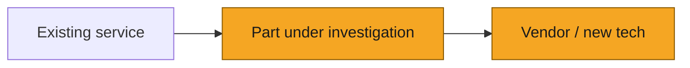

# SOL-XXXX: Spike title

> [!NOTE]
> **How to use.** For timeboxed questions, before committing to a plan. Copy this file to `plans/SOL-XXXX-spike-short-slug.md` and open a PR. Two reviewers, same-day sign-off on the brief. All spike code is throwaway by default; findings feed a Plan. See the [Process Guide](../README.md). Delete this block in your copy.

| | |
|---|---|
| **Ticket** | SOL- |
| **Author** | @ |
| **Reviewers** | @ / @ |
| **Timebox** | 1 to 2 days |
| **Status** | Proposed / Running / Done |

## Question

*The single question this spike answers. If there are two questions, that is two spikes.*

## Why it matters

*The decision this unblocks, and what happens if we skip finding out.*

## Candidates and criteria

*The options under evaluation and the criteria every one of them is judged against. Fix the criteria before testing starts, and record any later change under Deviations. Delete this section for single-candidate feasibility spikes.*

*Criteria (example set for a knowledge-graph database bake-off):*

- *Handles our real query shapes: multi-hop traversals (asset to claim to reference), at current and 10x scale*
- *Tenant isolation story*
- *Ops fit: SQLAlchemy/asyncpg compatibility, deploy and backup story, the cost of operating an extra system*
- *Cost at our volume, license included*

| Candidate | Why it is in the running |
|---|---|
| *Postgres we already run (recursive CTEs, AGE extension)* | *Decision ladder rung 2: no new system, known ops* |
| *Neo4j* | *Native graph model, strongest query ergonomics* |
| *Do nothing (current representation)* | *Baseline that makes the cost of switching explicit* |
| | |

## Method

*How you will find out: prototype, load test, reading vendor docs against our constraints. Keep the experiment as small as the question allows, and run it identically for every candidate.*

## Exit criteria

*The result that ends the spike early, and what gets written down if the timebox expires with no answer.*

## Context view

*The territory the question touches. Amber marks the part under investigation.*

## Deviations from the brief

*Appended while running, one line each with a why: a criterion changed or reworded, a candidate added or dropped without full evaluation, the timebox extended. Leave it empty only if the spike ran exactly as approved. Binding decisions go in the decision log of the Plan this spike seeds.*

- *Example: 2026-08-12, dropped Neptune after 2 hours: no local dev story, ruled out on ops fit before load testing.*

## Findings

*Appended when the spike ends. What was tried, what was measured, what surprised you. For comparative spikes, score the matrix: one row per criterion, one column per candidate, numbers or short evidence in the cells, no adjectives.*

| Criterion | Candidate A | Candidate B | Do nothing |
|---|---|---|---|
| | | | |

## Recommendation

*Proceed, adjust, or drop. Name the Plan this seeds, or the reason no plan is needed.*

---

Spikes feed Plans: a proceed recommendation spawns a ticket with the needs-plan label, and its evidence pastes into that plan's [Alternatives rejected](plan-template.md#6-alternatives-rejected) section.
